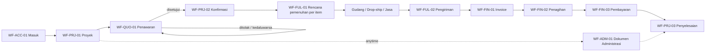
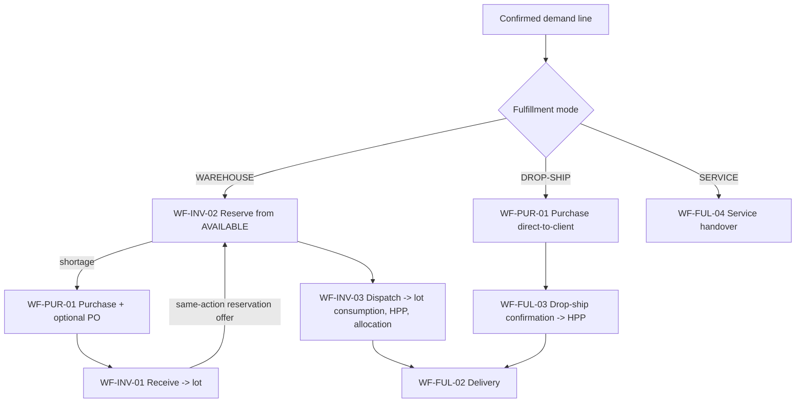
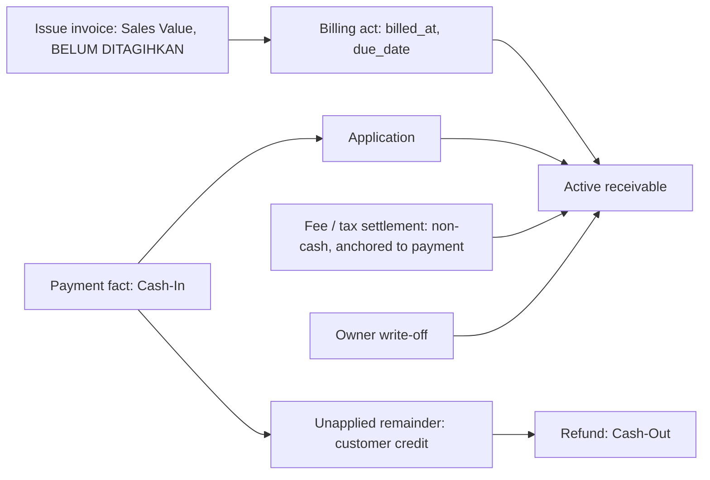

# Critical business workflows

Status: APPROVED | Updated: 2026-09-30 | Owner: Planning

Approval: [APPR-004](../00-governance/DECISION_LOG.md#appr-004--p3-critical-business-workflows-approved), explicit conditional Owner approval on 2026-09-29 (DIR-026) of this document as committed in the P3 finalization checkpoint; the approved file hash, verified conditions and exclusions are recorded there. Approval changes lifecycle only, not implementation authorization.

Amendment: narrowly amended on 2026-09-30 to represent the Owner's clarification [DIR-027](../00-governance/DECISION_LOG.md#dir-027-obs-007-and-tech-017--p4-authorization-unattributed-loss-clarification-and-p4-documentation) on unattributed cross-company economic loss: physical truth is corrected at once with an immutable recognition snapshot, remaining physical stock is never retained or frozen for a pending case, definitive later evidence may resolve it and found stock is never recognized twice. Only text marked `DIR-027` changed — it supersedes the retention safeguard of L-42 and SF-UNATTRIBUTED; no other rule is reopened. The pre-amendment SHA-256 is recorded in the decision log; the amended revision is approved under [APPR-005](../00-governance/DECISION_LOG.md#appr-005--p4-database-architecture-approved).

Authority: P3 authorized by DIR-023 (planning) and DIR-024 (Owner decisions D-1–D-5 and documentation execution), red-teamed under DIR-025 and corrected under DIR-026 (Owner decision on unexplained fungible loss attribution and finalization) in the [decision log](../00-governance/DECISION_LOG.md); sources are the twentieth to twenty-third locked source records. This document owns workflow orchestration: command sequences, user-triggered transitions and system reactions, cross-domain hand-offs, branches, partial processing, the procedural correction matrix, document applicability, responsibility boundaries, completion/override/revalidation procedures and business-level indivisibility. Phase evidence and the aggregate P1 → P2 → P3 traceability verification are owned by [P3_QUALITY_GATE](P3_QUALITY_GATE.md).

**Anti-duplication contract:** [DOMAIN_MODEL](DOMAIN_MODEL.md) owns concepts and scope classes; [BUSINESS_RULES](BUSINESS_RULES.md) owns lifecycles, invariants, correction legality and calculation meaning; [V1_SCOPE](../01-product/V1_SCOPE.md) owns the Owner's product meaning. Workflows below cite their rule IDs instead of restating them. On conflict, the owning document and the latest Owner decision win; report the conflict under [change control](../00-governance/CHANGE_CONTROL.md).

**Boundary:** P3 consumes the P2 lifecycles without adding, removing or relaxing a transition. It defines what must happen and in which order, never how it is stored, locked, rendered or displayed: no tables/columns/ERD/migrations (P4), no capability names or field projection (P5), no locking, isolation or idempotency protocol (P6), no screens, copy or components (P7), no test IDs (P8), no build units (P11).

## 1. Conventions

- **IDs:** `WF-<AREA>-<nn>` primary workflows; `SF-<NAME>` reusable subflows; `PX-<nn>` partial-processing rules; `CM-<nn>` correction-matrix rows; `AX-<nn>` indivisible business actions; `QS-<nn>` derived action-queue and blocker signals; `L-<nn>` Level-1 planner decisions. Later phases cite these IDs.
- **Actors:** **OWN** Owner; **ADM** Admin Operasional — always one individual account acting within its explicit company grants and capabilities; **OWN!** Owner-only by a settled Owner decision; **ADM+** Admin holding a separately grantable authority for a sensitive correction or closure (DIR-024 D-5); **SYS** a system-derived consequence inside the same command; **BG** a background reaction after commit that may retry and never changes business truth.
- **Command:** one user-intended business action producing P2 facts or decisions. **Workflow:** an ordered set of commands plus the derived signals that prompt the next command. Workflows never store their own progress: remaining quantities, stage progress and "what is next" are derived from facts and decisions (BR-XD-05; FS-01; FS-11). Tempting duplicates that stay derived: project stage, purchase receipt progress, delivery completeness, invoice paid/overdue state, requirement satisfaction, completion readiness, credit balances and every stock quantity.
- **Outcome vocabulary:** COMMITTED, REJECTED (with the failed precondition), CONFLICT (prepared against superseded facts) and, for background work only, PENDING/FAILED. No command reports success for an effect that did not commit.
- **Context tags** (input to P7, not UI design): `[floor]` warehouse/field task on mobile or scanner; `[desk]` intensive desktop task; `[both]`. Journey anchors use the Owner's Indonesian terms (e.g., *Barang Masuk*, *Barang Keluar*, *Piutang*, *Pembayaran*, *Dokumen Administrasi*); P7 owns final copy.
- **Irreversible** marks commands that can only be undone through a correction primitive (issue, billing, payment, dispatch, receiving, settlement, write-off, completion, Force Complete).
- **PLANNER-DETERMINED** marks a genuine Level-1 decision (listed with grounds in [section 12](#12-planner-determined-level-1-decisions)); **DIR-024** marks semantics taken from the Owner's P3 decisions D-1–D-5, **DIR-026** the Owner's decision on unexplained fungible loss attribution and **DIR-027** its clarification (no freezing of physical stock; immutable recognition snapshot).

## 2. Standard command envelope — SF-CMD

Every committed command follows this business sequence; P5/P6 choose the mechanisms.

1. **Identity:** the individual account is authenticated and active (BR-XC-02).
2. **Scope:** the target record's company is within the actor's grants (Owner: all); every related reference belongs to the same company unless the workflow explicitly defines a cross-company record (inter-company allocation) (BR-ACC-01/02).
3. **Authority:** the actor holds the capability for this action; OWN! and ADM+ actions follow [section 4](#4-actor-and-authority-matrix).
4. **Preconditions:** evaluated against current committed facts, never against the page the actor saw.
5. **Stale state:** a command prepared against facts that have since changed in a way that affects it returns CONFLICT and the current state; it never overwrites newer truth (OB §32; GAP-015).
6. **One effect per intent:** repeating the same intent yields the original result after re-authorization; the same intent with different content is a CONFLICT. A second, separately created intent for the same physical or financial event is caught by the command's business uniqueness where the event carries an external identity (supplier delivery or shipment reference, bank statement line, evidence identity per L-45, source bill, serial state); fungible events without one (dispatch, delivery, return or adjustment of quantity items) are bounded only by their quantity caps plus a likely-duplicate warning that needs the actor's explicit, reasoned confirmation (L-49; GAP-008).
7. **Dates:** SF-DATE applies.
8. **Indivisible effect:** all effects listed for the command commit together or none do (section 9).
9. **Audit:** individual actor, recorded_at, business_date, action, entity, before/after, reason where required, evidence references and linkage (BR-XC-01; BR-CR-01).
10. **After commit:** derived projections and QS signals reflect the new truth (BR-XD-05); BG reactions start and report PENDING/FAILED truthfully without re-running the command.

## 3. Workflow architecture

Four layers: (1) entry and master data; (2) the project backbone; (3) supporting operational workflows; (4) reusable subflows. The backbone is a spine of **optional** stages: a stage applies to a demand line only when its fulfillment mode, channel, document selection or payment facts require it; nothing is faked to complete a diagram (GAP-021; BR-XD-02/03).

## 4. Actor and authority matrix

Business authority only; P5 turns it into capabilities, grants and field projection. Owner holds every authority. An ADM action is always limited to the actor's granted companies.

| Action family | OWN | ADM | Class / source |
| --- | --- | --- | --- |
| Users, roles, capabilities, company grants | ✓ | — | OWN! (OB §17) |
| Company master: create, identity assets, bank accounts, numbering rules, deactivate | ✓ | — | OWN! (OB §3; AC-01) |
| Set waiver eligibility of an administrative requirement | ✓ | — | OWN! (BR-PRJ-03) |
| Remove, make optional, relax the satisfaction mode or clear the client-original flag of a required, non-waivable administrative requirement | ✓ | — | OWN! (DIR-024 D-5) |
| Supersede an Owner write-off: in the same action as a void or downward revision of its invoice (superseded or re-recorded on the replacement), or to apply money recovered after it | ✓ | — | OWN! (DIR-019; DIR-024 D-5; L-17) |
| Attribute unexplained found stock to an owning company, with flagged cost basis | ✓ | — | OWN! (DIR-024 D-5) |
| Resolve a pending unexplained-loss attribution case: assign the lost or condition-changed fungible quantity to candidate companies (lot claims closed per SF-UNATTRIBUTED) | ✓ | — (`DIR-027`: ADM+ may only record a resolution that definitive later evidence fully identifies) | OWN! (DIR-026; DIR-027) |
| Receivable write-off / formal disposition | ✓ | — | OWN! (DIR-019; BR-FIN-08) |
| Force Complete | ✓ | — (denied, also through any API) | OWN! (DIR-011; BR-PRJ-04) |
| Client, supplier, product/service, unit, barcode, location, minimum-stock masters; archive | ✓ | ✓ | ADM (CAP-02/03) |
| Project setup and amendment, quotation draft/issue/revise, approval, commercial confirmation | ✓ | ✓ | ADM (CAP-04; BR-PRJ-06; L-25) |
| Reservation create/adjust/release; reservation cut on shrinkage | ✓ | ✓ inventory | ADM (BR-RSV-01–04) |
| Purchase, PO, receiving, dispatch, delivery, drop-ship confirmation, service handover | ✓ | ✓ | ADM (CAP-05/06/07) |
| Document issue, external uploads, invoice issue, billing act, payment record/application, expense, disbursement and other Cash-In recording | ✓ | ✓ | ADM (CAP-08/10/11) |
| Add administrative requirements or tighten them (make required, stricter mode, client-original) | ✓ | ✓ | ADM (CAP-09) |
| Normal completion decision when all predicates are true | ✓ | ✓ | ADM (BR-PRJ-02; L-12) |
| Dispute hold set/clear | ✓ | ✓ | ADM (BR-FIN-08; L-12) |
| Corrections and reversals: dispatch/receiving reversal, sales and purchase returns, dispatch identity substitution (CM-36), reversal of an erroneous restoration or return (CM-37), contra-facts, payment reallocation, invoice void/downward revision (with evidence, CM-24), document revision/void, billing-act correction, superseding decisions, duplicate-payment and duplicate-evidence warning overrides | ✓ | ADM+ | DIR-024 D-5 |
| Purchase cancellation | ✓ | ADM+ | DIR-024 D-5 |
| Refunds, fee settlements, tax settlements, expenses/disbursements corrections | ✓ | ADM+ | DIR-024 D-5 |
| Stock adjustments, condition changes, opname variance application, loss recognition, recording a pending unexplained-loss case (SF-UNATTRIBUTED) or `DIR-027` its resolution fully identified by definitive later evidence | ✓ | ADM+ | DIR-024 D-5; DIR-026; DIR-027 |
| Inter-company allocation (grant on the consuming company only) | ✓ | ADM+ | DIR-024 D-5; L-03 |
| Operational closures: remaining-scope cancellation, delivery closure, purchase-remainder closure, correction-case closure; project cancellation | ✓ | ADM+ | DIR-024 D-5 |
| Admin N/A on a waiver-eligible requirement | ✓ | ✓ | ADM (DIR-011; BR-ADM-02) |
| Opening-data import: prepare and dry-run / commit after sign-off | ✓ | prepare only | ADM prepare, OWN commit (CAP-15; OS-02) |
| Availability checks, numbering, snapshots, HPP/loss attribution, revalidation | — | — | SYS |
| Rendering, exports, notifications, restock/overdue alerts | — | — | BG |

Every ADM+ action requires a mandatory reason, evidence where available or required, exact individual attribution, timestamp, before/after or source/correction linkage, immutable audit and visibility in the Owner review queue (QS-14). Two Admin accounts with identical grants remain separate identities; no action is attributed to "Admin" as a shared identity (BR-XC-02; FS-10). No launch role is added.

## 5. Workflows

Each workflow uses one template: purpose; actors/trigger; preconditions; main path; branches; partial; exceptions; correction/cancellation (CM rows); records affected; invariants; result/completion; audit/authority/concurrency; traceability and later-phase obligations. `N/A — reason` replaces silence.

### 5.1 Access and master data

#### WF-ACC-01 — Session and company context `[both]`

- **Purpose:** authenticated, individually attributable entry and the actor's company scope. **Actors/trigger:** OWN, ADM; login.
- **Preconditions:** active individual account; not throttled.
- **Main path:** authenticate → load grants and capabilities → dashboard: Owner consolidated and per company; Admin action queue across granted companies (section 10) → work → logout ends the session.
- **Branches:** password reset through the approved channel (DEP-08); onboarding: the Owner creates the individual account and the initial credential travels through the approved channel; Owner-account recovery is a human operator procedure (P5/P9).
- **Company context:** scope = granted companies (Owner: all). A working filter may narrow views; every command targets exactly one record company and is re-checked by SF-CMD — a selected "current company" never substitutes for authorization.
- **Exceptions:** session expired mid-form → re-authenticate, then the form is submitted as a new intent through SF-CMD (stale checks apply); grant/capability revoked or user deactivated → the next command is REJECTED; that user's drafts stay available to other authorized users.
- **Records:** security/technical log (distinct from business audit, BR-XC-03). **Invariants:** BR-ACC-01, BR-XC-02/03.
- **Traceability:** CAP-01/13; AC-13; REF-001/004; IMG-01. Later: P5 authentication/session/throttling controls; P7 dashboards and queues; P8 denial and revoked-access tests.

#### WF-ACC-02 — Users, roles, capabilities and company grants `[desk]` — OWN!

- **Main path:** create individual user → role (Owner / Admin Operasional) → company grants → capabilities, including ADM+ authorities → activate; later change grants/capabilities; deactivate.
- **Exceptions:** deactivation ends sessions and keeps historical attribution; accounts are never shared; the last active Owner account cannot be deactivated or demoted (L-34, PLANNER-DETERMINED).
- **Audit:** permissions, grants and user access are critical audit areas (BR-XC-01). **Traceability:** CAP-01/13; AC-13; REF-002–004. Later: P5 capability catalogue and default grants.

#### WF-MD-01 — Company master `[desk]` — OWN!

- **Main path:** add legal company (name, NPWP/tax identity, addresses, contacts) → identity assets (logo, stamp/signature, director) → bank accounts → document identity and numbering rules → tax configuration (DIR-024 D-1: tax registration status and treatment settings, effective-dated, configured values only, no invented rate or formula) → activate.
- **Changes:** identity changes never alter issued snapshots (BR-SN-01); tax configuration applies by the business_date of the transaction it governs (D-1 item 3).
- **Deactivation:** blocks new projects, invoices and purchases; payments, applications, settlements, returns and corrections on existing records continue; history and snapshots stay intact (BR-ACC-03).
- **Traceability:** CAP-01; AC-01; REF-005/006. Later: P4 effective-dated configuration representation; P5 S3 protection of banks/identity assets.

#### WF-MD-02 — Client organization → unit → PIC `[both]`

- **Main path:** search the existing organization (no duplicate organizations) → select or create the unit with its unit address → select or create the PIC.
- **Archive with live history:** not selectable for new projects; open projects continue; issued outputs keep the address as used (BR-SN-02). No institution-specific module exists; UNY/UGM are ordinary rows.
- **Traceability:** CAP-02; AC-02; REF-009/010.

#### WF-MD-03 — Supplier master `[desk]`

- **Main path:** create or select a supplier directly; price history is derived per company from that company's purchases (S3; BR-ACC-02). No comparison, scoring or mandatory competing quotes.
- **Archive with live history:** blocks new purchases; open purchases, receipts and returns continue.
- **Traceability:** CAP-02; AC-02; REF-011; SH-01.

#### WF-MD-04 — Catalog, units, barcodes, serial policy and price defaults `[desk]`

- **Main path:** create product or service (the goods/service flag decides stock applicability) → SKU → base unit = the smallest unit in which the product is counted or sold, with alternate units as exact multiples (L-31) → barcode: manufacturer code if present, otherwise generate an internal code → serial policy → purchase/selling/SPJ-reference price defaults with history → images → activate.
- **Branches:** an unknown barcode scanned during work is offered to an authorized user for registration, never auto-created or auto-selected; a barcode already resolving to another active product is rejected (BR-INV-09); internal barcodes can be printed as labels (method validated under DEP-03).
- **Changes:** ratio and price changes never rewrite committed snapshots (BR-INV-03; BR-SN-01); switching a product to serialized requires zero on-hand stock or a registration count that assigns a serial to every on-hand unit; switching it off keeps serial history (L-35, PLANNER-DETERMINED).
- **Archive with live history:** not selectable for new demand or purchases; confirmed demand stays fulfillable; stock stays countable.
- **Traceability:** CAP-03; AC-03/16; REF-012–015; GAP-020/025.

#### WF-MD-05 — Locations and minimum stock `[desk]`

- **Main path:** maintain rack/location lookups; receiving and counts record locations; moving units between locations is a location-change movement with zero net pool quantity (L-36, PLANNER-DETERMINED); per-product minimum stock feeds QS-17 restock advice, which never creates a purchase (BR-INV-10).
- **Traceability:** CAP-06/17; AC-22/23; REF-023/028. No WMS.

### 5.2 Project and commercial workflows

#### WF-PRJ-01 — Project setup and amendment `[both]`

- **Purpose:** create the operational hub and capture demand. **Actors/trigger:** OWN, ADM (grant on the chosen company); client request.
- **Preconditions:** company active and granted; client/unit/PIC selectable.
- **Main path:** create project (DRAFT; project number assigned once, never reused) → primary company → client → unit → PIC (WF-MD-02) → channel REGULAR or SIPLAH; SIPLAH metadata (external reference, program/account codes, SIPLAH value, real purchase value, fee, VA fee, cashback/refund amounts, tax, notes) are manual informational values (BR-FIN-10; CAP-12) → demand lines: product/service, quantity, unit, selling price, tax components under the applicable configured treatment (D-1), proposed fulfillment mode → DRAFT → ACTIVE once company, client/unit/PIC and channel are set (SM:Project).
- **Branches:** SIPLAH projects follow the same flow and never depend on SIPLAH availability (AC-15); regular projects never require SIPLAH fields; a rare cross-company need uses a linked project in the other company (explicit reference and reason), each project staying single-company (OB §4).
- **Amendment:** before confirmation lines are freely editable; after confirmation commercial changes need a new quotation revision and approval, or a re-confirmation with client evidence for no-quotation projects (L-20); channel changes only before the first channel-dependent committed record (BR-PRJ-05); company changes only while DRAFT with no committed downstream record, otherwise cancel and re-create or use a linked project (L-21).
- **Exceptions:** a DRAFT with no committed downstream record may be discarded with audit, its number retired (L-37, PLANNER-DETERMINED); concurrent edits → CONFLICT for the stale editor.
- **Records:** Project, project items, channel metadata snapshots. **Invariants:** BR-PRJ-05, BR-SN-01/02, BR-XC-01. **Result:** ACTIVE project with demand lines.
- **Traceability:** CAP-04/12; AC-04/15/20; REF-017/038; IMG-01. Later: P4 project numbering; P7 project hub.

#### WF-QUO-01 — Quotation cycle `[desk]`

- **Main path:** draft from project lines (editable) → issue DOC-01 through SF-ISSUE (number, immutable snapshot, validity date; the revision becomes SENT) → an authorized user records the client's response: APPROVED (client acceptance, evidence attached where available) or REJECTED. A SENT revision past its validity date presents as EXPIRED and cannot be approved (L-25).
- **Branches:** any non-draft revision can be revised into a new DRAFT; the chain is preserved; only the latest SENT revision can be approved; revision after approval needs re-approval and reservation adjustment (BR-QUO-02); rejected → revise or cancel the project; partial acceptance → revise to the accepted subset, then approve (L-20).
- **Exceptions:** duplicate or concurrent approval → one decision (AX-13); approval recorded in error → CM-27.
- **Invariants:** BR-QUO-01–03 (a quotation never reserves or moves money); BR-CR-06 (quotations are never voided). **Result:** an APPROVED revision triggers WF-PRJ-02.
- **Traceability:** CAP-04/08; AC-04/08; DOC-01; REF-018; IMG-02.

#### WF-PRJ-02 — Commercial confirmation `[desk]`

- **Main path:** (A) approval of the latest SENT revision is the confirmation; or (B) no-quotation path: an explicit confirmation decision with the client's order evidence (client SPK, Surat Pesanan or SIPLAH order uploaded via SF-EVIDENCE) (BR-PRJ-06). SYS pins each demand line's conversion, price and tax snapshots (BR-INV-03; BR-SN-01) in the same action (AX-13), then proposes reservations for WAREHOUSE lines (L-02).
- **Re-confirmation:** approving a later revision re-pins changed lines; a reduction below dispatched, delivered or invoiced quantity needs a return or invoice revision first; affected reservations are adjusted in the same action (BR-QUO-02).
- **Optional output:** a company-issued SPK (DOC-09) for the confirmed work, never impersonating a client-issued SPK.
- **Exceptions/correction:** CM-27. **Traceability:** CAP-04; AC-04/16/22; DOC-09; OWN-04.

#### WF-FUL-01 — Fulfillment planning per demand line `[desk]`

- **Main path:** each confirmed line gets a mode — WAREHOUSE, DROP-SHIP or SERVICE (BR-XD-03). WAREHOUSE: read AVAILABLE (S1 quantity view) → reserve up to AVAILABLE via SF-RESERVE → any remainder is a shortage (QS-02) → WF-PUR-01. DROP-SHIP: project purchase flagged direct-to-client → WF-FUL-03. SERVICE: WF-FUL-04, with an optional service purchase for subcontracted work.
- **Re-plan:** only the unstarted remainder of a line can change mode: it is split into a new line with the same commercial snapshot and the new mode, audited, with no re-approval (L-21).
- **Per-line conservation (L-04):** WAREHOUSE: reserved remaining + net dispatched + cancelled ≤ pinned demand; DROP-SHIP: net confirmed + cancelled ≤ pinned demand; SERVICE: handed over + cancelled ≤ pinned demand.
- **Traceability:** CAP-06; AC-20/22; IMG-03/04; GAP-021/023.

### 5.3 Inventory and purchasing workflows

Quantities: ON HAND (physical, including unusable) · UNUSABLE (subset of ON HAND) · RESERVED (claims on usable supply) · AVAILABLE = ON HAND − RESERVED − UNUSABLE ≥ 0 (BR-INV-01). Every stock event names its lot, and for serialized goods its serials; the lot of a serialized unit is derived from the serial, never chosen. Usable and unusable remainders are tracked per lot and per serial (L-13). The one exception is a pending unexplained-loss case (SF-UNATTRIBUTED; DIR-026): its physical effect names the candidate lots without choosing one until the case is resolved (`DIR-027`: without retaining or freezing any other stock meanwhile), so per scope ON HAND = Σ lot remainders − pending lost quantity and UNUSABLE = Σ lot unusable remainders + pending condition-changed quantity.

#### WF-INV-02 — Reservation management `[desk]`

- **Purpose:** bind usable existing supply to confirmed demand without physical movement (BR-RSV-01/02). **Actors:** OWN, ADM with inventory capability; cuts may need ADM+ grants (below).
- **Create/increase (AX-01):** explicit command on a confirmed WAREHOUSE line (L-02); quantity ≤ AVAILABLE and ≤ the line remainder under per-line conservation (L-04). A quotation, a draft or an unconfirmed line never reserves (BR-QUO-03).
- **Reduce/release (AX-02):** on quantity reduction, remaining-scope cancellation, re-plan, project cancellation or "no longer needed"; reason recorded; no timed holds (BR-RSV-02; FS-09). A release never exceeds the reservation's remaining quantity at commit: a racing dispatch consumes it or the release releases it, never both.
- **Consumption:** only by dispatch (WF-INV-03); a CONSUMED reservation is never reactivated — a restored unit may receive a new reservation (L-07).
- **Shortage after reservation:** any command that lowers usable supply below Σ active reservations (condition change, count loss, adjustment, receiving reversal) must carry an explicit human cut of chosen reservation(s) in the same action (SF-RSV-CUT; BR-RSV-04); the affected projects are flagged (QS-04). If a cut would touch a project in a company outside the actor's grants, the command is REJECTED and routed (QS-20) to the Owner or an actor granted on every affected company.
- **Purchased shortage:** never reserved before receipt; at receipt of a project-linked line the same receiving action offers a reservation for that line's unreserved confirmed demand (BR-RSV-03; AX-04).
- **Residual reservations** of force-completed or cancelled projects are release-required (QS-16; BR-PRJ-04).
- **Traceability:** CAP-06; AC-16/22; OWN-04; GAP-023. Later: P6 atomic availability and per-line checks; P8 last-unit races.

#### WF-PUR-01 — Project purchase `[desk]`

- **Preconditions:** project ACTIVE; purchasing company = the project's company (L-05); supplier active.
- **Main path:** create purchase: supplier, goods lines (product, quantity, entered unit + conversion snapshot, actual unit price, tax components and the tax treatment applicable to the transaction — company, transaction context, business_date, evidence — recorded on the line, DIR-024 D-1), purchase charges, each identified by its source bill (issuer + reference, with the bill's total) and classified (DIR-024 D-2) as *attributable acquisition charge* (with an explicit allocation basis) or *non-attributable charge* (expense), Σ charge lines and expenses citing one bill ≤ its total (L-43), link to project/demand lines, direct-to-client flag for drop-ship lines → optional PO (DOC-02 or DOC-14) through SF-ISSUE → purchase OPEN.
- **No money, no stock:** creating a purchase changes neither cash nor stock (BR-PUR-03); Cash-Out arises only from a disbursement (WF-FIN-07); stock only from receiving.
- **Branches:** several suppliers and purchases may serve one project without duplicating demand (BR-PUR-02); purchasing more than the shortage is allowed — the excess becomes free pool stock after receipt (visible, not reserved); a drop-ship line continues in WF-FUL-03 and is never received into the warehouse.
- **Amendment:** before any receipt, drop-ship confirmation or disbursement, goods lines are editable; non-stock lines, whose cost is attributed to the project at purchase (L-18), change only through CM-17 contra and re-attribution; afterwards additions use a supplementary purchase and cost errors use CM-17 (L-23).
- **Cancellation (ADM+):** header CANCELLED only with zero receipts, zero drop-ship confirmations and no performed or paid non-stock line; non-stock lines' HPP is contra-attributed in the same action (AX-12; PO voided); after partial receipt the unfilled remainder ends by purchase-remainder closure (ADM+; BR-PUR-04; CM-18), which re-spreads the remainder's pending charge shares in the same action (AX-32; L-47).
- **Records:** Purchase + lines + charge lines, PO document. **Invariants:** BR-PUR-01–04, BR-SN-02.
- **Traceability:** CAP-05/11; AC-05; DOC-02/14; REF-019/020; IMG-03. Later: P4 purchase/charge representation; P5 S3 cost protection.

#### WF-PUR-02 — Replenishment purchase `[desk]`

- Same as WF-PUR-01 without a project link (BR-PUR-01); prompted, never created, by the restock advisory (QS-17); goods lines only (a drop-ship always needs a project). Non-attributable charges are company expenses (D-2 item 6). Received goods become free pool stock usable by any project through reservation and dispatch.
- **Traceability:** CAP-05/06; AC-05/22; DOC-02/14; REF-028.

#### WF-INV-01 — Receiving (*Barang Masuk*) `[floor]`

- **Preconditions:** OPEN purchase line with a warehouse remainder; SF-SCAN for product identity; serials for serialized products.
- **Main path (per purchase line = one receiving event):** count and classify the arrived quantity — **usable** (movement into usable stock at a location), **damaged-accepted** (movement straight into UNUSABLE, never passing through AVAILABLE), **rejected at the door** (no stock event; recorded as a receiving discrepancy; the remainder stays open, is closed, or is returned) (L-13) → the event creates exactly one receiving lot: source company, source purchase line, base quantity and actual unit cost from SF-CHARGE (line price, non-creditable tax per D-1, allocated attributable charges per D-2) (BR-INV-04) → serials registered (unique while in stock, BR-INV-09) → evidence via SF-EVIDENCE → optional DOC-12 Nota Terima Barang → for a project-linked line, same-action reservation offer.
- **Partial:** any number of receiving events; remainder = CALC-03 until received or closed.
- **Exceptions:** over-receipt → REJECTED (supplementary purchase first; PX-03); unknown barcode → registration by an authorized user (WF-MD-04); a serial already in stock → REJECTED; duplicate submission → one effect (AX-04).
- **Corrections:** CM-02/03/04; receiving reversal (AX-05) only for the lot's unconsumed quantity, its charge share re-spread as never received (SF-CHARGE); consumed quantity first needs the dependent restoration or a case.
- **Traceability:** CAP-03/06; AC-03/06/22; DOC-12; REF-024; IMG-04. Later: P4 lot/serial representation; P6 AX-04/05; P7 scanner flow.

#### WF-INV-03 — Warehouse dispatch (*Barang Keluar*) `[floor]`

- **Preconditions:** confirmed WAREHOUSE line with an active reservation, or an unreserved remainder covered by AVAILABLE (reserve-and-consume in one action); usable lot remainder; serials in stock and usable.
- **Main path:** select the demand line → SF-SCAN products/serials → confirm lots (oldest-first suggestion as a picking aid only, shown through a physical-only projection; BR-INV-04) → one indivisible dispatch (AX-03): usable stock out, reservation consumed, lot consumption per lot, serial state out, HPP attribution at pinned lot cost (L-18), inter-company allocation overlay where the lot's source company differs (WF-INV-07) → DOC-03 Surat Jalan for the shipment (L-19) → goods leave; delivery follows in WF-FUL-02.
- **Partial:** multiple dispatches per line within per-line conservation (L-04).
- **Exceptions:** insufficient usable supply after a competing action → REJECTED; serial absent or unusable → REJECTED; another company's lot without inter-company authority → REJECTED and routed (QS-20); `DIR-027`: a pending unexplained-loss case never blocks a dispatch that the normal invariants allow; duplicate → one effect; a likely duplicate without a distinguishing reference → L-49 warning.
- **Corrections:** CM-05 wrong dispatch still in the warehouse; CM-06 dispatched goods returned undelivered; CM-07 loss in transit; CM-36 wrong serial or lot recorded on goods that have left.
- **Invariants:** BR-INV-01/02/04/05/09, BR-RSV-02, BR-FIN-12; FS-03. **Traceability:** CAP-06/07; AC-06/07/16/22; DOC-03; REF-025; dispatch DoD (ACCEPTANCE_CRITERIA).

#### WF-INV-07 — Inter-company allocation (embedded in dispatch)

- **Trigger:** a dispatch for Company B's project consumes a lot whose source company is Company A; or a loss or unrecovered cost of A's lot is charged to B's project (L-44).
- **Effect:** in the same action (AX-03, AX-11 or AX-30), the consumption carries an allocation record: source company, consuming company/project, product, base quantity, pinned lot cost, reason, individual actor, timestamp (BR-INV-05). It is not a second consumption and not a second cost (L-18). A loss charged to B's project records its allocation on the loss consumption (a new stock-out), and an unrecovered share of a purchase return records a cost-only allocation on the return consumption; a reclassification without stock-out (loss in transit) keeps the dispatch's allocation and adds none (L-44). No inter-company invoice, journal or cash transfer is created (FS-07).
- **Authority:** ADM+ inter-company authority plus a grant on the consuming company only; no grant on the source company is needed or implied (DIR-024 D-5; L-03). The allocated cost is visible as the consuming project's own cost; the source company's purchases, suppliers, prices and other lots stay hidden (BR-ACC-02). P5 decides any further masking.
- **Reversal:** only together with the consumption it overlays — every restoration (SF-RESTORE, damaged returns included), a dispatch identity substitution (CM-36), a reversal of an erroneous restoration (CM-37, which re-establishes it) or the exact inverse of a charged loss (SF-LOSS) — never as a standalone step.
- **Conservation (AX-10):** for every lot and every consuming project of another company, net allocated quantity = the units of that lot net-consumed by that project's dispatches and losses, and net allocated cost = the cost of that lot charged to that project (HPP, loss or unrecovered share). Restored units carry no allocation, so a later purchase return of the source lot needs no separate reversal and can use only physically present, unconsumed quantity (BR-INV-06).
- **Traceability:** CAP-06/11; AC-06/11/13; OWN-05; GAP-003/006.

#### WF-INV-04 — Condition change and quarantine `[floor]`

- **Main path:** usable → UNUSABLE naming lot/serials, reason and evidence; if usable supply would fall below Σ active reservations, SF-RSV-CUT in the same action (AX-06). Fungible units whose lot cannot be identified from evidence are confirmed by the actor when the candidate lots belong to one company (L-42) and otherwise follow SF-UNATTRIBUTED (DIR-026). UNUSABLE → usable only by an explicit re-inspection decision with reason. Disposal of unusable units continues in WF-INV-06.
- **Damaged client returns** keep their correction case open until repaired, returned to the supplier, or disposed with loss (WF-FUL-05; SF-LOSS); the restoration already reversed any inter-company allocation, so repair leaves a plain unit of the source lot.
- **Authority:** ADM+ (DIR-024 D-5). **Traceability:** CAP-06; AC-22; REF-024/029; GAP-009/023.

#### WF-INV-05 — Stock opname `[floor]`

- **Main path:** open a count scope (product × location × condition, plus serials) → record counted quantities against the system basis at count start → variance application (ADM+) re-reads the scope; any movement recorded in that scope after count start makes the count stale → recount (L-14; recorded order per BR-DT-05).
- **Negative variance:** decrease adjustment naming lots identified by serial, location, condition, label or other evidence; unidentified units whose candidate lots all belong to one company are confirmed by the ADM+ actor with oldest-first shown only as a picking aid (L-42; BR-INV-04); when the candidate lots belong to several companies the decrease becomes a pending unexplained-loss case (SF-UNATTRIBUTED; DIR-026) — never an automatic FIFO, oldest-first or proportional attribution → SF-RSV-CUT if needed → SF-LOSS in the same action with the causal-project rule (L-38), except for a pending case; a unit under an open case becomes that case's single loss outcome (DIR-024 D-3).
- **Positive variance:** a surplus in a scope with a pending unexplained-loss case first reverses that pending quantity exactly (no lot or company touched); a prior loss or disposal is reversed only when a serial, a single candidate lot/company or entry-error evidence identifies those units (linked reversal restoring the original provenance); any other surplus becomes one open count finding per scope and product (QS-18) that the Owner alone attributes to an owning company with an explicit flagged cost basis, creating a flagged lot (DIR-024 D-5; BR-INV-04; L-15). Until attributed the units are not added to ON HAND, every later count basis of that scope includes the pending finding, and an attribution made after a later count started makes that count stale (AX-07).
- **Unexpected serials** (e.g., a serial recorded as dispatched) become count findings resolved through the CM rows — typically CM-36 when a dispatch recorded the wrong serial — never silent re-registration.
- **Traceability:** CAP-06; AC-06/16; REF-027; GAP-009.

#### WF-INV-06 — Inventory adjustment, disposal and loss `[floor]`

- **Main path:** decreases only (L-15): disposal of unusable units, confirmed shrinkage, other physical loss — naming lot/serials, reason and evidence → one action (AX-06): stock out, SF-RSV-CUT if usable supply is reduced, and SF-LOSS recording the loss exactly once at the current net lot cost, attributed to the causal project when one is established, otherwise to the owning company (DIR-024 D-3; L-38). Unidentified fungible units follow L-42 within one company; across companies the stock-out commits with a pending unexplained-loss case instead of a loss (SF-UNATTRIBUTED; DIR-026), and disposing of units held by a pending condition-change case turns it into a pending loss case with the same candidates.
- **Increases** never use adjustment: they come only from receiving, opening lots, drop-ship returns, restorations, linked reversals of a wrong decrease (≤ the original, same lots/serials/condition; CM-28), the exact reversal of a pending unexplained-loss case (SF-UNATTRIBUTED) or Owner-attributed count surplus.
- **Authority:** ADM+. **Traceability:** CAP-06/11; AC-06/11; REF-027/029.

#### WF-PUR-03 — Purchase return to supplier `[floor]`

- **Preconditions:** units of that supplier's purchase lot physically present and unconsumed (usable or unusable); allocated units cannot be "unallocated" in place (BR-INV-06).
- **Main path:** open SF-CASE → select lot/serials → stock out to supplier (lot consumption by return, never HPP), with SF-RSV-CUT in the same action if usable supply would fall below reservations (cross-company cuts routed, QS-20) → declare the outcome: **replacement** (the purchase expects the replacement quantity; a new receipt creates a new lot) or **refund** (supplier refund recorded as non-income Cash-In when money arrives, WF-FIN-07; L-08) → purchase-value contra only for what the supplier refunds or replaces; any unrecovered share (e.g., freight, restocking fee, partial refund) is recognized once through SF-LOSS on its bearer (causal project per L-38, with a cost-only allocation when its company differs from the lot's, L-44) → record-bound documents as needed → case closure only when the returned units' current net cost = value refunded (received as non-income Cash-In, or evidenced as a supplier credit against the unpaid purchase value) + value replaced (units re-received on the purchase line) + unrecovered share recognized through SF-LOSS; an expected refund neither received nor evidenced keeps the case open (AX-11).
- **Authority:** ADM+. **Invariants:** BR-INV-06, BR-INV-13, BR-CR-04, BR-FIN-11/12. **Corrections:** a return recorded in error → CM-37. **Traceability:** CAP-06; AC-06/12; REF-029.

### 5.4 Fulfillment workflows

#### WF-FUL-02 — Delivery (*Pengiriman*) `[both]`

- **Preconditions:** shipped quantity not yet delivered: warehouse lines = dispatched − delivered − returned undelivered − closed as lost; drop-ship lines = confirmed shipments not yet delivered. SERVICE lines use handover (WF-FUL-04) as their delivery equivalent and need no delivery record (L-39).
- **Main path:** record delivery against the shipment(s): delivered quantity per line, recipient name, business_date, condition, proof (signed Surat Jalan copy, photo, signature upload) → any difference or condition problem creates a discrepancy record and opens SF-CASE → optional inspection/acceptance facts recorded from the client's inspection (rendered by DOC-10) → optional BAST (DOC-08) from confirmed handover/acceptance facts.
- **Partial:** repeated deliveries; remaining delivery = CALC-04.
- **Closure:** delivery formal closure (ADM+, reason) when shipped-but-undelivered quantity will not be delivered (refused and returned: CM-06; lost: CM-07); unshipped demand ends by further dispatch or remaining-scope cancellation (SF-CANCEL-LINE).
- **Exceptions:** delivered > shipped → REJECTED; duplicate → one effect (AX-09); a likely duplicate without a distinguishing reference → L-49 warning; delivery never changes stock (BR-INV-02; FS-03).
- **Corrections:** CM-08 wrong delivery record; returns → WF-FUL-05.
- **Traceability:** CAP-07; AC-07/21; DOC-03/08/10; REF-031; IMG-05.

#### WF-FUL-03 — Drop-ship / direct fulfillment `[desk]`

- **Preconditions:** DROP-SHIP demand line with a project-linked purchase line flagged direct-to-client.
- **Main path:** supplier ships directly to the client → drop-ship confirmation (AX-08): supplier, shipped quantity, actual cost (line price, non-creditable tax per D-1, allocated attributable charges per D-2), serials where applicable, supplier evidence → HPP attributed to the project at confirmation (BR-FIN-12; L-18) → optional company-issued DOC-03 for the direct shipment → delivery record (WF-FUL-02); one command may record confirmation and delivery together when the client's proof arrives with the supplier's confirmation (L-40).
- **Partial:** several confirmations; Σ confirmed ≤ purchase line and ≤ demand remainder; one confirmation per supplier shipment reference.
- **Isolation:** zero warehouse events; receiving/dispatch are never offered for the line (BR-INV-11; FS-05). Sourcing the remainder from stock uses the re-plan split (L-21).
- **Corrections:** CM-14 client returns goods to the warehouse (new lot at the HPP contra amount, i.e. the confirmation's current net cost incl. allocated charges and non-creditable tax); CM-15 client returns goods straight to the supplier; wrong confirmation → contra with reason (CM-27).
- **Traceability:** CAP-06; AC-06/20; REF-030; IMG-04.

#### WF-FUL-04 — Service fulfillment and handover `[both]`

- **Main path:** record service performance/handover facts per service line (business_date, scope performed, recipient/acceptance, evidence) → BAST (DOC-08) from the confirmed facts. Service cost arises only from non-stock project-attributed purchase lines or expenses, such as subcontracting (L-18); materials physically used for a service are WAREHOUSE or DROP-SHIP lines of the same project, never expensed while still in a lot.
- **Rules:** services never create stock events (BR-INV-11; FS-05); Σ handed over ≤ pinned demand; handover is the delivery equivalent for completion (L-39).
- **Traceability:** CAP-07; AC-20; DOC-08; REF-031.

#### WF-FUL-05 — Sales return (after delivery) `[both]`

- **Preconditions:** delivered quantity on the line; returned ≤ net delivered (PX-08); each returned serial must come from that line's dispatch (L-07) — when the dispatch recorded the wrong serial, CM-36 corrects it first.
- **Main path:** open SF-CASE (reason, evidence) → physical receipt of the returned goods through SF-RESTORE: **usable** → back into usable stock on the original lot; **damaged** → into UNUSABLE on the original lot; in both cases HPP contra and any inter-company allocation reversed together with the consumption (WF-INV-07), the case recording the causal project and the source lot → net delivered falls by the returned quantity (PX-08; the delivery record is not reversed) → demand: re-deliver (new dispatch), reduce through revision/re-confirmation, or remaining-scope cancellation → finance: before invoicing nothing; after invoicing/billing an invoice downward revision or void with disposition of every reduction (CM-12); after payment the released money becomes customer credit, refundable on request (CM-13) → record-bound documents revised or voided, affected requirements reopened → damaged units: outcome recorded — repaired (condition change to usable), returned to supplier (WF-PUR-03), or disposed with loss charged to the causal project (SF-LOSS; DIR-024 D-3), a new allocation on the loss consumption when the lot's company differs (L-44) → case closure (BR-CR-04) → SF-REVAL when the project was completed.
- **Drop-ship returns:** CM-14/15. **Return recorded in error:** CM-37.
- **Traceability:** CAP-06/13; AC-06/12/21; REF-029; BR-XD-01.

### 5.5 Documents and administrative workflows

#### WF-DOC-01 — Generated document lifecycle `[desk]`

- **Main path:** DRAFT (editable, unnumbered; a preparation draft prints with draft marking and never satisfies a requirement) → issue through SF-ISSUE: valid inputs, truthful issuer, the record-bound precondition from the table below, the next available number of the company/type/business-date period, immutable snapshot of content + company identity assets + number (BR-DOC-01/02) → render through SF-RENDER (BG; PENDING/FAILED; every retry reproduces the issued snapshot; BR-DOC-03).
- **Revision:** a new issued version linked to its predecessor, which stays retrievable and keeps its identity; a revision whose business_date falls in another period takes that period's next number. **Void:** retires the version and its number forever; never cascades to the underlying business record (BR-CR-06). Quotations are revised, rejected or expired, never voided.
- **Concurrency:** issuing a given draft/version is one effect; two Admins issuing different documents at the same time receive distinct numbers (AX-15).
- **Deactivated company:** revisions, voids and replacements of existing documents, and collection documents (DOC-05/07/13) for existing receivables, remain possible; other new business documents are blocked (BR-ACC-03).
- **Deferred format:** whether a revision shows a new sequence number or a base number with a revision suffix is validated under GAP-019, within the fixed constraint "unique and never reused".
- **Traceability:** CAP-08; AC-08/12; DOC-01–14; REF-032–036; GAP-007/016/019.

| DOC | Renders business record | Issue precondition | Notes |
| --- | --- | --- | --- |
| DOC-01 Penawaran | Quotation revision | Demand lines; company identity | Issue = SENT; never voided (L-25) |
| DOC-02 PO / DOC-14 Surat Pesanan | One purchase order record (project or replenishment) | Purchase exists | Two layouts of one record; each issued layout has its own type number; client-issued Surat Pesanan is an upload |
| DOC-03 Surat Jalan / Faktur Pengiriman | Outbound shipment: dispatch or drop-ship shipment | Dispatch or shipment committed | Signed copy is the delivery proof (L-19) |
| DOC-04 Nota / DOC-06 Invoice | The invoice (sales) record | Issued sales record within the project cap | Two layouts of one record; value, billing and receivable identical (L-26) |
| DOC-05 Kuitansi | (a) a recorded payment; (b) *Kuitansi untuk Proses Pembayaran* against an issued invoice | (a) payment fact; (b) issued non-void invoice with outstanding ≥ amount | Mode (b) creates no Cash-In, payment, settlement or paid state and is visibly distinct (DIR-024 D-4; WF-FIN-08) |
| DOC-07 Lampiran Kuitansi | Detail of its Kuitansi | Issued DOC-05 | Follows its Kuitansi's revisions/voids |
| DOC-08 BAST | Confirmed handover/acceptance facts | Handover or accepted delivery recorded | Never auto-certified by status or printing |
| DOC-09 SPK | Company-issued work/order agreement | Confirmed inputs; truthful issuer | Never impersonates a client SPK; draft marking until issued |
| DOC-10 Berita Acara Pemeriksaan Barang | Recorded inspection/acceptance facts | Inspection facts recorded (WF-FUL-02) | User-confirmed facts only |
| DOC-11 HPS | Company-prepared estimate | Confirmed inputs; truthful issuer | Client/third-party HPS is an upload |
| DOC-12 Nota Terima Barang | Receiving event | Receipt committed | Never a fictitious receipt |
| DOC-13 Surat Permintaan Pembayaran | Invoice + billing data | Issued non-void invoice (normally at billing) | No cash effect |

Generating any layout changes no stock, cash or obligation (BR-XD-04; AC-08).

#### WF-DOC-02 — External and uploaded documents `[both]`

- **Main path:** upload the authentic original (client SPK/Surat Pesanan, SIPLAH order, third-party HPS, faktur pajak, NPWP, NIB, bank statement, tax withholding/collection proof, delivery and payment proofs) through SF-EVIDENCE with issuer metadata and its evidence identity (L-45) into private storage (S4), linked to its record or requirement.
- **Replacement:** a new attachment version supersedes the old one; history is kept; dependent requirement satisfaction and settlements are re-evaluated (L-41).
- **Authenticity guard:** an upload identical to a system-rendered artifact never satisfies a client-original requirement; official external documents are never generated (FS-12).
- **Traceability:** CAP-08/09; AC-08/09; REF-034; IMG-06.

#### WF-ADM-01 — Administrative checklist (*Dokumen Administrasi* / SPJ) `[desk]`

- **Main path:** define per-project requirements at any time: type (catalog document, external document type or free description), required/optional, satisfaction mode generated/uploaded/either, client-original flag; waiver eligibility is set only by the Owner, default non-waivable (BR-PRJ-03) → satisfy: generated → an issued and rendered version of that type; uploaded → an authentic attachment from the correct issuer; either → one of them; client-original → only an authentic upload (BR-ADM-01) → Admin marks TIDAK BERLAKU only on waiver-eligible items, with reason (BR-ADM-02).
- **Authority:** Admin may add requirements and tighten them (make required, stricter satisfaction mode, client-original); deleting, making optional, relaxing the satisfaction mode or clearing the client-original flag of a required non-waivable item is the Owner-only override (DIR-024 D-5); a required waiver-eligible item is handled by N/A, not removal.
- **Default:** a project with confirmed commercial value carries the invoice (sales) record as a default required item (L-27), satisfied only when the project's non-void invoiced sales value equals its confirmed sales value less cancelled scope and returns; a lower value needs revision/re-confirmation (L-20); QS-15 shows confirmed value not yet invoiced.
- **Derived status:** required / prepared (draft only) / missing / satisfied / waived is derived, never stored separately. Material corrections reopen affected items (BR-ADM-03).
- **Deferred:** reusable client checklist templates (V1_SCOPE D-02).
- **Traceability:** CAP-09; AC-09/21; REF-037; IMG-06/07; GAP-019/022.

### 5.6 Financial workflows

#### WF-FIN-01 — Invoice (sales record) issuance `[desk]`

- **Preconditions:** confirmed commercial value; company active; project cap: Σ non-void sales values ≤ Σ confirmed demand value (L-16, checked in AX-16).
- **Main path:** draft the sales record from confirmed lines (itemized) or as a value-only DP/termin record → tax components under the treatment applicable to the transaction (company, transaction context, business_date, evidence), recorded separately from the sales value (DIR-024 D-1) → issue as DOC-06 Invoice or DOC-04 Nota through SF-ISSUE (L-26) → Sales/Transaction Value snapshotted; status BELUM DITAGIHKAN; no Cash-In and no active receivable (BR-FIN-02). Operating revenue excludes output-tax components (CALC-08 as amended by DIR-024).
- **Branches:** several invoices per project (DP/termin) are normal; invoicing above delivered value is flagged (QS-15), not blocked; advance money already held as customer credit is applied after issue (WF-FIN-03).
- **Corrections:** CM-23 unbilled, CM-24 billed.
- **Traceability:** CAP-10/11; AC-10/11; DOC-04/06; REF-039; IMG-07.

#### WF-FIN-02 — Billing activation and receivable monitoring (*Piutang*) `[desk]`

- **Main path:** mark an issued non-void invoice DITAGIHKAN with billed_at and an entered due_date (no payment-terms engine) (AX-17) → the unpaid remainder becomes active receivable = billed value − Σ(payment applications + fee settlements + tax settlements + Owner write-offs) ≥ 0 (BR-FIN-04 as amended) → optional billing package: DOC-13 and, where the client's administration requires it, a Kuitansi untuk Proses Pembayaran (WF-FIN-08) → aging from due_date per BR-FIN-15 (QS-10).
- **Branches:** advance applications reduce the activated amount (annex 2); a replacement invoice — named explicitly in the void-and-replace or revision action (AX-22), never inferred — inherits billed_at/due_date, another due date only through CM-25 with entry-error evidence (L-30); a wrong billing act or due date → CM-25; dispute → WF-FIN-05.
- **Traceability:** CAP-10/17; AC-10/23; DOC-13; REF-039/040.

#### WF-FIN-03 — Payment receipt and application (*Pembayaran*) `[both]`

- **Preconditions:** evidence that money was actually received (bank statement line, transfer proof or cash receipt); a company bank account or cash method.
- **Main path:** record the payment fact (AX-18): business_date, amount > 0, method, company bank destination, the bank statement line it is evidenced by (flagged until cited), reference, proof, paying client (a treasurer or platform that paid on the client's behalf is recorded as intermediary metadata) and, where one exists, the remittance advice with claimed gross and claimed deductions → duplicate check: same company bank account and amount within a date window, regardless of reference → warning; proceeding needs an ADM+ override with audited reason (QS-21); Σ Cash-In facts citing one statement line, net of contras, never exceed the line amount, and a line not yet fully cited is a reconciliation signal (QS-12; L-22) → application through SF-APPLY (AX-19): issued invoices of the same client and company (billed or unbilled, never drafts), absolute amount per target, each ≤ outstanding, Σ ≤ payment → any remainder is customer credit (BR-FIN-03/05) → evidenced deductions of the same remittance through WF-FIN-04 → link to an outstanding Kuitansi untuk Proses Pembayaran if one exists (WF-FIN-08).
- **Multi-client bank line:** one payment fact per client, all sharing one bank-line identity whose total is conserved (L-22).
- **Missing proof:** allowed only with a reason; flagged; fails the audit predicate until evidenced; its credit cannot be refunded; a company-issued document such as a Kuitansi is never proof of receipt (L-29).
- **Partial, advance and overpayment:** numeric annex 1–3.
- **Corrections:** CM-19 wrong payment fact (contra), CM-20 wrong company (BR-FIN-07), CM-21 reallocation — never of an application consumed by a refund (L-46) and always carrying the settlements anchored to the old (payment, invoice) with it or keeping them with reason (L-28).
- **Traceability:** CAP-10; AC-10/12/16; DOC-05/07; REF-041–043; IMG-08.

#### WF-FIN-04 — Deduction settlement: verified intermediary fee and tax withheld/collected `[desk]`

- **Preconditions:** the payment fact of the same remittance exists (settlements are anchored to it, L-28); evidence uploaded through SF-EVIDENCE — fee: platform or bank advice; tax: the official withholding/collection proof; target invoice issued and non-void with outstanding ≥ amount.
- **Main path:** record one settlement (AX-21): type, amount, invoice, payment reference, evidence, business_date, actor → reduces that invoice's active receivable; creates no Cash-In and no payment; the gross invoice value stays unchanged.
  - **Fee type** (SIPLAH platform fee; verified bank/VA/payment-intermediary fee): project-attributed expense exactly once under all seven DIR-020 conditions (BR-FIN-09). The fee expense category is closed to manual entry, so the same fee cannot be expensed twice.
  - **Tax type** (tax withheld or collected by a client, government treasurer, SIPLAH operator or other legitimate intermediary): not a payment, not a write-off, not operating revenue and not automatically an expense — it becomes an expense only through an explicit, configured and evidenced treatment recorded once; tax type recorded; reported separately for reconciliation with the company's tax records (DIR-024 D-1; BR-FIN-16).
- **Conservation:** one settlement per (payment, invoice, class fee/tax, specific type — e.g., separate settlements for tax collected and tax withheld); each cites its evidence identity (L-45) and proven amount, and Σ settlements per evidence identity ≤ that amount across all payments and termins; payment + Σ its settlements ≤ the claimed gross of its remittance advice; collected output tax ≤ the invoice's tax component; same client and company; Σ reductions ≤ billed (BR-FIN-04).
- **Late evidence:** the payment is recorded and applied for the net amount; claimed-but-unevidenced deductions stay outstanding and visible (QS-13 = claimed − evidenced) until the evidence arrives; no settlement without evidence.
- **Guard:** an unexplained short payment cannot be labelled a fee or tax; it stays outstanding, is disputed, or is written off by the Owner (QS-14 exception view).
- **Corrections:** CM-22; a reallocation off the invoice moves or keeps the anchored settlements (CM-21); a void or downward revision re-records them or keeps them as explicit residuals (CM-24). **Traceability:** CAP-10/11/12; AC-10/11/15; REF-042/044; OWN-01; DIR-019/020/024.

#### WF-FIN-05 — Dispute hold and Owner write-off `[desk]`

- **Dispute:** ADM sets an indicator with reason; the receivable stays active and keeps aging from due_date; it blocks normal completion; clearing needs a reason (BR-FIN-08).
- **Resolution:** a real payment; an invoice correction where value is not owed (CM-23/24); or Owner write-off (OWN!, AX-24): amount ≤ outstanding, reason, before/after, audit; removes the amount from active receivable and collectible aging while preserving it as disposed history; no Cash-In, no profit (DIR-019). If the same client and company hold unapplied credit, the Owner applies it first or records why not (L-17). Money that was actually received is reconstructed as a real payment, never written off.
- **Recovery after write-off:** money later received for a written-off amount is recorded as a real payment; meanwhile its unapplied amount is credit linked to the written-off invoice and listed for the Owner (QS-12/QS-14); the Owner supersedes the write-off by up to that amount and the payment is applied to the invoice in the same action (AX-24; L-17), keeping the original write-off as disposed history. A dispute hold lapses when the invoice's outstanding reaches zero through payment, correction or write-off.
- **Traceability:** CAP-10; AC-10/21; OWN-01; DIR-019.

#### WF-FIN-06 — Customer credit and refund `[desk]`

- **Credit:** derived from unapplied payment money, applications released by corrections and opening customer credit carried by migration — always traceable to real payment money or to the opening credit's import identity and signed opening evidence (BR-FIN-05; BR-XD-06); spent only by application to another invoice of the same client and company, or by refund.
- **Refund (AX-23, ADM+):** a refund disbursement (Cash-Out) consuming one application of evidenced credit, with transfer evidence; never negative Cash-In, never cost. The consumed application is final while the disbursement stands: no reallocation (CM-21) supersedes, releases or re-targets it; only a contra of the refund disbursement (CM-38: entry error, or the transfer came back) releases it to credit (L-46).
- **Unbacked refund:** when a payment contra (CM-19) leaves a refund disbursement not fully backed by applications of real payments of the same client and company, the shortfall is an explicit residual on the correction case (QS-07/QS-14); it blocks case closure and normal completion until a later real payment of that client and company is applied to the refund disbursement or the disbursement itself is contra'd as an entry error (L-46).
- **Rules:** credit is never revenue or profit (FS-08); project-originated credit needs a disposition (apply, refund, or hold with reason) before normal completion.
- **Traceability:** CAP-10; AC-10; REF-042.

#### WF-FIN-07 — Expenses, disbursements and other cash `[desk]`

- **Expense record:** actual cost with company, optional causal project attribution and evidence; system-created kinds: fee settlements (WF-FIN-04), losses (SF-LOSS), non-attributable purchase charges (DIR-024 D-2); a charge is never both acquisition cost and expense.
- **Disbursement (Cash-Out):** against a purchase, expense or refund reference, with evidence (BR-FIN-11). Creating a purchase is never Cash-Out.
- **Other Cash-In:** income categories (e.g., actually received cashback/pengembalian, BR-FIN-10) versus non-income restitution (supplier refunds for returned, cancelled or overpaid purchases, L-08).
- **Tax remittance:** tax the company itself pays to the state is a disbursement (Cash-Out) referencing its tax payment evidence (BR-FIN-11); remitting output tax, which is not revenue under the NET model, never becomes cost; any other tax payment follows its configured, evidenced treatment; tax that forms acquisition cost enters cost solely through SF-CHARGE on the purchase line, and a tax settlement becomes an expense only through an explicit configured, evidenced treatment — nothing is counted twice (DIR-024 D-1; L-43).
- **Cross-company money:** a real inter-bank transfer is recorded as Cash-Out (A) + Cash-In (B) facts (BR-FIN-07); never automatic.
- **Corrections:** CM-38 wrong disbursement, expense or refund (SF-CONTRA; AX-33).
- **Traceability:** CAP-11; AC-11; REF-044–046.

#### WF-FIN-08 — Kuitansi untuk Proses Pembayaran (pre-payment Kuitansi) `[desk]`

- **Purpose:** support institutional/government payment processing that requires a signed Kuitansi before funds are transferred (DIR-024 D-4).
- **Preconditions:** issued non-void invoice (normally billed); Σ open pre-payment Kuitansi on that invoice, including this one, ≤ its outstanding; reason recorded.
- **Main path:** issue DOC-05 in pre-payment mode through SF-ISSUE (Kuitansi number; the snapshot and output state *untuk proses pembayaran*) → no Cash-In, no payment fact, no settlement, no paid state; the receivable is unchanged → QS-19 lists it until linked or voided.
- **Payment arrives:** the real payment is recorded normally (WF-FIN-03) and linked per (payment, invoice); the Kuitansi amount must equal the linked payments' applications to that invoice plus that invoice's evidenced settlements, otherwise it is revised or voided and reissued; a later correction lowering that total unlinks it (QS-19); a receipt-mode Kuitansi is REJECTED while a pre-payment Kuitansi is open on the invoice, and money already linked receives no second Kuitansi (no duplicate recognition); the pre-payment Kuitansi is never evidence that money was received.
- **Corrections:** the issued Kuitansi stays immutable under normal revision/void rules (CM-26); voiding it never touches payments.
- **Traceability:** CAP-08/10; AC-08/10; DOC-05/07; BR-DOC-04 as amended by DIR-024.

### 5.7 Completion and cancellation

#### WF-PRJ-03 — Project completion (*Penyelesaian*) `[desk]`

Predicates are derived on demand and re-read inside the completion command (BR-PRJ-02; AC completion table):

| # | Predicate | Evaluated over |
| --- | --- | --- |
| 1 | Fulfillment | every line delivered or handed over (net of returns) = pinned demand, or its remainder cancelled |
| 2 | Delivery | every shipment delivered or formally closed; no open discrepancy case |
| 3 | Returns/corrections | no open correction case for the project (returns, discrepancies, damaged-unit outcomes, payment cases), including unbacked-refund and unresolved-deduction residuals |
| 4 | Documents | every required generated document issued, not voided and rendered/available |
| 5 | Administration | every required item satisfied, validly waived (N/A on an eligible item) or removed by the Owner |
| 6 | Billing | every issued non-void invoice billed or voided |
| 7 | Receivable | each invoice's outstanding = 0 through applications and fee/tax settlements, or Owner-disposed; no dispute hold |
| 8 | Stock | no active reservation; no open project-linked purchase remainder without closure; no open count finding or restoration touching the project; no unresolved unusable units and no pending unexplained-loss case whose causal project is this one (L-38; DIR-026) |
| 9 | Payment | no open payment/disbursement correction case; project-originated credit dispositioned; no pre-payment Kuitansi left unlinked and unvoided |
| 10 | Audit | every committed command audited; required evidence present (payment, delivery, closure, settlement); no flagged unevidenced payment |

- **Normal completion (AX-25):** an explicit decision by OWN or ADM when all ten predicates are true at commit (L-12); never automatic; delivery or full payment alone never completes.
- **Force Complete (AX-26, OWN!):** review the blocker snapshot → explicit confirmation bound to that snapshot (changed blockers → CONFLICT) → mandatory reason → record actor, timestamp, before/after predicate snapshot and residual obligations (open receivables stay active and aging; release-required reservations; open cases; missing documents) → nothing is fabricated (BR-PRJ-04). Admin and API attempts are denied.
- **Residual commands** accepted on COMPLETED_* and CANCELLED projects without reopening (L-11) — they may only reduce residual obligations: payments and applications to the project's residual receivables, fee/tax settlements, refunds of project-originated credit, Owner write-off and the Owner's supersession of a write-off to apply recovered money; billing of an issued-unbilled invoice; issuing, revising or voiding collection documents for residual receivables (DOC-05 in either mode, DOC-07, DOC-13); release of residual reservations; receipts on still-open project purchases (goods go to the free pool with no reservation offer); drop-ship confirmations and delivery records for shipments made before completion; CM-07 for shipments in transit; resolution and closure of listed open cases and of unusable units whose causal project is this one, including loss recognition and the resolution of a pending unexplained-loss case (Owner, or `DIR-027` ADM+ from definitive evidence); uploads of late client originals; linking or voiding an outstanding pre-payment Kuitansi. Anything that would raise the project's outstanding or otherwise change a completed result is a correction (SF-REVAL); anything else is REJECTED.
- **Revalidation (SF-REVAL):** a correction is *material* when it changes a predicate input or a project CALC value; a material correction on a completed project returns it to ACTIVE with a link to the correction; the historical completion or Force Complete record stays (BR-CR-05).
- **Corrections on a CANCELLED project:** the section 8 rows apply without any state change — P2 defines no reactivation from CANCELLED — so the project stays CANCELLED while the correction changes only the facts it corrects, and the correction and its residual effects stay visible in QS-16 (L-11).
- **Traceability:** CAP-09/18; AC-21; REF-G05; IMG-08/09; OWN-03; GAP-022.

#### WF-PRJ-04 — Project cancellation `[desk]`

- **Decision (ADM+, reason):** allowed at any stage (BR-PRJ-01); in the same action SYS releases every active reservation; companion corrections are performed first for whatever is actually being undone (returns, invoice voids/revisions with disposition, purchase cancellation or remainder closure, remaining-scope cancellation). Facts that stay true — goods kept by the client, value legitimately owed such as a retained DP — remain recorded; open receivables stay active and collectable (L-10); afterwards only residual commands and section 8 corrections, without reactivation, apply (L-11).
- **Guidance:** a substantially fulfilled deal normally ends by remaining-scope cancellation and normal completion instead.
- **Traceability:** CAP-04/18; AC-12/21; GAP-005.

### 5.8 Migration-adjacent workflow

#### WF-MIG-01 — Opening facts `[desk]`

- **Main path:** ADM prepares an import batch with an import identity per row → isolated dry run → malformed/duplicate rows surfaced → reconciliation to signed control totals per company (stock quantity and cost, receivables, credits) → joint Owner/Admin sign-off → Owner commits (AX-28; L-33).
- **Opening facts:** opening lots per company/product/location/condition with cost, conversion snapshot and serials (BR-INV-12); opening receivables per open invoice with remaining value and due date or `migrasi` aging bucket (BR-FIN-14); opening customer credit for advances held — per client and company, an application source carrying its import identity and the signed opening evidence, never a live-period Cash-In (BR-XD-06; BR-FIN-05; L-50); open projects with remaining demand lines (confirmation evidence = migration record) and their opening receivables, prior deliveries and invoices kept as archive; open purchases with their remaining quantities; reservations re-created afterwards through normal reservation commands; document number sequences seeded per company/type/period after the last legacy number used, so no number collides (BR-DOC-02).
- **Rules:** reruns are idempotent by import identity; archived history is never replayed as current effects (BR-XD-06); wrong opening facts → CM-33.
- **Deferred:** cutover freeze versus delta reconciliation is an Owner agreement at P10 (GAP-010).
- **Traceability:** CAP-15; AC-17; REF-051; GAP-010.

## 6. Reusable subflows

| ID | Purpose and rule | Used by |
| --- | --- | --- |
| SF-CMD | Standard command envelope (section 2) | Every command |
| SF-DATE | business_date defaults to today (WIB); an earlier real date is allowed equally for Owner and Admin with audit; never later than today for committed facts; due dates, validity dates, deadlines and planned dates are forward-looking attributes, not business dates (L-09); numbering periods, aging and effective-dated configuration follow business_date; conservation checks follow recorded order (BR-DT-01–06) | All dated facts |
| SF-SCAN | Identify by manufacturer/internal barcode, serial or manual lookup; unknown → registration offer, never auto-create; ambiguous → never auto-select; a repeated scan of the same serial in one command counts once; serial state must match the operation (receiving: not in stock; dispatch: in stock and usable; return: dispatched on that line); quantity items are not forced into per-unit labels (BR-INV-09; AC-03) | WF-INV-01/03/05, WF-FUL-05, WF-PUR-03 |
| SF-RESERVE | Create/adjust/release under AVAILABLE ≥ 0 and per-line conservation (AX-01/02; L-04) | WF-FUL-01, WF-INV-01/02, WF-PRJ-02 |
| SF-RSV-CUT | When a supply-reducing event would leave usable supply below Σ active reservations, the actor chooses which reservations to cut and by how much in the same action; no automatic priority (BR-RSV-04; FS-09); affected projects flagged (QS-04); cross-company cuts need grants on every affected company or are routed (QS-20) | WF-INV-04/05/06, WF-PUR-03, CM-02/03/16/28/33 |
| SF-CHARGE | Actual unit acquisition cost = line actual price (excluding creditable tax) + tax treated as non-creditable under the treatment recorded on the purchase line for that company, transaction context, business_date and evidence (DIR-024 D-1) + share of attributable purchase charges. Each charge is identified by its source bill (issuer + reference) with the bill's total; Σ charge lines and expenses citing one bill ≤ that total, so one bill is never counted twice or recorded both as a charge and as a separate purchase or expense (L-43). An attributable charge is allocated on an explicit deterministic basis recorded with it (e.g., line value, quantity or weight) over the ordered quantity: each receiving event's lot takes the share of its quantity and the share of a still-open remainder stays pending on the purchase (allocated + pending = charge); when that remainder is closed or the purchase cancelled, or a receipt is reversed as never received, its share is re-spread over the received quantity in the same action (AX-32; consumed units re-attributed as in CM-35), and a charge with nothing received is expensed per DIR-024 D-2 items 5–6; residual-absorbing rounding keeps Σ allocated = charge exactly once every remainder has ended (DIR-024 D-2; BR-FIN-13; L-47). Each received unit's share follows the unit's disposition: in a lot → lot cost; dispatched → HPP, with an allocation supplement when the lot's company differs; lost or disposed → SF-LOSS on the same bearer; returned to the supplier → recovered with the refund or replacement, otherwise the unrecovered share through SF-LOSS (WF-PUR-03). Non-attributable charges become expense (project when causal, else company); a charge is allocated or expensed, never both. Corrections and restorations use each consumption's current net cost (SF-REVAL where material) | WF-PUR-01/02, WF-INV-01, WF-FUL-03 |
| SF-ISSUE | Validate inputs, issuer and record-bound precondition → next available number of the company/type/business-date period → immutable snapshot (BR-DOC-01/02) | All generated documents |
| SF-RENDER | Background rendering of an issued version; PENDING/FAILED visible (QS-08); retry reproduces the snapshot; never re-issues or renumbers (BR-DOC-03) | All generated documents |
| SF-EVIDENCE | Attach authentic originals/proofs in private storage with declared issuer, deliverer and date received; replacement is versioned; a reproduction of any company-issued document (identical, stamped or scanned) never satisfies a client-original or third-party requirement, and no company-issued document proves that money was received (FS-12; L-41). Every piece of evidence carries an evidence identity per company — issuer, document type, the issuer's reference number and document date (a bank statement line: account, date, amount and line reference); attaching a document whose identity already exists versions that evidence and never creates a second one, and a document without an issuer reference raises a duplicate warning on same issuer, type, date and amount that needs an ADM+ override with reason (QS-21; L-45) | Receiving, delivery, payment, settlements, checklist |
| SF-APPLY | Payment application/reallocation: absolute amount per payment-target; same client and company; each ≤ outstanding; Σ ≤ payment; reallocation supersedes, never deletes (BR-FIN-03). An application consumed by a refund disbursement is final while that disbursement stands (L-46). Moving an application off an invoice disposes in the same action of the settlements anchored to that (payment, invoice): each is kept with reason where its evidence still covers that invoice, otherwise contra'd and re-recorded on the new target, a fee's expense moving with it exactly once (L-28) | WF-FIN-03/06, CM-19–24 |
| SF-SETTLE | Deduction settlement anchored to its payment and evidence: one per (payment, invoice, class fee/tax, specific type); each cites its evidence identity (L-45) and proven amount, and Σ settlements per evidence identity ≤ that amount across all payments; the payment's recorded remittance advice gives the claimed gross and claimed deductions, and payment + Σ its settlements ≤ claimed gross; collected output tax ≤ the invoice's tax component; same client and company; fee → expense once; tax → expense only through an explicit configured, evidenced treatment (BR-FIN-09/16; L-28) | WF-FIN-04 |
| SF-CONTRA | Contra-fact referencing the original; both stay visible; at most the original net of prior contras; the same action disposes of dependent applications, settlements and attributions — a refund-consumed application only as L-46 allows; opens SF-CASE when a correct fact must be re-recorded (BR-CR-02; AX-33) | Payments, disbursements, expenses, settlements, purchase cost |
| SF-RESTORE | Physical restoration (dispatch reversal, undelivered-dispatch return, sales return, drop-ship return): cites the original consumptions; quantities in base units, an alternate-unit entry converting at the cited event's snapshot (BR-INV-03); Σ restored ≤ consumed; reversal ≤ net dispatched − net delivered; return ≤ net delivered (PX-08); returned serials must match; restores lot consumption and contra-attributes HPP at each consumption's current net cost — a partial restoration takes its proportional share, residual-absorbing rounding giving the remainder to the restoration that zeroes the consumption (BR-FIN-13; L-31) — and the restored units re-enter their lot at that contra amount (drop-ship return: a new lot at the contra amount); reverses the consumption's inter-company allocation in the same action, damaged returns included, so net allocation always equals net cross-company consumption (WF-INV-07; L-44); never reactivates a consumed reservation — a new reservation may be created in the same action (L-07); a restoration recorded in error is undone only by CM-37 | CM-05/06/10–14, CM-37 |
| SF-LOSS | Loss recognition exactly once per lost unit (lot/serial + quantity) at its current net lot cost (including allocated charges and non-creditable tax) for units disposed, shrunk or lost, committed in the same action as the stock-out that removes them (AX-06/30; DIR-024 D-3); causal project (L-38): damaged-return case → returning project; loss in transit → the shipment's project; damage recorded at receipt of a project-linked line → that project; otherwise → the lot's owning company; unidentified fungible units follow L-42 within one company and SF-UNATTRIBUTED across companies (DIR-026). A unit lost under an open case is that case's single loss outcome. When the charged project belongs to another company than the lot, the loss consumption carries a new explicit inter-company allocation under WF-INV-07 authority (L-44). When the cost already sits in the causal project's HPP (loss in transit), the same action contra-attributes that HPP and records the loss of the same amount — reclassification without stock-out, keeping the dispatch's existing allocation, never a second cost or allocation. A loss reversal (goods found) is the exact inverse in one action — loss contra, re-attribution of the reclassified HPP and supersession of the lost-quantity delivery closure — before any restoration | WF-INV-05/06, WF-FUL-05, WF-PUR-03, CM-07/11/15/34 |
| SF-UNATTRIBUTED | Pending company attribution of an unexplained fungible loss or condition change (DIR-026; clarified by `DIR-027`). Applies only when evidence and provenance cannot tie the affected units to one company because the candidate lots in the scope (product × location × condition) belong to several companies. The action corrects the physical truth immediately — ON HAND falls (loss) or UNUSABLE rises (condition change) for the scope, with SF-RSV-CUT when needed — and records one unattributed economic loss case with an immutable recognition snapshot: product, scope, base quantity, business_date, recorded_at, individual actor, reason, evidence reviewed, and every candidate company with its candidate lots, their remainders in the scope and current net costs, i.e. each company's exposure at recognition. It consumes or changes no specific lot, attributes no cost, recognizes no loss and changes no company or project profit; no FIFO, oldest-first, proportional, whichever-moves-next or other automatic rule ever decides the company. `DIR-027`: remaining physical stock is never retained or frozen for the case — receiving, reservation, dispatch and fulfillment continue against actual physical stock under the normal invariants, and later movements never alter the snapshot. Resolution (AX-37): the Owner assigns the pending quantity to candidate companies within each one's recognition exposure; or, when definitive later evidence identifies the owning lots and they still hold the quantity in the scope, an ADM+ actor records that evidenced resolution under the normal loss authority and audit rules. The same action closes that quantity of lot claims in the scope — the assigned company's own lots first (explicitly confirmed, oldest-first only as a picking aid); any shortfall, because later movements consumed them, from other lots chosen explicitly by the Owner, each carrying an inter-company allocation that charges the assigned company (WF-INV-07) — and, for a loss, records SF-LOSS once at the closed claims' current net cost with the causal-project rule; subsequent stock movements are never re-pointed or rewritten. A condition-change case is resolved only onto usable claims the assigned company still holds in the scope; otherwise it stays pending, with no economic effect, until its units are re-inspected as usable (exact reversal), disposed (it becomes a pending loss case with the same snapshot) or identified by evidence. Found stock: a later surplus in the same scope first reverses the pending quantity exactly and, when nothing remains pending, closes the case with no loss; after resolution, found units follow the exact loss reversal (SF-LOSS), so nothing is recognized twice; a case recorded in error is reversed exactly (CM-28). The audit keeps actor, timestamp, reason, evidence, product and quantity, lot/provenance context, selected company, resolution kind and before/after. Until resolution no company's or project's profit includes the case; stock and profit views show it separately as unattributed with the candidate companies' affected quantity marked pending, reports that need resolved company attribution expose the pending quantity, the Owner queue lists it (QS-22) and completion blocks only through predicate 8 | WF-INV-04/05/06, CM-09/28 |
| SF-CASE | Open a correction case with reason and links; linked corrections accumulate; closure decision (ADM+) records the outcome (BR-CR-04); a case carrying an unbacked-refund, unresolved-deduction or unaccounted returned-cost residual cannot close | Returns, discrepancies, payment corrections, damaged-unit outcomes |
| SF-REVAL | Materiality test (changes a predicate input or a project CALC value); a completed project returns to ACTIVE with a link; a CANCELLED project stays CANCELLED; residual commands never trigger it (BR-CR-05; L-11) | Any correction on a completed project |
| SF-CANCEL-LINE | Remaining-scope cancellation (ADM+) of an unfilled remainder with reason and client/supplier evidence where it exists; releases its reservation in the same action (AX-14); cannot cancel below net shipped, confirmed or handed-over quantity (PX-08) | WF-PRJ-01/04, WF-FUL-01/02, WF-PRJ-03 |

## 7. Partial-processing rules

| Rule | Statement |
| --- | --- |
| PX-01 | Every quantity workflow is additive: many receipts, dispatches, confirmations, deliveries, handovers, applications and settlements per line; remaining = pinned target − Σ net events (CALC-02/03/04). |
| PX-02 | Zero processed is a valid resting state; nothing happens because time passes — no timed holds, auto-closures or auto-completion (FS-09). |
| PX-03 | Excess is rejected at the command: receipt > purchase remainder; dispatch > reservation + AVAILABLE or > line remainder; confirmation > purchase line or demand remainder; delivery > shipped; application > outstanding (the remainder becomes credit); invoice > project cap. Legitimate excess needs the source amended first (supplementary purchase, revision and re-confirmation) (L-23). |
| PX-04 | Unfillable remainders end only through explicit closures with reason and authority: purchase-remainder closure, delivery closure, remaining-scope cancellation, correction-case closure (BR-PUR-04; BR-CR-04). |
| PX-05 | A committed partial effect is never undone implicitly when a later step fails; it is corrected only through section 8. |
| PX-06 | Owner examples: purchase 100 → receive 60 of which 5 damaged-accepted into UNUSABLE → 40 remain open on the purchase; deliver 50 of 100 → invoice whatever the contract requires, flagged when above delivered value, the other 50 continue; invoice Rp10m billed, Rp6m paid → Rp4m active and aging from due_date. |
| PX-07 | Another authorized Admin can continue any open work at any step: progress is derived and never held in anyone's session; stale pages receive CONFLICT. |
| PX-08 | Net quantities used by every cap: net dispatched = dispatched − restored − closed as lost; net confirmed (drop-ship) = confirmed − returned; net delivered = delivered − returned by the client; every restoration and return counts net of its CM-37 reversals, and a CM-36 identity substitution changes no quantity. A sales return never also reverses the delivery record; a delivery correction (CM-08) is only for entry errors. |

## 8. Correction, reversal and cancellation matrix

Principle: first establish what really happened, then use the P2 primitive (BR-CR-06): entry error → REVERSAL or contra-fact; real goods movement → RETURN; changed agreement → REVISION + re-confirmation; money on the wrong target → REALLOCATION; a decision recorded in error → a superseding COMPENSATING decision of the same authority (L-32); after completion → compensating action + SF-REVAL. Every row carries reason, individual actor and linkage; ADM+ applies wherever section 4 says so; every row revises, voids or keeps (with reason) the record-bound documents it affects and reopens the requirements they satisfied.

| Row | Situation | Ordered procedure | Expected end state |
| --- | --- | --- | --- |
| CM-01 | Wrong scan, not committed | Discard inside the command | No record |
| CM-02 | Wrong product/serial received and committed | Receiving reversal of the lot's unconsumed quantity (AX-05) → correct receiving; if consumed, first SF-RESTORE the dependent dispatch or open SF-CASE; SF-RSV-CUT if needed | Stock/lot/serial state as physically true; no orphan lot |
| CM-03 | Over-received quantity | Partial receiving reversal of the excess while unconsumed; otherwise SF-CASE + count | Lot = physical receipt |
| CM-04 | Under-received quantity | Additional receiving event for the missing units | Remainder correct |
| CM-05 | Wrong dispatch, goods never left or physically back | SF-RESTORE (dispatch reversal): stock, lot consumption, serials, HPP contra, allocation reversal; optional new reservation in the same action | As before the dispatch, except the consumed reservation stays consumed |
| CM-06 | Dispatched goods refused or not sent, returned undelivered | RETURN-type restoration via SF-RESTORE; delivery closure for the shipment or re-dispatch | Stock back usable/unusable; project HPP contra |
| CM-07 | Goods lost in transit | Delivery closure for the lost quantity → SF-LOSS reclassification to the shipment's project (DIR-024 D-3), keeping the dispatch's allocation; net dispatched falls by the lost quantity (PX-08) → re-dispatch or remaining-scope cancellation; if found later, the exact loss reversal (SF-LOSS) precedes any restoration | Project cost unchanged in total, shown as loss; no stock change; one allocation per consumed unit; the line is never deadlocked |
| CM-08 | Wrong delivery record | Delivery correction (reversal) with reason; stock untouched; DOC-08/10 revised if affected | Delivered quantity correct |
| CM-09 | Damage discovered in the warehouse | Condition change → UNUSABLE + SF-RSV-CUT (unidentified fungible units across companies: SF-UNATTRIBUTED); later repair, supplier return (WF-PUR-03) or disposal with SF-LOSS | AVAILABLE ≥ 0; loss once if disposed; no company chosen without evidence or the Owner |
| CM-10 | Usable goods returned by the client before invoicing | WF-FUL-05: SF-CASE → SF-RESTORE usable → net delivered falls by the return (PX-08; the delivery record is not reversed) → re-deliver / revise / cancel remainder → case closure | Stock back; HPP contra; no money effect; returned quantity subtracted once |
| CM-11 | Client-damaged return | As CM-10 into UNUSABLE, the allocation reversed with the restored consumption; case records the causal project and source lot; outcome: repair (plain unit of the source lot), supplier return (WF-PUR-03; unrecovered share on the causal project) or disposal with SF-LOSS charged to the causal project — a new allocation on the loss consumption when the lot's company differs (L-44) | Loss once, on the causal project; net allocation = net cross-company consumption |
| CM-12 | Return after billing | CM-10/11 + invoice downward revision or void with disposition of every reduction (CM-24); replacement keeps billing dates | Receivable reduced only through revision/void |
| CM-13 | Return after payment | CM-12; released money becomes customer credit; refund via WF-FIN-06 if requested | Credit or refund traceable to payment money |
| CM-14 | Drop-ship goods returned to the warehouse | SF-RESTORE: HPP contra at the confirmation's current net cost; new lot at exactly that contra amount (incl. allocated charges and non-creditable tax, as corrected by any CM-17) | Stock gains a lot with the original provenance; cost neither created nor lost |
| CM-15 | Drop-ship goods returned by the client to the supplier | HPP contra only for what the supplier refunds or replaces; any unrecovered share (e.g., attributable freight, restocking fee) recognized once through SF-LOSS on the causal project; supplier refund (non-income Cash-In) or replacement confirmation; no warehouse event | No stock effect; no cost lost |
| CM-16 | Purchase return | WF-PUR-03: unconsumed, physically present units only; SF-RSV-CUT in the same action when needed; replacement or refund declared; unrecovered components once through SF-LOSS; case closes only when returned cost = refunded + replaced + unrecovered | Lot reduced; AVAILABLE ≥ 0; purchase value contra only for recovered value; returned cost fully accounted |
| CM-17 | Wrong purchase price, tax or charge | Before any receipt: edit; after: one action (AX-34) — contra on the purchase line cost → lot-basis contra → contra and re-attribution of each consumption, restoration, loss, allocation and unrecovered share (BR-FIN-13) → SF-REVAL on affected projects | Σ attributed = corrected cost |
| CM-18 | Purchase cancellation / unfillable remainder | Zero receipts/confirmations: header CANCELLED + PO void (AX-12); otherwise purchase-remainder closure re-spreading the remainder's pending charge shares in the same action (AX-32); money already paid returns as supplier refund (non-income Cash-In) | No stock or cost fabricated; Σ allocated = charge |
| CM-19 | Wrong payment fact (amount, client, date, method) | SF-CONTRA → forced disposition of its applications and settlements — a refund-consumed application moves only to the re-recorded payment of the same client and company, and any refund left unbacked stays an explicit residual on the case until a later real payment of that client and company is applied to the refund disbursement or the disbursement is contra'd as an entry error (L-46) → SF-CASE → re-record the real payment → re-apply → case closure | Cash-In equals money received; every refund backed by real payment money; case closed |
| CM-20 | Money received into the wrong company | BR-FIN-07: refund from the receiving company + fresh payment to the right one, or record the real transfer (Cash-Out A + Cash-In B) then apply | No cross-company application |
| CM-21 | Payment applied to the wrong invoice | Superseding application (SF-APPLY) under conservation, never of a refund-consumed application (L-46); the settlements anchored to the (payment, old invoice) move with it or are kept with reason in the same action (L-28) | Payment total unchanged; settlements follow their evidence |
| CM-22 | Wrong or duplicate fee/tax settlement | Contra the settlement (and, for fees, its expense) → re-record with correct evidence (AX-33) | Each deduction settled once per evidence identity |
| CM-23 | Wrong unbilled invoice | Revision or void; any advance applications and settlements disposed in the same action as in CM-24 (BR-FIN-03/04) | Sales value and receivable consistent |
| CM-24 | Wrong billed invoice | Void or downward revision only with evidence of an entry error, a changed agreement (revision/re-confirmation with client evidence) or a return — value owed but uncollectable leaves only by Owner write-off. Value still owed moves only to a replacement named in the same action (void-and-replace or revision), which inherits billed_at/due_date (L-30); a void without replacement cites the return, re-confirmation or cancellation that ends the value, and the project cap is checked on the net. The same action disposes every attached reduction (AX-22): applications re-targeted to the replacement or released to credit; each settlement re-recorded on the replacement up to what its evidence supports there (collected output tax ≤ the replacement's tax component), otherwise kept with its evidence as an explicit unresolved-deduction residual on the correction case — its receivable leg released, a fee's expense staying once unless the issuer's evidence shows a refund — that blocks case closure until evidence resolves it; an Owner write-off is superseded or re-recorded on the replacement by the Owner in that same action, so an Admin can never void or revise it away (L-06) | Receivable conserved; every settlement and write-off accounted; aging not reset |
| CM-25 | Wrong billing act or due date | Superseding billing-act correction only with entry-error evidence; the superseded basis stays visible and QS-14 lists the change; aging recomputed | Aging on the corrected date |
| CM-26 | Pre-payment Kuitansi wrong, or linked money differs from it | Revise or void and reissue under document rules; relink per (payment, invoice); any correction that lowers the linked applications or settlements unlinks it (QS-19) | One receipt identity per real payment and invoice |
| CM-27 | Decision recorded in error (approval, confirmation, closure, N/A, dispute, write-off, handover, drop-ship confirmation, surplus or unexplained-loss attribution) | Superseding decision of the same authority with reason; dependent facts corrected first (a wrong loss attribution through the exact loss reversal); pins follow; reservations change only through SF-RESERVE, never by reactivation (L-32) | Truth restored without deletion |
| CM-28 | Wrong adjustment, condition change or count application | Linked REVERSAL equal and opposite to the wrong movement, ≤ the original net of prior reversals, same lots/serials/condition; a pending unexplained-loss case reversed exactly with it; SF-RSV-CUT re-evaluated; any linked loss reversed exactly (SF-LOSS) | Stock and loss consistent |
| CM-29 | Cancellation after reservation only | Release reservations → cancellation or remaining-scope cancellation | RESERVED reduced; AVAILABLE restored |
| CM-30 | Cancellation after purchase | Purchase cancelled if unreceived; received goods stay as free pool stock with original provenance; paid money returns as supplier refund | No dummy reversal |
| CM-31 | Cancellation after partial fulfillment | Remaining-scope cancellation + normal completion, or full returns (CM-10–13) before project cancellation; retained facts stay truthful | Debt stays collectable |
| CM-32 | Material correction on a completed project | Any row above → SF-REVAL → ACTIVE with link; completion/force record preserved; on a CANCELLED project the same rows apply without a state change (L-11) | Gate re-evaluated; cancellation preserved |
| CM-33 | Wrong opening (migration) fact | Contra/reversal by import identity, limited to unconsumed quantity with dependents restored first and SF-RSV-CUT when needed; an opening receivable or credit only after its applications are disposed; never re-import over it | Opening totals reconcile; AVAILABLE ≥ 0 |
| CM-34 | Wrong loss recognition | Exact loss reversal (SF-LOSS) including re-attribution of any reclassified HPP and reversal of its allocation; units come back only through a linked reversal of the loss's stock-out (≤ original) → correct recognition | Loss counted once; no cost vanishes |
| CM-35 | Wrong charge allocation basis | One action (AX-34): contra the allocation → re-allocate on the corrected basis → re-attribute consumed units (SF-CHARGE) | Σ allocated = charge exactly |
| CM-36 | Wrong serial or lot recorded on a dispatch whose goods have left | Identity substitution in one action (AX-35) with evidence (count finding, delivery/BAST serial, physical check), same product and quantity: the consumption moves from the recorded serial/lot, which is physically present and returns to stock in its recorded condition, to the one actually shipped, which must be recorded in stock and usable (otherwise SF-CASE); HPP contra at the old consumption's current net cost and re-attribution at the new lot's; allocation reversed and re-recorded by lot company; line, reservation, shipment, delivery and quantities unchanged; cross-company effects need grants or are routed (QS-20); SF-REVAL where material | Serial and lot provenance true; net quantities unchanged |
| CM-37 | Restoration, sales return or purchase return recorded in error | Linked REVERSAL (AX-36) ≤ the original net of prior reversals, same lots/serials/condition: re-establishes the lot consumption, the HPP contra'd (or purchase-value contra and refund expectation), the inter-company allocation and the net dispatched/delivered quantities; SF-RSV-CUT when usable supply falls below reservations; companion financial corrections (invoice revision or replacement inheriting billing dates, credit disposition) and case reopening in the same case; never SF-LOSS | As if the erroneous event never happened; both records visible |
| CM-38 | Wrong disbursement, expense or refund (entry error, or the transfer came back) | SF-CONTRA (AX-33) with evidence; dependent attributions contra'd in the same action; a refund's consumed application returns to credit only here (L-46) → re-record the true fact | Cash-Out equals money actually paid out; credit restored only when refund money did not leave |

## 9. Indivisible business actions

Each action below must commit all of its effects together or none, and must keep its invariant true against every competing action. The identity column says what "the same intent" means for a retry (GAP-008). P6 chooses the mechanisms; P8 proves them with real concurrent tests (BR-XD-07).

| AX | Action | Invariant that must survive competition | Business identity |
| --- | --- | --- | --- |
| AX-01 | Reservation create/increase | AVAILABLE ≥ 0 per product; per-line conservation (L-04); confirmed WAREHOUSE demand only; two claims on the last unit → exactly one succeeds | line + intent |
| AX-02 | Reservation reduce/release/cut | a cut commits with the supply-reducing event; cuts need grants on affected companies; a release ≤ the remaining reservation at commit — a racing dispatch consumes it or the release releases it, never both | reservation + intent |
| AX-03 | Dispatch | one physical subtraction; ≤ reservation + AVAILABLE and ≤ line remainder; lot consumption ≤ lot remainder, with no pending-case retention (`DIR-027`); serial in stock and usable; HPP once; allocation overlay on the same consumption | line + shipment intent |
| AX-04 | Receiving | ≤ purchase remainder; one lot per event; cost from SF-CHARGE; serial unique while in stock; optional same-action reservation | purchase line + receiving reference |
| AX-05 | Receiving reversal | only the lot's unconsumed quantity; its charge share re-spread as never received in the same action | lot + intent |
| AX-06 | Condition change / adjustment decrease / count variance | AVAILABLE ≥ 0 or explicit cut; per-lot usable/unusable remainders never negative; a stock-out and its loss commit together (AX-30), or the stock-out commits with a pending unexplained-loss case and its immutable recognition snapshot (DIR-026; `DIR-027`); stale basis → recount | count or adjustment intent |
| AX-07 | Count surplus attribution (OWN!) | one open finding per scope and product; pending unexplained losses and identified losses reversed first; flagged lot once; a count of that scope started before the attribution becomes stale | count finding |
| AX-08 | Drop-ship confirmation | Σ ≤ purchase line and demand remainder; HPP once | supplier shipment reference |
| AX-09 | Delivery record | delivered ≤ shipped; no double delivery | shipment + receipt intent |
| AX-10 | Restoration (SF-RESTORE) | cites consumptions; Σ restored ≤ consumed; per-line caps; the consumption's allocation reversed with it, so per lot and consuming project net allocated quantity and cost = net cross-company consumption and charged cost; restored units re-enter at the contra amount | original consumption + intent |
| AX-11 | Purchase return | ≤ physically present unconsumed lot quantity; AVAILABLE ≥ 0 or cut; unrecovered components once through SF-LOSS; the case closes only when returned cost = refunded + replaced + unrecovered | return case + intent |
| AX-12 | Purchase cancellation | only with zero receipts and confirmations and no performed or paid non-stock line; non-stock lines' HPP contra-attributed in the same action; a racing receipt wins or the cancel wins, never both | purchase |
| AX-13 | Commercial confirmation / re-confirmation | once per approved revision; pins snapshots; adjusts reservations | quotation revision |
| AX-14 | Remaining-scope cancellation / re-plan split | cannot go below net shipped/confirmed/handed-over; releases reservation; a racing dispatch wins or the cancel wins | line + intent |
| AX-15 | Document issue | number unique per company/type/period; one identity per issued version; never reused | draft + version |
| AX-16 | Invoice issue | project cap Σ non-void sales value ≤ confirmed value | draft + version |
| AX-17 | Billing activation / correction | once per invoice; activates only the unpaid remainder | invoice |
| AX-18 | Payment recording | one Cash-In fact per real receipt; every bank payment cites its statement line (flagged until cited) and Σ Cash-In facts per line, net of contras, ≤ line amount (excess REJECTED; a line not yet fully cited is a reconciliation signal); retry = command identity; duplicate-warning override is ADM+ | command identity; bank line |
| AX-19 | Payment application / reallocation | absolute amount per payment-target; Σ ≤ payment; outstanding ≥ 0; same client + company; a refund-consumed application is never superseded (L-46); settlements anchored to a moved (payment, invoice) move or stay with reason together (L-28) | payment + target |
| AX-20 | Payment contra | contra and forced dispositions together; case opened; a refund-consumed application moves only to the re-recorded payment and any unbacked refund becomes an explicit case residual | original payment |
| AX-21 | Deduction settlement (fee/tax) | one per (payment, invoice, class, specific type); Σ per evidence identity (L-45) ≤ proven amount; payment + Σ its settlements ≤ claimed gross; collected output tax ≤ invoice tax component; Σ reductions ≤ billed; fee expense once | payment + invoice + type + evidence |
| AX-22 | Invoice void / downward revision | evidence of entry error, changed agreement or return; value still owed only to a replacement named in the same action (inheriting billed_at/due_date), the project cap checked on the net; every attached reduction disposed together — settlements re-recorded or kept as explicit residuals, the write-off superseded or re-recorded by the Owner; never an Admin void or revision while a write-off stands | invoice version |
| AX-23 | Refund disbursement | consumes one application of evidenced credit, which stays final while the disbursement stands (L-46) | credit + intent |
| AX-24 | Owner write-off / supersession | Σ reductions ≤ billed; a supersession for recovered money commits with its application, and one at a void or revision commits with that action | invoice + intent |
| AX-25 | Normal completion | all ten predicates true at commit; a concurrent correction makes it fail, never pass stale | project + intent |
| AX-26 | Force Complete | one decision; complete audit set or nothing; confirmation bound to the shown snapshot | project + snapshot |
| AX-27 | Project cancellation | releases every reservation together; a racing dispatch or receipt wins or the cancellation wins | project + intent |
| AX-28 | Opening import batch | reruns never duplicate stock, debt or credit; sequences seeded | import identity |
| AX-29 | Purchase-charge allocation | allocated + pending on open remainders = charge; Σ allocated = charge exactly once every remainder has ended; each unit's share follows its disposition; allocated or expensed, never both; Σ charge lines and expenses citing one source bill ≤ its total | charge source bill (issuer + reference) |
| AX-30 | Loss recognition / reversal | once per lost unit, with the stock-out that removes it; reclassification contra-attributes HPP in the same action and keeps the dispatch's allocation; a new cross-company loss consumption records one allocation; reversal is the exact inverse | lost unit (lot/serial + quantity) |
| AX-31 | Pre-payment Kuitansi issue and link | at issue, Σ open pre-payment Kuitansi on the invoice incl. this one ≤ its outstanding; at link, amount = linked payments' applications to that invoice + that invoice's settlements; one link per (payment, invoice); lowering corrections unlink; no receipt-mode Kuitansi while one is open | Kuitansi + payment + invoice |
| AX-32 | Purchase-remainder closure | closes only the unreceived remainder; re-spreads its pending charge shares over the received quantity in the same action; a racing receipt wins or the closure wins, never both | purchase line + intent |
| AX-33 | Contra-fact (settlement, expense, disbursement, attribution) | once per original, Σ contras ≤ the original; dependent applications, settlements and attributions disposed together; a refund's application released only by its disbursement's contra (L-46) | original fact + intent |
| AX-34 | Cost correction cascade (CM-17/35) | purchase-line or allocation contra, lot-basis change and re-attribution of every dependent consumption, restoration, loss, allocation and unrecovered share commit together; Σ attributed = corrected cost | purchase line or charge + intent |
| AX-35 | Dispatch identity substitution (CM-36) | same product and quantity; recorded unit physically present, shipped unit recorded in stock and usable; HPP and allocation re-attributed at current net costs; nothing else changes | original consumption + intent |
| AX-36 | Reversal of a restoration or return (CM-37) | ≤ the original net of prior reversals; same lots/serials/condition; consumption, cost, allocation and net quantities re-established together; AVAILABLE ≥ 0 or cut | original event + intent |
| AX-37 | Unexplained-loss attribution (OWN!; `DIR-027`: ADM+ only for a resolution fully identified by definitive evidence) | Σ assigned ≤ pending quantity, each company within its recognition exposure; lot claims closed only in the scope and ≤ each lot's remainder there, the assigned company's own lots first and any other lot carrying an inter-company allocation; lot effect, allocation and SF-LOSS commit together; the snapshot and every later movement stay unchanged; no retention holds stock while the case is pending (`DIR-027`) | pending case + intent |

## 10. Derived signals and action queue

Signals are projections over facts and decisions (BR-XD-05), never stored truth. They feed the Owner dashboard, the Admin action queue and in-app alerts (CAP-17); P7 designs presentation.

| QS | Signal | QS | Signal |
| --- | --- | --- | --- |
| QS-01 | Confirmed WAREHOUSE demand not yet reserved | QS-12 | Unapplied customer credit (incl. credit linked to a written-off invoice); flagged unevidenced payments; bank statement lines not yet fully cited |
| QS-02 | Shortage → purchase needed | QS-13 | Claimed remittance deductions not yet evidenced (claimed − evidenced) |
| QS-03 | Received goods for a project awaiting reservation | QS-14 | Owner review queue: every ADM+ correction/closure, deduction settlements, overridden warnings |
| QS-04 | Reservations cut / project demand flagged | QS-15 | Completion blockers per project; invoicing above delivered value; confirmed value not yet invoiced |
| QS-05 | Open purchase remainders | QS-16 | Residual obligations of force-completed/cancelled projects (incl. release-required reservations) |
| QS-06 | Dispatched or shipped but not delivered | QS-17 | Low stock / restock advice |
| QS-07 | Open discrepancies and correction cases, incl. unbacked-refund and unresolved-deduction residuals | QS-18 | Count findings, stale counts, unattributed surplus (Owner) |
| QS-08 | Render pending/failed | QS-19 | Pre-payment Kuitansi not yet linked or voided |
| QS-09 | Issued invoices BELUM DITAGIHKAN | QS-20 | Routed blockers needing other-company grants |
| QS-10 | Overdue receivables by aging bucket | QS-21 | Duplicate warnings overridden or confirmed (payments, evidence, fungible stock and delivery events) |
| QS-11 | Disputed receivables | QS-22 | Pending unexplained-loss attribution cases (Owner) with their recognition snapshots, and their separate unattributed display in company stock and profit views (`DIR-027`: they block no consumption) |

## 11. Cross-company and multi-Admin rules

- **Single-company projects:** each project, its purchases, invoices, payments and documents belong to one company; rare needs use a linked project (OB §4) or the inter-company allocation (WF-INV-07). No inter-company invoice, journal, cash transfer or cross-company payment application is created (FS-07; FS-10).
- **Shared pool:** an inventory-permitted Admin sees pooled physical availability (S1 quantities) without other-company purchase costs, profitability, banks, invoices, billing, payments, financial records, private documents or unrelated transaction detail (BR-ACC-01/02). Any action that would change another company's records (cuts, reversals) needs a grant on that company or is routed (QS-20). Which company economically bears an unexplained fungible loss or condition change is decided only by the Owner (SF-UNATTRIBUTED; DIR-026).
- **Individual Admins:** records are never locked to their creator; any authorized Admin continues open work; concurrent edits of the same draft return CONFLICT to the stale editor; corrections by a different Admin are normal and the audit shows both accounts; a deactivated Admin's history keeps its attribution (BR-XC-02; DIR-018). No ownership locks exist beyond the invariant-driven exclusivity of section 9.

## 12. Planner-determined Level-1 decisions

Each decision preserves approved business meaning and is recorded here with its grounds (DIR-005/017/019 authority). Owner business decisions are DIR-024 D-1–D-5, DIR-026 and its clarification `DIR-027`, not Level-1. After the targeted conservation review (DIR-025), TECH-016 revised L-06/07/11/17/22/28/30/31/42/43/44 and added L-45–L-50; the draft L-42's automatic cross-company rule is superseded by DIR-026, and the retention safeguard of the approved L-42 by the Owner's clarification `DIR-027`.

| ID | PLANNER-DETERMINED decision | Grounds |
| --- | --- | --- |
| L-01 | Workflow progress is always derived; no workflow status fields | FS-01/11; BR-XD-05 |
| L-02 | Reservation is an explicit command, proposed at confirmation; no automatic priority | BR-RSV-01/04; FS-09 |
| L-03 | Inter-company allocation needs separately grantable authority and a consuming-company grant only; allocated cost visible as the consuming project's cost; source records hidden | BR-INV-05; BR-ACC-01/02; DIR-024 D-5 |
| L-04 | Per-line conservation: reserved remaining + net dispatched + cancelled ≤ pinned demand (and equivalents for drop-ship/service) | CALC-02/04; BR-RSV-01 |
| L-05 | Project-linked purchases belong to the project's company; cross-company payment is recorded as real transfer facts | BR-FIN-07; FS-07 |
| L-06 | Void/downward revision of any invoice carrying reductions disposes of all of them in the same action; settlements that cannot be re-recorded on the replacement stay explicit residuals (receivable leg released, a fee's expense kept once unless refunded) that block case closure | BR-FIN-03/04; BR-CR-03; BR-INV-13 no-vanishing principle |
| L-07 | Restorations cite original consumptions, are capped, match serials, never reactivate a consumed reservation, reverse the consumption's allocation and re-enter the lot at the contra amount | BR-INV-02/05/08/09; BR-FIN-12; SM:Reservation |
| L-08 | Supplier refunds for returned/cancelled/overpaid purchases are non-income Cash-In; rebates follow BR-FIN-10 | BR-FIN-01/10/11; FS-08 |
| L-09 | No committed fact has a business_date later than today (WIB); due/validity/deadline dates are attributes | DIR-018 rule 7; BR-DT-04/06 |
| L-10 | Cancellation follows BR-PRJ-01 literally: any stage, explicit companion corrections, retained facts stay true, debt stays collectable | BR-PRJ-01; FS-08 |
| L-11 | Closed residual-command list after completion/cancellation; "material" = changes a predicate input or project CALC value; on a CANCELLED project corrections apply without any state change | BR-CR-05; BR-PRJ-04; SM:Project (no transition out of CANCELLED) |
| L-12 | Normal completion is an explicit decision that a permitted Admin may take; dispute hold is Admin-recordable | BR-PRJ-02; DIR-011; BR-FIN-08 |
| L-13 | Three receiving outcomes; every stock event names its lot; usable/unusable tracked per lot and serial | BR-INV-01/04/09 |
| L-14 | Counts per product × location × condition (+ serials); any movement in scope after count start → recount | BR-INV-07; BR-DT-05; GAP-009 |
| L-15 | Stock increases only via receiving, opening lots, drop-ship returns, restorations, linked reversals of wrong decreases (≤ original) or Owner-attributed surplus; surplus reverses a prior loss only when evidence identifies the units | BR-INV-04/08 |
| L-16 | Project-level invoice cap; value-only DP/termin invoices allowed; above-delivered invoicing flagged | CALC-08; BR-FIN-02 |
| L-17 | Owner write-off with available same-client credit requires applying it first or a reason; money recovered after a write-off is applied in the same action as the Owner's supersession of the write-off by that amount; a dispute hold lapses at zero outstanding | BR-FIN-05/08; BR-CR-06 COMPENSATING |
| L-18 | One cost attribution per unit: stock at lot consumption; drop-ship at confirmation; non-stock purchase lines at purchase; allocation overlays the dispatch; materials used for services are stock or drop-ship lines | BR-FIN-12; CALC-09 |
| L-19 | DOC-03 renders the outbound shipment and its signed copy is delivery proof | BR-DOC-04; AC-07 |
| L-20 | Partial acceptance via quotation revision; the latest APPROVED revision governs; reductions below executed quantities need returns/revision first | BR-QUO-02; BR-PRJ-06 |
| L-21 | Mode re-plan by splitting the unstarted remainder (same commercial snapshot); company change only in a DRAFT without committed records | BR-XD-03; BR-PRJ-05 |
| L-22 | Retry = command identity; duplicate-payment heuristic independent of reference with ADM+ audited override; every bank payment cites its statement line and Σ Cash-In per line, net of contras, ≤ line amount at every commit, full citation being a reconciliation target; multi-client lines → per-client facts | BR-FIN-03/06; GAP-008 |
| L-23 | Excess is rejected until the source is amended (supplementary purchase, revision) | CALC-03/04 |
| L-24 | Operational-context tags and Indonesian journey anchors as P7 inputs | V1_SCOPE language contract |
| L-25 | Approval records the client's acceptance; a SENT revision past validity presents as EXPIRED and cannot be approved | BR-QUO-01; PX-02 |
| L-26 | The invoice record is the single sales-value record; DOC-06 Invoice and DOC-04 Nota are its layouts | BR-FIN-02; BR-DOC-04; CALC-08 |
| L-27 | A project with confirmed commercial value carries the invoice record as a default required item, satisfied only when non-void invoiced sales value = confirmed sales value less cancelled scope and returns | CALC-08; FS-08; AC-21 |
| L-28 | Deduction settlements are anchored to their payment and evidence (one per payment, invoice, class and specific type; Σ per evidence identity ≤ proven amount; payment + Σ ≤ claimed gross; collected output tax ≤ invoice tax component); moving an application off an invoice moves its anchored settlements or keeps them with reason in the same action | BR-FIN-09/16; BR-FIN-04 |
| L-29 | Payment proof required; an unevidenced payment needs a reason, is flagged, fails the audit predicate and its credit is not refundable; a company-issued document is never proof of receipt | BR-FIN-06; AC-10 |
| L-30 | A replacement invoice is named explicitly in the same void-and-replace or revision action — never inferred — and inherits billed_at/due_date; a billed void without replacement must cite the return, re-confirmation or cancellation ending the value; another due date only via CM-25 with entry-error evidence | BR-FIN-15; FS-08 |
| L-31 | Base unit = smallest counted unit, alternates exact multiples; quantities never rounded; cost residual goes to the event that zeroes the lot; restorations convert at the cited event's snapshot and take proportional cost shares, the residual going to the restoration that zeroes the consumption | BR-INV-03; BR-FIN-13; GAP-025 |
| L-32 | A decision recorded in error is corrected by a superseding decision of the same authority (COMPENSATING ACTION) | BR-CR-06 |
| L-33 | Opening import: Admin prepares and dry-runs; Owner commits after joint sign-off (reviewed plan baseline accepted by DIR-024) | AC-17; OS-02; C2 |
| L-34 | The last active Owner account cannot be deactivated or demoted | OB §17; continuity |
| L-35 | Switching a product to serialized needs zero stock or a registration count | BR-INV-03/09 |
| L-36 | Location moves are zero-net location-change movements | BR-INV-02; CALC-01 |
| L-37 | A DRAFT project with no committed downstream record may be discarded with audit; its number is retired | FS-02; BR-CR-06 EDIT |
| L-38 | Causal project for losses: damaged-return case, shipment in transit, or damage at receipt of a project-linked line; otherwise the owning company | DIR-024 D-3 |
| L-39 | Service handover is the delivery equivalent for SERVICE lines | BR-XD-02/03; FS-05 |
| L-40 | Drop-ship confirmation and delivery may be recorded in one command when proof arrives together | BR-INV-11 |
| L-41 | Replacing an external document re-evaluates the requirements and settlements that depended on it; reproductions of company-issued documents never count as client or third-party originals | BR-ADM-03; FS-12 |
| L-42 | Lots of lost or condition-changed fungible units are named from evidence (serial, location, condition, label, documented damage); unidentified units whose candidate lots all belong to one company are confirmed explicitly by the ADM+ actor, oldest-first shown only as a picking aid; across companies the Owner decides (DIR-026) against the immutable recognition snapshot, and `DIR-027` no stock is retained or frozen while the case is pending: the resolution closes lot claims in the scope — the assigned company's own lots first, any shortfall from other lots with an inter-company allocation — without re-pointing later movements; a later surplus in the same scope reverses the pending quantity first | BR-INV-04; DIR-026; DIR-027 (the earlier retention safeguard is superseded) |
| L-43 | A purchase charge is identified by its source bill (issuer + reference) whose total caps Σ charge lines and expenses citing it; acquisition-cost tax enters cost only through SF-CHARGE; a tax remittance is Cash-Out referencing its tax payment evidence, remitted output tax never becomes cost and other tax payments follow their configured treatment | DIR-024 D-1/D-2; BR-FIN-11/17 |
| L-44 | Allocation follows consumption: every restoration reverses its consumption's allocation; a loss or unrecovered cost charged to a project of another company than the lot records one allocation on that loss or return consumption; a reclassification without stock-out keeps the dispatch's allocation | BR-INV-05/06; FS-07; DIR-024 D-3 |
| L-45 | Evidence identity = issuer, document type, the issuer's reference and document date per company (bank line: account, date, amount, line reference); re-attaching the same identity versions it; reference-less documents raise a duplicate warning with ADM+ override | BR-FIN-09/16; GAP-008; FS-12 |
| L-46 | A refund-consumed application is final while its disbursement stands and is released only by that disbursement's contra; a payment contra may move it only to the re-recorded payment; an unbacked refund is an explicit case residual resolved only by a later real payment applied to it or by the disbursement's contra | BR-FIN-03/05/06; BR-CR-02; FS-08 |
| L-47 | An attributable charge allocates over ordered quantity with the open remainder's share pending; closure, cancellation or reversal of never-received units re-spreads it over the received quantity in the same action; Σ allocated = charge once every remainder has ended | BR-PUR-05; BR-FIN-13; DIR-024 D-2 |
| L-48 | A wrong serial or lot on a shipped dispatch is corrected by identity substitution of the same product and quantity, re-attributing cost and allocation at current net costs | BR-INV-02/05/09; BR-CR-06 REVERSAL |
| L-49 | Fungible stock and delivery events without an external identity raise a likely-duplicate warning (same line or case, quantity and business_date) that needs the actor's reasoned confirmation, listed in QS-21 | BR-XD-07; GAP-008; AC-16 |
| L-50 | Opening customer credit is a migration fact per client and company with import identity and signed opening evidence: an application source, never a live-period Cash-In | BR-XD-06; BR-FIN-05 (both clarified by TECH-016); AC-17 |

## 13. Downstream obligations

- **P4 (database):** represent every record named in the workflows, including charge lines with explicit allocation basis, pending shares and source-bill totals, lot usable/unusable remainders, allocation overlays on consumptions (net allocation = net cross-company consumption), pending unexplained-loss cases with their candidate lots, deduction settlements anchored to payments with evidence identities, refund-application finality, explicit invoice replacement links, pre-payment Kuitansi mode and links, correction cases with their residuals, opening customer credit, effective-dated tax configuration, number-sequence seeding and import identities; give every E-DB rule and AX invariant a database guarantee; keep derived values reconcilable (BR-INV-08).
- **P5 (security):** turn section 4 into capabilities, default grants and ADM+ authorities; physical-only lot projection; S3/S4 protection of costs, settlements and tax evidence; Owner review queue access; denial of Admin/API Force Complete, write-off and its supersession, surplus and unexplained-loss attribution (except an ADM+ resolution fully identified by definitive evidence, `DIR-027`) and required-item removal; content-level duplicate detection for uploaded evidence as a technical hardening of L-45.
- **P6 (concurrency/idempotency):** mechanisms for AX-01–37, stale-state detection, retry identities, likely-duplicate warnings (L-49), atomic recognition and resolution of pending unexplained-loss cases without any retention (`DIR-027`), render durability, count staleness and sequence allocation.
- **P7 (UX):** Indonesian journeys per workflow and context tag; presentation of COMMITTED/REJECTED/CONFLICT/PENDING outcomes, blockers, QS signals, the Force Complete confirmation, the pre-payment Kuitansi's distinct state and pending unattributed losses.
- **P8 (testing):** scenario families per workflow and CM row, using each row's expected end state and the P2 numeric annex; the targeted-review scenarios recorded in P3_QUALITY_GATE as fixtures; real concurrency tests per AX; denial tests per section 4.
- **P10 (release):** cutover freeze or delta (GAP-010) and opening reconciliation rehearsal.
- **P11 (build units):** units cite WF/SF/CM/AX IDs; FEATURE_COVERAGE_MATRIX consumes the P3 traceability recorded in P3_QUALITY_GATE.

## 14. Traceability and open items

Each workflow names its P1 and P2 anchors above; the aggregate CAP-01–18 / AC-01–23 / DOC-01–14 / OWN-01–06 / REF-IMG → BR/CALC → WF/SF/CM/AX matrix and its orphan checks are owned by [P3_QUALITY_GATE](P3_QUALITY_GATE.md#aggregate-traceability). OWNER_DECISION_REQUIRED = 0 (DIR-024; DIR-026). Deferred, not open business choices: revision-number format (GAP-019), cutover freeze versus delta (GAP-010, P10), masking of a consuming project's own allocated cost (P5), exact tax configuration and computation mechanics (DIR-024 D-1 item 7; P4/P5).
