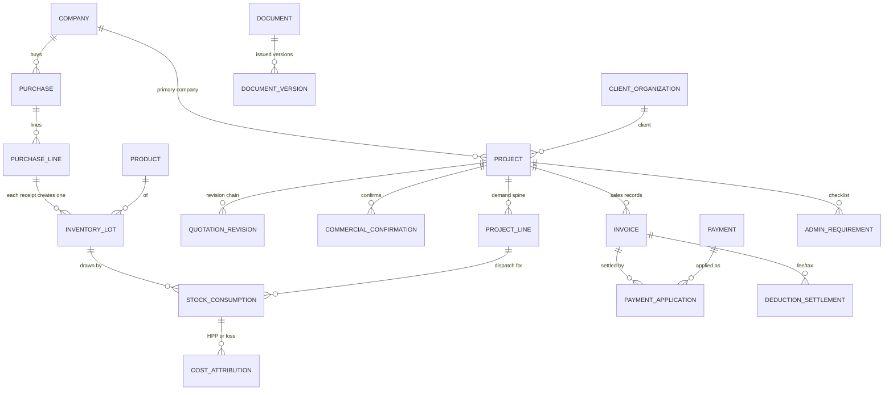
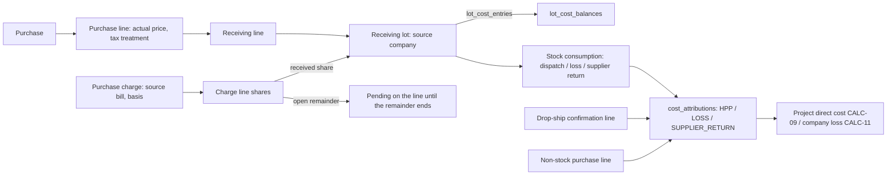
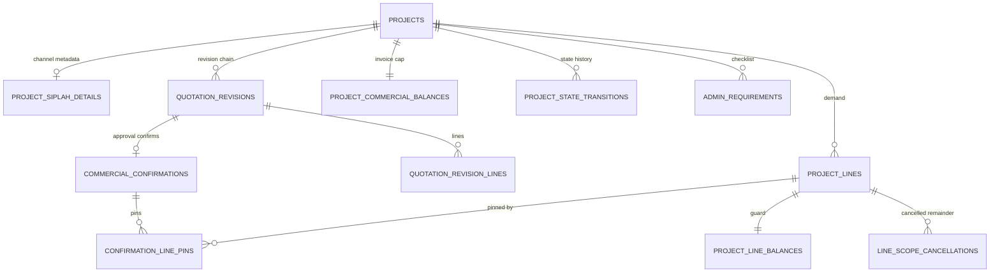
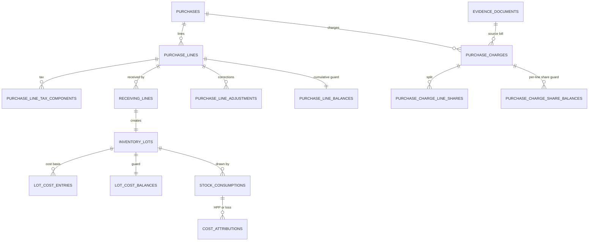
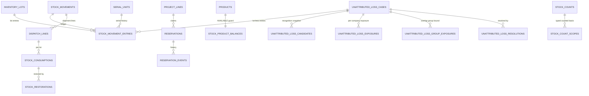
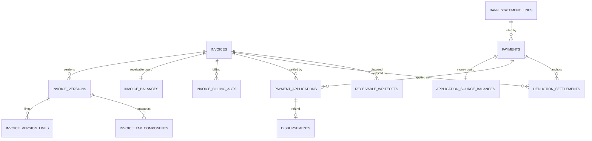
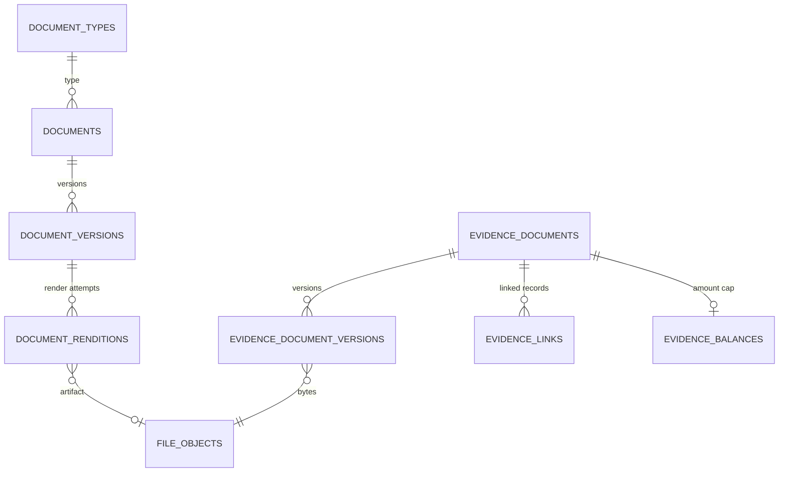

# Database architecture

Status: APPROVED | Updated: 2026-10-01 | Owner: Planning

Approval: [APPR-005](../00-governance/DECISION_LOG.md#appr-005--p4-database-architecture-approved), explicit conditional Owner approval on 2026-09-30 (DIR-029) of this document as committed in the P4 finalization checkpoint; the approved file hash, the verified conditions and the exclusions are recorded there. Approval changes lifecycle only, not implementation authorization.

Amendment: the `security_events` row of §4.13 alone was narrowly amended on 2026-09-30 as a Level-1 technical clarification under [TECH-020](../00-governance/DECISION_LOG.md#dir-031-obs-010-and-tech-020--p5-authorization-entry-baseline-and-security-documentation): its seven event kinds become the starter entries of the catalogue that [SECURITY LG-02](SECURITY.md#6-audit-and-security-logging) completes, with the further columns LG-02 defines; only its clauses marked `TECH-020` were added. The pre-amendment SHA-256 is recorded in the decision log; the amended revision is approved under [APPR-006](../00-governance/DECISION_LOG.md#appr-006--p5-security-and-authorization-approved). A second amendment of the same kind was made on 2026-09-30 under [TECH-021](../00-governance/DECISION_LOG.md#dir-032-obs-011-and-tech-021--p6-authorization-entry-baseline-and-concurrency-documentation): the `command_log` row of §4.13 gains the state `CONFLICT`, so each terminal outcome of WORKFLOWS §1 can be stored as [CONCURRENCY_IDEMPOTENCY §10](CONCURRENCY_IDEMPOTENCY.md#10-command-identity-and-replay) requires, and a clause on its two reference columns; §4, §19, §20, §23, §25 and §26 each gain one clause that points to the mechanism CONCURRENCY_IDEMPOTENCY or PERFORMANCE defines for it — the export-request record, the purge of expired `command_log` rows, the index register, the audit rows of two refusals, the moment deferred checks run, and the failure mapping per code. Only the clauses marked `TECH-021` were added and no business meaning changes; the pre-amendment SHA-256 is recorded in the decision log, and the amended revision is approved under [APPR-007](../00-governance/DECISION_LOG.md#appr-007--p6-concurrency-idempotency-and-performance-approved).

Authority: P4 — Database Architecture is authorized by the Owner's fast-track directive [DIR-027](../00-governance/DECISION_LOG.md#dir-027-obs-007-and-tech-017--p4-authorization-unattributed-loss-clarification-and-p4-documentation) (twenty-fourth source record), which also clarifies DIR-026 on unattributed cross-company loss; red-teamed under DIR-028 and corrected under DIR-029 ([TECH-018](../00-governance/DECISION_LOG.md#dir-028-obs-008-dir-029-and-tech-018--p4-targeted-review-corrections-and-finalization); twenty-fifth and twenty-sixth source records). This document owns the **logical database design**: persistent records, the authoritative-versus-derived classification, relationships and keys, constraints, immutability, snapshots, company scope, value types, index/search design, transaction boundaries and the idempotency boundary handed to P6. Application structure is owned by [ARCHITECTURE](ARCHITECTURE.md); phase evidence, adversarial findings and validation by [P4_QUALITY_GATE](P4_QUALITY_GATE.md).

**Anti-duplication contract:** business meaning is owned by [V1_SCOPE](../01-product/V1_SCOPE.md), [DOMAIN_MODEL](../02-domain/DOMAIN_MODEL.md), [BUSINESS_RULES](../02-domain/BUSINESS_RULES.md) and [WORKFLOWS](../02-domain/WORKFLOWS.md). This document cites their identifiers (CAP, BR, CALC, FS, WF, SF, CM, AX, L, QS) and never restates, relaxes or extends a business rule; where a structure below and an approved rule disagree, the rule wins and the structure is a defect to correct under [change control](../00-governance/CHANGE_CONTROL.md).

**Boundary:** logical design only. No migration, executable SQL, seeder, factory, Laravel scaffolding or application code exists or is implied. Fragments marked **NON-EXECUTABLE** only clarify a constraint. Column lists name the columns that carry meaning or constraints; the routine columns of §1 are implied. P5 owns the permission matrix and field projection; P6 the locking, isolation, retry and idempotency protocol; P8 the tests; P9 physical storage, database roles and deployment; P10 cutover; P11 build units.

## 1. Conventions

- **Names:** snake_case plural tables; `id` is the internal primary key; foreign keys are `<entity>_id`; enumerations are short uppercase codes stored as `text` with a `CHECK (col IN (…))` list (no PostgreSQL enum types, so adding a code is an ordinary expand-only migration).
- **Routine columns:** every table has `recorded_at timestamptz NOT NULL DEFAULT now()` (immutable; BR-DT-01). Rows created by a person carry `recorded_by` (user). Records with business meaning in time carry `business_date date NOT NULL` (WIB calendar date; BR-DT-01/05/06; never later than today for committed facts, L-09). Editable rows carry `lock_version integer` for stale-edit detection (OB §32; SF-CMD step 5) and `updated_at`.
- **Command identity:** every row a user command inserts carries `command_id uuid` and `command_line_no smallint`, with UNIQUE (`command_id`, `command_line_no`) in each table, so even after `command_log` retention ends a replayed command cannot insert a second copy of any row (§26). Where a decision may occur at most once per business subject within a command, the key is scoped to that subject — (`command_id`, `project_id`) on `project_state_transitions`, (`issue_command_id`, `document_id`) on `document_versions`, (`command_id`, `project_line_id`) on `line_scope_cancellations`, (`command_id`, `purchase_line_id`) on `purchase_line_closures`, (`command_id`, `invoice_id`) on `receivable_writeoffs` — so one command that legitimately affects several projects, documents, lines or invoices writes one row for each (a cost correction revalidating two completed projects writes two REVALIDATE rows).
- **Exclusive arc:** a row that may reference one of several record kinds has one nullable, fully constrained foreign key per kind plus `CHECK (num_nonnulls(…) = 1)` — never an untyped polymorphic `(type, id)` pair, because PostgreSQL cannot enforce a foreign key on it (D-DB-10).
- **Company keys:** every table of scope COMPANY or PROJECT, and every row of a POOL table that records one company's command, bearer or case, carries `company_id`; every company-owned table has UNIQUE (`company_id`, `id`) — and UNIQUE (`company_id`, `client_organization_id`, `id`) where same-client rules apply (invoices, payments, opening credits, refund disbursements) — so every company-owned reference is a composite foreign key (§15). These routine keys are implied where a row below does not list them.
- **All-or-none composite keys:** PostgreSQL composite foreign keys default to MATCH SIMPLE, which skips the whole check when any member is NULL. Wherever the scoping member of a composite key is nullable, a CHECK makes the pair all-or-none, so a present reference can never escape its scope through a NULL company: `stock_movements` (`project_id IS NULL OR company_id IS NOT NULL`, and the same for `purchase_id`), every (`correction_case_id`, `case_company_id`) pair (`num_nonnulls(correction_case_id, case_company_id) IN (0, 2)`), `evidence_links` (company present exactly when the evidence is company-scoped, §4.10) and `documents`/`document_versions` optional subject and account references. Where the optional member is the referenced record itself and the scope column is NOT NULL (an optional project of a purchase, expense or bearer), MATCH SIMPLE is the intended meaning: no project, nothing to check. **Typed-reference pairs** — an id with the type or kind column that carries it into a composite key — are all-or-none as well: (`reverses_movement_id`, `reverses_movement_type`), every (`…_evidence_id`, `…_evidence_type`) pair, (`transfer_from_disbursement_id`, `transfer_from_disbursement_kind`), (`inherited_from_act_id`, `inherited_from_invoice_id`) and the restoration's cited-unit columns. Because a CHECK that evaluates to NULL passes, every CHECK over nullable columns is written NULL-safe (explicit `IS NOT NULL` terms).
- **Quantity scale:** every quantity-bearing fact row carries `product_id` and `quantity_scale` through a composite foreign key to `products` (`id`, `quantity_scale`) and `CHECK (qty = round(qty, quantity_scale))` on each base quantity it stores — ledger entries, lots, receiving, dispatch, drop-ship, delivery and handover lines, consumptions, restorations, reservations and reservation events, confirmation pins, quotation, purchase and invoice lines, closures, cancellations, count scopes, lines and findings, unattributed cases and resolution lines — so a fractional quantity of a counted or serialized product is unstorable everywhere, not only in the ledger (§7). Guard balances are sums of such values and need no CHECK of their own.
- **Guard posting pattern:** a *guard balance* row (class GB) is changed only by a conditional in-transaction update that adds signed deltas; its CHECK constraints reject any commit that would break the conservation law it guards (§5.2, §18). PostgreSQL checks CHECK constraints per statement, so a command updates each guard row **once, in one statement carrying the net delta of all its columns** — an intermediate state is never written — and an update that matches no row is a failure, never a silent success (P6). **What PostgreSQL guarantees and what it does not:** it guarantees the guard's CHECK on the guard row; the coupling between a fact and its guard delta is guaranteed by the single posting path (ARCHITECTURE §7) and verified by reconciliation (§3.1). Catalogue rows that rely on that coupling are labelled **DB+APP+DQ** (§18), never "DB" alone.

| Class | Meaning | Change rule (application database role) |
| --- | --- | --- |
| AF | Authoritative fact — immutable record of something that happened | INSERT only; corrected by contra, reversal or superseding rows (BR-CR-02); the few state or citation columns named in §4 (settlement state, a bank-line citation and its reasoned correction, a bank line's void) change only through a column-level grant and a transition trigger that allows exactly the transitions §4 lists |
| AD | Authoritative decision — immutable record of a business decision | INSERT only; a correction is a superseding decision (`supersedes_…_id`, L-32) |
| SR | State record — the stored-decision state of a P2 state model or an editable draft | INSERT + UPDATE of its lifecycle/draft columns only, each change audited; never deleted once committed history references it |
| MD | Master data — "true now" reference data | INSERT + UPDATE with audit; ARCHIVE instead of delete once referenced |
| CF | Configuration — effective-dated or versioned settings | INSERT + UPDATE of rows not yet effective; effective rows are closed and superseded |
| SN | Snapshot — immutable copy of values asserted at commitment (BR-SN-01) | INSERT only, written in the committing transaction |
| GB | Guard balance — controlled materialization of a conservation law, rebuildable from facts | UPDATE only through the owning posting service; never user-editable; the audited `GuardMaintenance` rebuild (§3.1) is the one exceptional writer |
| DV | Derived view — computed on read, never stored | none (SQL view or query object) |
| AE | Audit evidence | INSERT only; no application role can update or delete (the table-owning migration role technically can; §28 restricts it) |
| OP | Operational record — technical coordination (commands, renditions, imports) | as stated per table; never business truth |

Scope codes follow [DOMAIN_MODEL](../02-domain/DOMAIN_MODEL.md#reading-conventions): GLOBAL, MASTER, COMPANY, PROJECT (company-attributed through its project), POOL (shared physical quantities) and POOL×COMPANY (pool quantities carrying economic company attribution). Sensitivity classes S0–S4 are [DOMAIN_MODEL's](../02-domain/DOMAIN_MODEL.md#scope-and-sensitivity-classes); P5 enforces them.

## 2. Design decisions

Each decision is a Level-1 technical choice under DIR-005/DIR-027 that preserves approved business meaning; alternatives are recorded so later phases do not re-litigate them without new evidence.

| ID | Decision | Rejected alternatives and why |
| --- | --- | --- |
| D-DB-01 | One PostgreSQL database, one schema; module ownership expressed by table-name families and code ownership (ARCHITECTURE), not by database schemas | Schema per module: cross-module foreign keys and Laravel migrations become harder for no integrity gain. Database per company: forbidden (DIR-027 §6) and would break the shared pool |
| D-DB-02 | `bigint` identity primary keys everywhere; an additional `public_id uuid` (UUIDv7) only on routable aggregate roots; business numbers are separate, never keys (§16) | UUID keys everywhere: twice the key width on every ledger foreign key and harder debugging, with no benefit where rows are never exposed. ULID: no native type. Sequential ids in URLs: enumerable, leaks volumes |
| D-DB-03 | Money is `numeric(18,2)` rupiah; derived splits (cost, charge and proportional contras) round to a **Rp1 increment** with residual absorption, as the binding annex 10 requires (§17) | Integer minor units: exact but unreadable in SQL/reports and still needs decimal handling for rates. Float: forbidden |
| D-DB-04 | Quantities are base units `numeric(18,3)` with a per-product scale (0 for counted and serialized goods); alternate units convert by an **integer** ratio ≥ 1 (L-31), so conversion never rounds (§7) | Float or free-scale numerics: uncontrolled rounding. Decimal ratios: L-31 makes alternates exact multiples of the smallest counted unit |
| D-DB-05 | Append-only facts plus contra/reversal/superseding rows; immutability protected by the application roles' privileges (INSERT/SELECT only on AF/AD/SN/AE tables) and by triggers on issued content (§13, §28); the table-owning migration role is outside these privileges and is restricted operationally (§28) | `is_deleted` flags or in-place edits: destroy history (FS-02, BR-CR-02) |
| D-DB-06 | Stock truth is an append-only **inventory ledger**; current balances are **guard balances** maintained in the same transaction, whose CHECK constraints PostgreSQL enforces on every commit — AVAILABLE ≥ 0 and non-negative lot/scope quantities hold for the guard rows unconditionally, and for the ledger through the single posting path and reconciliation (§5; DB+APP+DQ) | Ledger-only derivation: correct but cannot express AVAILABLE ≥ 0 as a constraint and makes every scan and dispatch aggregate the ledger. Free-standing balance table: a second truth |
| D-DB-07 | The same guard pattern protects every cross-row conservation law that must survive concurrency: payment applications and refund backing, receivable reductions, evidence, bank-line and source-bill caps, fee/tax expense caps, money-fact contras and transfers, charge and charge-share allocation, cumulative purchase-line posting, per-line fulfilment caps, the project invoice cap, restoration and reversal caps, pending-case quantities and unattributed-loss exposures (§3.1, §18) | Application checks only: violates "database guarantees for critical invariants" (OB §26). Triggers computing sums: slow, hidden and still racy without locks. SERIALIZABLE isolation everywhere: operationally fragile retry storms |
| D-DB-08 | **Composite foreign keys** carry `company_id` (and `client_organization_id` where the rule is same-client) so a row cannot reference another company's record (§15) | Application-only scoping: a single missed check leaks or corrupts cross-company data (GAP-006) |
| D-DB-09 | Snapshots: typed value snapshots on transaction lines for anything computed later; an immutable JSONB payload for issued document content; immutable file objects for identity assets; immutable bank-account rows (§14) | Versioned copies of every master: heavy and unnecessary. Rendering from live masters: rewrites history (BR-SN-01) |
| D-DB-10 | Exclusive-arc typed foreign keys instead of Laravel morph (`*_type`, `*_id`) columns for business links | Morph links: no referential integrity; orphaned evidence and documents become possible |
| D-DB-11 | Exact B-tree lookups plus `pg_trgm` similarity search; no full-text engine or external search service in V1 (§21) | Full-text search: Indonesian names and codes need substring/similarity, not stemming. Elasticsearch: excluded (OB §30) |
| D-DB-12 | Document and project numbers come from per (company, sequence type, period) **counter rows** incremented inside the issuing transaction — unique in their scope, monotonic per counter, append-only, never reused and concurrency-safe — plus UNIQUE constraints on the issued numbers; a retired project number keeps an explicit tombstone (§10). No business rule requires gapless series (BR-DOC-02), so none is claimed | `MAX(number)+1`: forbidden (OB §14; BR-DOC-02). PostgreSQL SEQUENCE objects: non-transactional, leave gaps on rollback and cannot be seeded per period cleanly |
| D-DB-13 | An unattributed loss is recorded as **lot-less ledger entries** of its case plus an immutable candidate snapshot with per-company exposure rows; assignment is capped per company by that exposure and, across cases pending in the same scope at the same time, by one overlap-group bound, so the same claims are never attributed twice; resolution closes lot claims and never re-points later movements; nothing freezes stock meanwhile (DIR-027; §5.8) | Retention of candidate lots: superseded by DIR-027. Assigning a lot at recognition: an automatic company choice (DIR-026) |
| D-DB-14 | Inter-company allocation is an **overlay on the consumption itself** (source company versus bearer company on the consumption and cost rows), not a separate table (§6.5) | Separate allocation table: can drift from the consumption it describes; "allocation follows consumption" (L-44, AX-10) then needs extra synchronization code |

## 3. Authoritative versus derived data

Everything quantitative or progressive is derived from facts and decisions (BR-XD-05; FS-01; FS-11; L-01). A stored derived value exists only as a **guard balance** that satisfies all five conditions: (1) its source facts and formula are named (§3.1); (2) the facts carry every discriminator the formula needs; (3) it is written only in the transaction that writes those facts, by its one normal writer; (4) it can be rebuilt from them at any time by a deterministic query; (5) a reconciliation query that finds a difference reports a defect (BR-INV-08) rather than a second opinion — the facts win. Guards exist to let PostgreSQL enforce conservation under concurrency and to serve hot reads; they are never edited, imported or "corrected" directly, except by the audited maintenance rebuild of §3.1.

| Concept | Classification | Source of truth → representation |
| --- | --- | --- |
| ON HAND, UNUSABLE per product | GB `stock_product_balances` | Σ `stock_movement_entries` (all, and condition UNUSABLE); rebuild = ledger sum |
| RESERVED per product | GB column of `stock_product_balances` | Σ remaining of ACTIVE `reservations`, which is Σ `reservation_events` |
| AVAILABLE | DV | ON HAND − RESERVED − UNUSABLE; its ≥ 0 bound is a CHECK on the product guard (BR-INV-01) |
| Stock per location × condition | GB `stock_scope_balances` | lot claims, pending reductions and pending additions of the scope, from the ledger; physical = claims − reductions + additions |
| Lot remainder (claims) per location × condition | GB `stock_lot_balances` | Σ ledger entries of the lot |
| Lot remaining cost | GB `lot_cost_balances` | Σ `lot_cost_entries` − Σ lot draws in `cost_attributions` |
| Serial current state/location | GB-like current state on `serial_units` | the latest event citing the serial: ledger entry, drop-ship confirmation line or drop-ship restoration (§3.1) |
| Reservation remaining | SR column on `reservations` | Σ `reservation_events` |
| Per-line reserved / net dispatched / net confirmed / handed over / net delivered / cancelled | GB `project_line_balances` | reservations, dispatch lines, restorations, delivery closures, drop-ship confirmations, handovers, deliveries, cancellations (PX-08) |
| Purchase receipt progress and remainder (CALC-03); cumulative cost posting | GB `purchase_line_balances` | receiving lines (normal and replacement), receipt reversals, closures, cancellations, drop-ship confirmations and their reversals; the line's corrected goods and non-creditable-tax values and what has been posted of them, net of reversals and corrections |
| Charge allocation per charge and per line | GB `purchase_charge_balances`, `purchase_charge_share_balances` | charges and their corrections, the current allocation version's shares, CHARGE_SHARE / CHARGE_RESPREAD entries, LATE_CHARGE / CHARGE_RESPREAD attributions and charge expenses |
| Outstanding receivable (CALC-05) | GB `invoice_balances.outstanding` | issued invoice version − active applications − fee/tax settlements − net write-offs (BR-FIN-04) |
| Active receivable / BELUM DITAGIHKAN / paid / overdue | DV | outstanding + current billing act + due date (BR-FIN-02, CALC-05); *paid* means outstanding 0 with no net write-off — a written-off amount shows as disposed, never as paid (BR-FIN-08) |
| Aging bucket (CALC-07) | DV | due date (or `migrasi` basis) versus the WIB business day (BR-FIN-15) |
| Payment applied / unapplied; refund-backed consumption; remaining application capacity | GB `application_source_balances` | payment or opening-credit amount and its contras; ACTIVE invoice-target and refund-target `payment_applications`; refund-target applications ended by a source contra (shortfall) or by the refund's own contra (released) |
| Customer credit (CALC-06) | DV | unapplied remainder of payments and opening credits of one client and company (BR-FIN-05) |
| Evidence and bank-line citations; fee and tax expenses per evidence | GB `evidence_balances` | settlements, charges, expenses and Cash-In facts citing the evidence |
| Contras per money fact; refund backing and shortfall; transfer citation | GB `money_fact_balances` | contras of each disbursement, other Cash-In, expense, settlement and write-off; REFUND applications targeting each refund and the typed resolutions of its shortfall; Cash-In facts citing an inter-company transfer-out |
| Reversal caps | GB `stock_reversal_balances` | MOVEMENT_REVERSAL entries against the reversed movement |
| Project revenue, direct cost, profit, margin (CALC-08–10) | DV | issued non-void invoice versions; `cost_attributions`; `expenses` |
| Company and consolidated profit, cashflow (CALC-11–14) | DV | as above plus other Cash-In and disbursements, by business_date (CALC-13) |
| Project stage, "what is next", completion readiness, requirement satisfaction | DV | predicates over facts and decisions (L-01; WF-PRJ-03) |
| Project state, quotation state, document version state, reservation state | SR | the P2 stored-decision state models, changed only by their transitions |
| Pending unattributed quantity; exposure assigned per company and per overlap group | GB columns of `unattributed_loss_cases`; GB `unattributed_loss_exposures`, `unattributed_loss_group_exposures` | recognition, found, resolution, conversion and reversal movements of the case; the immutable candidate snapshot; resolution lines |
| Number sequence position | SR `number_sequences` | authoritative counters: migration seeds cannot be derived, so a counter is verified — every value below it is an issued number, a retired number with its tombstone (`retired_numbers`) or a legacy value below the migration seed — never rebuilt downward |
| QS-01–QS-22 signals, dashboards, reports | DV | queries over the above; no stored queue |
| Issued document content | SN `document_versions.payload` | immutable at issue; presentation only — no financial or stock computation reads it |
| Audit history | AE `audit_events` | written in the same transaction as the change it describes |

### 3.1 Guard registry and reconciliation

Every guard below has one authoritative formula over facts, the discriminators that formula needs, and one normal writer (ARCHITECTURE §7). The same table drives the verify commands (P6 cadence) and the P8 reconciliation suite. "Net" always means net of the reversals, contras, supersessions and corrections that cite the counted fact.

| Guard (key) | Authoritative formula over facts | Discriminators relied on | Normal writer |
| --- | --- | --- | --- |
| `stock_product_balances` (product) | on hand = Σ ledger entries; unusable = Σ entries in condition UNUSABLE; reserved = Σ `remaining_qty_base` of ACTIVE reservations | entry `condition`; reservation `state` | InventoryPosting |
| `stock_scope_balances` (product, location, condition) | claims = Σ entries with a lot; per pending case, net = Σ that case's lot-less entries in the scope, and pending reduction = Σ over cases of max(0, −net), pending addition = Σ over cases of max(0, +net) — so clearing entries (resolution, found, recognition reversal, conversion) net against the entries they clear; version = number of movements with entries in the scope; last entry = highest entry id | `lot_id` present or not; `unattributed_case_id` | InventoryPosting |
| `stock_lot_balances` (lot, location, condition) | Σ entries of the lot at the key | — | InventoryPosting |
| `stock_reversal_balances` (reversed movement, lot, location, condition) | original = absolute net of the reversed movement's lot entries at the key; reversed = absolute net of the MOVEMENT_REVERSAL entries citing it at the key; lot-less reversals have no row here — they are capped by the case counters | `reverses_movement_id` | InventoryPosting |
| `stock_consumption_balances` (consumption or drop-ship line) | quantity; restored = Σ restorations citing it of kinds other than SUBSTITUTION and DROPSHIP_ERROR_REVERSAL, net of their CM-37 reversals and of the DROPSHIP_ERROR_REVERSALs that undo them; substituted = Σ SUBSTITUTION restorations; reclassified = Σ LOST_IN_TRANSIT closure quantity reclassified on it | restoration `kind`; closure kind | InventoryPosting |
| `serial_units` state (serial) | the serial's latest movement or drop-ship event in recorded order, evaluated by the serial's **net** entry in that movement: net +1 → IN_STOCK at the positive entry's lot, location and condition; net 0 (condition change, location move) → IN_STOCK at the positive entry; net −1 → by type: DISPATCH or IDENTITY_SUBSTITUTION → DISPATCHED, PURCHASE_RETURN → RETURNED_TO_SUPPLIER, LOSS, ADJUSTMENT_DECREASE or COUNT_VARIANCE → LOST, RECEIPT_REVERSAL → NEVER_RECEIVED, MOVEMENT_REVERSAL → the state before the reversed movement; a drop-ship confirmation line → DROPSHIPPED, a DROPSHIP_SUPPLIER_RETURN → RETURNED_TO_SUPPLIER, a DROPSHIP_CONFIRMATION_REVERSAL → NEVER_RECEIVED and any DROPSHIP_ERROR_REVERSAL → DROPSHIPPED (a drop-shipped serial has no ledger entry) | movement type; restoration kind | InventoryPosting |
| `reservations` remaining and state | Σ reservation events; CONSUMED/RELEASED from the terminating event | event `kind` | InventoryPosting |
| `project_line_balances` (project line) | demand = current pin; reserved = ACTIVE reservations' remaining; dispatched net = Σ dispatch lines − Σ restorations other than SUBSTITUTION of their consumptions (net of their CM-37 reversals) − reclassified lost quantity, an identity substitution changing no quantity; drop-ship confirmed net = Σ confirmation lines − Σ DROPSHIP_RETURN, DROPSHIP_SUPPLIER_RETURN and DROPSHIP_CONFIRMATION_REVERSAL restorations, each net of its CM-37 reversal or DROPSHIP_ERROR_REVERSAL (an error reversal only nets, it is never a positive term); delivered net = Σ delivery lines − their reversal lines − Σ restorations of goods returned by the client after delivery (SALES_RETURN, and DROPSHIP_RETURN or DROPSHIP_SUPPLIER_RETURN with `after_delivery`), net of their reversals; handed over = Σ handover lines − their reversal lines; cancelled = Σ current cancellations (PX-08) | restoration kind and `after_delivery`; reversal links; supersession | DemandPosting |
| `project_commercial_balances` (project) | confirmed = Σ current pins' sales value; invoiced = Σ current ISSUED LIVE invoice versions' sales value | invoice `origin`, version state | DemandPosting |
| `purchase_line_balances` (purchase line) | ordered; normal received net = Σ usable + damaged quantity of non-replacement receipts − their reversals (rejected units never count); replacement expected = Σ replacement declarations of return cases net of outcome corrections; replacement received net = Σ usable + damaged quantity of replacement receipts − their reversals + Σ replacement drop-ship confirmation lines − their reversals; closed = Σ current closures, or the whole ordered quantity on cancellation; drop-ship confirmed net = Σ non-replacement confirmation lines − Σ DROPSHIP_CONFIRMATION_REVERSAL restorations of them (net of their error reversals); goods value = line value + Σ PRICE_CORRECTION deltas; non-creditable tax value = Σ non-creditable components + Σ TAX_CORRECTION deltas; posted goods / tax = Σ lot entries and direct attributions of the line with `cost_component` GOODS / NONCREDITABLE_TAX (replacement bases excluded) | `receipt_kind`; `is_replacement`; `cost_component`; adjustment `kind` | PurchasePosting |
| `purchase_charge_balances` (charge) | amount = charge amount + Σ CHARGE_CORRECTION deltas; allocated = Σ lot entries and direct attributions with `cost_component` CHARGE citing the charge (LATE_CHARGE and CHARGE_RESPREAD attributions on consumptions are draws from those entries and are not counted again); expensed = Σ PURCHASE_CHARGE expenses of the charge | `cost_component`; charge reference | CostPosting |
| `purchase_charge_share_balances` (charge, line) | share = the current allocation version's share; posted = Σ CHARGE-component lot entries and direct attributions that cite this share (`purchase_charge_line_share_id` of the current version), including their reversal and correction rows; respread out = Σ re-spread rows of the charge whose `respread_from_purchase_line_id` is this line, under the current version; expensed out = Σ fallback PURCHASE_CHARGE expenses of the charge that cite this line | `allocation_version`; `cost_component`; share or re-spread reference; the expense's `purchase_line_id` | CostPosting |
| `lot_cost_balances` (lot) | remaining quantity = Σ ledger entries of the lot; remaining cost = Σ `lot_cost_entries` − Σ net lot draws in `cost_attributions` | draw source keys | CostPosting |
| `evidence_balances` (evidence or bank line) | proven = the evidence's proven amount, or the bank line's amount (0 once VOIDED); cited = Σ ACTIVE and RESIDUAL settlements, charges (current amount), expenses citing it as their source bill and Cash-In, each net of its contras, citing it; expensed = Σ FEE_DEDUCTION and TAX_TREATMENT expenses citing it, net of contras | settlement `state`; citation columns | EvidencePosting |
| `invoice_balances` (invoice) | gross, sales and output-tax values = the current effective version (0 when voided); applied = Σ ACTIVE invoice-target applications; fee / tax / collected-tax settled = Σ ACTIVE settlements by class and direction; written off = Σ write-offs − Σ their supersession contras; current act = the unsuperseded root chain's latest act | settlement class, direction, state; application state | ReceivablePosting |
| `application_source_balances` (payment or opening credit) | gross = source amount; contra = Σ contras; invoice applied / refund backed = Σ ACTIVE invoice- / refund-target applications; refund released = Σ refund-target applications ended REFUND_CONTRA; refund shortfall = Σ over refund-target applications ended SOURCE_CONTRA of (amount − superseding and resolving applications − resolving refund contras); settled = Σ ACTIVE anchored settlements; claimed deductions = Σ current claimed-deduction rows | `target_kind`; `state`; `end_reason`; `resolves_application_id` | MoneyPosting |
| `money_fact_balances` (money fact) | contra = Σ contras; for a REFUND: backed = Σ ACTIVE applications targeting it, shortfall = Σ open shortfall of its SOURCE_CONTRA-ended backing applications, released = Σ its backing applications ended REFUND_CONTRA; for an INTERCOMPANY_TRANSFER_OUT: transfer cited = Σ Cash-In citing it, net of their contras | `fact_kind`; `end_reason`; resolution links | MoneyPosting |
| `unattributed_loss_cases` counters (case) | all measured in the case's own (product, location, condition) scope: found = the net of the case's UNATTRIBUTED_FOUND entries and the (negative) MOVEMENT_REVERSAL entries that reverse them; resolved = Σ resolution lines net of resolution reversals; reversed = Σ the case's lot-less MOVEMENT_REVERSAL entries that undo its recognition (for a successor, those that undo its conversion); converted = the quantity moved to its successor by UNATTRIBUTED_CONVERSION, net of the conversion's reversal | movement type; reversed movement | InventoryPosting |
| `unattributed_loss_exposures` (case, company) | exposure = Σ the company's candidate rows (immutable); assigned = Σ the case's resolution lines to the company, net of reversals | — | InventoryPosting |
| `unattributed_loss_group_exposures` (group, company) | replayed in recognition order: bound = max over members of (member exposure + the group's net assignment to the company committed before that member's recognition); assigned = Σ members' net assignments to the company | recognition order; resolution recorded order | InventoryPosting |
| `correction_cases` counters (case) | unbacked refund = Σ refund shortfall carried by the case; residual settlement = Σ RESIDUAL settlements of the case; returned cost = Σ SUPPLIER_RETURN amounts of the case's returned units — their draws and drop-ship reclassifications with their corrections — **excluding** cause RETURN_SETTLEMENT; refunded = Σ RETURN_REFUNDED adjustments of the case; replaced = Σ REPLACEMENT_BASIS lot entries and replacement confirmation bases of the case with their corrections; unrecovered = Σ RETURN_SETTLEMENT LOSS amounts of the case | cost class and cause; case keys | MoneyPosting (money counters); CostPosting (return figures) |
| `number_sequences` (company, type, period) | authoritative, never rebuilt: verified that every value below `next_value` is an issued number, a tombstoned retired number or below the migration seed | — | NumberAllocator |

**Rebuild and reconciliation path.** `ReconcileGuards` (scheduled; ARCHITECTURE §11) is verify-only: it recomputes each formula and reports every difference to the named operator (GAP-013/031). A difference is repaired only by `GuardMaintenance`, the single audited exceptional writer of guards: a maintenance command run by the administration role (§28) after a verified defect or a restore, which recomputes the affected rows from the formulas above inside one transaction, writes the recomputed values and records an audit event per row with before/after values, the defect or restore reference and the actor. It never runs during normal operation, is never scheduled and never changes a fact; a guard whose rebuilt value would violate its own CHECK means the facts themselves are inconsistent, which is a defect to correct through §13, not by rebuild.

## 4. Module map and logical model

Tables group into thirteen modules owned by the application modules in [ARCHITECTURE](ARCHITECTURE.md#3-modules). Counts are logical tables (framework infrastructure tables — sessions, password-reset tokens, queue and cache tables, migrations — are excluded and belong to P5/P9; `TECH-021`: so is the operational export-request record that [CONCURRENCY_IDEMPOTENCY H6-04](CONCURRENCY_IDEMPOTENCY.md#17-p5-obligations-h6-01h6-12) defines for the export context of PERMISSIONS_MATRIX DP-07).

| Module | Tables | Scope | Content |
| --- | --- | --- | --- |
| IAM — Identity & Access | 7 | GLOBAL | users, roles, capabilities, grants |
| ORG — Organization | 9 | COMPANY/GLOBAL | companies, bank accounts, numbering and retired-number tombstones, tax configuration |
| PTY — Parties | 5 | MASTER | client organization → unit → address/PIC, suppliers |
| CAT — Catalog | 6 | MASTER | products/services, units, conversions, barcodes, price defaults, images |
| PRJ — Projects & Commercial | 11 | PROJECT | projects, SIPLAH details, demand lines, quotations, confirmations, pins, cancellations, completion, guards |
| PUR — Procurement | 8 | COMPANY | purchases, lines, taxes, charges, shares, closures, adjustments, guard |
| INV — Inventory | 26 | POOL / POOL×COMPANY | locations, lots, serials, ledger, consumptions, restorations, balances, reservations, counts and their typed scopes, unattributed-loss cases with exposure guards |
| CST — Costing & Expenses | 6 | POOL×COMPANY / PROJECT / COMPANY | lot cost ledger and balance, cost attributions (HPP/loss), charge and charge-share guards, expenses |
| FUL — Fulfillment | 7 | PROJECT | drop-ship confirmations, deliveries, delivery closures, service handovers |
| DOC — Documents & Evidence | 10 | COMPANY | document types, documents, versions, renditions, files, evidence, bank statement lines, evidence guards and links |
| ADM — Administration | 3 | PROJECT | requirements, satisfaction links, waivers |
| FIN — Finance | 19 | COMPANY | invoices, versions, lines, tax components, billing, payments, applications, settlements, write-offs, disputes, opening credit, Kuitansi links, disbursements, other Cash-In, contras, guards |
| OPS — Operations | 7 | GLOBAL/COMPANY | audit, security events, command log, correction cases, imports, archive |
| **Total** | **124** | | |



The written tables below are authoritative; diagrams (this overview and the domain diagrams in §29) only orient.

### 4.1 IAM — Identity & Access

| Table | Class | Key columns and constraints | Rules served |
| --- | --- | --- | --- |
| `users` | MD | `public_id`; `name`; `email` UNIQUE on `lower(email)`; `password` (framework-supported one-way hash only, never plaintext or reversible); `is_active`; `deactivated_at/by` | BR-XC-02 individual identity; never deleted (audit references it); L-34 last active Owner protected |
| `roles` | CF | `code` UNIQUE (`OWNER`, `ADMIN_OPERASIONAL`; custom roles later, D-01); `is_builtin` | Two launch roles (OB §17) |
| `capabilities` | CF | `code` UNIQUE (e.g. `stock.dispatch`); `authority_class` (`ADM`, `ADM_PLUS`, `OWNER_ONLY`) | WORKFLOWS §4 action families; P5 owns the catalogue |
| `role_capabilities` | CF | PK (`role_id`, `capability_id`) | Capability-based authorization, never role-name checks |
| `user_roles` | SR | PK (`user_id`, `role_id`); `granted_by/at` | One launch role per user in V1 (application rule) |
| `user_capability_grants` | SR | `user_id`, `capability_id`, `granted_by/at`, `revoked_by/at`, `reason`; partial UNIQUE (`user_id`, `capability_id`) WHERE `revoked_at IS NULL` | Separately grantable ADM+ authorities (DIR-024 D-5) |
| `user_company_grants` | SR | `user_id`, `company_id`, `granted_by/at`, `revoked_by/at`; partial UNIQUE (`user_id`, `company_id`) WHERE `revoked_at IS NULL` | Default deny: no active row means no company access (BR-ACC-01) |

### 4.2 ORG — Organization

| Table | Class | Key columns and constraints | Rules served |
| --- | --- | --- | --- |
| `companies` | MD | `public_id`; `code` UNIQUE; `legal_name`, `legal_form`, `npwp`, address/contact, `director_name`; `logo_file_id`, `stamp_file_id`, `signature_file_id` → immutable `file_objects`; `is_active`, `deactivated_at/by/reason` | CAP-01; identity changes never alter issued snapshots (BR-SN-01); deactivation per BR-ACC-03 |
| `company_bank_accounts` | MD (immutable detail) | `company_id`; `bank_name`, `account_number`, `account_holder`, `branch`; `is_active`; UNIQUE (`company_id`, `bank_name`, `account_number`); UNIQUE (`company_id`, `id`) for composite keys | Detail columns are never updated once any fact references the row (trigger); a change is a new row plus deactivation, so payments and documents keep the destination actually used (BR-SN-02) |
| `numbering_schemes` | CF | `company_id`; `sequence_type` (`DOC-01`…`DOC-14`, `PROJECT`); `period_granularity` (`YEAR`, `MONTH`); `format_template`; `revision_format` (`NEW_NUMBER`, `BASE_SUFFIX`); `effective_from`; UNIQUE (`company_id`, `sequence_type`, `effective_from`) | Company numbering rules (WF-MD-01, OWN!); exact formats validated under GAP-019 |
| `number_sequences` | SR (authoritative allocator) | PK (`company_id`, `sequence_type`, `period_key`); `next_value bigint CHECK (next_value >= 1)`; `seeded_by_import_row_id`; `seed_value` (the first live value; legacy values lie below it); created on demand only for periods on or after the go-live period — an earlier period exists only if the migration seeded it, so a backdated issue into an unseeded pre-cutover period is REJECTED; never lowered or rebuilt downward, because seeds cannot be derived from issued rows | Unique, monotonic, append-only, never reused numbers (BR-DOC-02; D-DB-12); migration seeding (WF-MIG-01, AX-28); verification per §3.1 |
| `retired_numbers` | AF | `company_id`; `sequence_type`, `period_key`, `sequence_no`, `formatted_number`; `retired_kind` (`DISCARDED_DRAFT_PROJECT`); `source_public_id` (the discarded record's public id); `reason`; `retired_by`; `command_id`, `command_line_no`; UNIQUE (`company_id`, `sequence_type`, `period_key`, `sequence_no`); UNIQUE (`company_id`, `sequence_type`, `formatted_number`) | The explicit tombstone of a project number whose DRAFT project was discarded (L-37), written in the discarding transaction, so a retired number is recorded, explained and never reissued; document numbers need none — a number is drawn only at issue and a void keeps its version row (§10) |
| `tax_types` | CF | `code` UNIQUE; `name`; `category` (`OUTPUT_TAX`, `INPUT_TAX`, `WITHHOLDING`, `COLLECTION`, `OTHER`); `is_active` | Tax kinds are data, never code constants (BR-FIN-17; FS-13) |
| `tax_rate_versions` | CF | `tax_type_id`; `rate_percent numeric(9,6)`; `base_numerator`, `base_denominator` (integers, default 1/1, for configured tax bases); `rounding_mode` (`HALF_UP`, `DOWN`); `effective` daterange; EXCLUDE overlapping ranges per `tax_type_id` | Effective-dated configured rates (DIR-024 D-1 item 3) |
| `company_tax_profiles` | CF | `company_id`; `registration_status` (a configured value such as the company's VAT registration); `effective` daterange; EXCLUDE overlap per company | D-1: treatment by company and period |
| `tax_treatment_rules` | CF | `company_id` (NULL = every company; a company-specific rule overrides the global rule for the same context, tax type and date); `transaction_context` (`SALES_INVOICE`, `PURCHASE_LINE`, `PAYMENT_WITHHELD`, `PAYMENT_COLLECTED`, `TAX_REMITTANCE`); `tax_type_id`; `treatment` (`OUTPUT_EXCLUDED_FROM_REVENUE`, `INPUT_CREDITABLE`, `INPUT_TO_ACQUISITION_COST`, `SETTLEMENT_NO_EXPENSE`, `SETTLEMENT_TO_EXPENSE`, `REMITTANCE_NOT_COST`, `REMITTANCE_TO_EXPENSE`); `evidence_required`; `effective` daterange; EXCLUDE overlap per (`coalesce(company_id, 0)`, `transaction_context`, `tax_type_id`), so global rules cannot overlap either | D-1 NET model: configurable, evidenced, no invented formula (§12) |

### 4.3 PTY — Parties

| Table | Class | Key columns and constraints | Rules served |
| --- | --- | --- | --- |
| `client_organizations` | MD | `public_id`; `name` (trigram index); `npwp` (optional); `is_active` | One generic hierarchy; UNY/UGM are ordinary rows (OB §8). No UNIQUE on name — same-named schools in different cities are legitimate; duplicates are prevented by search-first creation and a warning (WF-MD-02) |
| `client_units` | MD | `client_organization_id`; `name`; `is_active`; UNIQUE (`client_organization_id`, lower(`name`)) | Unit/department level |
| `client_addresses` | MD | `client_unit_id`; `label`; address lines, `city`; `is_active` | Unit-specific selectable address (AC-02); the address as used is snapshotted on outputs (§14) |
| `client_contacts` | MD | `client_unit_id`; `name`, `position`, `phone`, `email`; `is_active` | PIC; S2 relations |
| `suppliers` | MD | `public_id`; `name` (trigram index); `npwp`; address/contact; `is_active` | Master identity only; price history is derived per company from purchases (BR-ACC-02) — no stored supplier-price table |

### 4.4 CAT — Catalog

| Table | Class | Key columns and constraints | Rules served |
| --- | --- | --- | --- |
| `products` | MD | `public_id`; `kind` (`GOODS`, `SERVICE`); `sku` UNIQUE on `lower(sku)`; `name` (trigram index); `base_unit_id`; `quantity_scale smallint CHECK (quantity_scale BETWEEN 0 AND 3)`; `is_serialized`; `min_stock_qty_base`; `is_active`; CHECK (`NOT is_serialized OR (kind = 'GOODS' AND quantity_scale = 0)`); UNIQUE (`id`, `quantity_scale`) (the scale key of §1); no historical row keys on `is_serialized`, so the L-35 switch stays possible for a product with history | Goods/service flag decides stock applicability (BR-INV-11); serialized means integer pieces (BR-INV-03); switching serialization follows L-35 |
| `units` | MD | `code` UNIQUE; `name` | Unit dictionary |
| `product_units` | MD | `product_id`, `unit_id`, `ratio_to_base bigint CHECK (ratio_to_base >= 1)`, `is_base`, `is_active`; UNIQUE (`product_id`, `unit_id`); partial UNIQUE (`product_id`) WHERE `is_base`; CHECK (`NOT is_base OR ratio_to_base = 1`) | Base = smallest counted unit, alternates exact integer multiples (L-31); ratio edits never reach history because transactions snapshot the ratio (§7) |
| `product_barcodes` | MD | `product_id`; `code` (as printed); `code_key` generated as `upper(regexp_replace(code, '\s', '', 'g'))` — whitespace removed and letters upper-cased, leading zeros kept; `kind` (`MANUFACTURER`, `INTERNAL`); `is_active`; **partial UNIQUE (`code_key`) WHERE `is_active`**; scans are looked up by the same normalization | A code resolves to at most one active product however it is typed or scanned (BR-INV-09), consistent with the normalized SKU and serial keys; internal codes come from a database sequence (gaps are harmless) |
| `product_price_history` | AF | `product_id`; `price_kind` (`PURCHASE_DEFAULT`, `SELLING_DEFAULT`, `SPJ_REFERENCE`); `amount numeric(18,2) CHECK (amount >= 0)`; `effective_from`; `reason` | Defaults and their history (CAP-03); the current default is the latest row; transactions snapshot their own prices |
| `product_images` | MD | `product_id`; `file_object_id`; `sort_order`; `is_primary`; partial UNIQUE (`product_id`) WHERE `is_primary` | Thumbnails for lists (OB §30) |

### 4.5 PRJ — Projects & Commercial

| Table | Class | Key columns and constraints | Rules served |
| --- | --- | --- | --- |
| `projects` | SR | `public_id`; `company_id`; `project_number`, `period_key`, `sequence_no` with UNIQUE (`company_id`, `project_number`); `client_organization_id`, `client_unit_id`, `client_contact_id`, `client_address_id`; `channel` (`REGULAR`, `SIPLAH`); `state` (`DRAFT`, `ACTIVE`, `CANCELLED`, `COMPLETED_NORMAL`, `COMPLETED_FORCED`); `title`, deadlines; `origin` (`LIVE`, `OPENING`), `import_row_id` UNIQUE; `linked_project_id` + `link_reason` (rare cross-company need, OB §4); UNIQUE (`company_id`, `id`); UNIQUE (`company_id`, `id`, `client_organization_id`) (the key invoices use, so an invoice's client is the project's client) | SM:Project; single-company project; number assigned once and never reused — a discarded DRAFT leaves a `retired_numbers` tombstone (WF-PRJ-01; L-37) |
| `project_siplah_details` | SR | PK `project_id`; `external_reference`, `program_code`, `account_code`, `siplah_value`, `real_purchase_value`, `fee_amount`, `va_fee_amount`, `cashback_amount`, `refund_amount` (all `numeric(18,2)`, informational), `notes`; `locked_at` | Manual metadata (CAP-12; BR-FIN-10: never moves money); editable with audit until the first channel-dependent commit (BR-PRJ-05), then locked |
| `project_lines` | SR | `project_id`, `company_id`; `line_no`; `kind` (`GOODS`, `SERVICE`); `product_id`; draft description, quantity, unit and price; `fulfillment_mode` (`WAREHOUSE`, `DROPSHIP`, `SERVICE`); `split_from_line_id` (re-plan split, L-21); `current_pin_id`; UNIQUE (`project_id`, `line_no`); UNIQUE (`company_id`, `id`) | The demand spine every reservation, purchase link, dispatch, delivery and invoice line cites |
| `commercial_confirmations` | AD | `project_id`, `company_id`; `kind` (`QUOTATION_APPROVAL`, `NO_QUOTATION`, `MIGRATION`); `quotation_revision_id`; partial UNIQUE (`quotation_revision_id`) WHERE `supersedes_confirmation_id IS NULL` (one root confirmation per revision); `business_date`; `decided_by`; `reason`; `supersedes_confirmation_id` UNIQUE (a linear chain of superseding confirmations of the same authority, CM-27); `command_id` UNIQUE | BR-PRJ-06; once per approved revision (AX-13), correctable by supersession (L-32); client order evidence through `evidence_links` |
| `confirmation_line_pins` | SN | `commercial_confirmation_id`, `project_line_id`; `description`; `entered_qty`, `entered_unit_id`, `ratio_to_base`, `qty_base`; `unit_price`, `sales_value`; `tax_components jsonb` (type, rate, base, amount, treatment rule); UNIQUE (`commercial_confirmation_id`, `project_line_id`) | Pinned conversion, price and tax per confirmation (BR-INV-03; BR-SN-01); re-confirmation adds new pins (WF-PRJ-02) |
| `quotation_revisions` | SR | `public_id`; `project_id`, `company_id`; `revision_no` UNIQUE per project; `state` (`DRAFT`, `SENT`, `APPROVED`, `REJECTED`); `valid_until`; `decided_by/at`, `decision_reason`; `supersedes_revision_id` UNIQUE | SM:Quotation; EXPIRED is derived (SENT past validity, L-25); never voided (BR-CR-06) |
| `quotation_revision_lines` | SN once SENT | `quotation_revision_id`, `project_line_id`; description, quantities, `ratio_to_base`, `qty_base`, `unit_price`, `sales_value`, `tax_components jsonb` | Editable while DRAFT; frozen by trigger at SENT |
| `line_scope_cancellations` | AD | `project_line_id`; `qty_base > 0`; `reason`; `decided_by`; `business_date`; `supersedes_id`; UNIQUE (`command_id`, `project_line_id`) | Remaining-scope cancellation (SF-CANCEL-LINE; AX-14), several lines per command |
| `project_line_balances` | GB | PK `project_line_id`; `fulfillment_mode`; `demand_qty_base`; `reserved_qty_base`; `dispatched_net_qty_base`; `dropship_confirmed_net_qty_base`; `handed_over_qty_base`; `delivered_net_qty_base`; `cancelled_qty_base`; every column ≥ 0 plus the CHECKs of §9 | Per-line conservation L-04, PX-03, PX-08 as database guarantees |
| `project_commercial_balances` | GB | PK `project_id`; `confirmed_sales_value`, `invoiced_sales_value`; CHECK (`invoiced_sales_value <= confirmed_sales_value`) | Project invoice cap (L-16; AX-16) |
| `project_state_transitions` | AD | `project_id`; `from_state`, `to_state`; `transition_kind` (`ACTIVATE`, `CANCEL`, `COMPLETE_NORMAL`, `FORCE_COMPLETE`, `REVALIDATE`); `reason`; `predicate_snapshot jsonb`, `unmet_predicates jsonb`, `residual_obligations jsonb`; `confirmed_snapshot_hash`; `correction_reference`; `decided_by`; UNIQUE (`command_id`, `project_id`) — one transition per project per command, so one correction can revalidate every completed project it touches; CHECK (`transition_kind <> 'FORCE_COMPLETE' OR (reason IS NOT NULL AND predicate_snapshot IS NOT NULL AND confirmed_snapshot_hash IS NOT NULL)`) | Completion, Force Complete, cancellation and revalidation history (BR-PRJ-02–04; BR-CR-05; AX-25–27); `projects.state` changes in the same transaction |

### 4.6 PUR — Procurement

| Table | Class | Key columns and constraints | Rules served |
| --- | --- | --- | --- |
| `purchases` | SR | `public_id`; `company_id`; `supplier_id` + `supplier_snapshot jsonb` (name, tax id, address as used at commit); `project_id` NULL for replenishment, composite FK (`company_id`, `project_id`) → `projects` (L-05); `business_date`; `supplier_reference`; `state` (`OPEN`, `CLOSED`, `CANCELLED`), `cancelled_by/at/reason`; `origin`, `import_row_id` UNIQUE; UNIQUE (`company_id`, `id`) | BR-PUR-01–04; the PO is document DOC-02/DOC-14 of this record, not another table (BR-DOC-04) |
| `purchase_lines` | AF (draft-editable before the first effect) | `purchase_id`, `company_id`; `line_no`; `kind` (`GOODS`, `NONSTOCK`); `product_id`; `project_line_id` (composite FK within the company); `delivery_mode` (`WAREHOUSE`, `DROPSHIP`); `entered_qty`, `entered_unit_id`, `ratio_to_base`, `qty_base`; `unit_price` (actual, excluding creditable tax); `line_value`; `description`; CHECK (`kind = 'GOODS' OR delivery_mode = 'WAREHOUSE'`) | Actual price snapshot; editable only before any receipt, confirmation or disbursement (L-23), afterwards through `purchase_line_adjustments` |
| `purchase_line_tax_components` | SN (draft-editable with its line before the line's first effect) | `purchase_line_id`; `tax_type_id`; `treatment_rule_id`; `treatment` snapshot; `rate_percent`; `base_amount`, `amount` | D-1 treatment recorded on the line; non-creditable tax enters lot cost through SF-CHARGE only (L-43) |
| `purchase_charges` | AF | `purchase_id`, `company_id`; `source_bill_evidence_id` + `source_bill_evidence_type`, both NOT NULL — every charge names its source bill (L-43) — (composite FK to `evidence_documents` (`id`, `evidence_type`) with CHECK type = `SUPPLIER_BILL`, and with `company_id`); `classification` (`ATTRIBUTABLE`, `NON_ATTRIBUTABLE`); `amount > 0` (as recorded; corrections are CHARGE_CORRECTION adjustments); `allocation_basis` (`LINE_VALUE`, `QUANTITY`, `WEIGHT`, `EXPLICIT`); CHECK (`(classification = 'ATTRIBUTABLE') = (allocation_basis IS NOT NULL)`) | BR-PUR-05; SF-CHARGE; source-bill identity (L-43) |
| `purchase_charge_line_shares` | AF (versioned) | `purchase_charge_id`, `purchase_line_id`; `basis_value`; `share_amount`; `allocation_version`; UNIQUE (`purchase_charge_id`, `purchase_line_id`, `allocation_version`) | Deterministic, residual-absorbing split (BR-FIN-13); a basis correction (CM-35) or an amount correction (CM-17) adds a version |
| `purchase_line_balances` | GB | PK `purchase_line_id`; quantities: `ordered_qty_base`; `normal_received_net_qty_base` (usable + damaged quantity of non-replacement receipts, net of their reversals — rejected units never count); `closed_qty_base` (closures, or the whole ordered quantity when the purchase is cancelled); `dropship_confirmed_net_qty_base` (non-replacement confirmation lines, net of confirmation reversals); `replacement_expected_qty_base` (from warehouse and drop-ship supplier returns declared as replaced), `replacement_received_net_qty_base` (replacement receipts and replacement drop-ship confirmation lines, net of their reversals); values: `goods_value` (the line's current goods value, net of PRICE_CORRECTIONs), `noncreditable_tax_value` (current, net of TAX_CORRECTIONs), `posted_goods_value`, `posted_noncreditable_tax_value` (what lots and drop-ship attributions of this line currently carry of each, **net of receipt reversals, confirmation reversals and cost corrections**); CHECK (`normal_received_net_qty_base + closed_qty_base + dropship_confirmed_net_qty_base <= ordered_qty_base`) — the normal cap; CHECK (`replacement_received_net_qty_base <= replacement_expected_qty_base`) — the separate replacement cap; CHECK (`posted_goods_value <= goods_value AND posted_noncreditable_tax_value <= noncreditable_tax_value`); all ≥ 0 | CALC-03; over-receipt rejected (PX-03) — replacement headroom can never admit a normal receipt; replacement receipts capped by their expectation (WF-PUR-03); a cancellation closes the whole line, so a racing receipt fails the guard (AX-12); cumulative cost posting (§6.1) |
| `purchase_line_closures` | AD | `purchase_line_id`; `closed_qty_base > 0`; `reason`; `decided_by`; `business_date`; `supersedes_id` UNIQUE (a closure recorded in error is superseded, CM-27, with the exact inverse posting of AX-32); UNIQUE (`command_id`, `purchase_line_id`) | BR-PUR-04; AX-32 re-spread of pending charge shares, several lines per command |
| `purchase_line_adjustments` | AF | exclusive arc (`purchase_line_id`, `purchase_charge_id`); `kind` (`PRICE_CORRECTION`, `TAX_CORRECTION`, `CHARGE_CORRECTION`, `RETURN_REFUNDED`, `RETURN_REPLACED`); `amount_delta`; `reason`; `correction_case_id`; `command_id`, `command_line_no` | Only the three *_CORRECTION kinds drive the cost cascade (CM-17; AX-34), moving the line, charge, charge-share, source-bill, lot-cost, consumption and case guards together (§6.3); RETURN_* kinds record the purchase value of a supplier return (WF-PUR-03) and never touch lot cost again |

### 4.7 INV — Inventory

Physical pool and economic attribution are separate dimensions: quantities are keyed by product, location, condition and lot; a lot carries its **source (economic owner) company**; nothing is partitioned into company-owned stock balances (§5).

| Table | Class | Key columns and constraints | Rules served |
| --- | --- | --- | --- |
| `locations` | MD | `code` UNIQUE; `name`; `is_active` | Rack/location lookup, no WMS (REF-023) |
| `inventory_lots` | AF | `lot_code` UNIQUE; `product_id`; `source_company_id`; `acquisition_kind` (`RECEIPT`, `OPENING`, `DROPSHIP_RETURN`, `SURPLUS`); exactly one source reference by kind, each a composite foreign key that carries the source company, so a lot's provenance cannot contradict the acquisition that created it — (`receiving_line_id`, `source_company_id`) → `receiving_lines` (`id`, `company_id`), (`import_row_id`, `source_company_id`) → `import_rows` (`id`, `company_id`), (`restoration_id`, `source_company_id`) → `stock_restorations` (`id`, `source_company_id`) for a drop-ship return, (`stock_count_finding_id`, `source_company_id`) → `stock_count_findings` (`id`, `attributed_company_id`) — each source reference UNIQUE; `entered_qty`, `entered_unit_id`, `ratio_to_base`, `acquired_qty_base` with CHECK (`acquired_qty_base > 0 AND acquired_qty_base = entered_qty * ratio_to_base`); `business_date`; `cost_basis_flagged`; UNIQUE (`id`, `source_company_id`); UNIQUE (`id`, `product_id`) | One lot per acquisition (BR-INV-04/11/12; L-15); provenance never changes and is keyed to its cause; the lot cites its source record, never the reverse (no circular keys) |
| `serial_units` | SR (current state of the ledger) | `product_id`; `serial_number`, `serial_key` (normalized); UNIQUE (`product_id`, `serial_key`); `state` (`IN_STOCK`, `DISPATCHED`, `DROPSHIPPED`, `RETURNED_TO_SUPPLIER`, `LOST`, `NEVER_RECEIVED`); `current_lot_id`, `current_location_id`, `current_condition`; `last_entry_id`; CHECK (`(state = 'IN_STOCK') = (current_lot_id IS NOT NULL AND current_location_id IS NOT NULL AND current_condition IS NOT NULL)`) | One physical identity per serial; it can never be in stock twice (§8; BR-INV-09) |
| `stock_movements` | AF | `public_id`; `movement_type` (`RECEIPT`, `RECEIPT_REVERSAL`, `DISPATCH`, `RESTORATION`, `IDENTITY_SUBSTITUTION`, `PURCHASE_RETURN`, `CONDITION_CHANGE`, `LOCATION_MOVE`, `ADJUSTMENT_DECREASE`, `COUNT_VARIANCE`, `LOSS`, `OPENING`, `DROPSHIP_RETURN_RECEIPT`, `SURPLUS_ATTRIBUTION`, `UNATTRIBUTED_RECOGNITION`, `UNATTRIBUTED_CONVERSION`, `UNATTRIBUTED_RESOLUTION`, `UNATTRIBUTED_RESOLUTION_REVERSAL`, `UNATTRIBUTED_FOUND`, `MOVEMENT_REVERSAL`); `business_date`; `recorded_by`; `reason`; `company_id` (the company whose command this is; NULL only for pool-wide commands such as location moves, counts and pending cases); `project_id`; `purchase_id`, each all-or-none with `company_id` (§1); `correction_case_id`; `stock_count_id`; `unattributed_case_id`; `reverses_movement_id` + `reverses_movement_type` (composite FK to the reversed header) with CHECK (`(movement_type IN ('RECEIPT_REVERSAL', 'MOVEMENT_REVERSAL', 'UNATTRIBUTED_RESOLUTION_REVERSAL')) = (reverses_movement_id IS NOT NULL)`), CHECK (`(reverses_movement_id IS NULL) = (reverses_movement_type IS NULL)`) so the typed pair is all-or-none; CHECK (`movement_type <> 'MOVEMENT_REVERSAL' OR reverses_movement_type IN ('CONDITION_CHANGE', 'RESTORATION', 'DROPSHIP_RETURN_RECEIPT', 'SURPLUS_ATTRIBUTION', 'OPENING', 'UNATTRIBUTED_RECOGNITION', 'UNATTRIBUTED_FOUND', 'UNATTRIBUTED_CONVERSION')`), CHECK (`movement_type <> 'RECEIPT_REVERSAL' OR reverses_movement_type = 'RECEIPT'`) and CHECK (`movement_type <> 'UNATTRIBUTED_RESOLUTION_REVERSAL' OR reverses_movement_type = 'UNATTRIBUTED_RESOLUTION'`); partial UNIQUE (`reverses_movement_id`) WHERE `movement_type = 'UNATTRIBUTED_RESOLUTION_REVERSAL'` — a resolution, which creates no consumption for a condition-change case, is reversed at most once and exactly; `supplier_delivery_reference`; `command_id`, `command_line_no` (one command may post several movements); UNIQUE (`id`, `movement_type`); UNIQUE (`company_id`, `id`) | The header of every inventory command (WF-INV-01–07); a movement that created consumptions is never MOVEMENT_REVERSAL'd — capped restorations undo it (§5.3) |
| `stock_movement_entries` | AF | `id` (monotonic ledger order); `stock_movement_id` + `movement_type` (composite FK to the header, §5.3); `product_id` + `quantity_scale` (composite FK to `products`); `location_id`; `condition` (`USABLE`, `UNUSABLE`); `lot_id`; `unattributed_case_id` (composite FK with `product_id` and `location_id` to the case); `serial_unit_id`; `qty_delta_base numeric(18,3) CHECK (qty_delta_base <> 0 AND qty_delta_base = round(qty_delta_base, quantity_scale))`; `stock_consumption_id`; `stock_restoration_id`; CHECK (`(lot_id IS NULL) = (unattributed_case_id IS NOT NULL)`); CHECK (`lot_id IS NOT NULL OR movement_type IN ('UNATTRIBUTED_RECOGNITION', 'UNATTRIBUTED_CONVERSION', 'UNATTRIBUTED_RESOLUTION', 'UNATTRIBUTED_RESOLUTION_REVERSAL', 'UNATTRIBUTED_FOUND', 'MOVEMENT_REVERSAL')`); CHECK (`serial_unit_id IS NULL OR abs(qty_delta_base) = 1`); per-row sign CHECKs and the net-zero deferred constraint trigger by movement type (§5.3); composite FK (`lot_id`, `product_id`) → `inventory_lots` | The immutable stock ledger (OB §5; BR-INV-02/08); lot-less rows exist only for pending unexplained-loss cases (DIR-026/027) |
| `receiving_lines` | AF | `stock_movement_id`; `company_id`; `purchase_line_id` (composite FK within the company); `entered_qty`, `entered_unit_id`, `ratio_to_base`, `qty_base` with CHECK (`qty_base = entered_qty * ratio_to_base`); `usable_qty_base`, `damaged_qty_base`, `rejected_qty_base` (each ≥ 0) with CHECK (`usable_qty_base + damaged_qty_base + rejected_qty_base = qty_base`); `receipt_kind` (`ORIGINAL`, `SUPPLEMENT` — the CM-04 missing units of the same delivery, `RE_RECEIPT` — the CM-02 correct receipt after a reversal, `REPLACEMENT` — goods replacing a purchase return) with `corrects_receiving_line_id` (composite FK (`corrects_receiving_line_id`, `purchase_line_id`) → `receiving_lines` (`id`, `purchase_line_id`), so a correction cites a receipt of the same line) and CHECK (`(receipt_kind IN ('SUPPLEMENT', 'RE_RECEIPT')) = (corrects_receiving_line_id IS NOT NULL)`); a RE_RECEIPT requires, by trigger, that the cited receipt's lot carries a RECEIPT_REVERSAL; `correction_case_id` with CHECK (`(receipt_kind = 'REPLACEMENT') = (correction_case_id IS NOT NULL)`); `supplier_delivery_reference`; partial UNIQUE (`purchase_line_id`, `supplier_delivery_reference`) WHERE `receipt_kind = 'ORIGINAL'` and the reference is present | Three receiving outcomes (L-13); rejected quantity never enters stock; business identity of AX-04 that never blocks its own corrections — corrective receipts are causally linked to the original instead of being unique by the delivery note; the lot it creates cites it (one direction only) |
| `dispatch_lines` | AF | `stock_movement_id`; `project_line_id`, `project_id`, `company_id` (composite FK (`project_line_id`, `project_id`, `company_id`) → `project_lines`); `product_id` + `quantity_scale` (§1); `entered_qty`, `entered_unit_id`, `ratio_to_base`, `qty_base > 0` with CHECK (`qty_base = entered_qty * ratio_to_base`); `reserved_qty_base`, `unreserved_qty_base` (≥ 0, sum = `qty_base`); `reservation_id` with composite FK (`reservation_id`, `project_line_id`) → `reservations` (`id`, `project_line_id`), so a dispatch can consume only its own line's reservation; CHECK (`(reserved_qty_base > 0) = (reservation_id IS NOT NULL)`); UNIQUE (`id`, `company_id`, `project_id`); UNIQUE (`id`, `entered_unit_id`, `ratio_to_base`) (the keys consumptions and restorations use) | The outbound shipment per demand line (WF-INV-03); DOC-03 renders the movement; returns convert at this snapshot (L-31) |
| `stock_consumptions` | AF | `stock_movement_id`; `lot_id`, `source_company_id` (composite FK to the lot); `product_id`; `qty_base > 0`; `kind` (`DISPATCH`, `LOSS`, `PURCHASE_RETURN`, `UNATTRIBUTED_LOSS`); `dispatch_line_id`; `unattributed_resolution_line_id`; `bearer_company_id`, `bearer_project_id` (composite FK to `projects`; NULL project = company-level bearer); the bearer is keyed to its cause: a DISPATCH consumption carries composite FK (`dispatch_line_id`, `bearer_company_id`, `bearer_project_id`) → `dispatch_lines` (`id`, `company_id`, `project_id`) with CHECK (`kind <> 'DISPATCH' OR (dispatch_line_id IS NOT NULL AND bearer_project_id IS NOT NULL)`); an UNATTRIBUTED_LOSS consumption carries composite FK (`unattributed_resolution_line_id`, `bearer_company_id`) → resolution lines (`id`, `assigned_company_id`) and, by trigger, the line's bearer project; a PURCHASE_RETURN consumption has CHECK (`bearer_company_id = source_company_id AND bearer_project_id IS NULL`); `allocation_reason`, `allocation_authorized_by`; `correction_case_id` + `case_company_id` (all-or-none; composite FK to the case, CHECK `case_company_id IN (source_company_id, bearer_company_id)`); CHECK (`source_company_id = bearer_company_id OR allocation_reason IS NOT NULL`); CHECK (`(kind = 'DISPATCH') = (dispatch_line_id IS NOT NULL)`) and CHECK (`(kind = 'UNATTRIBUTED_LOSS') = (unattributed_resolution_line_id IS NOT NULL)`), so the keys to the cause can never be skipped; UNIQUE (`id`, `lot_id`, `source_company_id`); UNIQUE (`id`, `dispatch_line_id`) (the key restorations use) | Every draw of lot quantity; the inter-company allocation overlay (D-DB-14; BR-INV-05; L-44), whose economic root can no longer contradict the dispatch or resolution that caused it |
| `stock_consumption_balances` | GB | exclusive arc: `stock_consumption_id` UNIQUE or `dropship_confirmation_line_id` UNIQUE; `qty_base`; `restored_qty_base`; `reclassified_qty_base`; `substituted_qty_base`; CHECK (`restored_qty_base + reclassified_qty_base + substituted_qty_base <= qty_base`), all ≥ 0 | Σ restored ≤ consumed (AX-10) for warehouse consumptions and for returned drop-ship lines (CM-14/15); loss-in-transit and substitution caps (CM-07/36) |
| `stock_restorations` | AF | `stock_movement_id` — NULL only for the drop-ship kinds that involve no warehouse event, CHECK (`(stock_movement_id IS NULL) = (kind IN ('DROPSHIP_SUPPLIER_RETURN', 'DROPSHIP_CONFIRMATION_REVERSAL', 'DROPSHIP_ERROR_REVERSAL'))`); source exclusive arc (`stock_consumption_id`, or `dropship_confirmation_line_id` for the drop-ship kinds, CHECK by kind); `source_company_id` (the cited consumption's source, or the confirmation's company, by composite key) with UNIQUE (`id`, `source_company_id`) for the lot it may create; the cited event's unit snapshot, typed per source: `cited_dispatch_line_id` with composite FK (`stock_consumption_id`, `cited_dispatch_line_id`) → `stock_consumptions` (`id`, `dispatch_line_id`) — so a return can only cite its own consumption's dispatch line — and composite FK (`cited_dispatch_line_id`, `cited_unit_id`, `cited_ratio_to_base`) → `dispatch_lines` (`id`, `entered_unit_id`, `ratio_to_base`); for drop-ship kinds composite FK (`dropship_confirmation_line_id`, `cited_unit_id`, `cited_ratio_to_base`) → `dropship_confirmation_lines` (`id`, `entered_unit_id`, `ratio_to_base`); (`cited_unit_id`, `cited_ratio_to_base`) all-or-none and present exactly when the source has an entered unit, `cited_dispatch_line_id` present exactly for a DISPATCH consumption source; restorations of loss and purchase-return consumptions, which have none, are entered in the base unit; `entered_qty`, `entered_unit_id`, `ratio_to_base`, `qty_base > 0` with CHECK (`qty_base = entered_qty * ratio_to_base`) and the NULL-safe CHECK (`ratio_to_base = 1 OR (cited_unit_id IS NOT NULL AND entered_unit_id = cited_unit_id AND ratio_to_base = cited_ratio_to_base)`), the base-unit alternative verified against `products.base_unit_id` by trigger — a return is entered in the cited unit or the base unit, never at a master ratio (L-31); `kind` (`DISPATCH_REVERSAL`, `UNDELIVERED_RETURN`, `SALES_RETURN`, `DROPSHIP_RETURN`, `DROPSHIP_SUPPLIER_RETURN`, `DROPSHIP_CONFIRMATION_REVERSAL`, `DROPSHIP_ERROR_REVERSAL`, `SUBSTITUTION`, `LOSS_REVERSAL`, `RETURN_ERROR_REVERSAL`); `after_delivery` — required for DROPSHIP_RETURN and DROPSHIP_SUPPLIER_RETURN (true when the client had received the goods, false for a refused or undelivered shipment closed by a delivery closure), implied by kind otherwise (SALES_RETURN true, UNDELIVERED_RETURN and DISPATCH_REVERSAL false), CHECK by kind; `reverses_restoration_id` + `reverses_restoration_kind` (a typed pair) — only on DROPSHIP_ERROR_REVERSAL, which undoes a DROPSHIP_SUPPLIER_RETURN or DROPSHIP_CONFIRMATION_REVERSAL recorded in error: composite FK (`reverses_restoration_id`, `qty_base`, `dropship_confirmation_line_id`, `reverses_restoration_kind`) → `stock_restorations` (`id`, `qty_base`, `dropship_confirmation_line_id`, `kind`) with CHECK (`reverses_restoration_kind IN ('DROPSHIP_SUPPLIER_RETURN', 'DROPSHIP_CONFIRMATION_REVERSAL')`) makes it exact, of the right kind and on the same confirmation line, partial UNIQUE (`reverses_restoration_id`) makes it once, and it lowers the confirmation line's restored quantity — CHECK (`(kind = 'DROPSHIP_ERROR_REVERSAL') = (reverses_restoration_id IS NOT NULL)`); UNIQUE (`id`, `qty_base`, `dropship_confirmation_line_id`, `kind`); `returned_condition` (NULL for the movement-less kinds); `correction_case_id` + `case_company_id` (as on consumptions) | SF-RESTORE; its cost contra lives in `cost_attributions`; RETURN_ERROR_REVERSAL undoes a purchase return recorded in error (CM-37); DROPSHIP_SUPPLIER_RETURN (CM-15) and DROPSHIP_CONFIRMATION_REVERSAL (CM-27) lower net confirmed with no warehouse event, capped by the confirmation line's `stock_consumption_balances` row, and DROPSHIP_ERROR_REVERSAL is their CM-37 correction |
| `stock_product_balances` | GB | PK `product_id`; `on_hand_qty`, `unusable_qty`, `reserved_qty`; `version bigint`; CHECK (`unusable_qty >= 0 AND reserved_qty >= 0 AND unusable_qty <= on_hand_qty AND reserved_qty + unusable_qty <= on_hand_qty`) | **AVAILABLE = ON HAND − RESERVED − UNUSABLE ≥ 0**: PostgreSQL enforces it on this guard row at every commit; the posting path keeps the row equal to the ledger and reservations, and reconciliation proves it (BR-INV-01; BR-RSV-01; DB+APP+DQ) |
| `stock_scope_balances` | GB | PK (`product_id`, `location_id`, `condition`); `claims_qty` (Σ lot entries); `pending_reduction_qty` (outstanding negative lot-less entries of pending cases); `pending_addition_qty` (outstanding positive lot-less entries of pending condition changes); `qty` generated as claims − reductions + additions; CHECK (`claims_qty >= pending_reduction_qty AND pending_reduction_qty >= 0 AND pending_addition_qty >= 0`); `version bigint`; `last_entry_id` | Physical quantity per scope; every pending reduction stays backed by lot claims of its own scope (§5.8); count staleness basis (L-14) |
| `stock_lot_balances` | GB | PK (`lot_id`, `location_id`, `condition`); `product_id`; `qty CHECK (qty >= 0)` | Lot remainders (claims) per location and condition, quantity only (S1) (L-13) |
| `stock_reversal_balances` | GB | PK (`reversed_movement_id`, `lot_id`, `location_id`, `condition`); `original_qty_base` (absolute net quantity of the reversed movement at that key); `reversed_qty_base`; CHECK (`reversed_qty_base >= 0 AND reversed_qty_base <= original_qty_base`) | A MOVEMENT_REVERSAL never exceeds the original net of prior reversals (CM-28/33/37; AX-36) |
| `reservations` | SR | `project_line_id`, `company_id`; `product_id` + `quantity_scale` (§1); `state` (`ACTIVE`, `RELEASED`, `CONSUMED`); `remaining_qty_base CHECK (remaining_qty_base >= 0 AND remaining_qty_base = round(remaining_qty_base, quantity_scale))`; partial UNIQUE (`project_line_id`) WHERE `state = 'ACTIVE'`; CHECK (`state <> 'ACTIVE' OR remaining_qty_base > 0`); UNIQUE (`id`, `project_line_id`) (the key dispatch lines use) | SM:Reservation (BR-RSV-01–04); a consumed reservation is never reactivated (L-07) |
| `reservation_events` | AF | `reservation_id`; `product_id` + `quantity_scale` (§1); `kind` (`CREATE`, `INCREASE`, `DECREASE`, `RELEASE`, `CONSUME`, `CUT`); `qty_delta_base` with the scale CHECK; `reason`; `dispatch_line_id`; `cut_by_movement_id`; `command_id` | Reservation history; CUT names the supply-reducing movement (SF-RSV-CUT) |
| `stock_counts` | SR | `public_id`; scope (`location_id`, `condition`, product set); `state` (`OPEN`, `APPLIED`, `STALE`, `CANCELLED`); `started_at`; the typed basis lives in `stock_count_scopes`; the movements that apply it cite `stock_count_id` — one application may post several (named-lot losses, pending cases) | Opname session with counted basis (BR-INV-07; L-14) |
| `stock_count_scopes` | SN | PK (`stock_count_id`, `product_id`, `location_id`, `condition`); `basis_version bigint` (the scope guard's `version` when the count opened); `system_qty_at_start`; inserted only in the transaction that opens the count | The typed counted basis: applying the count compares each row's `basis_version` with the live scope version, and any difference makes the count STALE (L-14; GAP-009) — no staleness rule reads JSON |
| `stock_count_lines` | AF | (`stock_count_id`, `product_id`, `location_id`, `condition`) composite FK → `stock_count_scopes`; `quantity_scale` (§1); `counted_qty`; `serial_unit_id` or `unregistered_serial_text`; `counted_by` | Observations within an opened scope; unexpected serials become findings (WF-INV-05) |
| `stock_count_findings` | SR | `stock_count_id`; `product_id`, `location_id`, `condition`; `surplus_qty_base > 0`; `state` (`OPEN`, `ATTRIBUTED`, `REVERSED_LOSS`, `WITHDRAWN`); `attributed_company_id`, `flagged_cost_basis`, `decided_by`, `reason` (the surplus lot cites its finding, never the reverse — no circular key); partial UNIQUE (`product_id`, `location_id`, `condition`) WHERE `state = 'OPEN'`; UNIQUE (`id`, `attributed_company_id`) (the key the surplus lot uses) | One open finding per scope and product; Owner-only attribution (AX-07; DIR-024 D-5) |
| `unattributed_loss_cases` | SR + GB | `public_id`; `case_kind` (`LOSS`, `CONDITION_CHANGE`); `product_id` + `quantity_scale` (§1), `location_id`, `condition` — a BEFORE INSERT trigger rejects a serialized product at recognition, and no key ties the case to the product's current serial policy, so a later L-35 switch stays possible; `recognized_qty_base > 0`; `exposure_qty_base` (Σ candidate quantities — of the source case when converted — fixed at recognition); `prior_pending_qty_base` (the scope's pending quantity of other cases at recognition, i.e. the scope guard's pending reduction before this case; a conversion successor copies its source case's value, both describing one physical event) with CHECK (`recognized_qty_base <= exposure_qty_base - prior_pending_qty_base`) — recognition accounts for quantity already missing in the scope; `exposure_group_case_id` (the founding case of the scope's overlap group when other cases of the scope were pending at recognition, NULL for a founder; §5.8); `found_qty_base`, `resolved_qty_base`, `reversed_qty_base`, `converted_qty_base` (each ≥ 0; `resolved_qty_base` falls only through a resolution reversal); CHECK (`case_kind = 'LOSS' OR found_qty_base = 0`); `pending_qty_base` generated as recognized − found − resolved − reversed − converted, CHECK (`pending_qty_base >= 0`); `causal_project_id`; `recognition_movement_id` UNIQUE; `converted_from_case_id` UNIQUE (one successor per converted case); `business_date`; `recognized_by`; `reason`; UNIQUE (`id`, `product_id`, `location_id`); column-level UPDATE grants cover only the four counters — the scope, kind, quantities of recognition, exposure, prior pending, group, causal project and recognition columns are immutable for the application role | DIR-026/027 pending case (§5.8) |
| `unattributed_loss_candidates` | SN | `unattributed_loss_case_id`; `candidate_company_id`; `lot_id` (composite FK with the company); `qty_in_scope_at_recognition > 0`; `net_unit_cost_at_recognition` (S3); UNIQUE (`unattributed_loss_case_id`, `lot_id`); insertable only in the recognition (or conversion) transaction — a deferred constraint trigger keeps Σ quantities equal to the case's fixed `exposure_qty_base` and each company's Σ equal to its exposure row | The immutable recognition snapshot: candidate companies, lots and exposure (DIR-027 items 3 and 8) |
| `unattributed_loss_exposures` | SN + GB | PK (`unattributed_loss_case_id`, `company_id`); `exposure_qty_base > 0` (Σ the company's candidate rows; immutable, written with the case); `assigned_net_qty_base` (Σ the case's resolution lines to the company, net of reversals; the only updatable column); CHECK (`assigned_net_qty_base >= 0 AND assigned_net_qty_base <= exposure_qty_base`) | **A company is never assigned more of a case than its recognition-time exposure** (DIR-027 items 3/9; AX-37), enforced on this row at every commit |
| `unattributed_loss_group_exposures` | GB | PK (`exposure_group_case_id`, `company_id`); `bound_qty_base` — raised, never lowered, at each member's recognition to max(current bound, member exposure + the group's current assignment to the company); `assigned_net_qty_base` (Σ over the group's cases); CHECK (`assigned_net_qty_base >= 0 AND assigned_net_qty_base <= bound_qty_base`) | **Overlapping cases never reuse the same exposure**: cases pending in one scope at the same time share one bound per company (§5.8); later movements never change a bound |
| `unattributed_loss_resolutions` | AD | `unattributed_loss_case_id`; `resolution_kind` (`OWNER_ATTRIBUTION`, `EVIDENCE_IDENTIFIED`); `stock_movement_id` UNIQUE; `supersedes_resolution_id` UNIQUE (the corrected attribution after an exact resolution reversal, CM-27); `decided_by`; `business_date`; `reason`; `command_id`, `command_line_no` | AX-37; Owner-only except definitive-evidence resolution (DIR-027 item 10); each resolution reversed at most once (partial UNIQUE on the reversal movement) |
| `unattributed_loss_resolution_lines` | AD | `unattributed_loss_resolution_id` + `unattributed_loss_case_id` (composite FK to the resolution and its case); `assigned_company_id`, composite FK (`unattributed_loss_case_id`, `assigned_company_id`) → `unattributed_loss_exposures`, so only a candidate company can be assigned; `assigned_qty_base > 0`; `bearer_project_id` (causal project, composite FK with the assigned company); UNIQUE (`id`, `assigned_company_id`) | The economic assignment; its lot closures are the consumptions or condition entries that cite it; each line moves its exposure row and its group row in the same statement set |

### 4.8 CST — Costing & Expenses

One managerial cost ledger holds every draw of lot cost and every direct non-stock project cost, so a unit of cost can be attributed only once and HPP versus loss is a class, not a second copy (BR-FIN-12; BR-INV-13; §6). Expense records live here too, beside the cost ledger they complete (CALC-09/11), so Procurement and Finance both reach them without a dependency cycle (ARCHITECTURE §3).

| Table | Class | Key columns and constraints | Rules served |
| --- | --- | --- | --- |
| `lot_cost_entries` | AF | `lot_id`, `source_company_id`; `entry_kind` (`GOODS`, `NONCREDITABLE_TAX`, `CHARGE_SHARE`, `CHARGE_RESPREAD`, `COST_CORRECTION`, `OPENING_COST`, `SURPLUS_FLAGGED_BASIS`, `DROPSHIP_RETURN_BASIS`, `REPLACEMENT_BASIS`, `RECEIPT_REVERSAL`, `BASIS_REVERSAL`); `cost_component` (`GOODS`, `NONCREDITABLE_TAX`, `CHARGE`, `BASIS`) — fixed by kind for the first four, the basis kinds and BASIS_REVERSAL (the reversed units' share of an opening, surplus or drop-ship return lot's basis, written with the MOVEMENT_REVERSAL that removes them), and stated on every COST_CORRECTION and RECEIPT_REVERSAL row (one row per component), with `purchase_charge_id` required when the component is CHARGE and `purchase_charge_line_share_id` present exactly on share-schedule rows (CHARGE_SHARE and their reversal or correction rows), while re-spread rows carry `respread_from_purchase_line_id` (the line whose ended remainder they spread) instead, and every CHARGE-component row records the `allocation_version` it posts under — so every posted-value guard can be rebuilt; signed `amount numeric(18,2)`; source references (`purchase_line_id`, `purchase_charge_id`, `purchase_charge_line_share_id`, `purchase_line_adjustment_id`, `import_row_id`, `stock_restoration_id`, `correction_case_id`); `business_date`; `command_id`, `command_line_no`; partial UNIQUE (`lot_id`) WHERE `entry_kind IN ('GOODS', 'OPENING_COST', 'SURPLUS_FLAGGED_BASIS', 'DROPSHIP_RETURN_BASIS', 'REPLACEMENT_BASIS')` — exactly one basis per lot, kept consistent with the lot's `acquisition_kind` by trigger; partial UNIQUE (`lot_id`) WHERE `entry_kind = 'NONCREDITABLE_TAX'`; partial UNIQUE (`lot_id`, `purchase_charge_line_share_id`) WHERE `entry_kind = 'CHARGE_SHARE'` | Lot acquisition cost basis (BR-INV-04; BR-PUR-05; BR-FIN-17): no duplicate lot cost |
| `lot_cost_balances` | GB | PK `lot_id`; `remaining_qty_base`; `remaining_cost`; CHECK (`remaining_qty_base >= 0 AND remaining_cost >= 0 AND (remaining_qty_base > 0 OR remaining_cost = 0)`) | Current net lot cost; the zeroing draw takes exactly the remaining cost (BR-FIN-13) |
| `cost_attributions` | AF | `cost_class` (`HPP`, `LOSS`, `SUPPLIER_RETURN`); `cause` (`INITIAL`, `RESTORATION_CONTRA`, `COST_CORRECTION`, `CHARGE_RESPREAD`, `LATE_CHARGE`, `RECLASSIFICATION`, `LOSS_REVERSAL`, `SUBSTITUTION`, `RETURN_SETTLEMENT`); signed `amount <> 0`; exclusive arc of source — `stock_consumption_id`, `dropship_confirmation_line_id`, `purchase_line_id` (non-stock line); `cost_component` (with `purchase_charge_id` and the same share, re-spread and version references as lot entries for CHARGE) on **direct** attributions only — those sourced from a drop-ship confirmation line or a non-stock purchase line, one row per component — while lot draws carry none, because they draw a lot's blended cost; for lot draws `lot_id` and `source_company_id` through the composite FK (`stock_consumption_id`, `lot_id`, `source_company_id`) → `stock_consumptions`, so a cost row cannot name another lot or source; `stock_restoration_id`; `correction_case_id` + `case_company_id` (as on consumptions); `bearer_company_id`, `bearer_project_id` (composite FK), equal to the consumption's bearer (trigger) except cause RETURN_SETTLEMENT, whose bearer is the case's causal project (a cost-only allocation); `allocation_reason` with CHECK (`source_company_id IS NULL OR source_company_id = bearer_company_id OR allocation_reason IS NOT NULL`); `reverses_attribution_id`; `business_date`; `command_id`, `command_line_no`; partial UNIQUE (`stock_consumption_id`) WHERE `cause = 'INITIAL'`; partial UNIQUE (`dropship_confirmation_line_id`, `cost_component`, `purchase_charge_id`) and (`purchase_line_id`, `cost_component`, `purchase_charge_id`) WHERE `cause = 'INITIAL'`, keyed on `coalesce(purchase_charge_id, 0)` so a NULL charge reference cannot duplicate a goods or tax row | HPP attribution and contra (BR-FIN-12), loss once (BR-INV-13; AX-30), reclassification instead of double count (annex 15), cost-only inter-company allocation (L-44) |
| `purchase_charge_balances` | GB | PK `purchase_charge_id`; `amount` (current: the recorded amount plus CHARGE_CORRECTION deltas); `allocated_amount`; `expensed_amount`; CHECK (`allocated_amount >= 0 AND expensed_amount >= 0 AND allocated_amount + expensed_amount <= amount`) | Allocated + pending + expensed = charge; any amount is allocated or expensed, never both (AX-29; L-47); a correction moves it together with the source bill's evidence guard (AX-34) |
| `purchase_charge_share_balances` | GB | PK (`purchase_charge_id`, `purchase_line_id`); `allocation_version` (current); `share_amount` (the line's share in that version); `posted_amount` (CHARGE entries on the line's lots and direct CHARGE attributions of its drop-ship or non-stock line under that version, net of reversals); `respread_out_amount` (the line's pending share moved to received quantity when its remainder ended); `expensed_out_amount` (the line's share expensed by the fallback when no received quantity of the charge remained to take it); CHECK (`posted_amount >= 0 AND respread_out_amount >= 0 AND expensed_out_amount >= 0 AND posted_amount + respread_out_amount + expensed_out_amount <= share_amount`) | The cumulative-rounding base of each charge share (§6.1): pending on the line = share − posted − respread out − expensed out; a charge or basis correction replaces the version and re-posts, so later receipts post exactly the remaining share |
| `expenses` | AF | `company_id`; `project_id` (NULL = company-level; composite FK); `kind` (`MANUAL`, `FEE_DEDUCTION`, `PURCHASE_CHARGE`, `TAX_TREATMENT`); `category`; `amount > 0`; `business_date`; `deduction_settlement_id` (originating settlement); `evidence_document_id` + `evidence_type` (fee advice or tax proof; composite FK, CHECK FEE_DEDUCTION → FEE_ADVICE, TAX_TREATMENT → TAX_WITHHOLDING_PROOF or TAX_COLLECTION_PROOF); `purchase_charge_id`; `source_bill_evidence_id` + `source_bill_evidence_type` (CHECK = `SUPPLIER_BILL`); `command_id`, `command_line_no`; CHECK (`kind NOT IN ('FEE_DEDUCTION', 'TAX_TREATMENT') OR evidence_document_id IS NOT NULL`); CHECK (`kind <> 'FEE_DEDUCTION' OR deduction_settlement_id IS NOT NULL`); CHECK (`kind <> 'PURCHASE_CHARGE' OR purchase_charge_id IS NOT NULL`); `purchase_line_id` on a PURCHASE_CHARGE expense created by the receipt-reversal fallback (the line whose share it expenses); CHECK (`purchase_charge_id IS NULL OR source_bill_evidence_id IS NULL`) — a bill is cited once, by its charge; an expense that cites a bill directly raises that bill's `cited_amount`, so one bill caps its charges and expenses together (L-43); FEE_DEDUCTION and TAX_TREATMENT rows raise their evidence's `expensed_amount`, whose CHECK caps them at the evidenced amount across every settlement, re-recording and move | Fee expense exactly once, created only by the settlement posting (BR-FIN-09); non-attributable charges (BR-PUR-05); a configured tax expense at most its evidence (BR-FIN-16; §12) |

### 4.9 FUL — Fulfillment

| Table | Class | Key columns and constraints | Rules served |
| --- | --- | --- | --- |
| `dropship_confirmations` | AF | `public_id`; `company_id`, `project_id`, `purchase_id` (composite FKs); `supplier_shipment_reference`; UNIQUE (`purchase_id`, `supplier_shipment_reference`); `business_date`; `command_id` UNIQUE | AX-08 business identity; zero warehouse events (BR-INV-11) |
| `dropship_confirmation_lines` | AF | `dropship_confirmation_id`; `purchase_line_id`; `project_line_id`; `product_id` + `quantity_scale` (§1); `entered_qty`, `entered_unit_id`, `ratio_to_base`, `qty_base > 0` with CHECK (`qty_base = entered_qty * ratio_to_base`); `serial_unit_id` (serialized goods: one row per serial, state `DROPSHIPPED`); `is_replacement` + `correction_case_id` (a supplier's replacement shipment after a CM-15 return, CHECK both or neither, counted only against the replacement cap); UNIQUE (`id`, `entered_unit_id`, `ratio_to_base`) | Cost attributed at confirmation through direct `cost_attributions` (L-18): a normal line posts the purchase line's cumulative values per component (§6.1); a replacement line posts the returned units' cost carried by its case as one BASIS component, raising the case's replaced value, and never touches the line's posted values; returns and reversals capped by its `stock_consumption_balances` row |
| `deliveries` | AF | `public_id`; `company_id`, `project_id`; `business_date`; `recipient_name`; `condition_note`; `command_id` UNIQUE | Client-side record; never touches stock (BR-INV-02; FS-03) |
| `delivery_lines` | AF | `delivery_id`; `project_line_id`; exclusive arc (`dispatch_line_id`, `dropship_confirmation_line_id`); `entered_qty`, `entered_unit_id`, `ratio_to_base`, `qty_base > 0` with CHECK (`qty_base = entered_qty * ratio_to_base`); `reverses_delivery_line_id` (CM-08 entry-error correction) with partial UNIQUE (`reverses_delivery_line_id`) and composite FK (`reverses_delivery_line_id`, `qty_base`) → `delivery_lines` (`id`, `qty_base`) — an original is reversed at most once and exactly, then re-recorded correctly | Delivered ≤ shipped via the line guard (AX-09); no reversal can exceed its original |
| `delivery_closures` | AD | `project_line_id`; exclusive arc (`dispatch_line_id`, `dropship_confirmation_line_id`); `closed_qty_base > 0`; `closure_kind` (`LOST_IN_TRANSIT`, `RETURNED_UNDELIVERED`, `REFUSED`); `reason`; `correction_case_id`; `decided_by`; `supersedes_id` | Delivery formal closure (WF-FUL-02; CM-06/07) |
| `service_handovers` | AF | `public_id`; `company_id`, `project_id`; `business_date`; `recipient_name`; `command_id` UNIQUE | SERVICE delivery equivalent (L-39) |
| `service_handover_lines` | AF | `service_handover_id`; `project_line_id`; `product_id` + `quantity_scale` (§1); `entered_qty`, `entered_unit_id`, `ratio_to_base`, `qty_base > 0` with CHECK (`qty_base = entered_qty * ratio_to_base`); `scope_note`; `reverses_line_id` with partial UNIQUE (`reverses_line_id`) and composite FK (`reverses_line_id`, `qty_base`) → `service_handover_lines` (`id`, `qty_base`) | Σ handed over ≤ pinned demand via the line guard; entered-unit snapshot like every other quantity line (BR-INV-03); a reversal is exact and once |

### 4.10 DOC — Documents & Evidence

| Table | Class | Key columns and constraints | Rules served |
| --- | --- | --- | --- |
| `document_types` | CF | PK `code` (`DOC-01`…`DOC-14`); `name`; `subject_kind`; `is_numbered`; `allowed_modes` | The bounded catalogue (V1_SCOPE; CAP-08) |
| `documents` | SR | `public_id`; `company_id`; `document_type_code`; `mode` (`STANDARD`, `RECEIPT`, `PRE_PAYMENT`) — the two modes apply to DOC-05 only; subject exclusive arc, each a composite FK with `company_id`: `project_id` (DOC-01, DOC-09, DOC-11), `purchase_id` (DOC-02/14), `dispatch_movement_id` or `dropship_confirmation_id` (DOC-03), `invoice_id` (DOC-04/06/13; DOC-05 pre-payment), `payment_id` + `invoice_id` (DOC-05 receipt), `parent_document_id` (DOC-07), `delivery_id` or `service_handover_id` (DOC-08; DOC-10 uses `delivery_id`), `receiving_movement_id` (DOC-12); CHECK of the arc by type; per-type partial UNIQUE indexes over non-null subject columns — (`invoice_id`, `document_type_code`) WHERE type IN (DOC-04, DOC-06, DOC-13); (`purchase_id`, `document_type_code`) WHERE type IN (DOC-02, DOC-14); (`dispatch_movement_id`) and (`dropship_confirmation_id`) WHERE DOC-03; (`payment_id`, `invoice_id`) WHERE DOC-05 RECEIPT; (`parent_document_id`) WHERE DOC-07; (`project_id`) WHERE DOC-01; (`delivery_id`, `document_type_code`) WHERE type IN (DOC-08, DOC-10); (`service_handover_id`) WHERE DOC-08; (`receiving_movement_id`) WHERE DOC-12 | One business record, many layouts; layout selection never creates a second transaction (BR-DOC-04; BR-XD-04); pre-payment Kuitansi, DOC-09 and DOC-11 may have several chains |
| `document_versions` | SR, immutable once issued | `public_id`; `document_id`, `company_id`, `document_type_code` (denormalized for keys); `version_no`; `state` (`DRAFT`, `ISSUED`, `SUPERSEDED`, `VOIDED`); `business_date`; `numbering_scheme_id`; `period_key`, `sequence_no`, `revision_suffix integer NOT NULL DEFAULT 0`, `formatted_number`; `quotation_revision_id` / `invoice_version_id` (the business version rendered); `kuitansi_amount numeric(18,2)` (typed; required for DOC-05 and never read from the payload); `company_bank_account_id` — the bank destination the document prints, a typed composite FK (`company_id`, `company_bank_account_id`) → `company_bank_accounts`, so a Company B document can only name a Company B account; the payload's bank block is rendered from this reference, never typed freely; `payload jsonb`, `payload_sha256`; `issued_by`, `issue_command_id` with UNIQUE (`issue_command_id`, `document_id`) (one command may issue several documents, each once); `supersedes_version_id` UNIQUE; `voided_by/at/reason`; partial UNIQUE (`document_id`) WHERE `state = 'ISSUED'` and partial UNIQUE (`document_id`) WHERE `state = 'DRAFT'`; UNIQUE (`company_id`, `document_type_code`, `period_key`, `sequence_no`, `revision_suffix`); UNIQUE (`company_id`, `document_type_code`, `formatted_number`); CHECK (`state = 'DRAFT' OR (formatted_number IS NOT NULL AND payload IS NOT NULL)`); CHECK (`document_type_code <> 'DOC-05' OR kuitansi_amount > 0`) | SM:Document; one current issued version and one draft per document; immutable issued snapshot, number never reused, void retires it (BR-DOC-01/02; AX-15) |
| `document_renditions` | OP | `document_version_id`; `attempt_no`; `state` (`PENDING`, `RENDERING`, `READY`, `FAILED`); `file_object_id`; `renderer_version`; `error_summary` (no secrets); partial UNIQUE (`document_version_id`) WHERE `state = 'READY'` | Render ≠ issue; retries never reissue or renumber (BR-DOC-03; GAP-007) |
| `file_objects` | AF | `public_id`; `storage_disk`; `storage_key` UNIQUE (generated, never the uploaded name); `original_filename` (sanitized, display only); `mime_type` (detected); `size_bytes > 0`; `sha256`; `company_id` (NULL only for S0 product images and for the files of pool-scope evidence, §4.10); `sensitivity` (`S0`–`S4`); `purpose` (`UPLOAD`, `RENDITION`, `IDENTITY_ASSET`, `PRODUCT_IMAGE`, `IMPORT_SOURCE`, `ARCHIVE`, `EXPORT`); `uploaded_by`; `scan_state` | Private-file metadata; bytes are immutable (§22) |
| `evidence_documents` | SR | `public_id`; `evidence_scope` (`COMPANY`, `POOL`); `company_id` with CHECK (`(evidence_scope = 'POOL') = (company_id IS NULL)`); `evidence_type` (`CLIENT_SPK`, `CLIENT_ORDER`, `SIPLAH_ORDER`, `THIRD_PARTY_HPS`, `TAX_INVOICE`, `NPWP`, `NIB`, `BANK_STATEMENT`, `TAX_WITHHOLDING_PROOF`, `TAX_COLLECTION_PROOF`, `TAX_PAYMENT_PROOF`, `FEE_ADVICE`, `SUPPLIER_BILL`, `DELIVERY_PROOF`, `PAYMENT_PROOF`, `TRANSFER_PROOF`, `WAREHOUSE_RECORD`, `OPENING_SIGNOFF`, `LEGACY_DOCUMENT`, `OTHER`) with CHECK (`evidence_scope = 'COMPANY' OR evidence_type IN ('WAREHOUSE_RECORD', 'OPENING_SIGNOFF', 'OTHER')`) — pool evidence (count sheets, damage reports and photos of shared stock, a multi-company opening sign-off) belongs to no company and fabricates no ownership; `declared_issuer`, `issuer_reference`, `document_date`; `identity_key` (normalized issuer + type + reference + date, L-45); `proven_amount`; `deliverer`, `received_date`; `current_version_id`; partial UNIQUE (`company_id`, `evidence_type`, `identity_key`) WHERE `issuer_reference IS NOT NULL`; UNIQUE (`id`, `evidence_type`) and UNIQUE (`id`, `evidence_scope`) for citation keys; UNIQUE (`company_id`, `id`); a non-unique index on the type-free identity (`company_id`, normalized issuer, reference, date) serves the cross-type duplicate warning (P5) | Evidence identity: re-attaching the same identity versions it, never duplicates it (L-45; SF-EVIDENCE); authentic originals are never generated (FS-12). **Type is bound to role:** every amount-bearing citation carries the evidence type through the composite key (`evidence_document_id`, `evidence_type`) and CHECKs the types its role accepts — FEE settlements and FEE_DEDUCTION expenses: FEE_ADVICE; TAX settlements: TAX_WITHHOLDING_PROOF for WITHHELD, TAX_COLLECTION_PROOF for COLLECTED; TAX_TREATMENT expenses: those two; charges' source bills: SUPPLIER_BILL; statement lines: BANK_STATEMENT; TAX_REMITTANCE disbursements: TAX_PAYMENT_PROOF — so a document registered again under another type (OTHER, say) gains no second capacity in any role |
| `evidence_document_versions` | AF | `evidence_document_id`; `version_no` UNIQUE per document; `file_object_id`; `reason`; `uploaded_by` | Replacement keeps history (L-41) |
| `bank_statement_lines` | AF (+ void state) | `company_id`; `company_bank_account_id` (composite FK); `statement_evidence_id` + `statement_evidence_type` (composite FK, CHECK = `BANK_STATEMENT`); `business_date`; `amount > 0`; `line_reference NOT NULL` — the bank's own transaction reference or, when the bank prints none, the running balance after the line; never a positional line number, so one receipt in two overlapping statements has one identity; partial UNIQUE (`company_bank_account_id`, `business_date`, `amount`, `line_reference`) WHERE `state = 'ACTIVE'`; `state` (`ACTIVE`, `VOIDED`) with `voided_by/at/reason`, set once through a column grant and trigger — a line mistyped at entry is voided (its evidence guard's proven amount falls to 0, so the void cannot commit while any Cash-In still cites it; citations move first through their reasoned correction) and the true line entered | The bank-line identity every bank Cash-In cites (L-22; AX-18); a typo never becomes a permanent reconciliation signal |
| `evidence_balances` | GB | exclusive arc: `evidence_document_id` UNIQUE, `bank_statement_line_id` UNIQUE; `proven_amount`; `cited_amount`; `expensed_amount`; CHECK (`cited_amount >= 0 AND cited_amount <= proven_amount AND expensed_amount >= 0 AND expensed_amount <= proven_amount`) | Σ settlements per evidence ≤ proven amount (L-45); Σ charge lines and expenses per source bill ≤ its total (L-43); Σ Cash-In per bank line ≤ line amount (L-22); fee and tax expenses ≤ their evidence |
| `evidence_links` | SR (unlink set once) | `evidence_document_id` + `evidence_scope` (composite FK to `evidence_documents` (`id`, `evidence_scope`)); `company_id` with CHECK (`(evidence_scope = 'COMPANY') = (company_id IS NOT NULL)`) and composite FK (`company_id`, `evidence_document_id`); `role` (`PRIMARY_PROOF`, `SUPPORTING`, `CLIENT_ORIGINAL`, `REVIEWED`); exclusive arc to the linked record (`project_id`, `commercial_confirmation_id`, `purchase_id`, `stock_movement_id`, `delivery_id`, `dropship_confirmation_id`, `service_handover_id`, `payment_id`, `other_cash_receipt_id`, `disbursement_id`, `expense_id`, `deduction_settlement_id`, `receivable_writeoff_id`, `correction_case_id`, `admin_requirement_id`, `unattributed_loss_case_id`, `import_batch_id`) — company-scoped evidence links to company-owned records through composite keys with `company_id`; POOL evidence links only to pool records (a pool-wide movement, an unattributed-loss case, an import batch) through plain keys, CHECK by arc | Typed evidence linkage without morph columns (D-DB-10); DIR-027 evidence on a pending case is representable without inventing an owning company |

### 4.11 ADM — Administration

| Table | Class | Key columns and constraints | Rules served |
| --- | --- | --- | --- |
| `admin_requirements` | SR | `project_id`, `company_id`; `requirement_kind` (`CATALOG_DOCUMENT`, `EXTERNAL_DOCUMENT`, `FREE_TEXT`); `document_type_code` or `evidence_type`; `description`; `is_required`; `satisfaction_mode` (`GENERATED`, `UPLOADED`, `EITHER`); `requires_client_original`; `waiver_eligible` (Owner-set, default false); `is_default_invoice_item`; `state` (`ACTIVE`, `REMOVED`), `removed_by/at/reason`; CHECK (`NOT requires_client_original OR satisfaction_mode = 'UPLOADED'`) | Per-project checklist (BR-ADM-01); tightening by Admin, relaxation/removal Owner-only (DIR-024 D-5); invoice default item (L-27) |
| `admin_requirement_links` | SR (unlink set once) | `admin_requirement_id`; exclusive arc (`document_version_id`, `evidence_document_id`); `linked_by`; `unlinked_at/by/reason` | Satisfaction is derived from the linked issued/rendered version or authentic upload, never stored (WF-ADM-01) |
| `admin_requirement_waivers` | AD | `admin_requirement_id`; `reason`; `decided_by`; `supersedes_waiver_id` UNIQUE; `reopened_by_correction` | TIDAK BERLAKU only on eligible items (BR-ADM-02); reopening on material correction (BR-ADM-03) |

### 4.12 FIN — Finance

| Table | Class | Key columns and constraints | Rules served |
| --- | --- | --- | --- |
| `invoices` | SR | `public_id`; `company_id`, `project_id`, `client_organization_id` with composite FK (`company_id`, `project_id`, `client_organization_id`) → `projects`, so a project invoice's client is the project's client; `origin` (`LIVE`, `OPENING`), `import_row_id` UNIQUE, `aging_basis` (`DUE_DATE`, `MIGRASI`); CHECK (`origin = 'OPENING' OR project_id IS NOT NULL`); `state` (`DRAFT`, `ISSUED`, `VOIDED`); `current_version_id`; `replaces_invoice_id` UNIQUE (explicit void-and-replace link, L-30; composite FK with company and client); UNIQUE (`id`, `replaces_invoice_id`) (the key an inherited billing act uses); `voided_by/at/reason`; `void_basis` (`RETURN`, `RECONFIRMATION`, `CANCELLATION`, `ENTRY_ERROR_REPLACED`, `UNBILLED_ENTRY_ERROR`) with its typed basis as an exclusive arc — `void_correction_case_id` (RETURN; composite FK to a case of the company), `void_confirmation_id` (RECONFIRMATION; composite FK to a confirmation of the invoice's project), `void_cancellation_id` or `void_project_transition_id` (CANCELLATION: a remaining-scope cancellation of the project or its CANCEL transition), none for ENTRY_ERROR_REPLACED, whose basis is the replacement that cites it plus the entry-error evidence linked to the invoice, and none for UNBILLED_ENTRY_ERROR, the CM-23 void of an invoice that was never billed (a duplicate, or one issued to the wrong client), which a trigger admits only while the invoice has no billing act — CHECK (`state <> 'VOIDED' OR void_basis IS NOT NULL`) and CHECK that exactly the reference of the stated basis is present; an ENTRY_ERROR_REPLACED void commits only together with its replacement (deferred constraint trigger); UNIQUE (`company_id`, `id`); UNIQUE (`company_id`, `client_organization_id`, `id`) | The single sales-value record rendered as DOC-06 or DOC-04 (L-26); opening receivables are invoices of origin OPENING (BR-FIN-14); a billed void can cite only a basis that exists (CM-24; D-DB-10) |
| `invoice_versions` | SR, immutable once issued | `invoice_id`; `version_no`; `state` (`DRAFT`, `ISSUED`, `SUPERSEDED`, `VOIDED`); `kind` (`ITEMIZED`, `VALUE_ONLY`); `business_date`; `sales_value numeric(18,2) >= 0`; `output_tax_value >= 0`; `gross_value` generated (`sales_value + output_tax_value`); client snapshot (organization, unit, address, PIC as used); `revision_reason`; `revision_basis` (`INITIAL`, `UPWARD`, `ENTRY_ERROR`, `RETURN`, `RECONFIRMATION`, `CANCELLATION`) with the same typed exclusive arc as a void (`basis_correction_case_id`, `basis_confirmation_id`, `basis_cancellation_id`, `basis_project_transition_id`) and CHECK that a version whose gross is below its predecessor's (a downward revision, checked by trigger against `supersedes_version_id`) states ENTRY_ERROR, RETURN, RECONFIRMATION or CANCELLATION with the matching reference (ENTRY_ERROR with linked evidence); `supersedes_version_id` UNIQUE; `command_id` | REVISION = new version (BR-CR-06); sales value excludes output tax (BR-FIN-02/17; CALC-08); a downward revision's basis is typed and referentially valid (CM-24) |
| `invoice_version_lines` | SN once issued (draft-editable) | `invoice_version_id`; `project_line_id` (NULL for value-only DP/termin); description; `entered_qty`, `entered_unit_id`, `ratio_to_base`, `qty_base`; `unit_price`; `line_sales_value` | Itemized snapshot |
| `invoice_tax_components` | SN once issued (draft-editable) | `invoice_version_id`; `tax_type_id`; `treatment_rule_id`, `treatment`; `rate_percent`; `base_amount`, `amount >= 0` | Output-tax components kept apart from revenue (D-1) |
| `invoice_balances` | GB | PK `invoice_id`; `company_id`; `gross_value`, `sales_value`, `output_tax_value` (current effective version; 0 when voided); `applied_amount`; `fee_settled_amount`; `tax_settled_amount`; `collected_tax_settled_amount`; `written_off_amount`; `current_billing_act_id`, `current_due_date` (copied from the current act for aging queries); `outstanding` generated; CHECK (`applied_amount + fee_settled_amount + tax_settled_amount + written_off_amount <= gross_value`); CHECK (`collected_tax_settled_amount <= output_tax_value`); all ≥ 0 | **Receivable conservation BR-FIN-04**: PostgreSQL enforces the guard CHECK at every commit, the posting path couples it to applications, settlements and write-offs, reconciliation proves it (DB+APP+DQ); a void or downward revision cannot commit without disposing reductions (BR-CR-03; AX-22) |
| `invoice_billing_acts` | AD | `invoice_id`; `billed_at date`; `due_date date`, NULL only for kind OPENING of an invoice aged `MIGRASI` (CHECK and trigger); `kind` (`BILLING`, `CORRECTION`, `INHERITED`, `OPENING` — the imported billing of an opening receivable, carrying the legacy dates and its `import_row_id`); `inherited_from_act_id` + `inherited_from_invoice_id` with composite FK (`inherited_from_act_id`, `inherited_from_invoice_id`, `billed_at`, `due_date`) → acts (`id`, `invoice_id`, `billed_at`, `due_date`), so an inherited act copies the dates exactly, and composite FK (`invoice_id`, `inherited_from_invoice_id`) → `invoices` (`id`, `replaces_invoice_id`), so it can only come from the invoice this one replaces; CHECK (`(kind = 'INHERITED') = (inherited_from_act_id IS NOT NULL)`); a deferred constraint trigger requires, when the replaced invoice had a current billing act, that the replacement's root act is INHERITED and cites exactly that current act (not a superseded one) — no BILLING root with fresh dates and no missing act; `supersedes_act_id` UNIQUE; partial UNIQUE (`invoice_id`) WHERE `supersedes_act_id IS NULL` (one root act per invoice); `reason`; `decided_by`; `command_id`, `command_line_no` | Billing activation once per invoice (AX-17); correction only with entry-error evidence (CM-25); a replacement inherits billed_at/due_date from the replaced invoice's current act, so aging never resets (L-30); opening receivables carry their legacy billing (BR-FIN-14) |
| `payments` | AF | `public_id`; `company_id`, `client_organization_id`; `business_date`; `amount numeric(18,2) CHECK (amount > 0)`; `method` (`TRANSFER`, `CASH`, `VIRTUAL_ACCOUNT`, `OTHER`); `company_bank_account_id` (composite FK) with CHECK (`method = 'CASH' OR company_bank_account_id IS NOT NULL`); `bank_statement_line_id` (composite FK; NULL = flagged until cited) with `bank_citation_corrected_at/by/reason` — the citation is set once when the line arrives and afterwards changes only by a reasoned citation correction (never back to NULL), each change moving both lines' evidence guards in the same transaction (column grant and transition trigger); `payer_intermediary`; `reference`; `unevidenced_reason`; `recovery_for_invoice_id` (money received for a written-off invoice, WF-FIN-05; composite FK with company and client); `rerecords_payment_id` UNIQUE — the typed link from a re-recorded payment to the contra'd payment it replaces (CM-19), composite FK (`company_id`, `rerecords_payment_id`) → `payments`; `transfer_from_disbursement_id` + `transfer_from_disbursement_kind` (client money moved from another company by a real transfer, BR-FIN-07 b): composite FK → `disbursements` (`id`, `kind`) with CHECK kind = `INTERCOMPANY_TRANSFER_OUT`, capped by the disbursement's `money_fact_balances.transfer_cited_amount`; `command_id`, `command_line_no`; UNIQUE (`company_id`, `client_organization_id`, `id`) | Immutable Cash-In fact (BR-FIN-06; AX-18; L-29) whose wrong citation is correctable without a contra of the whole payment |
| `payment_claimed_deductions` | AF | `payment_id`; `deduction_class` (`FEE`, `TAX`); `tax_type_id` or `fee_type`; `claimed_amount > 0`; `supersedes_claimed_deduction_id` UNIQUE (a wrong claimed deduction is corrected by a superseding row with reason; the current rows are the unsuperseded ones); `reason`; `command_id`, `command_line_no` | Remittance advice, insertable when it arrives, even after the payment; the claimed gross is derived as payment amount + Σ current claimed deductions (L-28); QS-13 = claimed − evidenced; a correction can never drop the claim below the settlements already anchored (source CHECK) |
| `application_source_balances` | GB | exclusive arc: `payment_id` UNIQUE, `opening_customer_credit_id` UNIQUE; `company_id`, `client_organization_id`; `gross_amount` (the source's recorded amount); `contra_amount`; `net_amount` generated (`gross_amount - contra_amount`); `invoice_applied_amount` (ACTIVE invoice-target applications); `refund_backed_amount` (ACTIVE refund-target applications — refund-backed consumption currently backed by this source); `refund_released_amount` (refund-target applications released because the refund itself was contra'd — money that came back); `refund_shortfall_amount` (refund money this source funded that its own contra left unbacked while the refund stands); `capacity_amount` generated (`gross_amount - contra_amount - invoice_applied_amount - refund_backed_amount`) — the remaining application capacity, written over base columns because PostgreSQL does not let one generated column reference another; `settled_amount` (ACTIVE settlements anchored to the payment); `claimed_deductions_amount`; CHECK (`capacity_amount >= 0`); CHECK (`refund_shortfall_amount = 0 OR (invoice_applied_amount = 0 AND capacity_amount = 0)`) — **a source with an open refund shortfall keeps no invoice application and no free capacity**; CHECK (`settled_amount >= 0 AND settled_amount <= claimed_deductions_amount`); CHECK (`net_amount > 0 OR settled_amount = 0`); all amounts ≥ 0 | **Σ applications + refund-backed consumption ≤ the source's real money (BR-FIN-03)**; a payment correction can never free application capacity while refunded money it funded stands unbacked (L-46; §11.3); payment + Σ its settlements ≤ claimed gross (L-28); a fully contra'd payment keeps no active settlement |
| `payment_applications` | SR (supersedable layer) | `company_id`, `client_organization_id`; source arc (`payment_id`, `opening_customer_credit_id`) with composite FKs on (`company_id`, `client_organization_id`, source); target arc — `invoice_id` or `refund_disbursement_id` — each a composite FK on (`company_id`, `client_organization_id`, target); `target_kind` (`INVOICE`, `REFUND`) with CHECK matching the arc; `amount > 0` (immutable); `state` (`ACTIVE`, `SUPERSEDED`, `RELEASED`) with `end_reason` (`REALLOCATED`, `INVOICE_CORRECTED`, `SOURCE_CONTRA`, `RE_RECORDED`, `REFUND_CONTRA`), `end_contra_id` (the contra that caused a SOURCE_CONTRA or REFUND_CONTRA end, of the source or of the refund respectively) and `end_command_id` — the only updatable columns (column grant), set once together by a transition trigger; `supersedes_application_id` (composite FK within the company and client; a reallocation may split one application into several); `resolves_application_id` (a refund-target application that backs a refund shortfall left by a SOURCE_CONTRA-ended application targeting the same refund; composite FK); `business_date`; `reason`; `command_id`, `command_line_no` | The single mutable audited layer (DOMAIN_MODEL); same client and company by construction (BR-FIN-03/07; FS-10); refund finality with typed exits (§11.3) |
| `deduction_settlements` | AF (+ state) | `company_id`, `client_organization_id`; `invoice_id`, `payment_id` (composite FKs, NOT NULL: anchored, L-28); `settlement_class` (`FEE`, `TAX`); `tax_type_id` / `fee_type`; `tax_direction` (`WITHHELD`, `COLLECTED`); `specific_type_key text NOT NULL` (tax type and direction, or fee type); `treatment_rule_id` (TAX: the configured treatment applied); `amount > 0`; `evidence_document_id` + `evidence_type` NOT NULL (composite FK; CHECK FEE → FEE_ADVICE, TAX WITHHELD → TAX_WITHHOLDING_PROOF, TAX COLLECTED → TAX_COLLECTION_PROOF); `business_date`; `state` (`ACTIVE`, `RESIDUAL`, `CONTRAED`) with the transition matrix ACTIVE → RESIDUAL, ACTIVE → CONTRAED, RESIDUAL → CONTRAED, each at most once and CONTRAED terminal (column grant and transition trigger); `correction_case_id` — set, when not already present, in the same update as the ACTIVE → RESIDUAL transition (part of the one-shot column grant) and required for RESIDUAL; `command_id`, `command_line_no`; partial UNIQUE (`payment_id`, `invoice_id`, `settlement_class`, `specific_type_key`) WHERE `state = 'ACTIVE'` | BR-FIN-09/16; one per (payment, invoice, class, specific type) (L-28); RESIDUAL is the CM-24 unresolved-deduction residual — receivable and payment legs released, evidence citation kept — and leaves only by its resolution to CONTRAED (§11.4) |
| `receivable_writeoffs` | AD | `company_id`, `invoice_id` (composite FK); `amount > 0`; `reason`; `outstanding_before`, `outstanding_after`; `decided_by`; `business_date`; UNIQUE (`command_id`, `invoice_id`) | Owner-only disposal (BR-FIN-08; AX-24) |
| `receivable_dispute_holds` | SR | `invoice_id`; `reason`; `set_by/at`; `cleared_by/at`, `clear_reason`; partial UNIQUE (`invoice_id`) WHERE `cleared_at IS NULL` | Dispute keeps the receivable active and aging (BR-FIN-08); lapse at zero outstanding is derived (L-17) |
| `opening_customer_credits` | AF | `company_id`, `client_organization_id`; `amount > 0`; `import_row_id` UNIQUE; `signed_evidence_id`; UNIQUE (`company_id`, `client_organization_id`, `id`) for composite keys | Migration application source, never live Cash-In (BR-XD-06; L-50) |
| `prepayment_kuitansi_links` | SR (state set once) | `document_id` (DOC-05 `PRE_PAYMENT`); `invoice_id`; `payment_id`; `state` (`LINKED`, `UNLINKED`); `unlink_reason`; partial UNIQUE (`payment_id`, `invoice_id`) WHERE `state = 'LINKED'` | AX-31; never proof of receipt (DIR-024 D-4) |
| `disbursements` | AF | `public_id`; `company_id`; `client_organization_id` (required for REFUND); `business_date`; `amount > 0`; `kind` (`PURCHASE_PAYMENT`, `EXPENSE_PAYMENT`, `REFUND`, `INTERCOMPANY_TRANSFER_OUT`, `TAX_REMITTANCE`); `company_bank_account_id`; reference by kind — `purchase_id`, `expense_id`, `tax_evidence_id` + `tax_evidence_type` (composite FK, CHECK = `TAX_PAYMENT_PROOF`) + `treatment_rule_id` (TAX_REMITTANCE); a REFUND is backed by the REFUND applications that target it (§11.3); `command_id`, `command_line_no`; CHECK of the reference by kind; UNIQUE (`id`, `kind`); UNIQUE (`company_id`, `client_organization_id`, `id`) | The only Cash-Out (BR-FIN-11; L-43); purchase creation never creates one (FS-04); a REFUND commits fully backed (its money-fact guard) |
| `other_cash_receipts` | AF | `company_id`; `business_date`; `amount > 0`; `category` (`SUPPLIER_REFUND`, `CASHBACK_INCOME`, `INTERCOMPANY_TRANSFER_IN`, `OTHER_INCOME`, `OTHER_NON_INCOME`); `income_class` (`INCOME`, `NON_INCOME`) consistent with category by CHECK; `company_bank_account_id`; `bank_statement_line_id` (set once and corrected only with reason, as on payments); `transfer_from_disbursement_id` + `transfer_from_disbursement_kind` (as on payments; required exactly for INTERCOMPANY_TRANSFER_IN); `purchase_id`, `correction_case_id`; `command_id`, `command_line_no` | Non-client Cash-In: supplier refunds are non-income (L-08), received cashback is income (BR-FIN-10) |
| `financial_contras` | AF | `company_id`; exclusive arc of the original: `payment_id`, `other_cash_receipt_id`, `disbursement_id`, `expense_id`, `deduction_settlement_id`, `opening_customer_credit_id`, `receivable_writeoff_id` (a write-off supersession); `amount > 0`; `resolves_application_id` (on a refund's contra: the SOURCE_CONTRA-ended backing application whose shortfall this returned money resolves; composite FK to an application targeting the same refund); `reason`; `business_date`; `correction_case_id`; `recorded_by`; `command_id`, `command_line_no`; bounded per original by `money_fact_balances` (payments and opening credits by `application_source_balances`) | Contra-facts (BR-CR-02; SF-CONTRA; AX-20/33) and Owner write-off supersession (L-17) |
| `money_fact_balances` | GB | exclusive arc: `disbursement_id`, `other_cash_receipt_id`, `expense_id`, `deduction_settlement_id`, `receivable_writeoff_id` (each UNIQUE); `fact_kind` (`REFUND`, `TRANSFER_OUT`, `OTHER_DISBURSEMENT`, `CASH_IN`, `EXPENSE`, `SETTLEMENT`, `WRITEOFF`); `amount`; `contra_amount`; `backed_amount`, `shortfall_amount`, `released_amount` (REFUND only: currently backed by ACTIVE refund-target applications; unbacked because a funding source was contra'd; released because the refund itself was contra'd); `residual_case_id` (the correction case carrying a refund's shortfall); `transfer_cited_amount` (TRANSFER_OUT only: Σ Cash-In in the receiving company citing it); CHECK (`contra_amount >= 0 AND contra_amount <= amount`); CHECK (`fact_kind <> 'REFUND' OR backed_amount + shortfall_amount = amount - contra_amount`) — **a refund is fully backed at creation and every later unbacked rupiah is a typed shortfall**; CHECK (`released_amount <= contra_amount`) — backing is released only by an actual contra of the refund; CHECK (`shortfall_amount = 0 OR residual_case_id IS NOT NULL`); CHECK (`fact_kind = 'REFUND' OR (backed_amount = 0 AND shortfall_amount = 0 AND released_amount = 0)`); CHECK (`transfer_cited_amount <= amount - contra_amount AND (fact_kind = 'TRANSFER_OUT' OR transfer_cited_amount = 0)`); all ≥ 0 | Σ contras per original ≤ the original (SF-CONTRA; AX-33); refund backing and shortfall conserve the refund's net amount (L-46); one real transfer-out backs Cash-In up to its net amount only (BR-FIN-07 b) |

### 4.13 OPS — Operations

| Table | Class | Key columns and constraints | Rules served |
| --- | --- | --- | --- |
| `audit_events` | AE | `occurred_at`; `actor_user_id`; `company_id`; `action`; `entity_type`, `entity_id`, `entity_public_id`; `reason`; `correlation_id`; `command_id`; `authority_class` (`ADM`, `ADM_PLUS`, `OWNER_ONLY`, `SYSTEM`); `before jsonb`, `after jsonb`, `metadata jsonb` | Business audit (BR-XC-01–03; §23) |
| `security_events` | AE | `occurred_at`; `user_id` (nullable); `event_kind` (`LOGIN_SUCCEEDED`, `LOGIN_FAILED`, `THROTTLED`, `LOGOUT`, `PASSWORD_RESET_REQUESTED`, `PASSWORD_RESET_COMPLETED`, `SESSION_INVALIDATED` — `TECH-020`: the starter entries of the catalogue completed by [SECURITY LG-02](SECURITY.md#6-audit-and-security-logging), which the CHECK list follows); `ip_hash`; `user_agent_summary`; `correlation_id`; `TECH-020`: the further columns of SECURITY LG-02 (`actor_user_id`, `reason_code`, route name, target public id, `identifier_hash`, whitelisted details) | Security log kept apart from business audit (OB §36); P5 owns content and retention |
| `command_log` | OP | PK `command_id uuid`; `command_type`; `actor_user_id`; `company_id` (`TECH-021`: both recorded as plain values without foreign keys, so the first statement of a command takes no lock out of order — [CONCURRENCY_IDEMPOTENCY CI-03](CONCURRENCY_IDEMPOTENCY.md#10-command-identity-and-replay)); `payload_fingerprint`; `state` (`IN_PROGRESS`, `COMMITTED`, `REJECTED`, `CONFLICT` — `TECH-021`: the third terminal outcome of WORKFLOWS §1, recorded as [CONCURRENCY_IDEMPOTENCY CI-06](CONCURRENCY_IDEMPOTENCY.md#10-command-identity-and-replay) defines); `result_entity_type`, `result_entity_id`; `outcome_code`; `completed_at`; `expires_at` | The P6 idempotency boundary (§26); never business truth |
| `correction_cases` | SR | `public_id`; `company_id`, `project_id`; `case_kind` (`SALES_RETURN`, `DELIVERY_DISCREPANCY`, `DAMAGED_UNIT`, `PURCHASE_RETURN`, `DROPSHIP_RETURN`, `PAYMENT_CORRECTION`, `INVOICE_CORRECTION`, `OPENING_CORRECTION`, `OTHER`); `state` (`OPEN`, `CLOSED`); `reason`; `causal_project_id`; `source_lot_id`; guard counters written only by the posting services, in the same transactions as the linked facts, never by users and rebuildable (DQ) — `unbacked_refund_amount` (refund shortfalls assigned to the case), `residual_settlement_amount` (its RESIDUAL settlements), `returned_cost` (the SUPPLIER_RETURN cost of its returned units — draws and drop-ship reclassifications with their corrections, excluding RETURN_SETTLEMENT), `refunded_value` (its RETURN_REFUNDED adjustments), `replaced_value` (the bases of its replacement lots and replacement confirmations), `unrecovered_value` (its RETURN_SETTLEMENT losses), as §3.1 defines them; `closure_outcome`, `closed_by/at`; `reopened_by/at`, `reopen_reason`, `reopen_command_id` — CLOSED → OPEN is allowed only to the posting service whose facts change the case's figures (a cost correction touching its returned units, a refund shortfall or settlement residual assigned to it), in that same transaction, and is audited; CHECK (`state = 'OPEN' OR (unbacked_refund_amount = 0 AND residual_settlement_amount = 0)`); CHECK (`case_kind <> 'PURCHASE_RETURN' OR state = 'OPEN' OR returned_cost = refunded_value + replaced_value + unrecovered_value`) | BR-CR-04; SF-CASE residuals (L-06/L-46); purchase-return closure equation (AX-11) over posted figures: PostgreSQL rejects any commit that leaves a CLOSED case unbalanced, so a correction reopens it in the same transaction (DB+APP+DQ); `causal_project_id` and `source_lot_id` may name another company's project or lot — intentional cross-company links (§15) |
| `import_batches` | SR | `public_id`; `import_kind`; `source_file_id`, `source_sha256`; UNIQUE (`import_kind`, `source_sha256`); `cutoff_date`; `company_scope`; `state` (`PREPARED`, `DRY_RUN_PASSED`, `SIGNED_OFF`, `COMMITTED`, `ABORTED`); `control_totals jsonb`; `dry_run_report jsonb`; `prepared_by`; `owner_signoff_by/at`, `admin_signoff_by/at`; `committed_by/at` | WF-MIG-01; Owner commit after joint sign-off (L-33) |
| `import_rows` | SR (frozen once COMMITTED) | `import_batch_id`; `row_number` UNIQUE per batch; `import_kind`; `import_identity` (stable legacy key); `company_id` (typed, for every row that creates a company-owned fact or an opening lot; UNIQUE (`id`, `company_id`) is the key opening lots use for their provenance); `normalized_payload jsonb`; `validation_state` (`VALID`, `INVALID`, `DUPLICATE`, `SKIPPED`, `COMMITTED`); `errors jsonb`; `result_entity_type/id`; partial UNIQUE (`import_kind`, `import_identity`) WHERE `validation_state = 'COMMITTED'` | Idempotent reruns by import identity (AX-28; BR-INV-12; BR-FIN-14) |
| `legacy_archive_items` | AF | `company_id`; `archive_kind`; `legacy_reference`; `description`; `file_object_id`; `import_batch_id` | Identified archive, never current effects (BR-XD-06; D-06) |

## 5. Inventory architecture

### 5.1 One physical pool, separate economic attribution

The warehouse is one pool (CAP-06; REF-021). Physical truth is keyed by **product × location × condition × lot** and never by company; economic truth is the lot's `source_company_id` (who acquired it) plus the **bearer** recorded on each consumption and cost row (who consumes or bears it). Physical tables (`stock_*_balances`, the quantity columns of `stock_movement_entries`, `serial_units`, `locations`, lot identity) hold no money, so the S1 pooled-availability projection (BR-ACC-01) can be served without touching the S3 cost tables of §6; which lot attributes the projection shows is P5's field decision. Shared physical visibility therefore never implies shared financial visibility.

### 5.2 Ledger plus guard balances

Three options were evaluated for current stock (DIR-027 §10):

| Option | Verdict |
| --- | --- |
| Ledger-derived only (sum on every read) | Rejected as the sole mechanism: AVAILABLE ≥ 0 is a cross-row law PostgreSQL cannot CHECK over a ledger, so every command would need SERIALIZABLE isolation or a separate lock, and scanner lookups would aggregate history |
| Asynchronous materialized view | Rejected: stale by design, so it can neither guard a dispatch nor be trusted by a lookup |
| **Transactionally maintained guard balances** | **Chosen**: the posting service writes the ledger rows and the balance deltas in one transaction; CHECK constraints on the balance rows reject any commit that would break conservation; the ledger stays the truth and rebuilds the balances |

Every inventory command inserts one `stock_movements` header and its `stock_movement_entries`, then in the same transaction applies exactly those deltas to `stock_lot_balances` (entries with a lot), `stock_scope_balances` (all entries), `stock_product_balances` (ON HAND for all entries, UNUSABLE for UNUSABLE entries, RESERVED through reservation events), `serial_units`, `lot_cost_balances`, and the line, purchase and consumption guards the command touches. Only the inventory posting service writes them (ARCHITECTURE §7). A rebuild query recomputes every guard from the ledger and reservation facts; any difference is a defect (BR-INV-08; GAP-031). Each guard row is updated once per command with its net delta (§1), so a reserved last-unit dispatch moves ON HAND and RESERVED together in one statement.

**Why this is not a second truth:** the balances are never entered, imported or corrected by a person or a migration; they change only as the arithmetic consequence of committed ledger rows in the same transaction; and they can be rebuilt at any time by the audited maintenance path of §3.1.

**What is and is not a PostgreSQL guarantee here:** PostgreSQL guarantees that no committed state of a guard row violates its CHECK, whatever the application does. It does not, by itself, guarantee that every ledger row was accompanied by its guard delta — the application role holds INSERT on the ledger and UPDATE on the guards independently. That coupling is guaranteed by the single posting path (InventoryPosting through `GuardUpdate`, ARCHITECTURE §7), by treating an update that matches no guard row as a failure, and by reconciliation that reports any fact without its guard delta (GAP-031). Every guard-based row of §18 is therefore labelled DB+APP+DQ.

**The Owner's race example (OB §27):** stock = 1, two concurrent dispatches of 1.

```text
NON-EXECUTABLE ILLUSTRATION (P6 chooses the real statements, lock order and retry):
T1 and T2 both run: UPDATE stock_product_balances
                    SET on_hand_qty = on_hand_qty - 1, version = version + 1
                    WHERE product_id = :p;
T1 updates the row (on_hand 1 -> 0) and commits.
T2 waited on the row lock; PostgreSQL re-evaluates its update against T1's committed row,
producing on_hand -1, which violates CHECK (unusable_qty <= on_hand_qty) and
CHECK (reserved_qty + unusable_qty <= on_hand_qty)  -> T2 fails -> REJECTED.
The lot row check (qty >= 0) would reject T2 independently.
Result: one success, one failure, final stock 0 — whatever the application forgot to check.
```

The same row serializes reservation-versus-reservation (RESERVED + UNUSABLE ≤ ON HAND), reservation-versus-dispatch and adjustment races (AX-01/02/03/06; AC-16). A release racing a dispatch on the same reservation is caught by `reservations.remaining_qty_base >= 0` (AX-02).

### 5.3 Movement catalogue and sign discipline

`stock_movement_entries` carries `movement_type` copied from its header through a composite foreign key (`stock_movement_id`, `movement_type`) → `stock_movements` (`id`, `movement_type`), so sign rules are database rules of two kinds:

- **Per-row sign CHECKs:** RECEIPT, OPENING, DROPSHIP_RETURN_RECEIPT, SURPLUS_ATTRIBUTION, RESTORATION and UNATTRIBUTED_FOUND only add; DISPATCH, PURCHASE_RETURN, LOSS, ADJUSTMENT_DECREASE, COUNT_VARIANCE and RECEIPT_REVERSAL only subtract.
- **Net-zero groups — a deferred constraint trigger** (`CONSTRAINT TRIGGER … DEFERRABLE INITIALLY DEFERRED`, evaluated once per movement at commit) requires Σ `qty_delta_base` = 0 within each group key: LOCATION_MOVE per (lot, condition) — the same units leave one location and arrive at another, so −5/+6 is REJECTED; CONDITION_CHANGE per (lot, location); IDENTITY_SUBSTITUTION per product; UNATTRIBUTED_RESOLUTION and UNATTRIBUTED_RESOLUTION_REVERSAL per (product, location, condition); UNATTRIBUTED_RECOGNITION of a CONDITION_CHANGE case per (product, location); UNATTRIBUTED_CONVERSION per (product, location) in the USABLE condition, with its UNUSABLE entries equal to minus the converted quantity. A MOVEMENT_REVERSAL's entries must each carry the opposite sign of the reversed movement's net at the same key, checked against `stock_reversal_balances`. The same trigger checks the lot-less signs by the case's kind, which entries do not carry: a LOSS recognition only subtracts in its scope, and every clearing entry (resolution, finding, recognition reversal, conversion) has the opposite sign of the entry it clears.

Lot-less entries are allowed only on the unattributed-case movement types and on a MOVEMENT_REVERSAL of them. Stock therefore increases only through the closed list of L-15, and no movement type that should conserve quantity can create or destroy it. **Reversals are capped by construction:** a movement that created consumptions (dispatch, loss, adjustment, count loss, purchase return) is undone only by restorations of those consumptions, capped by `stock_consumption_balances`; every other correctable movement is undone by a MOVEMENT_REVERSAL that names it (type list CHECKed) and is capped per lot, location and condition by `stock_reversal_balances` (lot-less reversals by the case counters), so no path restores more than was removed (CM-28/33/37).

| Movement type | Ledger entries | Rows written in the same transaction |
| --- | --- | --- |
| RECEIPT | + usable and/or + unusable on the new lot | `receiving_lines` (with its `receipt_kind`), `inventory_lots`, `lot_cost_entries` (GOODS, NONCREDITABLE_TAX and CHARGE_SHARE at the cumulative targets of §6.1, or REPLACEMENT_BASIS for a replacement), `purchase_line_balances`, `purchase_charge_share_balances`, `purchase_charge_balances`, `serial_units`; optional reservation offer (AX-04) |
| RECEIPT_REVERSAL | − on the lot, ≤ unconsumed | `lot_cost_entries` (RECEIPT_REVERSAL, one row per cost component; CHARGE_RESPREAD of the reversed units' charge share), `purchase_line_balances` (quantity and posted values), charge-share and charge guards, serial NEVER_RECEIVED, reservation cut if needed (AX-05) |
| DISPATCH | − usable per lot, location, serial | `dispatch_lines`, `stock_consumptions` (DISPATCH), `cost_attributions` (HPP), reservation events, `project_line_balances`, serial state (AX-03) |
| RESTORATION | + on the consumption's lot, in the returned condition | `stock_restorations`, `stock_consumption_balances`, `cost_attributions` (RESTORATION_CONTRA; allocation reversed with it), `project_line_balances` (AX-10); the movement-less drop-ship restorations (CM-15, CM-27 and their DROPSHIP_ERROR_REVERSAL) write the same rows with no movement |
| IDENTITY_SUBSTITUTION | + recorded lot/serial, − shipped lot/serial | restoration of kind SUBSTITUTION plus a new DISPATCH consumption; cost and allocation re-attributed (AX-35) |
| PURCHASE_RETURN | − on the lot, unconsumed units only | `stock_consumptions` (PURCHASE_RETURN), `cost_attributions` (SUPPLIER_RETURN), return-case figures, replacement expectation, cut events (AX-11); a return recorded in error is undone by a RETURN_ERROR_REVERSAL restoration (CM-37) |
| CONDITION_CHANGE | − usable, + unusable on the same lot (re-inspection: the reverse) | reservation cut if needed (AX-06) |
| LOCATION_MOVE | − at the old location, + at the new, same lot and condition | — (L-36) |
| ADJUSTMENT_DECREASE, LOSS, COUNT_VARIANCE | − on the named lots | `stock_consumptions` (LOSS), `cost_attributions` (LOSS), reservation cut (AX-06/30) |
| OPENING | + on the opening lot | `inventory_lots` (OPENING), `lot_cost_entries` (OPENING_COST), `import_rows` (AX-28) |
| DROPSHIP_RETURN_RECEIPT | + on a new lot | `inventory_lots` (DROPSHIP_RETURN), `lot_cost_entries` (DROPSHIP_RETURN_BASIS) = the HPP contra on the confirmation (CM-14) |
| SURPLUS_ATTRIBUTION | + on a flagged lot | finding ATTRIBUTED, `lot_cost_entries` (SURPLUS_FLAGGED_BASIS) (AX-07) |
| UNATTRIBUTED_RECOGNITION / _CONVERSION / _FOUND / _RESOLUTION / _RESOLUTION_REVERSAL | lot-less entries of the case; resolution and its reversal add lot-specific entries | case, candidates, exposure and group rows; §5.8 |
| MOVEMENT_REVERSAL | exact inverse of a wrong condition change, restoration, drop-ship return receipt, surplus attribution, opening lot, or pending-case recognition, finding or conversion (type list CHECKed), ≤ the original net of prior reversals | `stock_reversal_balances` for lot entries; lot-less reversals capped through the case counters; removing units of an opening, surplus or drop-ship return lot writes a BASIS_REVERSAL `lot_cost_entries` row taking their share of the lot's remaining cost (zeroing rule) and moves `lot_cost_balances` — for a drop-ship return lot that amount goes back to the confirmation line's HPP, re-establishing the restoration it came from (CM-28/33/37; AX-36) |

### 5.4 Lots and lot claims

Every acquisition creates exactly one lot (`inventory_lots` source references are UNIQUE; BR-INV-04). A lot's remainder per location and condition is `stock_lot_balances.qty`; its total remainder and remaining cost live in `lot_cost_balances` (S3). Every stock event names its lot and, for serialized goods, its serials (L-13); the serial's lot is the serial's `current_lot_id`, never chosen. The oldest-first suggestion is a query ordering by lot `business_date` (an index serves it) — a picking aid only, never a valuation rule (BR-INV-04; DIR-026).

### 5.5 Reservations and AVAILABLE

A reservation exists only for a confirmed WAREHOUSE line (BR-RSV-01; L-02). Creating or increasing one writes `reservations`/`reservation_events` and adds to `stock_product_balances.reserved_qty` and `project_line_balances.reserved_qty_base` in one transaction; both CHECKs must hold (AX-01; L-04). Dispatch consumes (CONSUME event) or reserves-and-consumes the unreserved remainder in the same transaction. A supply-reducing command (condition change, count loss, adjustment, receipt reversal, purchase return, pending unexplained loss) that would leave RESERVED + UNUSABLE > ON HAND **cannot commit** unless it carries CUT events — PostgreSQL enforces that a cut accompanies the reduction; the application enforces that a human chose which reservations (BR-RSV-04; FS-09). A unit is never counted in RESERVED and UNUSABLE together because RESERVED is claims on usable supply and the CHECK bounds their sum by ON HAND.

### 5.6 Counts (opname)

A count stores, per scope, the `stock_scope_balances.version` at start as a typed `stock_count_scopes` row. Applying variance re-reads the versions; any change means a movement happened in the scope after the count started, so the count is STALE and must be recounted (L-14; GAP-009). One application may post several movements under one command: negative variance becomes named-lot LOSS consumptions or, across companies without evidence, pending cases (§5.8); positive variance first reverses pending LOSS cases of the scope, then reverses identified losses, otherwise becomes one OPEN `stock_count_findings` row per scope and product that only the Owner attributes (AX-07).

### 5.7 Drop-ship and services

Drop-ship lines create no ledger entries (BR-INV-11; FS-05): `dropship_confirmation_lines` carry quantity, serials (state DROPSHIPPED, never IN_STOCK) and the direct cost attributions; services create only handover rows. The project line guard's mode CHECKs make dispatch against a DROPSHIP or SERVICE line impossible (§9). Corrections of a confirmation also create no ledger entries. A client's return straight to the supplier (CM-15) is a DROPSHIP_SUPPLIER_RETURN restoration recorded under a PURCHASE_RETURN case of the purchase's company: the returned units' net HPP moves to class SUPPLIER_RETURN on the confirmation line (an HPP −c / SUPPLIER_RETURN +c pair), and the case settles it exactly like a warehouse purchase return — refunded, replaced by a replacement confirmation carrying that basis, or unrecovered through a RETURN_SETTLEMENT loss on the causal project — under the same closure equation. A confirmation recorded in error (CM-27) is a DROPSHIP_CONFIRMATION_REVERSAL restoration that contra-attributes the HPP, lowers the purchase line's confirmed quantity and posted values and returns the serial to NEVER_RECEIVED. Both are movement-less, capped by the confirmation line's consumption guard, and lower the project line's net confirmed quantity — and its net delivered quantity when the client had received the goods (`after_delivery`; a wrongly recorded delivery is first reversed by CM-08); either one recorded in error is undone once and exactly by a DROPSHIP_ERROR_REVERSAL (CM-37). A return to the warehouse (CM-14) is a normal DROPSHIP_RETURN restoration with its receipt movement and new lot.

### 5.8 Unattributed economic loss cases (DIR-026, DIR-027)

**Recognition** (one transaction, SF-UNATTRIBUTED): a `stock_movements` row of type UNATTRIBUTED_RECOGNITION; **lot-less** ledger entries carrying `unattributed_case_id` (loss: − in the scope; condition change: − usable and + unusable); the `unattributed_loss_cases` row with `exposure_qty_base` fixed as the sum of its candidates and `prior_pending_qty_base` fixed as the quantity other cases of the scope still had pending, with recognized ≤ exposure − prior pending (CHECK) — the new loss must fit in the claims not already missing; one `unattributed_loss_candidates` row per lot holding claims in the scope at that moment (company, lot, quantity in scope, current net unit cost) — the immutable snapshot of DIR-027 item 3, insertable only in this transaction (deferred constraint trigger); one `unattributed_loss_exposures` row per candidate company holding its exposure (the sum of its candidate rows) with nothing assigned; the overlap-group rows below; reservation cuts if needed; the audit event with reason and evidence links (company-scoped evidence of a company's own command, or POOL evidence such as a count sheet, §4.10). No lot balance, lot cost, consumption or cost attribution changes, so no company or project profit moves (DIR-026 item 6).

**Overlapping cases never reuse exposure.** Claims do not change at recognition, so two cases pending in the same scope at the same time see the same claims in their snapshots: with A 5 and B 5 claims, three successive cases of 2, 3 and 2 each snapshot A = 5, and per-case caps alone would let A absorb 7 units it never had. Cases therefore form an **overlap group**: a case recognized while other cases of its scope are pending joins their group (`exposure_group_case_id` names the founder; a case recognized in a scope with nothing pending founds a new group). The group holds one `unattributed_loss_group_exposures` row per company whose `bound_qty_base` is raised at each member's recognition to max(current bound, that member's exposure for the company + the group's assignment to the company already committed), never lowered, and whose `assigned_net_qty_base` sums the members' assignments; its CHECK bounds the company across the whole group. In the example the group bound for A stays 5, so after 2 + 3 are assigned to A the third case must go to B (7 > 5 is REJECTED). The bound depends only on snapshots and assignments — never on later movements (DIR-027 item 8) — and can never deadlock a resolution: at the latest member's recognition the scope's claims covered every pending quantity (scope guard), each company's remaining bound is at least its claims then minus what was assigned to it afterwards, so the remaining bounds always cover the remaining pending quantity (P8 proves the transportation argument on fixtures).

**While pending:** physical truth is already correct — the scope and product guards include the lot-less entries, so ON HAND and AVAILABLE are exact. `stock_scope_balances` keeps lot claims apart from pending reductions and CHECKs `claims_qty ≥ pending_reduction_qty`, so **every pending reduction stays backed by lot claims in its own scope** whatever later receipts, dispatches, moves and returns do, and the positive lot-less quantity of a pending condition change never backs another case. A loss counted in a scope that also holds pending condition-changed units is recorded against the scope's lot claims up to their capacity; any excess is recorded as disposal of those pending condition-changed units, which converts their case (below) — the actor states the split with a reason, and no company is chosen either way. Nothing is retained or frozen (DIR-027 item 7): commands choose lots normally under the normal guards, and the snapshot rows are never updated (DIR-027 item 8).

**Resolution** (AX-37): an `unattributed_loss_resolutions` row (OWNER_ATTRIBUTION, or EVIDENCE_IDENTIFIED for DIR-027 item 10) with `unattributed_loss_resolution_lines` assigning quantities to candidate companies — each line raises the company's exposure row (CHECK ≤ its recognition-time exposure) and its group row (CHECK ≤ the group bound) in the same transaction, so both DIR-027 bounds are PostgreSQL guard CHECKs rather than application checks; one UNATTRIBUTED_RESOLUTION movement whose entries clear the lot-less quantity (+) and close the same quantity of lot claims in the scope (−) — net physical change zero; for a loss, `stock_consumptions` of kind UNATTRIBUTED_LOSS and their `cost_attributions` (LOSS, at each closed claim's current net cost) with the assigned company or causal project as bearer. The assigned company's own lots are closed first; a shortfall — its claims were consumed after recognition — closes other lots' claims chosen by the Owner, and those consumptions carry the inter-company allocation overlay (`source_company_id` ≠ bearer, `allocation_reason` citing the case). Later movements are never re-pointed (DIR-027 item 9). An evidence resolution closes only the identified company's lots that still hold the claims (application check; P8 test). A condition-change case resolves only onto usable claims the assigned company still holds; it otherwise stays pending with no economic effect until re-inspection (an exact MOVEMENT_REVERSAL), disposal or evidence. **Disposal converts it** in one UNATTRIBUTED_CONVERSION movement with explicit rows: under the old case, + q lot-less in the usable scope and − q lot-less in the unusable scope (the exact inverse of q of its recognition; its `converted_qty_base` rises by q); under a new LOSS case, − q lot-less in the **usable** scope, where the unclosed claims remain. The header's `unattributed_case_id` names the new case, whose row carries `converted_from_case_id` (UNIQUE), `recognition_movement_id` = this movement, the old case's `exposure_qty_base`, `prior_pending_qty_base` and group, and whose candidate and exposure rows are copies of the old case's snapshot inserted in this transaction — the snapshot of the physical event stays the one taken at its recognition, and because that snapshot is already counted, the successor joins the old case's group without raising its bound. Net: usable scope 0, unusable scope − q, so ON HAND and UNUSABLE both fall by the disposed quantity. A disposal recorded in error is undone by a MOVEMENT_REVERSAL of the conversion, which inverts its rows, lowers the old case's `converted_qty_base` and raises the successor's `reversed_qty_base` (CM-28).

**Found stock** (DIR-027 item 11): before resolution, an UNATTRIBUTED_FOUND movement adds lot-less quantity back and raises `found_qty_base` (a finding recorded in error is reversed by a MOVEMENT_REVERSAL that lowers it again, never below zero) — no loss was ever recognized; only LOSS cases can be found (CHECK), a condition-change case being reversed by re-inspection instead; after resolution, the exact SF-LOSS reversal restores the closed claims through LOSS_REVERSAL restorations and cost contras, reversing any allocation with them. **Recognition in error:** a MOVEMENT_REVERSAL of the recognition raises `reversed_qty_base` (CM-28). **Attribution in error (CM-27):** an UNATTRIBUTED_RESOLUTION_REVERSAL movement is the exact inverse of the resolution — LOSS_REVERSAL restorations and cost contras restore the closed claims while a lot-less entry re-opens the same pending quantity (net physical zero: the units are still missing), `resolved_qty_base` falls and the exposure and group rows give back exactly what the resolution assigned; a resolution is reversed at most once (partial UNIQUE on the reversal movement), which also caps the reversal of a condition-change resolution that created no consumption; the corrected attribution is a new resolution with `supersedes_resolution_id`, against the unchanged snapshot. The generated `pending_qty_base ≥ 0` makes over-resolution, double finding and double reversal impossible at the database.

**Worked example (P3 scenario 6 under DIR-027).** Scope: A's lot 5 @10,000, B's lot 5 @12,000; count finds 8. Recognition: ON HAND 10 → 8; lot claims stay 5 + 5; case pending 2; snapshot A 5 (50,000), B 5 (60,000). Dispatches continue: A×5 (HPP 50,000) and B×3 (HPP 36,000) — all 8 physical units, nothing blocked; remaining claims B×2 = pending 2. The Owner assigns 2 to B → B's two claims close as loss 24,000 on company B. Had the Owner assigned 1 to A and 1 to B, A's claims are exhausted, so the Owner closes a second B claim with an allocation charging A → loss 12,000 on A (allocated from B's lot) and 12,000 on B. Conservation holds either way: A's lot 50,000 = HPP 50,000; B's lot 60,000 = HPP 36,000 + losses 24,000; physical ON HAND = 0 = Σ claims − pending.

Reports that need resolved attribution (company stock value, company and project profit) show pending cases separately with product, quantity and the snapshot exposure range; the Owner queue lists them (QS-22); completion predicate 8 reads `causal_project_id`.

## 6. Lot, cost and HPP architecture

Managerial costing only — no general ledger, journal, valuation method or tax algorithm (FS-13; V1_SCOPE out-of-scope list). The model is two ledgers and one guard: **`lot_cost_entries`** (what each lot's cost basis is), **`cost_attributions`** (every draw of lot cost and every direct non-stock project cost, classed HPP, LOSS or SUPPLIER_RETURN) and **`lot_cost_balances`** (the remaining quantity and cost of each lot).

### 6.1 The chain



- **Purchase → purchase line:** actual unit price excluding creditable tax and the tax treatment recorded on the line (BR-PUR-01; D-1). Creating either changes no stock and no cash (BR-PUR-03; FS-04).
- **Receiving line → lot:** one lot per receiving event; `lot_cost_entries` GOODS and NONCREDITABLE_TAX are the line's value and non-creditable tax for the received quantity by **cumulative rounding**: with q = normal received net + drop-ship confirmed net after the event, the line's target is round(value × q ÷ ordered) (exactly the value when q = ordered), and the event posts target − `posted_goods_value` (and likewise for tax), then raises the posted value by what it posted. Because the posted values are **net of every receipt reversal, confirmation reversal and cost correction** and the value columns are the **current corrected** goods and tax values, partial receipts of a box-priced line sum exactly, the completing receipt takes the remainder, and a correction made between two receipts is never posted twice. CHARGE_SHARE entries follow the same cumulative rule per charge share against `purchase_charge_share_balances`, capped by the share still pending on the line (share − posted − re-spread out − expensed out), so a share already re-spread after a receipt reversal is never posted again when the units are re-received (SF-CHARGE). A drop-ship confirmation posts the same cumulative amounts as direct attributions. A replacement receipt (`receipt_kind` REPLACEMENT) carries REPLACEMENT_BASIS from its purchase-return case instead of GOODS and charge shares and counts only against the separate replacement cap, so replacement headroom can never admit a normal receipt beyond the ordered quantity (PX-03). The partial UNIQUE indexes of §4.8 give each lot exactly one basis entry.
- **Receipt reversal arithmetic:** a reversal of r unconsumed units draws r's share of the lot's remaining cost (the zeroing draw takes all of it, §6.2) and splits it over the lot's cost components in proportion to their net amounts in the lot, the last component in the fixed order GOODS, NONCREDITABLE_TAX, CHARGE (charge by charge id) absorbing the residual; the CHARGE component is written as one row per (charge, share) for the part the lot carries under the line's share schedule and one row per (charge, re-spread source line) for the part it received by re-spread, each in proportion to what the lot holds of it; each row lowers exactly the guard it came from (`posted_amount` of that share, or the source line's re-spread total), and the next receipt's cumulative target re-absorbs any rounding difference, so the line still totals its value exactly. The reversed share is re-spread in the same action over the charge's remaining received quantity as never received (AX-05; SF-CHARGE), moving the line's `respread_out_amount`; when no received quantity of the charge remains, it becomes a PURCHASE_CHARGE expense citing the line instead (DIR-024 D-2 items 5–6), which raises the share guard's `expensed_out_amount`, so the expensed share is no longer pending, a later re-receipt posts none of it, and allocated + pending + expensed = the charge at every step.
- **Charge allocation:** `purchase_charge_line_shares` splits an attributable charge over the purchase lines on its recorded basis with residual absorption (the last line in `line_no` order takes the remainder, BR-FIN-13). Each line's share is allocated over the **ordered** quantity by cumulative rounding against its `purchase_charge_share_balances` row, so the receipt that completes a line allocates exactly its remaining share and allocated + pending + expensed = charge at every step (L-47; AX-29). When a remainder ends (closure, cancellation, receipt reversal as never received) its pending share is re-spread over the received quantity of the charge in the same transaction (CHARGE_RESPREAD entries on lots; CHARGE_RESPREAD attributions for already-consumed units; AX-32). A charge recorded after goods were received and partly consumed (AX-29) posts, in the same transaction, each lot's whole share as a CHARGE_SHARE entry and draws the part belonging to units already dispatched, lost or returned as LATE_CHARGE attributions on those consumptions, so a fully consumed lot receives an entry and an equal draw and no later consumer inherits an earlier unit's charge. A charge with nothing received becomes an `expenses` row of kind PURCHASE_CHARGE (D-2 items 5–6). `purchase_charge_balances` enforces allocated + expensed ≤ amount; the source bill's `evidence_balances` row enforces Σ charges and expenses citing the bill ≤ its total (L-43).
- **Consumption → HPP:** a dispatch draws cost from the lot at its current net cost (§6.2) into a `cost_attributions` row (HPP, INITIAL) whose bearer is the consuming project (BR-FIN-12; L-18). Drop-ship confirmations and non-stock purchase lines attribute their actual cost directly (INITIAL rows with those sources).
- **Loss:** a LOSS consumption draws the lot's current net cost into a LOSS row whose bearer is the causal project or the owning company (BR-INV-13; L-38). A loss in transit, whose cost already sits in HPP, is a **reclassification pair** on the dispatch consumption — HPP −a and LOSS +a, cause RECLASSIFICATION — with no new stock-out and the dispatch's existing allocation kept (annex 15; L-44).
- **Supplier return:** the PURCHASE_RETURN consumption draws the returned units' cost into class SUPPLIER_RETURN (not profit and loss). The return case then records refunded value (`other_cash_receipts` SUPPLIER_REFUND, non-income, plus a RETURN_REFUNDED purchase adjustment), replaced value (the replacement receipt's lot carries REPLACEMENT_BASIS) and the unrecovered share (a SUPPLIER_RETURN −u / LOSS +u pair with cause RETURN_SETTLEMENT on the causal bearer). The case's returned, refunded, replaced and unrecovered figures are guard counters posted by those facts — returned cost counts the returned units' SUPPLIER_RETURN cost before any RETURN_SETTLEMENT pair, which moves only the unrecovered figure — and it cannot close unless returned cost = refunded + replaced + unrecovered, a CHECK on `correction_cases` (AX-11). A drop-ship supplier return (CM-15) enters the same equation through its SUPPLIER_RETURN reclassification (§5.7). RETURN_* adjustments never enter the cost-correction cascade, so no returned cost is removed twice.

### 6.2 Conservation identity and draw arithmetic

For every lot: **Σ `lot_cost_entries` = `lot_cost_balances.remaining_cost` + Σ net lot draws in `cost_attributions`** (draws net of restoration contras and corrections). The guard keeps `remaining_cost ≥ 0` and forces `remaining_cost = 0` when `remaining_qty_base = 0`.

A draw of q units from a lot with remaining quantity Q and remaining cost C takes **C exactly when q = Q** (the zeroing draw absorbs every rounding residual), otherwise **C × q ÷ Q rounded to the Rp1 increment** (half-up). A restoration, reclassification or substitution of part of a consumption takes the proportional share of the consumption's **net cost of the class it reverses** — net HPP for a dispatch consumption, net LOSS for a loss consumption — over the consumption's **open quantity** (quantity − restored − reclassified − substituted), the residual going to the event that zeroes that open quantity; restored units re-enter the lot at exactly that contra amount, automatically, because the contra reduces the net draw (SF-RESTORE; L-31). A total that already includes another class is never the base, so a return after a loss-in-transit reclassification cannot contra the reclassified loss again.

| Fixture | Rows | Result |
| --- | --- | --- |
| Annex 10 — box of 12 @100,000 | GOODS 100,000; draw 5 → 100,000 × 5 ÷ 12 = 41,666.67 → **41,667**; draw 7 zeroes the lot → **58,333** | Σ = 100,000 exactly |
| P3 scenario 18 — partial returns | X returns 2 of 5: contra 41,667 × 2 ÷ 5 = 16,666.8 → **16,667**; lot remaining 2 / 16,667; Z draws 2 (zeroing) → 16,667; X returns 3 (zeroing its consumption) → **25,000** | Y 58,333 + Z 16,667 + lot 25,000 = 100,000 |
| Annex 14 — freight 100,000 on line value | shares A 25,000, B 75,000; lots cost 102,500 per piece | allocated + pending = 100,000; the 20,000 fee is `expenses` only |
| Annex 15 — loss in transit | dispatch HPP 100,000; reclassification pair −50,000 HPP / +50,000 LOSS | project cost stays 100,000; nothing counted twice |
| Annex 15, then the delivered unit returns | open quantity 2 − 1 reclassified = 1; net HPP 50,000 → restoration contra 50,000; LOSS 50,000 stays | the 100,000 of cost is counted once |
| Annex 16 — client-damaged return | restoration contra −50,000 into UNUSABLE on the lot; later LOSS draw 50,000 on the causal project | loss once on the project |

### 6.3 Opening stock, drop-ship returns, surplus and corrections

- **Opening stock:** OPENING lots carry OPENING_COST from the signed opening data (BR-INV-12); archived history is never replayed (BR-XD-06).
- **Drop-ship return to the warehouse (CM-14):** a RESTORATION_CONTRA on the confirmation line's HPP and a new DROPSHIP_RETURN lot whose DROPSHIP_RETURN_BASIS equals that contra — cost neither created nor lost. Return straight to the supplier (CM-15): the returned units' HPP moves to SUPPLIER_RETURN under a PURCHASE_RETURN case and is settled by refund, replacement confirmation or an unrecovered RETURN_SETTLEMENT loss (§5.7).
- **Owner-attributed surplus:** a SURPLUS lot with a flagged cost basis (AX-07).
- **Cost corrections (CM-17/35, AX-34)** move every guard the corrected value feeds, in one transaction:
  1. **Price or tax correction of a line:** the `purchase_line_adjustments` row; `goods_value` (or `noncreditable_tax_value`) of the line guard moves by the delta; the line's cumulative target for its current q is recomputed and target − posted is spread over the line's lots and non-replacement drop-ship confirmation lines, in id order, by cumulative rounding of their **net** quantities (a lot's acquired quantity less its receipt reversals, a confirmation line's quantity less its confirmation reversals — a fully reversed lot takes nothing), and posted as COST_CORRECTION `lot_cost_entries` (component GOODS or NONCREDITABLE_TAX) on the lots and direct COST_CORRECTION attributions on the confirmation lines; the posted value moves by exactly what was posted. A later receipt then posts only the corrected remainder.
  2. **Charge correction (amount) or basis correction:** the adjustment row; `purchase_charge_balances.amount` and the source bill's `evidence_balances.cited_amount` move by the delta (the bill's cap still holds — a charge corrected above its bill needs the bill evidence corrected first); a new allocation version of the shares; every CHARGE posting of the old version is contra'd (COST_CORRECTION rows, component CHARGE) and the corrected charge is re-posted under the new version by exactly the AX-29 rules — received units in lots, consumed units as draws, ended remainders re-spread, open remainders pending, a charge with nothing received expensed — with `purchase_charge_share_balances` replaced by the new version's shares and posted amounts.
  3. **Dependents:** for each lot whose cost moved, COST_CORRECTION attributions re-attribute every dependent consumption, restoration, loss, allocation (same bearer, same overlay) and unrecovered share, each dependent's share being its net quantity over the lot's net quantity (§6.2), the lot keeping the rest; a purchase-return consumption's correction moves its case's `returned_cost`, and a replacement lot or replacement confirmation created for that case takes a COST_CORRECTION of its basis by the replaced units' share of that amount (moving `replaced_value`), so a replaced return stays balanced.
  4. **Case state:** if a CLOSED purchase-return case's equation no longer balances (a refunded or unrecovered share), the same transaction reopens it (§4.13); it closes again only after an explicit further outcome (additional refund evidence, a RETURN_SETTLEMENT unrecovered share) restores returned = refunded + replaced + unrecovered.
  5. **Revalidation:** one REVALIDATE transition per affected completed project where material (SF-REVAL), under the (`command_id`, `project_id`) key.

  **Result:** Σ attributed economic cost (lot remainders + HPP + LOSS + drop-ship and non-stock attributions, with SUPPLIER_RETURN draws balanced by their refund, replacement and unrecovered figures) = the corrected source cost exactly. Worked example (annex 10 corrected): a box of 12 for 100,000; receive 5 → GOODS 41,667 (posted 41,667); 2 of them dispatched → HPP 16,667. Price corrected to 120,000 → target(5) = 50,000 → COST_CORRECTION +8,333 on lot 1 (posted 50,000); the dispatch's share 8,333 × 2 ÷ 5 = 3,333 → HPP 20,000; lot 1 keeps 30,000 for 3 units. Receive 7 → GOODS 120,000 − 50,000 = 70,000. Total 20,000 + 30,000 + 70,000 = 120,000; without the posted-value move the second receipt would have posted 78,333 and the line 128,333. RETURN_* adjustments never enter this cascade.

### 6.4 Why a unit of cost is never counted twice

(1) One INITIAL attribution per consumption, drop-ship line and non-stock line (partial UNIQUE); (2) lot draws are bounded by `lot_cost_balances`; (3) HPP and LOSS are classes of the same row family, so moving cost between them is a pair of rows, never a second draw; (4) charges are allocated or expensed, never both (`purchase_charge_balances`; `expenses.purchase_charge_id`), and allocation uses cumulative rounding; (5) fee and configured tax expenses are capped by their evidence's `expensed_amount`, so a fee is expensed at most once across settlements, re-recordings and moves; (6) a source bill caps everything citing it, and a charge's expense never cites the bill again; (7) contras, reclassifications and substitutions use the class and open quantity being reversed; (8) CALC-09 sums `cost_attributions` and `expenses` rows once each. P8 proves the identities with the annex fixtures (GAP-025/027/028).

### 6.5 Inter-company allocation overlay

A consumption or cost row whose `source_company_id` (the lot's company, verified by composite foreign key to the lot) differs from `bearer_company_id` **is** the explicit inter-company allocation of BR-INV-05: product, base quantity, pinned lot cost (its attribution), source company, consuming company/project, `allocation_reason`, the authorizing actor and timestamp. It is written by the same statement as the consumption, reversed by the same restoration and re-attributed by the same correction, so **net allocation = net cross-company consumption per lot and project by construction** (AX-10; L-44). Both roots of the overlay are keyed to their causes: the lot's source company to the receiving line, import row, restoration or count finding that created the lot, and the consumption's bearer to the dispatch line or unattributed-loss resolution line that caused it (§4.7) — so no row can faithfully propagate a company that contradicts its cause. A cost-only allocation (the unrecovered share of a supplier return or a loss charged to another company's project) is a cost row with that overlay. The Owner's allocation report is a derived view over these rows. No inter-company invoice, journal or cash transfer exists (FS-07). Cost rows of a lot draw are keyed to their consumption (composite key on consumption, lot and source company) and carry its bearer (trigger), so a contra cannot silently drop or move an allocation; the one exception is the RETURN_SETTLEMENT loss of an unrecovered supplier-return share, charged to the causal project as a cost-only allocation. A row citing a correction case keys it with the company that owns the case — the bearer for sales-return and damaged-unit cases, the source for purchase-return cases (`case_company_id`).

## 7. Multi-unit representation

| Element | Representation | Why |
| --- | --- | --- |
| Base counting unit | `products.base_unit_id`; the smallest unit counted or sold (L-31) | One quantity truth (BR-INV-03) |
| Alternate unit | `product_units.ratio_to_base bigint ≥ 1` | Exact integer multiples: conversion multiplies, never divides or rounds |
| Base quantity | `numeric(18,3)` limited per product by `quantity_scale` (0 for counted and serialized goods, up to 3 for measured goods such as metres or kilograms) | Exact decimal; scale 3 covers millimetre/gram precision; no float anywhere |
| Transaction snapshot | every quantity-bearing line stores `entered_qty`, `entered_unit_id`, `ratio_to_base`, `qty_base` with `CHECK (qty_base = entered_qty * ratio_to_base)` — confirmation pins, quotation lines, purchase lines, receiving lines, dispatch lines, drop-ship confirmation lines, delivery lines, service handover lines, invoice lines, lots, and restorations (at the cited event's ratio) | Master ratio changes never rewrite history (annex 11); the check makes a mis-converted row impossible |
| Scale enforcement | every quantity-bearing fact row — not only ledger entries — carries (`product_id`, `quantity_scale`) through a composite foreign key and CHECKs the rounding of each base quantity (§1); changing a product's scale while rows reference it is blocked by the key | A fractional base quantity of a counted or serialized product cannot be stored anywhere: not in a reservation, pin, purchase line, restoration or count |
| Partial return in another unit | a return is entered either in the cited event's own unit at that event's ratio snapshot or in the product's base unit at ratio 1 (CHECK and trigger, §4.7); a third unit would need a master ratio and is refused; comparisons always use base units (SF-RESTORE) | Receipt ↔ dispatch symmetry with no historical conversion drift (GAP-025; L-31) |
| Display in alternate units | computed on read (base ÷ ratio), never stored rounded | No drift |

## 8. Serial representation

- **Identity:** one `serial_units` row per (`product_id`, normalized serial). It is the physical identity for its whole life; its history is every ledger entry citing it.
- **State:** `IN_STOCK` (with current lot, location and condition — CHECK), `DISPATCHED`, `DROPSHIPPED`, `RETURNED_TO_SUPPLIER`, `LOST`, `NEVER_RECEIVED` (a receipt reversed as never received). Transitions are conditional updates inside the posting transaction: receive requires "not IN_STOCK" (a buy-back re-enters on a new lot), dispatch requires IN_STOCK and USABLE, a sales return requires DISPATCHED on that line's consumption (L-07); a drop-ship confirmation sets DROPSHIPPED, its supplier return RETURNED_TO_SUPPLIER and its reversal NEVER_RECEIVED. The state is rebuilt from the latest event citing the serial — ledger entry, drop-ship confirmation line or drop-ship restoration (§3.1) — because a drop-shipped serial never has a ledger entry.
- **Duplicate prevention:** the UNIQUE key plus the conditional transition mean two concurrent receipts of one serial cannot both succeed and a serial can never be in stock twice; a unique index on (`stock_movement_id`, `serial_unit_id`, sign of `qty_delta_base`) stops one command from counting a repeated scan twice (SF-SCAN).
- **Corrections:** a wrongly typed serial at receipt is corrected by receipt reversal and a new receipt (CM-02) — the recorded serial text of a row with history is never edited (trigger); a wrong serial on a shipped dispatch uses identity substitution (CM-36; AX-35); counts that find unexpected serials create findings (WF-INV-05).
- **Policy switch:** L-35 (zero stock or a registration count) is an application precondition checked against `stock_product_balances`; no historical row keys on the serial flag, so a product with unattributed-loss history can still be switched (the fungible-only rule is checked when a case is recognized).

## 9. Project and commercial representation

- **Project:** one row with one `company_id` (OB §4); client organization, unit, address and PIC as live references, snapshotted on issued outputs (§14); channel with SIPLAH details locked after the first channel-dependent commit (BR-PRJ-05); state changes only through `project_state_transitions` rows written with the state (SM:Project). No separate Order entity (BR-PRJ-06).
- **Demand lines and pins:** `project_lines` is the stable spine; each confirmation writes immutable `confirmation_line_pins` and moves `current_pin_id`; `project_line_balances.demand_qty_base` follows the current pin. A re-confirmation that lowers demand below what was already reserved, dispatched, confirmed, handed over or cancelled fails the guard — the return or revision must come first (L-20; BR-QUO-02).
- **Line guard CHECKs by mode (L-04; PX-08; AX-09):**

| Mode | Constraint set on `project_line_balances` |
| --- | --- |
| WAREHOUSE | `reserved_qty_base + dispatched_net_qty_base + cancelled_qty_base <= demand_qty_base`; `delivered_net_qty_base <= dispatched_net_qty_base`; drop-ship and handover columns = 0 |
| DROPSHIP | `dropship_confirmed_net_qty_base + cancelled_qty_base <= demand_qty_base`; `delivered_net_qty_base <= dropship_confirmed_net_qty_base`; reserved and dispatched = 0 |
| SERVICE | `handed_over_qty_base + cancelled_qty_base <= demand_qty_base`; the other columns = 0 |

  `dispatched_net_qty_base` already excludes restored and reclassified-lost quantity, while an identity substitution changes no quantity (its SUBSTITUTION restoration and new consumption sit on the same dispatch line), so sales returns lower dispatched and delivered together (PX-08, CM-10) and a substitution after delivery stays valid.
- **Quotations:** one revision chain per project (`quotation_revisions`); a SENT revision freezes its lines; APPROVED/REJECTED are decisions; EXPIRED is derived; the latest APPROVED revision governs (L-20). DOC-01 versions render revisions (§10).
- **Confirmation:** `commercial_confirmations` — one root confirmation per approved revision (partial UNIQUE), correctable by a superseding confirmation of the same authority (CM-27), or NO_QUOTATION with client order evidence, or MIGRATION for open projects; pins are written in the same transaction (AX-13).
- **Partial fulfilment and cancellation:** additive events (PX-01) against the line guard; remaining-scope cancellation is a decision row that releases the reservation in the same transaction (AX-14).
- **Completion:** predicates are derived (WF-PRJ-03); the completion or Force Complete decision is a `project_state_transitions` row holding the predicate snapshot, unmet predicates, residual obligations and — for Force Complete — reason and the hash of the blocker snapshot the Owner confirmed (AX-26). Revalidation is a REVALIDATE transition linked to the correction (BR-CR-05), one per affected project even when one correction touches several. Every row is immutable history.

## 10. Document architecture

**Issue is a business transaction; rendering is derived work.** Issuing (SF-ISSUE, AX-15) commits together: the subject's record-bound precondition, the next number of the (company, type, business-date period) counter, the `document_versions` row in state ISSUED with its immutable `payload` and `payload_sha256`, the business version it renders (`quotation_revision_id` or `invoice_version_id`), a `document_renditions` row in state PENDING and the audit event. The PENDING rendition row is the durable record of work still owed, so a crash after commit loses nothing: a job renders it after commit and a sweeper re-queues PENDING or FAILED rows (ARCHITECTURE §11). A retry adds an attempt; it never touches the version, never consumes a number and never reissues (BR-DOC-03; GAP-007).

**Numbering (D-DB-12; BR-DOC-02):** `period_key` is derived from the version's `business_date` with the scheme's granularity (e.g. `2026` or `2026-09`) and stored. The issuing transaction increments `number_sequences.next_value` for (company, type, period) and uses the pre-increment value. The counter row serializes concurrent issuers; a rolled-back issue rolls the increment back, a committed one consumes the number forever. **Guarantees, precisely:** numbers are unique within (company, type, period), monotonic per counter, append-only, never reused and concurrency-safe, and never computed as `MAX(number)+1`. They are not promised gapless: BR-DOC-02 requires none, and a discarded DRAFT project (L-37) leaves its number retired — recorded by a `retired_numbers` tombstone in the discarding transaction so the hole is explained and the number is never reissued. Document numbers need no tombstone: a number is drawn only at issue and a voided version keeps its row, so in normal operation document series have no unexplained holes. Counter rows are created on demand only for periods on or after go-live; an earlier period has a counter only if the migration seeded it after the last legacy number, so a document backdated into an unseeded pre-cutover period is REJECTED rather than restarting at 1 over legacy numbers. Counters are authoritative and never lowered. `UNIQUE (company_id, document_type_code, period_key, sequence_no, revision_suffix)` and `UNIQUE (company_id, document_type_code, formatted_number)` backstop any mechanism error. A backdated document draws the next number of its business-date period; chronology and number order may differ (DIR-018). Revisions either consume a new number of their own business-date period (`NEW_NUMBER`) or keep the base number with an incremented, never-NULL `revision_suffix` (`BASE_SUFFIX`) — both are representable and unique; GAP-019 chooses the format. A void keeps the row, so its number stays occupied and is never reused. Project numbers use the same counters with sequence type `PROJECT`, a discarded draft's number surviving as its tombstone.

**Immutable issued content:** once ISSUED, a trigger rejects any change to `payload`, `payload_sha256`, numbering columns, `business_date` and issue columns; the only allowed state changes are ISSUED → SUPERSEDED (by a new version whose `supersedes_version_id` is UNIQUE, so the chain is linear) and ISSUED → VOIDED with reason and actor (BR-DOC-01; BR-CR-06: a void never cascades to the business record). The payload holds everything the layout prints — issuer legal identity, the bank destination of financial documents (rendered from the version's typed `company_bank_account_id`, which a composite key confines to the issuing company's own accounts), client/unit/address/PIC as used, lines, quantities, units, prices, tax components, SPJ/admin values and channel metadata shown — and references identity assets by immutable `file_objects` id and checksum (§14). **No financial or stock computation reads a payload**: amounts come from the business records the payload rendered.

**One record, many layouts:** per-type partial UNIQUE indexes give each record-bound subject exactly one chain per type (nullable subject columns never enter a UNIQUE key); partial UNIQUE indexes allow one ISSUED and one DRAFT version per chain, so two Admins cannot issue two roots of one document. DOC-02/DOC-14 are two layouts of one purchase, DOC-04/DOC-06 two layouts of one invoice, each issued layout with its own type number (L-26). DOC-05 has two modes: RECEIPT (subject = payment + invoice; one chain per pair) and PRE_PAYMENT (subject = invoice; links in `prepayment_kuitansi_links`, AX-31); its amount is the typed `kuitansi_amount`, never read from the payload. DOC-07 follows its parent Kuitansi. Company-prepared DOC-09/DOC-11/DOC-14 carry the truthful company issuer in the payload and a draft marking until issued (BR-DOC-04).

**External evidence and authenticity:** client, third-party and bank originals are `evidence_documents` with declared issuer, issuer reference, document date and an identity key (L-45); replacements are new `evidence_document_versions`; bytes are immutable `file_objects`. A company draft or rendition can never satisfy a client-original requirement (FS-12): `admin_requirements.requires_client_original` accepts only an evidence link, and an upload whose checksum equals a stored rendition's checksum is flagged as a reproduction (application check; P5 hardens content-duplicate detection). Evidence types are bound to the roles that cite them, so re-registering a document under another type gains no capacity, and pool evidence of shared stock belongs to no company (§4.10); warning on the same issuer, reference and date under two types, or the same checksum under two identities, is P5 hardening.

## 11. Financial architecture

### 11.1 The five concepts never share a row

| Concept | Only source | Never |
| --- | --- | --- |
| Sales / Transaction Value (CALC-08) | issued, non-void `invoice_versions.sales_value` (output tax excluded) | from payments, SIPLAH values or settlements (FS-04) |
| Active Receivable (CALC-05) | `invoice_balances.outstanding` of invoices with a current billing act | negative; reduced by anything but the four approved reductions |
| Cash-In (CALC-14) | `payments` and `other_cash_receipts`, net of `financial_contras` | from issuing, billing, settlements, write-offs or credit |
| Cost / HPP (CALC-09) | `cost_attributions` (HPP, LOSS) and project `expenses` | from purchase creation or Cash-Out |
| Cash-Out (CALC-14) | `disbursements`, net of contras | from purchases or cost attribution (FS-04) |

### 11.2 Invoice, billing and receivable

- **Issue (AX-16):** `invoice_versions` ISSUED + its document version + `invoice_balances` initialized with the version's gross, sales and output-tax values + `project_commercial_balances.invoiced_sales_value` increased — the CHECK enforces the project cap (L-16). The invoice shows BELUM DITAGIHKAN while it has no current billing act (BR-FIN-02).
- **Billing (AX-17):** an `invoice_billing_acts` row with `billed_at` and `due_date`, set as `invoice_balances.current_billing_act_id`; one root act per invoice (partial UNIQUE) and a linear correction chain (CM-25). Advances already applied reduce what billing activates automatically — billing records no amount (annex 2).
- **Receivable conservation (BR-FIN-04):** `invoice_balances` holds applied, fee-settled, tax-settled and written-off amounts beside the current gross; the CHECK keeps their sum ≤ gross and every amount ≥ 0, so outstanding can never go negative and nothing can reduce it outside the four columns.
- **Void and downward revision (AX-22; BR-CR-03):** the action lowers `invoice_balances.gross_value` (to 0 for a void) in the same transaction as the disposition of every attached reduction — re-targeting or releasing applications, re-recording settlements or turning them RESIDUAL, superseding or re-recording the Owner write-off. If any reduction were left, the CHECK fails and nothing commits. A billed void records its `void_basis` with the typed reference of that basis (the return's case, the re-confirmation, the cancellation — each a real row of the same company), and a downward revision records the same kind of typed `revision_basis` on its version; an entry-error void commits only with its replacement — a new invoice whose `replaces_invoice_id` is UNIQUE, whose company and client match through composite keys, and whose root billing act must be an INHERITED act citing the replaced invoice's **current** act: the composite key (`invoice_id`, `inherited_from_invoice_id`) → (`id`, `replaces_invoice_id`) confines it to the replaced invoice, the composite key on (`act`, `invoice`, `billed_at`, `due_date`) copies the dates exactly, and a deferred constraint trigger rejects at commit a replacement of a billed invoice whose root act is missing, is a BILLING act with fresh dates, or cites a superseded act — so **aging is never reset** (L-30).
- **Dispute hold:** at most one uncleared hold per invoice; it never changes an amount; it is effective while outstanding > 0 (BR-FIN-08; L-17).

### 11.3 Payments, applications, credit and refunds

- **Payment (AX-18):** an immutable `payments` fact, `amount > 0`, destination account through a composite key to the company's own accounts (required unless CASH); `application_source_balances` initialized; the cited bank statement line's `evidence_balances.cited_amount` increased — its CHECK makes Σ Cash-In per bank line ≤ the line amount (L-22). A payment recorded before its statement is flagged (QS-12) and its citation column is set when the line arrives (column grant and trigger), with the same guard update; a wrong citation is corrected by a reasoned citation change that moves both lines' guards, never by a contra of the whole payment; a payment without proof records the reason and fails the audit predicate (L-29). Money received for a written-off invoice carries `recovery_for_invoice_id`, which lists it for the Owner (WF-FIN-05).
- **Application (AX-19):** an ACTIVE `payment_applications` row of the same company and client as both the payment and the invoice — guaranteed by composite foreign keys (BR-FIN-03/07; FS-10). The source's `invoice_applied_amount` and the invoice's `applied_amount` rise together; both CHECKs must hold, so an application can exceed neither the source's remaining application capacity (net money − invoice applications − refund-backed consumption) nor the invoice's outstanding. The amount is immutable; only the end columns change, once, through a transition trigger, and the posting changes them with a conditional update, so a racing duplicate reallocation cannot flip a row twice or decrement a guard twice.
- **Reallocation (CM-21):** the old row becomes SUPERSEDED (`end_reason` REALLOCATED) and a new ACTIVE row with `supersedes_application_id` is inserted in one transaction; the payment total is unchanged; anchored settlements move with it or stay with reason (L-28).
- **Customer credit (CALC-06):** derived — the `capacity_amount` of the client's payments and opening credits in one company, which is zero on any source carrying a refund shortfall. It is never stored as credit and never becomes income (BR-FIN-05; FS-08).
- **Refund (AX-23):** a REFUND `disbursements` row plus one or more ACTIVE applications with `target_kind = 'REFUND'` that target it, committed together: the refund's money-fact guard requires backed + shortfall = its net amount with no shortfall at creation, so **a refund can never be created unbacked**, and each source's refund-backed consumption rises by what it funds.
- **Finality (L-46) with typed exits:** refund-backed consumption stays binding on the source while the refund stands. A REFUND-target application leaves ACTIVE only through the transition trigger's three exits, each typed: (a) `RE_RECORDED` — superseded by an application targeting the same refund from the payment whose `rerecords_payment_id` names this source (CM-19); (b) `SOURCE_CONTRA` — its source is contra'd in the same command (`end_contra_id` names that contra), the part that the source's remaining money cannot back becoming the refund's typed shortfall on the payment-correction case (`residual_case_id`); (c) `REFUND_CONTRA` — the refund itself is contra'd (CM-38; `end_contra_id` names the refund's contra), which alone moves consumption into `refund_released_amount`, capped by the refund's contra amount. **No exit frees capacity that real money does not support:** exit (b) is admitted only as far as the source's guard allows — a source carrying a shortfall must hold no invoice application and no free capacity — so a payment correction can release refund backing only after every invoice application of that source is disposed and only down to the source's real remaining money. A shortfall is resolved only by a later real payment applied to the refund with `resolves_application_id`, or by money actually coming back through the refund's contra citing the application it resolves; the case's `unbacked_refund_amount` is the posted sum of its refunds' shortfalls and blocks closure and normal completion (predicates 3/9) until it is zero.
- **Payment contra (AX-20):** a `financial_contras` row raises `contra_amount`, lowering `net_amount`; since capacity ≥ 0, the contra cannot commit until the source's invoice applications are disposed (released or moved to the re-recorded payment) as far as needed, and only then may refund backing become a shortfall (exit b); since a fully contra'd payment must hold no active settlement (`net_amount > 0 OR settled_amount = 0`), its settlements move to the re-recorded payment or become RESIDUAL.
- **Adversarial worked example — the Rp1 contra.** Payment P 1,200,000: invoice application A 1,000,000; refund D 200,000 backed by application R from P (P: gross 1,200,000, invoice applied 1,000,000, refund backed 200,000, capacity 0; D: backed 200,000, shortfall 0). P is contra'd by Rp1 (net 1,199,999). *Attack:* end R by exit (b) — P's refund backed 0, shortfall 200,000, capacity would be 199,999 — then apply 199,999 to invoices. REJECTED at the contra's commit: P's CHECK requires a source with a shortfall to hold no invoice application and no capacity, and P still holds A. Superseding R by 199,999 from P with a Rp1 shortfall is REJECTED for the same reason. *The only committable dispositions* keep P's capacity at 0: release Rp1 of A (A superseded by A′ 999,999; the invoice's outstanding rises by 1) with R untouched, or move part of A to a re-recorded payment that really exists. Result: Cash-In 1,199,999 = invoices settled 999,999 + refunded 200,000; P's capacity 0, so **no extra 199,999 can ever be applied**. Contrast the legitimate shortfall: were P really 100,000 (contra 1,100,000), A must be released entirely (invoice outstanding back to 1,000,000), R superseded by 100,000 from P, and D's shortfall 100,000 carried on the case; when the client later pays 100,000 (P3), an application of P3 to D resolving R brings D's shortfall and P's to 0 and the case can close. Refund-contra variant: if D's 200,000 genuinely comes back (CM-38), R ends REFUND_CONTRA, P's released rises by 200,000 and its capacity to 200,000 — money that really returned may be applied again.

### 11.4 Deduction settlements, write-offs and pre-payment Kuitansi

- **Fee and tax settlements (AX-21; BR-FIN-09/16):** one `deduction_settlements` row, anchored to its payment, invoice and evidence document. It raises the invoice's fee or tax settled amount (receivable CHECK), the payment's `settled_amount` (CHECK ≤ the claimed deductions of the remittance advice, i.e. payment + Σ settlements ≤ claimed gross) and the evidence's `cited_amount` (CHECK ≤ proven amount); collected output tax also raises `collected_tax_settled_amount` (CHECK ≤ the invoice's output tax). A settlement creates no Cash-In row and no application. A fee settlement's expense (FEE_DEDUCTION) and a tax settlement's configured expense (TAX_TREATMENT, only under a SETTLEMENT_TO_EXPENSE rule, §12) raise the evidence's `expensed_amount`, capped at the proven amount — so a fee is expensed at most once however often its settlement is re-recorded.

**Settlement state transitions** (column grant and transition trigger; each at most once; CONTRAED terminal):

| From → to | When | Guard effects in the same transaction |
| --- | --- | --- |
| ACTIVE → RESIDUAL | a void or downward revision cannot re-record the settlement on the replacement (CM-24) | invoice fee/tax (and collected) settled −amount; payment `settled_amount` −amount; evidence citation kept; a fee's expense kept; the case's `residual_settlement_amount` +amount |
| ACTIVE → CONTRAED | the settlement itself was wrong or duplicate (CM-22), or it moves with a reallocation (L-28) | a `financial_contras` row; invoice and payment legs −amount; evidence `cited_amount` −amount; a fee's expense contra'd unless it moves exactly once with the re-recorded settlement |
| RESIDUAL → CONTRAED | **residual resolution**: evidence resolves it — the deduction is re-recorded on the invoice its evidence covers (a new ACTIVE settlement citing the same evidence in the same command) or the issuer's evidence shows it was refunded or cancelled | a `financial_contras` row citing the case; evidence `cited_amount` −amount (re-cited by the new settlement where re-recorded); the fee's expense contra'd and, where re-recorded, re-created once by the new settlement; the case's `residual_settlement_amount` −amount |

A residual therefore always has a legitimate exit, and the case can close once none remains. A partial UNIQUE key allows one ACTIVE settlement per (payment, invoice, class, specific type) while permitting corrected re-recording (CM-22). A wrong remittance-advice figure is corrected by a superseding `payment_claimed_deductions` row, never by contra of the payment; it can never fall below what is already settled against it (source CHECK).

- **Write-off (AX-24):** Owner-only `receivable_writeoffs` raising `written_off_amount` (CHECK); no Cash-In, no profit (BR-FIN-08). Money recovered later is a real payment; the Owner's supersession is a `financial_contras` row on the write-off committed with the payment's application to the invoice (L-17).
- **Pre-payment Kuitansi (AX-31):** a DOC-05 PRE_PAYMENT document whose `kuitansi_amount` is typed; at issue, Σ open pre-payment Kuitansi amounts on the invoice including this one ≤ its outstanding, and a receipt-mode Kuitansi is refused while a pre-payment one is open — both issue modes lock the invoice guard row, so different numbering periods cannot race past the check (application + P6). At link time one LINKED row per (payment, invoice) (partial UNIQUE); applications, contras, reallocations and invoice corrections that lower the linked total unlink it in the same transaction (AX-19/20/22/33). It is never proof of receipt (DIR-024 D-4).

### 11.5 Expenses, disbursements and other cash

`expenses` (owned by CST; company, optional project, kind, evidence) feed CALC-09/11; `disbursements` are the only Cash-Out and each cites its purchase, expense or tax evidence or — for refunds — is cited by its backing applications (BR-FIN-11); `other_cash_receipts` separate income (received cashback) from non-income restitution (supplier refunds, inter-company transfer in) by a CHECKed `income_class` (L-08; BR-FIN-10). A real inter-company transfer is two facts — Cash-Out in company A and, in company B, a Cash-In that cites it through `transfer_from_disbursement_id` (keyed to a disbursement of kind INTERCOMPANY_TRANSFER_OUT, and capped by that disbursement's `transfer_cited_amount`, so one Cash-Out can never back more Cash-In than it carried, across payments and other Cash-In alike): a client `payments` row when the money was the client's payment received by the wrong company, so it can then be applied in B (BR-FIN-07 b; CM-20), otherwise an `other_cash_receipts` row. Never automatic.

## 12. Tax architecture

- **Configuration, not code:** `tax_types`, effective-dated `tax_rate_versions`, `company_tax_profiles` and `tax_treatment_rules` hold every rate, base fraction, rounding mode and treatment. Non-overlapping effective ranges are exclusion constraints (btree_gist); the treatment-rule exclusion keys on `coalesce(company_id, 0)` so global rules cannot overlap either, and a company-specific rule takes precedence over the global rule for the same context, tax type and date. No rate, formula or treatment is hard-coded (BR-FIN-17; FS-13; DIR-024 D-1).
- **Resolution at the business date:** a transaction resolves the treatment rule whose range contains its `business_date` for its company and context, then snapshots the rule id, treatment, rate and amounts on its own rows (`invoice_tax_components`, `purchase_line_tax_components`, pin and quotation JSON) — later configuration changes never rewrite them (BR-SN-01).
- **Amounts are authoritative:** the application may propose `base × rate × numerator ÷ denominator` rounded by the configured mode, but the stored, user-confirmed amount matching the tax document is the truth; P4 defines no tax algorithm.
- **NET semantics (D-1):** output-tax components are stored apart from `sales_value` and are never revenue (CALC-08); purchase tax with treatment INPUT_TO_ACQUISITION_COST enters lot cost only through the NONCREDITABLE_TAX lot entry (SF-CHARGE; L-43), otherwise it is creditable and outside cost; withheld or collected tax at payment is a `deduction_settlements` row of class TAX with its direction, tax type, evidence and the treatment rule applied — never Cash-In, a payment, a write-off or revenue, and an expense only through an explicit SETTLEMENT_TO_EXPENSE rule, capped by its evidence (BR-FIN-16); a tax the company pays to the state is a TAX_REMITTANCE disbursement recording its treatment rule, never cost for remitted output tax (CALC-11; L-43).
- **Evidence caps:** withholding and collection proofs are evidence documents whose `proven_amount` caps every settlement citing them across payments and termins (L-45).

## 13. Correction and history representation

Committed history never disappears; a correction is always a new row that references what it corrects, never the reverse (BR-CR-01/02; FS-02). No table has an `is_deleted` flag.

| Primitive (BR-CR-06) | Persistent structure | Applies to |
| --- | --- | --- |
| EDIT | UPDATE with `lock_version` and audit before/after, only while a row is a draft or has no committed effect; a stale `lock_version` returns CONFLICT (SF-CMD step 5) | DRAFT projects and lines, DRAFT quotation/invoice/document versions, purchase lines before the first effect, requirements before satisfaction, masters |
| REVISION | a new version row with `supersedes_…_id` UNIQUE (linear chain), the parent's `current_…_id` pointer moved in the same transaction | `quotation_revisions`, `document_versions`, `invoice_versions`, `confirmation_line_pins`, `purchase_charge_line_shares` |
| VOID | state VOIDED with reason, actor and time on the version (and the invoice); the number stays occupied; never cascades | documents and invoices |
| REVERSAL | a linked row ≤ the original net of prior reversals: restorations (DISPATCH_REVERSAL, LOSS_REVERSAL, RETURN_ERROR_REVERSAL, and the movement-less DROPSHIP_CONFIRMATION_REVERSAL) capped by `stock_consumption_balances` for movements and confirmations that created consumptions; MOVEMENT_REVERSAL capped by `stock_reversal_balances` for condition changes, restorations (CM-37), drop-ship return receipts, surplus lots and opening lots (with BASIS_REVERSAL cost rows for the lots' basis), and by the case counters for pending-case recognitions, findings and conversions; a DROPSHIP_ERROR_REVERSAL once and exactly for a movement-less drop-ship restoration recorded in error; UNATTRIBUTED_RESOLUTION_REVERSAL once per resolution; `reverses_*` delivery and handover lines, each exact and at most once; receipt reversal with its RE_RECEIPT correction; cost contra rows | stock movements, drop-ship confirmations, deliveries, handovers, losses, unexplained-loss attributions |
| RETURN | a commercial event with its own rows: sales-return restorations, PURCHASE_RETURN consumptions, drop-ship return lots, each inside a `correction_cases` row | returns (BR-XD-01) |
| REALLOCATION | the old `payment_applications` row SUPERSEDED plus a new ACTIVE row citing it | payment applications |
| CONTRA | `financial_contras` for money facts and write-off supersession; signed contra rows in `cost_attributions` and `lot_cost_entries` for cost | payments, other Cash-In, disbursements, expenses, settlements, opening credits, costs |
| COMPENSATING ACTION | a superseding decision row of the same authority (`supersedes_…_id`, L-32) and REVALIDATE transitions (SF-REVAL); a superseded purchase-remainder closure posts the exact inverse of AX-32 (closed quantity restored, re-spread contra'd, the share pending again); a superseding claimed-deduction row; a reasoned bank-line citation correction; a residual settlement's resolution | confirmations, closures, waivers, billing acts, attributions, completion, remittance advice, citations, residuals |
| ARCHIVE / INACTIVE | `is_active` false with `deactivated_at/by/reason` on masters; company deactivation (BR-ACC-03) | masters and companies only |

- **Current version:** the row not referenced by any `supersedes_…_id`; hot paths use the maintained pointer (`current_version_id`, `current_pin_id`, `current_billing_act_id`), written in the same transaction as the new version.
- **Correction cases:** corrective rows carry `correction_case_id` keyed with the company that owns the case (movements, restorations, consumptions, cost attributions, contras, purchase adjustments, delivery closures, settlements, invoice versions through their revision action), so one case gathers every linked action; its residual and equation figures are guard counters posted by those rows, its closure CHECKs refuse to close while a residual remains, and a later fact that changes a CLOSED case's figures reopens it in the same transaction (BR-CR-04; L-06; L-46).
- **Before/after:** for UPDATEs of SR and MD rows the audit event stores before and after values; for append-only rows the original and its correction are themselves the before/after pair.
- **Deleting drafts:** only a DRAFT project, draft version or unconfirmed line with no committed dependent may be deleted, with an audit event holding its last content. Because PostgreSQL grants DELETE per table, not per row state, each draft-bearing table carries a BEFORE DELETE trigger that rejects the delete unless the row is in its draft state (DRAFT project, DRAFT quotation, invoice or document version and their lines, an unconfirmed project line) — the RESTRICT foreign keys then reject it if anything committed references it. A discarded project's number stays consumed in its counter, is recorded by a `retired_numbers` tombstone in the same transaction and is never reused (L-37).

## 14. Snapshot matrix

Snapshot at commitment, never at render (BR-SN-01/02). Two techniques, chosen per need: **value snapshots** copied into typed columns when later computations read them, and **immutable references** when the referenced row itself can never change.

| Historically significant data | Where it is fixed | Technique | Why |
| --- | --- | --- | --- |
| Company legal identity, issuer identity | document payload; identity asset files by immutable id and checksum | value + immutable reference | Issued documents must survive master changes (AC-01) |
| Client organization, unit, address, PIC as used | document payload; `invoice_versions` client columns | value | Outputs and receivable records keep the counterparty as used (AC-02) |
| Supplier identity | `purchases.supplier_snapshot`; PO payload | value | Purchase history keeps the supplier as used |
| Product/service description | line `description` columns; payload | value | Masters are "true now" |
| Transaction unit, conversion ratio, base quantity | line `entered_*`, `ratio_to_base`, `qty_base` (CHECKed) | value | Annex 11 ratio change |
| Prices (purchase, selling, SPJ reference) | pins, quotation, purchase and invoice lines; payload for SPJ values printed | value | Master price changes never rewrite history (OB §13) |
| Tax | `*_tax_components` rows and pin/quotation JSON with rule id, treatment, rate, base, amount | value | Configuration is effective-dated and may change (D-1) |
| SPJ/admin values and SIPLAH metadata | `project_siplah_details` locked after first channel-dependent commit; payload | value, locked | BR-PRJ-05 |
| Bank destination | payments, disbursements and issued document versions reference immutable `company_bank_accounts` rows through company-scoped composite keys; document payloads print the referenced account | immutable reference + value | The destination actually used, never another company's account |
| Document content | `document_versions.payload` + `payload_sha256` | value | Render retries reproduce the issued version (BR-DOC-03) |
| Lot cost and candidate exposure | `lot_cost_entries`; `unattributed_loss_candidates` and the immutable `exposure_qty_base` of `unattributed_loss_exposures` | value | Provenance and DIR-027 snapshot |
| Counted basis | `stock_count_scopes.basis_version` and `system_qty_at_start` | value | Staleness is judged against the basis actually counted (L-14) |

Not snapshotted by design: operational screens show live master names; user identity is referenced by id (users are never deleted); product images and locations are live references.

## 15. Company scope and tenancy

One workspace, one database, logical company scope (DIR-027 §22; OB §3–4).

| Category | Tables | Representation |
| --- | --- | --- |
| Company-owned business records | projects and their children, purchases, invoices, payments, applications, settlements, write-offs, disbursements, other Cash-In, expenses, documents, evidence, bank accounts and statement lines, correction cases | `company_id NOT NULL` on every aggregate root and on rows that must stay within one company; child lines inherit through their root |
| Shared physical inventory | locations, ledger entries, stock balances, serials, counts, reservations' quantities, pending cases' quantities | no company partition; quantity only |
| Economic attribution | `inventory_lots.source_company_id`; consumption and cost-row bearers; `lot_cost_*`; candidate companies of pending cases | explicit columns, composite keys to lots and projects |
| Global/platform records | users, roles, capabilities, grants, tax types and rates, document types, audit and security events, command log | no company or an explicit `company_id` context column |
| Masters | products, units, barcodes, price defaults, clients, suppliers | shared (S0 identity); company-specific history is derived per company |
| Owner consolidated views | derived queries across companies | Owner-only (P5); no stored consolidation |

**Composite keys that make cross-company references impossible** (D-DB-08): purchases → projects; purchase lines, reservations and dispatch lines → project lines; invoices → projects **and the project's client**; payment applications → (company, client, payment or opening credit) and (company, client, invoice); deduction settlements → payment and invoice of the same company and client; write-offs → invoices; payments, disbursements, statement lines **and issued document versions** → the company's own bank accounts (a Company B invoice cannot print Company A's account); expenses → projects; consumption and cost-row bearers → projects of the bearer company, keyed to the dispatch or resolution line that caused them; consumption and cost-row sources → the lot's source company, itself keyed to the acquisition that created the lot; drop-ship confirmations and deliveries → purchases and projects of the company; documents → subjects of the same company; company evidence, source-bill and bank-line citations → the citing company's own evidence and statement lines; requirement links → documents and evidence of the requirement's company; `correction_case_id` references → cases of the same company or of the case-owning side (`case_company_id`). Nullable scope members are all-or-none (§1), so a NULL company can never smuggle a scoped reference past MATCH SIMPLE. The general rule: every reference from a company-owned row to another company-owned record carries `company_id` in the key, except the intentional links listed next.

**Audited inventory of intentional cross-company links** (the earlier "three links" statement undercounted):

| Link | Where | Control |
| --- | --- | --- |
| Inter-company allocation overlay | `stock_consumptions` and lot-draw `cost_attributions` with source ≠ bearer; the restorations, substitutions and corrections that reverse or re-attribute them; the cost-only RETURN_SETTLEMENT loss charged to another company's causal project; UNATTRIBUTED_LOSS shortfall closures | reason required (CHECK), authorizing actor, composite keys to both the lot's source and the bearer's project; allocation follows consumption (C-28) |
| Correction-case side | `case_company_id` on consumptions, restorations and cost rows citing a case owned by the source or bearer company | CHECK `case_company_id IN (source, bearer)`; composite key to that company's case |
| Correction-case context | `correction_cases.causal_project_id` (a purchase-return case of the lot's company naming the causal project of another company) and `correction_cases.source_lot_id` (a sales-return or damaged-unit case of the bearer company naming another company's lot) | informational links for the case's figures; costs move only through the overlay rows above |
| Linked project | `projects.linked_project_id` with `link_reason` (OB §4) | reason required; no financial effect |
| Real inter-company transfer | `payments.transfer_from_disbursement_id` and `other_cash_receipts.transfer_from_disbursement_id` citing the other company's INTERCOMPANY_TRANSFER_OUT | kind-typed composite key; capped by the disbursement's `transfer_cited_amount` (BR-FIN-07) |

Pool-to-company references are not cross-company links between company records: lots carry their source company, pending cases name candidate companies and assigned companies, count findings name the attributed company, and pool evidence belongs to no company. Physical tables carry no money, supplier price history is derived per company, and lot costs sit in separate S3 tables, so shared physical inventory cannot become a path to another company's financial records (GAP-006). P5 enforces default deny on top of this shape.

## 16. Identifier strategy

- **Internal key:** `id bigint GENERATED ALWAYS AS IDENTITY` on every table — compact, index-local, readable in debugging, the only foreign-key target.
- **Public identifier:** `public_id uuid` (UUIDv7: time-ordered, so its unique index stays local) only on routable aggregate roots — users, companies, client organizations, suppliers, products, projects, quotation revisions, purchases, stock movements, stock counts, unattributed-loss cases, drop-ship confirmations, deliveries, service handovers, documents, document versions, file objects, evidence documents, invoices, payments, disbursements, correction cases and import batches. URLs, exports, file downloads and route binding use it, so internal ids are never enumerable. Child lines, ledgers, guards and snapshots never get one. UUIDv7 is generated by the application (framework support verified at DEP-07) or by the database where the chosen PostgreSQL version provides it.
- **Business numbers:** project numbers, formatted document numbers, lot codes, SKUs, barcodes and serials are unique within their scope and human-facing, but never primary or foreign keys; SKUs, barcodes and serials are unique by their normalized key (`lower(sku)`, `code_key`, `serial_key`), and retired project numbers stay recorded in `retired_numbers`.
- **External identifiers:** SIPLAH references, supplier delivery/shipment references, bank line references and issuer references are attributes with business uniqueness where they identify an event (§26), never primary keys (OB §9).
- **Import identity:** `import_rows.import_identity` per import kind, the only link to legacy keys (§24).

## 17. Money, quantity and date types

| Logical type | PostgreSQL representation | Rules |
| --- | --- | --- |
| Money (rupiah) | `numeric(18,2)` — up to about 10^16 rupiah with sen | Exact; sign constrained per column (`> 0` for facts, `>= 0` for values, signed only in ledgers); derived splits round to the Rp1 increment with residual absorption (D-DB-03; annex 10) |
| Percentage / tax rate | `numeric(9,6)` percent (e.g. 11.000000, 0.250000) | Configuration data only; margins and ratios are computed on read, never stored |
| Tax base fraction | two integers `base_numerator`, `base_denominator` | Represents configured fractional bases exactly |
| Quantity | `numeric(18,3)` base units, limited by `products.quantity_scale` | Serialized and counted goods scale 0; never float |
| Conversion ratio | `bigint ≥ 1` | Integer multiples (L-31) |
| Business date | `date` (WIB calendar day) | Periods, aging and effective dates follow it (BR-DT-05/06) |
| recorded_at | `timestamptz` stored in UTC, displayed in WIB | Immutable audit order (BR-DT-01) |
| Due, validity, deadline, planned dates | `date` attributes | Forward-looking; not business dates (L-09) |
| Effective range | `daterange` `[from, to)` with exclusion constraints | Requires the `btree_gist` extension (DEP-07) |
| Document period | `text period_key` (`YYYY` or `YYYY-MM`) | Derived from business_date at issue and stored |
| Counters and versions | `bigint` | Sequences, guard versions, ledger order |
| Content hashes | `text` of 64 lowercase hex characters | SHA-256 of files and payloads |
| Snapshots and reports | `jsonb` | Never for a field a constraint or computation needs |

Integer minor units were rejected for money (D-DB-03): `numeric` is exact in PostgreSQL, aggregates exactly, reads naturally in reports, and the application handles it as a decimal string through an arbitrary-precision decimal type — never PHP float (ARCHITECTURE §6).

## 18. Constraint catalogue

Layers: **DB** — a PostgreSQL constraint, key, trigger or privilege guarantees it alone, against every application role; **DB+APP+DQ** — PostgreSQL guarantees the CHECK on a guard row at every commit, the single posting path guarantees that the guard moves with its facts in the same transaction, and a reconciliation query proves the coupling (a fact without its guard delta is invisible to the CHECK, so it is not "DB" alone); **APP+DB** — the application decides and PostgreSQL backstops; **APP** — application rule only (not safely expressible in PostgreSQL); **P6** — needs the atomic mechanism P6 designs (locks, ordering, retry, idempotency); **DQ** — derived reconciliation query that must return no rows (run by P8 tests and a periodic operator check). No layer is claimed against the table-owning migration role, which §28 restricts operationally. Every row is also a **P8 test obligation**; rows marked ⚡ need real concurrent tests. Cross-row equations are never forced into CHECK constraints: they become guard balances (single-row CHECKs over maintained sums) or DQ checks.

| # | Invariant | Rules | Layer | Guarantee |
| --- | --- | --- | --- | --- |
| C-01 | Barcode resolves to at most one active product | BR-INV-09; AC-03 | DB | partial UNIQUE (`code_key`) WHERE active, on the normalized code; APP never auto-selects unknown/ambiguous scans |
| C-02 | One serial identity; never in stock twice ⚡ | BR-INV-09 | APP+DB, P6 | UNIQUE (`product_id`, `serial_key`); conditional state transition; IN_STOCK column CHECK |
| C-03 | Non-negative base quantities per lot, scope and product; every pending reduction backed by lot claims of its scope ⚡ | BR-INV-01/04; DIR-027 | DB+APP+DQ, P6 | CHECKs on `stock_lot_balances`, `stock_scope_balances` (`claims_qty ≥ pending_reduction_qty`), `stock_product_balances`; one net update per guard row per command; the posting path couples ledger and guards; DQ per §3.1 |
| C-04 | AVAILABLE = ON HAND − RESERVED − UNUSABLE ≥ 0 ⚡ | BR-INV-01; BR-RSV-01; AX-01/03 | DB+APP+DQ, P6 | product guard CHECK (§5.2), coupled to the ledger and reservations by the posting path and verified by DQ |
| C-05 | Reservation bounds: remaining ≥ 0, one ACTIVE per line, per-line conservation ⚡ | BR-RSV-01/02; L-04; AX-01/02 | DB (reservation row), DB+APP+DQ (line guard), P6 | `reservations` CHECK + partial UNIQUE; `project_line_balances` CHECK |
| C-06 | A supply reduction below reservations carries a human cut | BR-RSV-04; FS-09 | APP + DB+APP+DQ | product CHECK fails without CUT events; APP requires the actor's choice |
| C-07 | Stock increases only through permitted movement types; lot-less entries only on case movements; net-zero movements conserve quantity | L-15; L-36; BR-INV-02 | DB | per-row sign and lot-less CHECKs by movement type; the net-zero deferred constraint trigger per movement (§5.3), so a LOCATION_MOVE of −5/+6 cannot commit |
| C-08 | One lot per acquisition; provenance immutable and keyed to its acquisition | BR-INV-04/12 | DB | UNIQUE source references; composite keys carrying the source company to the receiving line, import row, restoration or count finding; INSERT-only privilege |
| C-09 | Quantity conversion exact; no fractional base quantity of a counted or serialized product anywhere | BR-INV-03; L-31 | DB | `CHECK (qty_base = entered_qty * ratio_to_base)`; the scale key and CHECK on every quantity-bearing fact row (§1); ±1 per serial entry; restorations only in the cited or the base unit |
| C-10 | Document and project numbers unique per company/type/period, monotonic, append-only and never reused, legacy numbers included; retired project numbers tombstoned ⚡ | BR-DOC-02; AX-15 | DB, P6 | authoritative counters never lowered, created only for seeded or post-go-live periods; UNIQUE keys; `retired_numbers`; never `MAX(number)+1`; no gapless claim |
| C-11 | Issued content, number and issue data immutable; one issued and one draft version per chain; one chain per record-bound subject; one issue per document per command | BR-DOC-01; BR-SN-01 | DB | trigger on issued rows; partial UNIQUE indexes; `supersedes_version_id` UNIQUE; UNIQUE (`issue_command_id`, `document_id`) |
| C-12 | Render never reissues | BR-DOC-03 | DB | renditions reference the version; no number or payload columns |
| C-13 | Σ invoice applications + refund-backed consumption ≤ the source's real money ⚡ | BR-FIN-03; AX-19/23 | DB+APP+DQ, P6 | `application_source_balances` capacity CHECK |
| C-14 | Applications stay within one company and one client | BR-FIN-03/07; FS-10 | DB | composite foreign keys |
| C-15 | Receivable reductions only by applications, fee/tax settlements and net write-offs; outstanding ≥ 0 ⚡ | BR-FIN-04 | DB+APP+DQ, P6 | `invoice_balances` CHECK |
| C-16 | Void or downward revision disposes every reduction | BR-CR-03; AX-22 | DB+APP+DQ | lowering `gross_value` fails the CHECK unless disposed in the same transaction |
| C-17 | Replacement named explicitly; aging inherited from the replaced invoice's current act | L-30 | DB | `replaces_invoice_id` UNIQUE + composite keys; inherited act keyed to the replaced invoice and its dates; deferred constraint trigger for the current act |
| C-18 | Evidence amount caps (settlements, expenses and charges per proof) ⚡ | L-45; BR-FIN-09/16 | DB+APP+DQ, P6 | `evidence_balances` CHECK; UNIQUE evidence identity; type bound to role (C-58) |
| C-19 | Σ Cash-In per bank statement line ≤ line; one identity per real bank line; a mistyped line voidable only once uncited ⚡ | L-22; AX-18 | DB+APP+DQ, P6 | `evidence_balances` CHECK; bank-line identity on the bank reference or running balance, never a position; citation set, then corrected only with reason; a VOIDED line proves 0 |
| C-20 | Source-bill cap: Σ charges (current amounts) and expenses citing a bill ≤ its total, also after a charge correction ⚡ | L-43; AX-29/34 | DB+APP+DQ, P6 | `evidence_balances` CHECK moved with every charge correction |
| C-21 | Charge conservation: allocated + pending + expensed = charge; any amount allocated or expensed, never both; no rounding overshoot per charge or per line share | BR-PUR-05; L-47; AX-29 | DB+APP+DQ | `purchase_charge_balances` and `purchase_charge_share_balances` CHECKs (≤); cumulative rounding capped by the share still pending; DQ proves equality once every remainder has ended |
| C-22 | One active settlement per (payment, invoice, class, type); payment + settlements ≤ claimed gross; collected tax ≤ invoice tax component; a fully contra'd payment keeps no active settlement | L-28; AX-21 | DB; DB+APP+DQ | partial UNIQUE (DB); source-balance and invoice CHECKs (DB+APP+DQ) |
| C-23 | A fee is expensed exactly once — at most its evidence — and never by manual entry | BR-FIN-09 | DB+APP+DQ + APP | evidence `expensed_amount ≤ proven_amount`; FEE_DEDUCTION rows only from the settlement posting; role-bound evidence type |
| C-24 | Loss recognized once per lost unit ⚡ | BR-INV-13; AX-30 | APP+DB, P6 | loss is a consumption bounded by the lot guard; one INITIAL attribution per consumption; serial LOST state; reclassification bounded by `stock_consumption_balances`; loss reversal only through capped restorations |
| C-25 | HPP attributed once per consumption, drop-ship line and non-stock line | BR-FIN-12; L-18 | DB | partial UNIQUE on INITIAL attributions (per cost component for direct attributions) |
| C-26 | Lot cost conservation; the zeroing draw takes the remaining cost | BR-FIN-13; L-31 | DB+APP+DQ | `lot_cost_balances` CHECK; DQ: Σ entries = remaining + net draws |
| C-27 | Restored, reclassified and substituted ≤ consumed, for warehouse consumptions and drop-ship lines (movement-less drop-ship restorations included); contras on the reversed class and open quantity ⚡ | AX-10/35/36; PX-08 | DB+APP+DQ, P6 | `stock_consumption_balances` CHECK; §6.2 contra base |
| C-28 | Cross-company attribution conservation: net allocation = net cross-company consumption; both economic roots keyed to their causes | BR-INV-05; AX-10; L-44 | DB (by construction) + DQ | overlay on consumption and cost rows; lot source keyed to its acquisition, bearer keyed to its dispatch or resolution line; cost rows keyed to their consumption and bearer; reason CHECK; DQ over bearer ≠ source rows |
| C-29 | Normal receipts + closures + drop-ship confirmations ≤ ordered; replacement receipts ≤ replacement expected, separately ⚡ | PX-03; AX-04/08/12 | DB+APP+DQ, P6 | `purchase_line_balances` CHECKs — two separate caps; a cancellation closes the whole line |
| C-30 | Delivered ≤ shipped; handed over ≤ demand; reversal lines exact and once ⚡ | AX-09; PX-08 | DB+APP+DQ, P6 | `project_line_balances` CHECK; partial UNIQUE and quantity key on reversal lines |
| C-31 | Project invoice cap ⚡ | L-16; AX-16 | DB+APP+DQ, P6 | `project_commercial_balances` CHECK |
| C-32 | Company-scope references, including document bank destinations and invoice clients | BR-ACC-01/02; GAP-006 | DB + P5 | composite foreign keys (§15) with all-or-none nullable members; the audited inventory of intentional cross-company links; P5 default deny |
| C-33 | Stale counts are never applied ⚡ | BR-INV-07; L-14 | APP+DB, P6 | typed `stock_count_scopes.basis_version` compared with the scope guard's `version` |
| C-34 | One open count finding per scope and product | AX-07 | DB | partial UNIQUE |
| C-35 | Pending unattributed quantity ≥ 0; no double found/resolved/reversed; only loss cases can be found ⚡ | DIR-026/027; AX-37 | DB+APP+DQ, P6 | generated `pending_qty_base` CHECK; kind CHECK; one reversal per resolution |
| C-36 | Recognition snapshot immutable and complete; later movements never change it; a recognition fits the claims not already pending | DIR-027 items 3/8 | DB | INSERT-only privilege; candidates and exposures only in the recognition or conversion transaction with Σ = fixed exposure (deferred constraint trigger); column grants exclude the recognition columns; recognized ≤ exposure − prior pending |
| C-37 | Assignment within each company's recognition exposure and, across overlapping cases, within the group bound; evidence resolution closes only identified lots; an attribution error is reversed exactly and once | DIR-027 items 9/10; CM-27 | DB+APP+DQ + APP | `unattributed_loss_exposures` and `unattributed_loss_group_exposures` CHECKs; UNATTRIBUTED_RESOLUTION_REVERSAL once (partial UNIQUE); `supersedes_resolution_id` UNIQUE; evidence scope by the application |
| C-38 | Force Complete carries reason, snapshots and the confirmed blocker hash | BR-PRJ-04; AX-26 | DB | CHECK on `project_state_transitions` |
| C-39 | Normal completion only with all ten predicates true at commit ⚡ | BR-PRJ-02; AX-25 | APP, P6 | predicates re-read inside the completion transaction |
| C-40 | Owner-only and ADM+ authorities | WORKFLOWS §4 | APP (P5) | capabilities; audited `authority_class` |
| C-41 | Billing once per invoice; one root act and a linear correction chain; a replacement's root act inherits the replaced invoice's current act; opening receivables carry an OPENING act | AX-17; L-30; BR-FIN-14 | DB, P6 | partial UNIQUE root act; `supersedes_act_id` UNIQUE; composite keys on the inherited invoice and dates; deferred constraint trigger; guard pointer |
| C-42 | One uncleared dispute hold per invoice | BR-FIN-08 | DB | partial UNIQUE |
| C-43 | Pre-payment Kuitansi: Σ open ≤ outstanding at issue; one link per (payment, invoice); no receipt-mode Kuitansi while a pre-payment one is open ⚡ | AX-31 | APP, P6 + DB | issue-time checks under the invoice guard for both modes; typed `kuitansi_amount`; partial UNIQUE on links; one receipt chain per (payment, invoice) |
| C-44 | Refund-backed consumption stays binding while its refund stands; a refund is fully backed at creation; backing is released only by the refund's contra; a source with a refund shortfall keeps no invoice application and no capacity ⚡ | L-46; AX-20/23 | DB+APP+DQ | `money_fact_balances` refund CHECKs; `application_source_balances` shortfall CHECK; typed exits on `payment_applications` (transition trigger) |
| C-45 | A payment contra forces disposition of applications and settlements; Σ contras per money fact ≤ the fact | AX-20/33; BR-CR-02 | DB+APP+DQ | source-balance CHECKs; `money_fact_balances` CHECKs |
| C-46 | Correction cases close only without residuals; purchase-return closure equation over posted figures; a change to a closed case's figures reopens it | BR-CR-04; L-06; L-46; AX-11/34 | DB+APP+DQ | `correction_cases` CHECKs on guard counters posted by the case's facts; audited reopen transition |
| C-47 | Duplicate migration batch and row identity | AX-28; BR-INV-12; BR-FIN-14 | DB | UNIQUE (`import_kind`, `source_sha256`); partial UNIQUE committed identity; UNIQUE `import_row_id` on created facts |
| C-48 | One effect per command, even after the command log expires | GAP-008; SF-CMD step 6 | DB + P6 | UNIQUE (`command_id`, `command_line_no`) in every command-written table; `command_log` |
| C-49 | Business uniqueness of externally identified events, without blocking their own corrections | L-22/45/49; AX-04/08/13 | DB | UNIQUE original receiving and shipment references (corrective receipts cite the original instead); one root confirmation per revision; evidence and bank-line identity |
| C-50 | No committed business_date later than today (WIB) | L-09; BR-DT-04 | APP + trigger | a CHECK cannot use the current date safely |
| C-51 | Channel locked after the first channel-dependent commit | BR-PRJ-05 | APP + trigger | `project_siplah_details.locked_at` |
| C-52 | Effective tax configuration never overlaps, globally or per company | BR-FIN-17 | DB | exclusion constraints (treatment rules keyed on `coalesce(company_id, 0)`) |
| C-53 | Append-only facts, decisions, snapshots and audit | BR-CR-02; BR-XC-03 | DB (application roles) + P9 | privileges of the application roles (§28) and model-level update guards; the table-owning role restricted operationally |
| C-54 | Deactivated company blocks new business, allows collection | BR-ACC-03 | APP | command preconditions |
| C-55 | Reversals never restore more than was removed | BR-CR-02; CM-28/33/37; AX-36 | DB+APP+DQ | `stock_reversal_balances` CHECK for lot entries and the case counters for lot-less ones; reversal type CHECKs over an all-or-none typed pair; consumption-creating movements reversed only through capped restorations; one exact DROPSHIP_ERROR_REVERSAL per movement-less drop-ship restoration |
| C-56 | A void or downward revision states a typed, existing basis; a billed entry-error void commits only with its replacement, an unbilled one needs none | L-30; AX-22; CM-23/24 | DB | `void_basis` / `revision_basis` exclusive arcs with typed keys; deferred replacement trigger; the unbilled-basis trigger |
| C-57 | Cumulative posted goods, tax and charge values are net of receipt reversals, confirmation reversals and corrections; after any cost correction Σ attributed economic cost = corrected source cost ⚡ | BR-FIN-13; CM-17/35; AX-34 | DB+APP+DQ, P6 | posted ≤ value CHECKs on `purchase_line_balances` and the share guards, moved in the correction's transaction; cost-component discriminators; DQ per §3.1 |
| C-58 | Evidence type bound to its citing role; pool evidence belongs to no company | L-45; DIR-027 | DB | composite (`evidence_document_id`, `evidence_type`) keys with role CHECKs; `evidence_scope` with all-or-none company keys on links |
| C-59 | Every correction path is representable and capped: corrective receipts, drop-ship supplier returns and confirmation reversals, superseding confirmations and closures, claimed-deduction supersession, citation correction, bank-line void | CM-02/04/15/27; L-32 | DB | typed causal links (`corrects_receiving_line_id`, `supersedes_*`), movement-less restoration kinds under the consumption cap, transition triggers |
| C-60 | Settlement states follow ACTIVE → RESIDUAL, ACTIVE → CONTRAED and RESIDUAL → CONTRAED only, each once; a residual always has an exit | CM-22/24; L-06 | DB | transition trigger with column grant; guard effects per §11.4 |
| C-61 | Every guard has one formula, its discriminators and one normal writer; drift is reported and repaired only by the audited maintenance rebuild | BR-INV-08; GAP-031 | DQ + APP + P9 | §3.1 registry; `ReconcileGuards` verify-only; `GuardMaintenance` audited under the administration role |

## 19. Referential integrity and delete/archive policy

All foreign keys are `ON DELETE RESTRICT` and keys are never updated. `ON DELETE CASCADE` exists only from a draft parent to its draft-only children (DRAFT project → its lines, DRAFT quotation revision → its lines, DRAFT invoice or document version → its lines), and even then only when no committed row references them (L-37); a purchase line's tax components may likewise be deleted and re-entered before the line's first effect (L-23). Since the application role's DELETE privilege is table-wide, the draft-only rule is enforced by a BEFORE DELETE trigger on each of those tables that rejects any row not in its draft state (§13); every other table grants the application role no DELETE at all. `TECH-021`: `command_log` is the one further exception — its expired rows are deleted by the retention purge of [CONCURRENCY_IDEMPOTENCY JB-08](CONCURRENCY_IDEMPOTENCY.md#15-jobs-scheduler-and-queue), through a BEFORE DELETE trigger that rejects any row whose `expires_at` has not passed. Nullable foreign keys are used only where absence has business meaning (replenishment purchase without project, company-level bearer, uncited bank line flagged for follow-up, value-only invoice line).

| Family | Deletion | Archive / end of life | Notes |
| --- | --- | --- | --- |
| Company | never | `is_active` false (BR-ACC-03); collection continues | identity assets immutable files |
| User | never | deactivated; sessions ended; grants revoked | audit keeps attribution (BR-XC-02) |
| Roles, capabilities, grants | built-ins never; grants are revoked, not deleted | revocation timestamps | grant history is audit evidence |
| Client organization, unit, address, PIC | never once referenced | inactive: not selectable for new projects | outputs keep the as-used snapshot |
| Supplier | never once referenced | inactive: blocks new purchases | open purchases continue |
| Product, product unit, barcode | never once referenced | inactive: no new demand/purchases; stock stays countable | barcode rows deactivate, freeing the code |
| Unit, location | never once referenced | inactive | location moves remain valid history |
| Project | only a DRAFT without committed records (L-37) | CANCELLED / COMPLETED states; never deleted after activation | number never reused |
| Project line | draft only | cancellation or re-plan split | pins are immutable |
| Quotation revision | DRAFT only | REJECTED / derived EXPIRED | never voided |
| Commercial confirmation, closures, cancellations, waivers | never | superseding decision | L-32 |
| Purchase, lines, charges | never | CANCELLED header; remainder closure | PO documents voided with a cancellation |
| Receiving, lots, movements, ledger entries | never | reversal movements | ledger is permanent |
| Reservation | never | RELEASED / CONSUMED | events keep history |
| Dispatch, consumption, restoration | never | restorations and reversals | allocation follows |
| Delivery, handover, drop-ship confirmation | never | reversal lines, closures, contras | |
| Invoice and versions | DRAFT versions only | VOIDED / SUPERSEDED | number retired |
| Payment, other Cash-In, disbursement, expense, settlement | never | contra rows | BR-CR-02 |
| Payment application | never | SUPERSEDED / RELEASED | the mutable layer keeps every state |
| Write-off, dispute hold | never | supersession / clearing | Owner-only write-off |
| Document, version | DRAFT versions only | SUPERSEDED / VOIDED | |
| Rendition | never | new attempts | artifacts are derived |
| File object | only an upload never linked to any record, after the P9 retention window | immutable bytes | orphan cleanup is P9 |
| Evidence document and versions | never once linked | new version on replacement; links may be unlinked with reason | |
| Admin requirement | before satisfaction (EDIT) | REMOVED (Owner-only for required non-waivable items) | |
| Correction case | never | CLOSED | |
| Import batch and rows | never after commit; an aborted batch's rows remain as evidence | ABORTED | |
| Audit and security events | never by any application role | retention decided in P9 | |

## 20. Index and query design

Indexes follow the P3 workflows, not every column. Rules: every primary, unique and exclusion constraint already indexes its columns; every foreign-key column that is joined from its parent or checked by a restricted delete gets an index; partial indexes serve "open" queues; list pages use keyset pagination on (`business_date`, `id`) or (`id`); P6 confirms each with measured query plans (OB §29; GAP-017). `TECH-021`: [PERFORMANCE §4 and §12](PERFORMANCE.md#12-index-register-and-verification-procedure) refine the keyset key per company and register the indexes P6 adds or extends; nothing is measured before P8.

| Workflow need | Index (logical) |
| --- | --- |
| Exact barcode scan | partial UNIQUE `product_barcodes (code_key) WHERE is_active`, the scan normalized the same way |
| Exact SKU | UNIQUE `products (lower(sku))` |
| Serial scan (product unknown) | `serial_units (serial_key)` plus the UNIQUE (`product_id`, `serial_key`) |
| Product, client, supplier name search | GIN trigram on `products.name`, `client_organizations.name`, `client_units.name`, `suppliers.name` (§21) |
| Project search and open-project lists | UNIQUE (`company_id`, `project_number`); GIN trigram on `projects.title`; partial `projects (company_id, deadline) WHERE state IN ('DRAFT', 'ACTIVE')` |
| Current availability | primary keys of `stock_product_balances`, `stock_scope_balances`, `stock_lot_balances` |
| Picking suggestion (oldest-first aid) | partial `stock_lot_balances (product_id, location_id) WHERE qty > 0`; `inventory_lots (product_id, business_date)` |
| Reservations | partial `reservations (product_id) WHERE state = 'ACTIVE'`; partial UNIQUE (`project_line_id`) WHERE ACTIVE |
| Receiving and dispatch history | `stock_movements (movement_type, business_date)`, `(project_id, business_date)`, `(purchase_id)`; `stock_movement_entries (lot_id, id)`, `(product_id, id)`, `(serial_unit_id, id)`, `(unattributed_case_id)` |
| Project documents | `documents (project_id, document_type_code)`; `document_versions (document_id, version_no)`; UNIQUE (`company_id`, `document_type_code`, `formatted_number`) |
| Invoice status, active receivables, aging | partial `invoice_balances (company_id, current_due_date) WHERE outstanding > 0`; `invoices (project_id)`, `(company_id, client_organization_id)` |
| Payment lookup and applications | `payments (company_id, business_date)`, `(company_id, client_organization_id)`, `(bank_statement_line_id)`, `(reference)`; partial `payment_applications (invoice_id) WHERE state = 'ACTIVE'` and `(payment_id) WHERE state = 'ACTIVE'` |
| Company and date reporting | `(company_id, business_date)` on `invoice_versions` (through invoice), `payments`, `other_cash_receipts`, `disbursements`, `expenses`; `cost_attributions (bearer_company_id, business_date)` and `(bearer_project_id)` |
| Action-queue signals (QS) | partial indexes: `purchase_line_balances` with an open remainder (QS-05), `correction_cases WHERE state = 'OPEN'`, `deduction_settlements WHERE state = 'RESIDUAL'` and refunds with `money_fact_balances.shortfall_amount > 0` (QS-07), `document_renditions WHERE state IN ('PENDING', 'FAILED')` (QS-08), `payments WHERE bank_statement_line_id IS NULL` and `payments WHERE recovery_for_invoice_id IS NOT NULL` (QS-12/14), `prepayment_kuitansi_links` open (QS-19), `unattributed_loss_cases WHERE pending_qty_base > 0` (QS-22) |
| Audit history | `audit_events (entity_type, entity_id, occurred_at)`, `(actor_user_id, occurred_at)`, `(company_id, occurred_at)`; BRIN on `occurred_at` when the table grows |
| Correction lineage and guards added by the targeted review | `receiving_lines (corrects_receiving_line_id)`; `payments (rerecords_payment_id)`; `payment_applications (resolves_application_id)` and partial `(refund_disbursement_id) WHERE end_reason = 'SOURCE_CONTRA'`; `lot_cost_entries (purchase_line_id, cost_component)` and `(purchase_charge_id, allocation_version)`; `unattributed_loss_cases (exposure_group_case_id)` and partial `(product_id, location_id, condition) WHERE pending_qty_base > 0` (prior pending at recognition); the type-free evidence identity index (duplicate warning); the primary keys of the new guard and snapshot tables |

N+1 remains an application defect (ARCHITECTURE §9); the schema makes efficient loading possible by keeping list columns on the aggregate root (numbers, dates, state, current pointers, guard totals) so a list page never needs per-row child queries.

## 21. Search

PostgreSQL alone serves V1 search (OB §30; D-DB-11): exact B-tree lookups for barcodes, SKUs, serials, project and document numbers; `pg_trgm` GIN indexes for substring and similarity search on names and titles (Indonesian institution names are matched by fragments such as "SMAN 1" or "UGM", where trigrams outperform stemming). Full-text search is not justified in V1: no long free-text corpus is searched. No external search service is introduced. Search results for company-owned records are always filtered by company scope before ranking (P5); S0 master names are searchable by any authorized user.

## 22. File and document storage metadata

File bytes live outside PostgreSQL on private local storage (P9 decides the volume layout and backups under DIR-009); PostgreSQL is authoritative for linkage and access. `file_objects` records the generated storage key (never the uploaded name), the sanitized original filename for display, the server-detected MIME type, size, SHA-256, uploader and time, the owning company (NULL only for S0 product images and pool-scope evidence files, §4.10) and sensitivity class. Relations are explicit: evidence versions, renditions, product images, company identity assets and import sources reference `file_objects`; access is always decided through the owning record (P5). Bytes are immutable — a replacement is a new object and a new evidence version (L-41). Upload validation (size, type, dimension limits, SVG active content, EXIF/GPS stripping) is P5's control design (OB §24); cleanup of never-linked uploads and backup coherence between files and database are P9's.

## 23. Audit persistence

`audit_events` is written by the same transaction as the change it records (a rolled-back command leaves no audit row and an audit failure rolls the command back): actor, company context, action, entity type/id/public id, reason, correlation (request) id, command id, authority class (ADM, ADM+, Owner-only, system), and before/after values for updates of state and master rows. Append-only facts are their own "after"; their corrections are linked rows, so the audit event references rather than copies them. It never stores passwords, password hashes, tokens, secrets, file contents or full request payloads; S3 values appear only where the change itself is financial and remain protected by P5. No application role can update or delete audit rows (§28). The Owner review queue (QS-14) reads ADM+ and Owner-only events. Security events (logins, throttling, resets, session invalidation) are a separate table, kept apart from business audit (OB §36; BR-XC-03). `TECH-021`: two refusals also leave audit rows, written by the transaction that records their outcome — a stale count, whose STALE mark commits with its audit row (C-33), and a refusal that an approved workflow routes (PERMISSIONS_MATRIX AZ-08; QS-20), which leaves one row per affected company naming the actor, the refused command and its target, and records no other change ([CONCURRENCY_IDEMPOTENCY ST-03 and SQ-23](CONCURRENCY_IDEMPOTENCY.md#12-failure-mapping)).

## 24. Migration and opening data

| Need (CAP-15; AC-17; WF-MIG-01) | Structure |
| --- | --- |
| Batch identity and source provenance | `import_batches` — kind, source file (private `file_objects`), source SHA-256 (UNIQUE per kind), cutoff date, company scope, control totals per company, dry-run report, Admin and Owner sign-off, Owner commit (L-33) |
| Row-level results and errors | `import_rows` — row number, stable `import_identity`, normalized payload, validation state, errors, created record |
| Idempotent re-import | partial UNIQUE (`import_kind`, `import_identity`) over committed rows plus UNIQUE `import_row_id` on every created fact: a rerun can never create a second lot, receivable, credit or project for the same legacy row (AX-28) |
| Opening stock and lots | OPENING movement, `inventory_lots` (OPENING) per company/product/location/condition with conversion snapshot and serials, whose source company is keyed to the import row's typed `company_id`, `lot_cost_entries` OPENING_COST (BR-INV-12) |
| Opening receivables | `invoices` of origin OPENING with the remaining value, a billing act of kind OPENING carrying the legacy billed date and due date — or no due date when `aging_basis = 'MIGRASI'` — and `invoice_balances` (BR-FIN-14) — receivables only: their sales happened before cutover, so they are excluded from live-period revenue (CALC-08) and from the project invoice cap (BR-XD-06) |
| Opening customer credit | `opening_customer_credits` with signed evidence — an application source, never Cash-In (L-50) |
| Open projects and purchases | projects and purchases of origin OPENING; MIGRATION confirmations with pins for the remaining demand; remaining purchase quantities as ordered quantities; reservations recreated afterwards through normal commands |
| Useful current-year documents | `evidence_documents` of type LEGACY_DOCUMENT linked to their projects or invoices, and `legacy_archive_items` for identified archive — never current effects (BR-XD-06) |
| Number sequences | `number_sequences.next_value` seeded after the last legacy number per company, type and period |
| Dry run | the same validation path on an isolated copy with the batch left in DRY_RUN_PASSED; P10 owns the rehearsal and cutover freeze versus delta decision (GAP-010) |

Raw legacy files are private business data: they live in private storage and never in the repository (ENGINEERING_PRINCIPLES). Wrong opening facts are corrected by contras/reversals by import identity, never by re-import (CM-33).

## 25. Transaction-boundary map

Each indivisible action (WORKFLOWS §9) is **one database transaction** in which every listed row commits or none does, together with its `audit_events` row and its `command_log` completion. **No network call, external API call, PDF rendering, image processing, file upload, email or large report runs inside these transactions** (OB §31): files are uploaded and validated before the command and referenced by id; rendering, exports and notifications are durable rows or jobs dispatched after commit (ARCHITECTURE §11). P6 owns locking, ordering and retry; this map fixes only *what* commits together. Deferred constraint triggers (net-zero movements, snapshot totals, replacement billing, void-with-replacement) run at the COMMIT of the same transaction, so their failure rolls back the whole action. `TECH-021`: [CONCURRENCY_IDEMPOTENCY §6](CONCURRENCY_IDEMPOTENCY.md#6-command-envelope) forces them as the last step before that COMMIT, inside the command's savepoint — every row of the action is still rolled back, and what then commits is the command's recorded refusal, with the exceptions CONCURRENCY_IDEMPOTENCY §6 names. Every guard named in italics moves in the same transaction as the facts it summarizes (§3.1).

| AX | Action | Rows that commit together (guards in *italics*) |
| --- | --- | --- |
| AX-01 | Reservation create/increase | `reservations`, `reservation_events` (scale-checked quantities); *product reserved*, *line reserved* |
| AX-02 | Reservation reduce/release/cut | `reservation_events`, reservation state; *product reserved*, *line reserved*; for a cut, the supply-reducing movement of the same command |
| AX-03 | Dispatch | DISPATCH movement + entries, `dispatch_lines` (reservation keyed to the same line), `stock_consumptions` (bearer keyed to the dispatch line; overlay), HPP `cost_attributions`, CONSUME events, serial states, a `stock_consumption_balances` row per consumption; *lot, scope, product, lot-cost, consumption, reservation and line guards* |
| AX-04 | Receiving | RECEIPT movement + entries, `receiving_lines` (receipt kind; corrected receipt for SUPPLEMENT and RE_RECEIPT), `inventory_lots` (provenance keyed to the receiving line), GOODS / NONCREDITABLE_TAX / CHARGE_SHARE `lot_cost_entries` at the cumulative targets of §6.1 or REPLACEMENT_BASIS, serial states, optional AX-01 rows; *stock, lot-cost, purchase-line (the cap of the receipt's kind; posted values), charge-share and charge guards* |
| AX-05 | Receiving reversal | RECEIPT_REVERSAL movement + entries citing the receipt, RECEIPT_REVERSAL lot entries per cost component (charge rows per share and per re-spread source), CHARGE_RESPREAD lot entries and draws for the re-spread share — or a PURCHASE_CHARGE expense when nothing received remains — serial NEVER_RECEIVED, cut events if needed; *stock, lot-cost, purchase-line (quantity and posted values), charge-share, charge and reservation guards* |
| AX-06 | Condition change / adjustment decrease / count variance | one or more movements + entries under one command, net-zero groups and lot-less signs checked at commit; LOSS consumptions and attributions; or pending cases with candidates, exposure rows, prior pending and overlap-group rows; or the UNATTRIBUTED_CONVERSION of a pending condition-change case with its successor's copied snapshot (reversible by a MOVEMENT_REVERSAL of the conversion); cut events; count state checked against `stock_count_scopes`; *stock (claims, pending reductions and additions), lot-cost, consumption, case, exposure, group and reservation guards* |
| AX-07 | Count surplus attribution (Owner) | finding ATTRIBUTED, SURPLUS_ATTRIBUTION movement + entries, SURPLUS lot (provenance keyed to the finding), SURPLUS_FLAGGED_BASIS entry; pending cases of the scope found first (UNATTRIBUTED_FOUND) and identified losses reversed (LOSS_REVERSAL restorations); *stock, lot-cost, case and consumption guards* |
| AX-08 | Drop-ship confirmation | `dropship_confirmations` + lines, direct HPP attributions per cost component at the purchase line's cumulative targets — or, for a replacement line, at its case's replacement basis — a `stock_consumption_balances` row per line, DROPSHIPPED serials, optional delivery rows (L-40); *purchase-line (confirmed or replacement quantity; posted values for normal lines), charge-share, charge, line and case guards* |
| AX-09 | Delivery record | `deliveries` + lines (a reversal line exact and once), discrepancy case when needed; *line guard* |
| AX-10 | Restoration | RESTORATION movement + entries — or no movement for DROPSHIP_SUPPLIER_RETURN, DROPSHIP_CONFIRMATION_REVERSAL and their DROPSHIP_ERROR_REVERSAL — `stock_restorations` (cited or base unit; `after_delivery` for drop-ship returns), RESTORATION_CONTRA attributions (overlay reversed with them), serial states, optional new reservation; a confirmation reversal also lowers the purchase line's confirmed quantity and posted values; a drop-ship supplier return moves the units' HPP into SUPPLIER_RETURN under its PURCHASE_RETURN case with the replacement expectation; *stock, lot-cost, consumption, line, purchase-line and case guards* |
| AX-11 | Purchase return | PURCHASE_RETURN movement + entries, consumptions (bearer = the lot's source company), SUPPLIER_RETURN attributions, case figures, replacement expectation, cut events; *stock, lot-cost, consumption, purchase-line (replacement expected) and case guards*; closure later with the case equation |
| AX-12 | Purchase cancellation | purchase state; every line's guard closed to its ordered quantity, so a racing receipt fails its CHECK; contra attributions of non-stock lines, PO version voided, charges expensed; *purchase-line, charge-share and charge guards* |
| AX-13 | Commercial confirmation | `commercial_confirmations` (root, or superseding under CM-27), `confirmation_line_pins`, current pin pointers, revision APPROVED, reservation adjustments, SIPLAH lock; *line demand and commercial guards* |
| AX-14 | Remaining-scope cancellation / re-plan split | `line_scope_cancellations` (one per line per command) or the new split line with pins, release events; *line and product guards* |
| AX-15 | Document issue | version ISSUED with payload, typed bank destination, number, business-version link, PENDING rendition; *number counter*; a discarded DRAFT project's `retired_numbers` tombstone is written by its discarding command |
| AX-16 | Invoice issue | invoice version ISSUED, invoice pointers, AX-15 rows for its layout; *invoice and commercial guards* |
| AX-17 | Billing activation / correction | `invoice_billing_acts` (BILLING, CORRECTION, INHERITED or OPENING); *invoice guard pointer and due date* |
| AX-18 | Payment recording | `payments` (re-record link; transfer citation), claimed deductions or their superseding rows, evidence links, optional same-command applications; a later citation or citation correction moves both lines' guards; *source (gross), bank-line and transfer-out guards* |
| AX-19 | Application / reallocation | new ACTIVE application(s), superseded or released old one with its end reason (one state transition), anchored settlements moved or kept, pre-payment Kuitansi unlinked when the linked total falls; *source (capacity), invoice and evidence guards* |
| AX-20 | Payment contra | `financial_contras`, forced application dispositions — invoice applications first, then refund backing into a typed shortfall only as far as the source guard allows — settlements moved or turned RESIDUAL, the refund shortfall assigned to the case, Kuitansi unlinks; *source, invoice, bank-line and money-fact (refund backing and shortfall) guards; case counters, reopening a closed case* |
| AX-21 | Deduction settlement | `deduction_settlements` (role-bound evidence type), fee or configured tax expense; *invoice, source and evidence guards* |
| AX-22 | Invoice void / downward revision | new or voided version with its typed basis, replacement invoice with an INHERITED act citing the replaced invoice's current act, every disposition (applications; settlements re-recorded or RESIDUAL; write-off superseded or re-recorded), document void/issue, Kuitansi unlinks; *invoice, commercial, source, evidence and money-fact guards; case counters* |
| AX-23 | Refund | REFUND disbursement + the REFUND application(s) backing it in full; *source (refund backed) and money-fact (backed = net amount) guards* |
| AX-24 | Write-off / supersession | `receivable_writeoffs` (one per invoice per command) or the write-off contra with the recovered payment's application; *invoice, source and money-fact guards* |
| AX-25 | Normal completion | predicates re-read, COMPLETE_NORMAL transition, project state |
| AX-26 | Force Complete | FORCE_COMPLETE transition with snapshot hash, project state |
| AX-27 | Project cancellation | CANCEL transition, project state, every release event; *reservation, product and line guards* |
| AX-28 | Opening import commit | batch and row states (typed company) with every opening fact of the committed rows — lots keyed to their import rows, OPENING billing acts, opening credits with their source guards — sequences seeded; *all guards the facts touch* (P6/P10 decide batch chunking; each row is atomic and idempotent) |
| AX-29 | Purchase-charge allocation | `purchase_charges` (source bill typed SUPPLIER_BILL), line shares (versioned), CHARGE_SHARE entries on lots with LATE_CHARGE draws for units already consumed, direct CHARGE attributions on drop-ship and non-stock lines, non-attributable expense; *charge, charge-share, lot-cost and source-bill guards* |
| AX-30 | Loss recognition / reversal | LOSS movement + entries, LOSS consumptions and attributions (with overlay), or a reclassification pair for loss in transit with its delivery closure, serial LOST, cut events; reversal = exact inverse through restorations; *stock, lot-cost, consumption and line guards* |
| AX-31 | Pre-payment Kuitansi issue / link | AX-15 rows with the issue-time cap; link rows |
| AX-32 | Purchase-remainder closure | `purchase_line_closures` (one per line per command), CHARGE_RESPREAD lot entries and draws; *purchase-line, charge-share, charge and lot-cost guards*; its CM-27 supersession posts the exact inverse |
| AX-33 | Contra-fact | `financial_contras` or cost contra rows and their dependent dispositions — a refund's contra resolving shortfall first and releasing backing (REFUND_CONTRA) only up to its amount; a residual settlement's resolution; a transfer-out within its cap — Kuitansi unlinks; *money-fact, source, evidence and affected guards; case counters* |
| AX-34 | Cost correction cascade | `purchase_line_adjustments`; price or tax: the line guard's value and posted value, COST_CORRECTION lot entries by component and direct attributions; charge or basis: the charge amount, the source bill's evidence guard, a new share version with contra and re-post of every CHARGE posting; COST_CORRECTION attributions for every dependent consumption, restoration, loss, allocation, unrecovered share and replacement basis; case figures, reopening a closed case whose equation no longer balances; one REVALIDATE transition per affected completed project; *purchase-line, charge, charge-share, source-bill evidence, lot-cost, consumption and case guards* |
| AX-35 | Dispatch identity substitution | IDENTITY_SUBSTITUTION movement + entries (net zero), SUBSTITUTION restoration, new consumption (bearer keyed to the dispatch line), cost and overlay re-attribution, serial states; *stock, lot-cost and consumption guards* |
| AX-36 | Reversal of a restoration or return | MOVEMENT_REVERSAL of the restoration (or a RETURN_ERROR_REVERSAL restoration of a purchase return, or a DROPSHIP_ERROR_REVERSAL of a movement-less drop-ship restoration) + entries, re-established consumption, cost and overlay, BASIS_REVERSAL lot-cost rows when an opening, surplus or drop-ship return lot loses units, cut events; *stock, lot-cost, consumption, reversal, line, purchase-line and case guards* |
| AX-37 | Unexplained-loss attribution and its exact reversal (CM-27) | resolution + lines, UNATTRIBUTED_RESOLUTION movement + entries (clear and close, net zero), UNATTRIBUTED_LOSS consumptions (bearer keyed to the resolution line) and LOSS attributions with overlay; the reversal inverts all of it, once; *case, exposure, group, stock, lot-cost and consumption guards* |

## 26. Idempotency and concurrency handoff to P6

- **Command identity (retry):** every user intent carries a client-generated `command_id` (UUID). `command_log` records its type, actor, company, payload fingerprint and outcome; every row the command inserts carries (`command_id`, `command_line_no`) under a UNIQUE key, so even after the log's retention ends a replay cannot create a second effect in any table. P6 defines replay (same id and fingerprint → the original result after re-authorization; different fingerprint → CONFLICT), in-flight handling and log retention (GAP-008).
- **Business identity (separate duplicates):** durable uniqueness independent of the log — AX-04 (`purchase_line_id`, `supplier_delivery_reference`) for ORIGINAL receipts, corrective receipts being linked to the receipt they correct; AX-08 (`purchase_id`, `supplier_shipment_reference`); AX-13 `quotation_revision_id`; AX-15 `issue_command_id` and the conditional DRAFT → ISSUED transition; AX-17 one current billing act; AX-18 bank-line identity and cap; AX-21 the active-settlement key and evidence identity; AX-07 one open finding; AX-26 the confirmed snapshot hash; AX-28 committed import identity; AX-37 the case's pending quantity. Fungible events without an external identity get the likely-duplicate warning of L-49 (same line or case, quantity and business_date — indexed), confirmed with a reason and listed in QS-21; no database uniqueness can decide those.
- **Stale state:** `lock_version` on editable rows, `version` on stock scope and product guards (counts), and the Force Complete snapshot hash give P6 precise CONFLICT detection (SF-CMD step 5).
- **Guards as lock anchors:** every conservation law has one row to lock or conditionally update. A consistent order is proposed for P6 to confirm and extend: project → correction case → unattributed-loss case and its group → product → scope → lot → serial → reservation → project line → purchase line → charge and charge share → lot cost → consumption → invoice → application source → money fact → evidence → number counter. Isolation stays READ COMMITTED with guard CHECKs as the backstop; serialization and deadlock failures are retried with bounded attempts; `23514` (check violation, including one raised by a deferred constraint trigger) maps to REJECTED with the violated rule, `23505` (unique violation) to CONFLICT or "already done". `TECH-021`: [CONCURRENCY_IDEMPOTENCY §4 and §12](CONCURRENCY_IDEMPOTENCY.md#12-failure-mapping) confirm and extend this order and refine the mapping per code and constraint.
- **Obligations P6 must settle (deferred by the targeted review):** a guard update that matches zero rows is a failure, never a silent success; guard and counter rows created on first use (a new scope, lot, charge share, overlap group or numbering period) need a race-safe creation (insert-or-lock) so two first users cannot both create or both miss the row; the completion anchor (AX-25) is the project row, locked before its predicates are re-read; each corrected AX action above gets its concrete statement sequence.
- **Cross-row preconditions that remain application checks inside the transaction** (not CHECK-expressible): completion predicates (AX-25), the pre-payment Kuitansi cap (AX-31), evidence resolution closing only the identified lots (AX-37), the reservation-cut choice (BR-RSV-04). P6 must make each run under the relevant anchor's lock. Exposure bounds and net-zero movements, formerly listed here, are now database guarantees (C-07, C-37).

## 27. Performance and scale assumptions

Designed for the actual business (DIR-027 §35): a handful of concurrent internal users on about five office PCs plus phones, several companies, one warehouse, thousands growing to hundreds of thousands of rows per busy table (OB §30), heavy exact scanning and modest document volumes. Guard rows make availability, outstanding, credit and per-line remainders single-row reads; the ledger is read only for history and reconciliation. No partitioning, materialized views, read replicas or external caches are introduced in V1; the ledger and audit tables are the first candidates for BRIN indexes or time partitioning if P6 measurements show the need. File bytes stay outside PostgreSQL. A single PostgreSQL instance on the existing VPS is sufficient; P6 sets measured targets, P9 sizes storage and connections.

## 28. Security-ready data design

- **Database roles (OB §38) and what each can do:**

  | Role | Used by | Privileges | What the database can and cannot guarantee against it |
  | --- | --- | --- | --- |
  | Migration / owner | schema migrations only, through a separate Laravel database connection (P9) | owns the tables: DDL, and implicitly every DML, TRUNCATE and the power to disable triggers | **nothing** — an owner is not bound by grants; P9 keeps its credential out of the runtime, uses it only in deployments and audited maintenance windows, and restores never run as it without the §3.1 verification afterwards |
  | Application runtime | web requests and queue workers (the same role; workers run the same actions) | per table class below | every DB and DB+APP+DQ guarantee of §18 |
  | Administration | `GuardMaintenance`, approved data repairs, restore verification | runtime privileges plus UPDATE on guard tables for the audited rebuild | the same CHECKs, keys and triggers; its use is audited event by event |
  | Read-only reporting (optional, P9) | exports and analysis | SELECT on reporting views | cannot change anything |

  Opening imports run through the application actions under the runtime role (ARCHITECTURE §3), never as the owner. The runtime role's privileges by table class: AF, AD, SN and AE tables — `SELECT`, `INSERT` only, plus column-level `UPDATE` grants on the few state or citation columns named in §4 (`deduction_settlements.state` with its `correction_case_id`, the bank-line citation and its correction columns on `payments` and `other_cash_receipts`, `bank_statement_lines.state`), each guarded by a transition trigger that allows exactly the transitions §4 lists; the AF and SN tables that §4 marks draft-editable (`purchase_lines` and `purchase_line_tax_components` before the line's first effect, L-23; quotation revision lines, invoice version lines and invoice tax components while their version is a DRAFT) also receive `UPDATE`, and the draft line tables of §19 `DELETE`, each through a BEFORE UPDATE/DELETE trigger that rejects any row whose parent is no longer a draft or whose purchase line already has an effect; SR, MD and CF — `SELECT`, `INSERT`, `UPDATE` of their lifecycle, draft or unlink columns (for `payment_applications` only its end columns; for `unattributed_loss_cases` only its four counters), with `DELETE` only on the draft tables of §19 and there only through the BEFORE DELETE draft trigger; GB — `SELECT`, `INSERT`, `UPDATE`; no `TRUNCATE` anywhere. Triggers protect immutable columns inside updatable tables (issued versions, SENT quotation lines, referenced bank accounts, serial text, SIPLAH details after lock, committed import rows, recognition columns of pending cases). These are guarantees against the runtime role only; the posting-path coupling of facts and guards is DB+APP+DQ (§18).
- **Credentials:** `users.password` holds only a framework-supported one-way hash (bcrypt or Argon2id); reset tokens are stored hashed; no table stores plaintext passwords, secrets, API keys or tokens, and this document contains none (OB §24–25).
- **Scope for default deny:** every company-owned row reaches `company_id` directly or through its root; public identifiers are non-enumerable; physical S1 tables hold no money; S3 costs, prices, banks and financial facts and S4 files are separable for P5's field projection. PostgreSQL row-level security is compatible with this shape and remains a P5 option, not a V1 requirement.
- **Privileged changes audited:** grants, capabilities, company master data, bank accounts, numbering schemes, tax configuration, waiver eligibility, requirement relaxation, write-offs, attributions and Force Complete always produce audit events with before/after and authority class.
- **Files:** private storage, generated keys, checksums and owner-record authorization (§22); P5 designs upload validation.

## 29. Domain diagrams

Orientation only; §4 is authoritative. Each diagram shows one domain's core relationships.

**Projects and commercial**



**Procurement and costing**



**Inventory core**



**Receivables and payments**



**Documents and evidence**



## 30. Traceability

P1 capability → P2 rules → P3 workflows and actions → P4 structures and constraints → later obligations. The aggregate verification (including AC, DOC, OWN and image identifiers and the orphan checks) is recorded in [P4_QUALITY_GATE](P4_QUALITY_GATE.md#traceability-verification).

| CAP | P2 | P3 | P4 structures / constraints | Later |
| --- | --- | --- | --- | --- |
| CAP-01 | BR-XC-02, BR-ACC-01/03, BR-SN-01/02, BR-FIN-17 | WF-ACC-01/02, WF-MD-01 | §4.1–4.2; C-32, C-52 | P5 capabilities and grants; P9 database roles |
| CAP-02 | BR-ACC-02, BR-SN-02 | WF-MD-02/03 | §4.3; derived supplier history; §14 | P5 S3 history projection |
| CAP-03 | BR-INV-03/09, BR-SN-01/02 | WF-MD-04, SF-SCAN | §4.4, §7, §8; C-01, C-02, C-09 | P7 scanner flow; P8 |
| CAP-04 | SM:Project, SM:Quotation, BR-PRJ-05/06, BR-QUO-01–03 | WF-PRJ-01/02/04, WF-QUO-01; AX-13/14/27 | §4.5, §9; C-05, C-38 | P7 project hub |
| CAP-05 | BR-PUR-01–05 | WF-PUR-01/02/03, SF-CHARGE; AX-12/29/32/34 | §4.6, §6.1, §6.3; C-20, C-21, C-29, C-57 | P8 charge conservation and correction fixtures |
| CAP-06 | BR-INV-01–13, BR-RSV-01–04 | WF-INV-01–07, WF-FUL-01/03/05, SF-RESERVE, SF-RSV-CUT, SF-RESTORE, SF-LOSS, SF-UNATTRIBUTED; AX-01–11/30/35–37 | §4.7–4.8, §5, §6; C-02–09, C-24–28, C-33–37, C-57, C-59 | P6 AX mechanisms; P8 races and DQ |
| CAP-07 | BR-INV-02, BR-XD-01, CALC-04 | WF-FUL-02/03/04; AX-08/09 | §4.9; C-30 | P7 delivery evidence |
| CAP-08 | SM:Document, BR-DOC-01–04 | WF-DOC-01/02, WF-FIN-08; SF-ISSUE, SF-RENDER, SF-EVIDENCE; AX-15/31 | §4.10, §10; C-10–12, C-43, C-58 | P6 render durability and sequences; P8 numbering races |
| CAP-09 | BR-ADM-01–03, BR-PRJ-03 | WF-ADM-01 | §4.11 | P5 Owner-only relaxations |
| CAP-10 | BR-FIN-01–08/15/16, BR-CR-03 | WF-FIN-01–06/08; SF-APPLY, SF-SETTLE, SF-CONTRA; AX-16–24/31/33 | §4.12, §11; C-13–19, C-22, C-23, C-41–45, C-58, C-59, C-60 | P6 AX; P8 annex 1–6/13 and the refund-shortfall attack |
| CAP-11 | BR-FIN-09–14/17, BR-PUR-05, BR-INV-13, CALC-08–14 | WF-FIN-04/07; SF-CHARGE, SF-LOSS, SF-UNATTRIBUTED; AX-21/29/30/34/37 | §6, §11, §12; C-21, C-24–26, C-57 | P8 profitability reconciliation |
| CAP-12 | BR-PRJ-05, BR-FIN-09/10/16 | WF-PRJ-01, WF-FIN-04 | `project_siplah_details`; settlements; C-51 | P7 channel fields; SIPLAH adapter seam (ARCHITECTURE §13) |
| CAP-13 | BR-XC-01–03, BR-ACC-01–03, BR-CR-01–06 | SF-CMD; WORKFLOWS §4, §8 | §13, §15, §23, §26, §28; C-32, C-40, C-48, C-53, C-61 | P5 matrix; P8 denial tests; P9 roles |
| CAP-14 | glossary | context tags | no schema content (public ids only) | P7 |
| CAP-15 | BR-INV-12, BR-FIN-05/14, BR-XD-06 | WF-MIG-01; AX-28; CM-33 | §24; C-47 | P10 rehearsal and cutover |
| CAP-16 | BR-DOC-01/03 | N/A — P9 | `file_objects` and rendition metadata for coherent backup | P9 backup and restore |
| CAP-17 | BR-XD-05, CALC-01–14 | WORKFLOWS §10 (QS-01–22) | §3 derived views, guard reads, §20 partial indexes | P6 targets; P7 dashboards |
| CAP-18 | BR-PRJ-02–04, BR-CR-05, BR-ADM-03 | WF-PRJ-03, SF-REVAL; AX-25/26 | `project_state_transitions`; C-38, C-39 | P5 Owner-only; P8 predicate tests |

**E-DB rules and their database guarantees:** BR-XC-01 → `audit_events` in the same transaction, C-53; BR-DT-01 → immutable `recorded_at` and `business_date` columns, C-50; BR-SN-01 → C-11 and §14; BR-CR-02 → C-45, C-53 and §13; BR-DOC-01 → C-11; BR-DOC-02 → C-10; BR-RSV-01 → C-04, C-05; BR-INV-01 → C-03, C-04; BR-INV-02 → C-07 (deliveries write no ledger rows); BR-INV-03 → C-09; BR-INV-04 → C-08, C-26; BR-INV-05 → C-28; BR-INV-08 → §3.1 guard registry and DQ checks, C-61; BR-FIN-03 → C-13, C-14; BR-FIN-04 → C-15, C-16.

**Owner decisions:** OWN-01 → §11.1; OWN-02 → §15, §5.1; OWN-03 → §9 completion; OWN-04 → §5.5; OWN-05 → §6.5; OWN-06 → P9. DIR-018 → §10 numbering, §17 dates; DIR-019/020 → §11.4; DIR-024 D-1 → §12, D-2 → §6.1, D-3 → §6.1, D-4 → §11.4, D-5 → C-40; DIR-026/027 → §5.8.

## 31. Downstream obligations and open technical items

- **P5:** capability catalogue in `capabilities`; the S1 physical projection versus S3/S4 fields per table class (field projection, including pool evidence and exposure rows); company scoping of every query, search, export and download; ADM+ and Owner-only enforcement including the DIR-027 evidence-resolution authority; upload validation; the evidence duplicate warnings — same checksum under two identities, same issuer, reference and date under two types; optional row-level security.
- **P6:** the statements, lock order (extended in §26) and retry policy for every guard and AX, including every action corrected by the targeted review; the completion anchor; zero-row guard updates treated as failure; race-safe creation of first-use guard and counter rows; `command_log` protocol and retention; SQLSTATE → outcome mapping including deferred-trigger failures; the render sweeper; count staleness; sequence allocation; the cross-row preconditions of §26 under their anchors; reconciliation (DQ) job cadence driven by the §3.1 registry.
- **P8:** every C-row, the ⚡ races with real concurrent PostgreSQL sessions, the DQ reconciliation suite driven by §3.1, the numeric annex 1–16 and P3 scenarios 1–18, DIR-027 fixtures — pending case with dispatch continuing, Owner resolution with and without substitution, evidence resolution, found before and after resolution, error reversal, condition-change conversion — and the targeted-review adversarial fixtures of P4_QUALITY_GATE: price and charge correction between partial receipts, the Rp1 refund-shortfall attack, the −5/+6 location move, replacement versus normal receipt caps, overlapping unattributed-loss cases, replacement invoices after partial payment, residual settlements, alternate-type evidence, corrective receipts, drop-ship reversals, cross-company bank accounts, multi-project revalidation, numbering with retired numbers, guard rebuild after corrections, and serial-state reconciliation including drop-shipped serials.
- **P9:** database roles and privileges of §28 — a separate migration connection and credential for Laravel, owner and TRUNCATE privileges kept out of the runtime, the administration role for audited maintenance; the `pg_trgm` and `btree_gist` extensions; private file storage layout; backup coherence of database and files; guard verification (§3.1) after every restore before reopening; audit and file retention.
- **P10:** opening import rehearsal, control totals and cutover freeze versus delta (GAP-010). **P11:** build units per module citing table groups, C-rows and AX-rows.
- **Open technical items (no Owner decision):** revision-number format (GAP-019); PostgreSQL and Laravel versions and extension availability, including deferred constraint triggers, generated columns in keys and the NULL-handling of partial UNIQUE indexes (DEP-07); partitioning thresholds (P6/P9); whether P5 adds row-level security. **OWNER_DECISION_REQUIRED = 0.**
