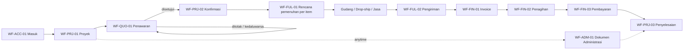
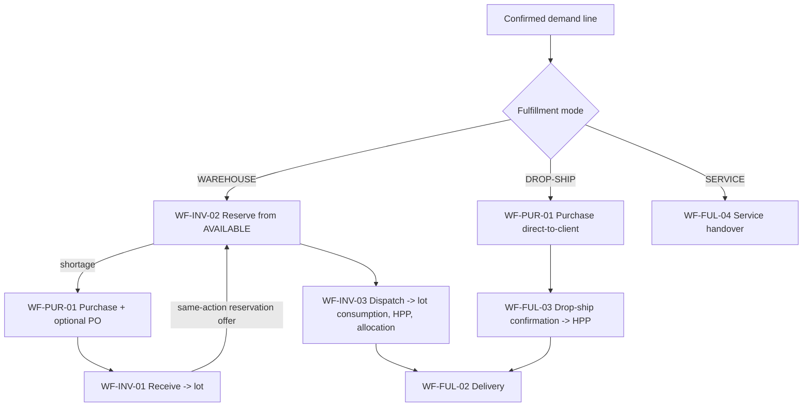
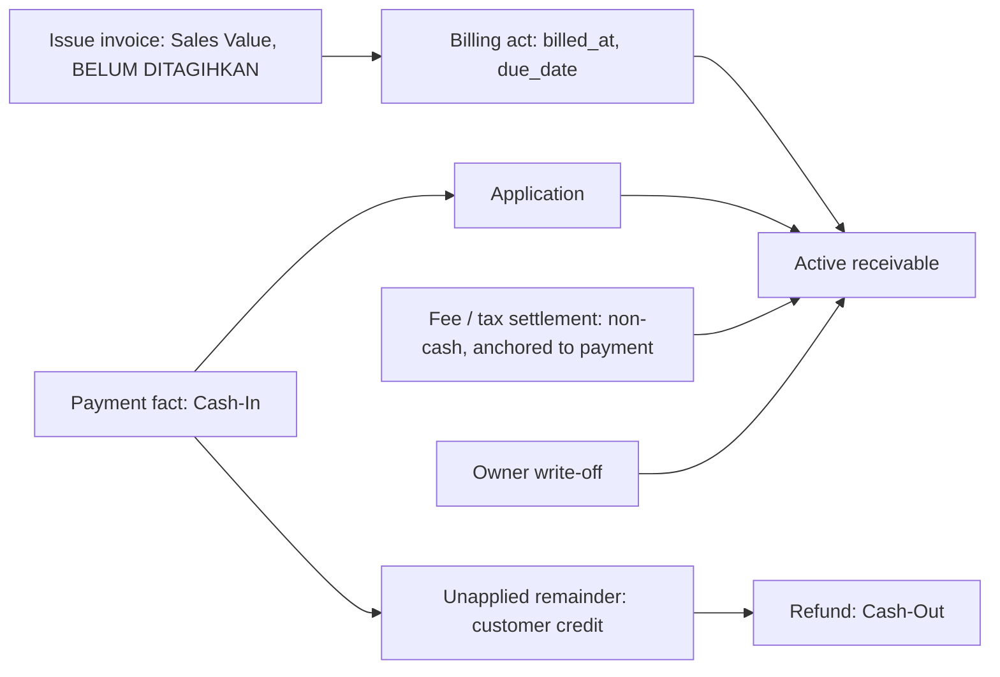

# Critical business workflows

Status: APPROVED | Updated: 2026-10-01 | Owner: Planning

Approval: [APPR-004](../../00-governance/DECISION_LOG.md#appr-004--p3-critical-business-workflows-approved), explicit conditional Owner approval on 2026-09-29 (DIR-026) of this document as committed in the P3 finalization checkpoint; the approved file hash, verified conditions and exclusions are recorded there. Approval changes lifecycle only, not implementation authorization.

Amendment: narrowly amended on 2026-09-30 to represent the Owner's clarification [DIR-027](../../00-governance/DECISION_LOG.md#dir-027-obs-007-and-tech-017--p4-authorization-unattributed-loss-clarification-and-p4-documentation) on unattributed cross-company economic loss: physical truth is corrected at once with an immutable recognition snapshot, remaining physical stock is never retained or frozen for a pending case, definitive later evidence may resolve it and found stock is never recognized twice. Only text marked `DIR-027` changed — it supersedes the retention safeguard of L-42 and SF-UNATTRIBUTED; no other rule is reopened. The pre-amendment SHA-256 is recorded in the decision log; the amended revision is approved under [APPR-005](../../00-governance/DECISION_LOG.md#appr-005--p4-database-architecture-approved). A further narrow, technical amendment was made on 2026-09-30 under [TECH-021](../../00-governance/DECISION_LOG.md#dir-032-obs-011-and-tech-021--p6-authorization-entry-baseline-and-concurrency-documentation): one note in the outcome vocabulary of §1, marked `TECH-021`, states how a technical failure of a command is reported; no business rule, authority or workflow changes. Its pre-amendment SHA-256 is recorded in the decision log, and the amended revision is approved under [APPR-007](../../00-governance/DECISION_LOG.md#appr-007--p6-concurrency-idempotency-and-performance-approved).

Authority: P3 authorized by DIR-023 (planning) and DIR-024 (Owner decisions D-1–D-5 and documentation execution), red-teamed under DIR-025 and corrected under DIR-026 (Owner decision on unexplained fungible loss attribution and finalization) in the [decision log](../../00-governance/DECISION_LOG.md); sources are the twentieth to twenty-third locked source records. This document owns workflow orchestration: command sequences, user-triggered transitions and system reactions, cross-domain hand-offs, branches, partial processing, the procedural correction matrix, document applicability, responsibility boundaries, completion/override/revalidation procedures and business-level indivisibility. Phase evidence and the aggregate P1 → P2 → P3 traceability verification are owned by [P3_QUALITY_GATE](../evidence/P3_QUALITY_GATE.md).

**Anti-duplication contract:** [DOMAIN_MODEL](../../02-domain/DOMAIN_MODEL.md) owns concepts and scope classes; [BUSINESS_RULES](../../02-domain/BUSINESS_RULES.md) owns lifecycles, invariants, correction legality and calculation meaning; [V1_SCOPE](../../01-product/V1_SCOPE.md) owns the Owner's product meaning. Workflows below cite their rule IDs instead of restating them. On conflict, the owning document and the latest Owner decision win; report the conflict under [change control](../../00-governance/CHANGE_CONTROL.md).

**Boundary:** P3 consumes the P2 lifecycles without adding, removing or relaxing a transition. It defines what must happen and in which order, never how it is stored, locked, rendered or displayed: no tables/columns/ERD/migrations (P4), no capability names or field projection (P5), no locking, isolation or idempotency protocol (P6), no screens, copy or components (P7), no test IDs (P8), no build units (P11).

## 1. Conventions

- **IDs:** `WF-<AREA>-<nn>` primary workflows; `SF-<NAME>` reusable subflows; `PX-<nn>` partial-processing rules; `CM-<nn>` correction-matrix rows; `AX-<nn>` indivisible business actions; `QS-<nn>` derived action-queue and blocker signals; `L-<nn>` Level-1 planner decisions. Later phases cite these IDs.
- **Actors:** **OWN** Owner; **ADM** Admin Operasional — always one individual account acting within its explicit company grants and capabilities; **OWN!** Owner-only by a settled Owner decision; **ADM+** Admin holding a separately grantable authority for a sensitive correction or closure (DIR-024 D-5); **SYS** a system-derived consequence inside the same command; **BG** a background reaction after commit that may retry and never changes business truth.
- **Command:** one user-intended business action producing P2 facts or decisions. **Workflow:** an ordered set of commands plus the derived signals that prompt the next command. Workflows never store their own progress: remaining quantities, stage progress and "what is next" are derived from facts and decisions (BR-XD-05; FS-01; FS-11). Tempting duplicates that stay derived: project stage, purchase receipt progress, delivery completeness, invoice paid/overdue state, requirement satisfaction, completion readiness, credit balances and every stock quantity.
- **Outcome vocabulary:** COMMITTED, REJECTED (with the failed precondition), CONFLICT (prepared against superseded facts) and, for background work only, PENDING/FAILED. No command reports success for an effect that did not commit. `TECH-021`: "for background work only" concerns outcomes — a command still has exactly three. The word FAILED is also the answer a command gets when it cannot be completed, or its completion cannot be confirmed, for a technical reason — a lock or statement timeout, an exhausted retry, a lost connection, a failed check of the mechanism itself; no outcome is then recorded, and repeating the same command identity either runs the command or returns the outcome it had already reached ([CONCURRENCY_IDEMPOTENCY §12](../../06-api-performance/CONCURRENCY_IDEMPOTENCY.md#12-failure-mapping)).
- **Context tags** (input to P7, not UI design): `[floor]` warehouse/field task on mobile or scanner; `[desk]` intensive desktop task; `[both]`. Journey anchors use the Owner's Indonesian terms (e.g., *Barang Masuk*, *Barang Keluar*, *Piutang*, *Pembayaran*, *Dokumen Administrasi*); P7 owns final copy.
- **Irreversible** marks commands that can only be undone through a correction primitive (issue, billing, payment, dispatch, receiving, settlement, write-off, completion, Force Complete).
- **PLANNER-DETERMINED** marks a genuine Level-1 decision (listed with grounds in [section 12](s10-14-signals-decisions-traceability.md#12-planner-determined-level-1-decisions)); **DIR-024** marks semantics taken from the Owner's P3 decisions D-1–D-5, **DIR-026** the Owner's decision on unexplained fungible loss attribution and **DIR-027** its clarification (no freezing of physical stock; immutable recognition snapshot).

## 2. Standard command envelope — SF-CMD

Every committed command follows this business sequence; P5/P6 choose the mechanisms.

1. **Identity:** the individual account is authenticated and active (BR-XC-02).
2. **Scope:** the target record's company is within the actor's grants (Owner: all); every related reference belongs to the same company unless the workflow explicitly defines a cross-company record (inter-company allocation) (BR-ACC-01/02).
3. **Authority:** the actor holds the capability for this action; OWN! and ADM+ actions follow [section 4](#4-actor-and-authority-matrix).
4. **Preconditions:** evaluated against current committed facts, never against the page the actor saw.
5. **Stale state:** a command prepared against facts that have since changed in a way that affects it returns CONFLICT and the current state; it never overwrites newer truth (OB §32; GAP-015).
6. **One effect per intent:** repeating the same intent yields the original result after re-authorization; the same intent with different content is a CONFLICT. A second, separately created intent for the same physical or financial event is caught by the command's business uniqueness where the event carries an external identity (supplier delivery or shipment reference, bank statement line, evidence identity per L-45, source bill, serial state); fungible events without one (dispatch, delivery, return or adjustment of quantity items) are bounded only by their quantity caps plus a likely-duplicate warning that needs the actor's explicit, reasoned confirmation (L-49; GAP-008).
7. **Dates:** SF-DATE applies.
8. **Indivisible effect:** all effects listed for the command commit together or none do (section 9).
9. **Audit:** individual actor, recorded_at, business_date, action, entity, before/after, reason where required, evidence references and linkage (BR-XC-01; BR-CR-01).
10. **After commit:** derived projections and QS signals reflect the new truth (BR-XD-05); BG reactions start and report PENDING/FAILED truthfully without re-running the command.

## 3. Workflow architecture

Four layers: (1) entry and master data; (2) the project backbone; (3) supporting operational workflows; (4) reusable subflows. The backbone is a spine of **optional** stages: a stage applies to a demand line only when its fulfillment mode, channel, document selection or payment facts require it; nothing is faked to complete a diagram (GAP-021; BR-XD-02/03).

## 4. Actor and authority matrix

Business authority only; P5 turns it into capabilities, grants and field projection. Owner holds every authority. An ADM action is always limited to the actor's granted companies.

| Action family | OWN | ADM | Class / source |
| --- | --- | --- | --- |
| Users, roles, capabilities, company grants | ✓ | — | OWN! (OB §17) |
| Company master: create, identity assets, bank accounts, numbering rules, deactivate | ✓ | — | OWN! (OB §3; AC-01) |
| Set waiver eligibility of an administrative requirement | ✓ | — | OWN! (BR-PRJ-03) |
| Remove, make optional, relax the satisfaction mode or clear the client-original flag of a required, non-waivable administrative requirement | ✓ | — | OWN! (DIR-024 D-5) |
| Supersede an Owner write-off: in the same action as a void or downward revision of its invoice (superseded or re-recorded on the replacement), or to apply money recovered after it | ✓ | — | OWN! (DIR-019; DIR-024 D-5; L-17) |
| Attribute unexplained found stock to an owning company, with flagged cost basis | ✓ | — | OWN! (DIR-024 D-5) |
| Resolve a pending unexplained-loss attribution case: assign the lost or condition-changed fungible quantity to candidate companies (lot claims closed per SF-UNATTRIBUTED) | ✓ | — (`DIR-027`: ADM+ may only record a resolution that definitive later evidence fully identifies) | OWN! (DIR-026; DIR-027) |
| Receivable write-off / formal disposition | ✓ | — | OWN! (DIR-019; BR-FIN-08) |
| Force Complete | ✓ | — (denied, also through any API) | OWN! (DIR-011; BR-PRJ-04) |
| Client, supplier, product/service, unit, barcode, location, minimum-stock masters; archive | ✓ | ✓ | ADM (CAP-02/03) |
| Project setup and amendment, quotation draft/issue/revise, approval, commercial confirmation | ✓ | ✓ | ADM (CAP-04; BR-PRJ-06; L-25) |
| Reservation create/adjust/release; reservation cut on shrinkage | ✓ | ✓ inventory | ADM (BR-RSV-01–04) |
| Purchase, PO, receiving, dispatch, delivery, drop-ship confirmation, service handover | ✓ | ✓ | ADM (CAP-05/06/07) |
| Document issue, external uploads, invoice issue, billing act, payment record/application, expense, disbursement and other Cash-In recording | ✓ | ✓ | ADM (CAP-08/10/11) |
| Add administrative requirements or tighten them (make required, stricter mode, client-original) | ✓ | ✓ | ADM (CAP-09) |
| Normal completion decision when all predicates are true | ✓ | ✓ | ADM (BR-PRJ-02; L-12) |
| Dispute hold set/clear | ✓ | ✓ | ADM (BR-FIN-08; L-12) |
| Corrections and reversals: dispatch/receiving reversal, sales and purchase returns, dispatch identity substitution (CM-36), reversal of an erroneous restoration or return (CM-37), contra-facts, payment reallocation, invoice void/downward revision (with evidence, CM-24), document revision/void, billing-act correction, superseding decisions, duplicate-payment and duplicate-evidence warning overrides | ✓ | ADM+ | DIR-024 D-5 |
| Purchase cancellation | ✓ | ADM+ | DIR-024 D-5 |
| Refunds, fee settlements, tax settlements, expenses/disbursements corrections | ✓ | ADM+ | DIR-024 D-5 |
| Stock adjustments, condition changes, opname variance application, loss recognition, recording a pending unexplained-loss case (SF-UNATTRIBUTED) or `DIR-027` its resolution fully identified by definitive later evidence | ✓ | ADM+ | DIR-024 D-5; DIR-026; DIR-027 |
| Inter-company allocation (grant on the consuming company only) | ✓ | ADM+ | DIR-024 D-5; L-03 |
| Operational closures: remaining-scope cancellation, delivery closure, purchase-remainder closure, correction-case closure; project cancellation | ✓ | ADM+ | DIR-024 D-5 |
| Admin N/A on a waiver-eligible requirement | ✓ | ✓ | ADM (DIR-011; BR-ADM-02) |
| Opening-data import: prepare and dry-run / commit after sign-off | ✓ | prepare only | ADM prepare, OWN commit (CAP-15; OS-02) |
| Availability checks, numbering, snapshots, HPP/loss attribution, revalidation | — | — | SYS |
| Rendering, exports, notifications, restock/overdue alerts | — | — | BG |

Every ADM+ action requires a mandatory reason, evidence where available or required, exact individual attribution, timestamp, before/after or source/correction linkage, immutable audit and visibility in the Owner review queue (QS-14). Two Admin accounts with identical grants remain separate identities; no action is attributed to "Admin" as a shared identity (BR-XC-02; FS-10). No launch role is added.

