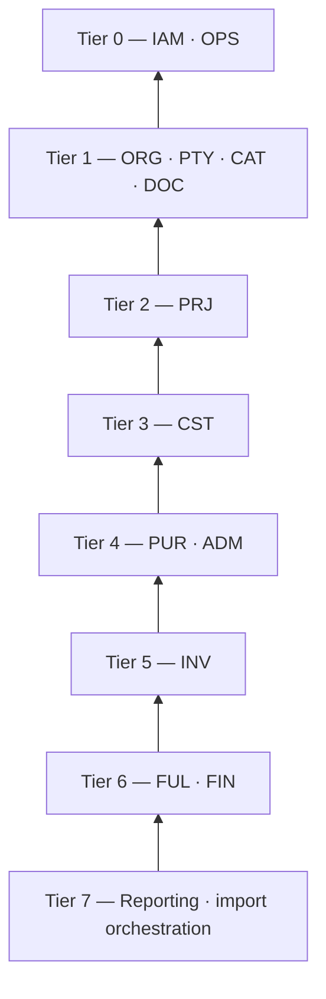

# Application architecture

Status: APPROVED | Updated: 2026-10-01 | Owner: Planning

Approval: [APPR-005](../00-governance/DECISION_LOG.md#appr-005--p4-database-architecture-approved), explicit conditional Owner approval on 2026-09-30 (DIR-029) of this document as committed in the P4 finalization checkpoint; the approved file hash, the verified conditions and the exclusions are recorded there. Approval changes lifecycle only, not implementation authorization.

Amendment: narrowly amended on 2026-09-30 as a Level-1 technical clarification under [TECH-021](../00-governance/DECISION_LOG.md#dir-032-obs-011-and-tech-021--p6-authorization-entry-baseline-and-concurrency-documentation): §5 and §11 gain clauses marked `TECH-021` that point to the mechanisms [CONCURRENCY_IDEMPOTENCY](../06-api-performance/CONCURRENCY_IDEMPOTENCY/README.md) defines — the failure mapping per code and what a refusal commits, the record that takes the place of the job-batch record of an export request, the recovery of an abandoned rendition attempt and the operational tasks of the job register. Only the clauses marked `TECH-021` were added; no structure, boundary or business meaning changes; the pre-amendment SHA-256 is recorded in the decision log, and the amended revision is approved under [APPR-007](../00-governance/DECISION_LOG.md#appr-007--p6-concurrency-idempotency-and-performance-approved).

Authority: P4 — Database Architecture, authorized by [DIR-027](../00-governance/DECISION_LOG.md#dir-027-obs-007-and-tech-017--p4-authorization-unattributed-loss-clarification-and-p4-documentation), red-teamed under DIR-028 and corrected under DIR-029 ([TECH-018](../00-governance/DECISION_LOG.md#dir-028-obs-008-dir-029-and-tech-018--p4-targeted-review-corrections-and-finalization)). This document owns the **application structure**: the modular-monolith boundaries, dependency direction, layers, the action (use-case) pattern, posting services, the authorization boundary handed to P5, the Inertia web layer, the React boundary, background jobs, file storage, integration seams and the reporting layer. The logical data model, constraints and transaction map are owned by [DATABASE](DATABASE/README.md); phase evidence by [P4_QUALITY_GATE](evidence/P4_QUALITY_GATE.md).

**Anti-duplication contract:** business rules are owned by [BUSINESS_RULES](../02-domain/BUSINESS_RULES.md) and orchestration by [WORKFLOWS](../03-workflows/WORKFLOWS/README.md); this document places them in code structure and never restates or changes them. Engineering guardrails remain owned by [ENGINEERING_PRINCIPLES](../00-governance/ENGINEERING_PRINCIPLES.md).

**Boundary:** a design for the executor, not scaffolding. No Laravel project, package, migration, React code, Docker or deployment file is created or implied; exact framework APIs and versions are verified against current official documentation when execution is authorized (DEP-07). P5 owns the permission matrix and security controls, P6 locking/idempotency/performance mechanisms, P7 screens and copy, P8 tests, P9 infrastructure, P11 build units.

## 1. Baseline and constraints

- **Stack (Owner baseline, OB §19; DIR-027 §6):** Laravel, Inertia.js, React with TypeScript, shadcn/ui on Tailwind CSS, PostgreSQL, Nginx; a Valkey/Redis-compatible queue and cache (never a system of record, OB §30); Docker Compose acceptable for deployment (P9).
- **Shape (OB §18):** a **modular monolith** — one Laravel application, one primary PostgreSQL database, one repository, one deployable unit — with layered architecture, an MVC web layer and the action/use-case pattern.
- **Excluded (DIR-027 §6):** microservices, event sourcing, Kafka, Kubernetes, full CQRS infrastructure, database-per-company tenancy, a repository class per model, full DDD ceremony, a generic workflow or rules engine (V1_SCOPE).
- **Owner priority order for trade-offs (OB §58):** data integrity → maintainability → security → correctness → operational simplicity → performance → developer convenience → novelty.

## 2. Layers

| Layer | Contents | Rules |
| --- | --- | --- |
| Presentation | routes, controllers, form requests, Inertia responses and prop resources, React pages | Thin: authorize, validate allowed fields, call one action, shape output. No business decision here (OB §18) |
| Application | **actions** (one per business command), **queries** (read models), jobs, module contracts | An action is the unit of work, authorization re-check and transaction (§5) |
| Domain | Eloquent models (persistence and relationships), enums, value objects, calculators, state-transition policies, **posting services** that own guard balances (§7) | No HTTP, session or rendering concerns; no business workflow hidden in model events |
| Infrastructure | PostgreSQL, queue, cache, filesystem, PDF renderer, integration adapters | Behind framework facilities or small interfaces; replaceable without touching domain rules |

Dependencies point downward only: presentation → application → domain → infrastructure facilities. Eloquent is used directly (pragmatic Laravel); there is no repository abstraction per model.

## 3. Modules

Thirteen modules own the tables of [DATABASE §4](DATABASE/s04-00-module-map.md#4-module-map-and-logical-model); a fourteenth, **Reporting**, owns no tables and only reads.

| Module | Responsibility | Owns (DATABASE) | Typical actions |
| --- | --- | --- | --- |
| Identity (IAM) | users, roles, capabilities, company grants, sessions | §4.1 | CreateUser, GrantCompany, GrantCapability, DeactivateUser |
| Organization (ORG) | companies, identity assets, bank accounts, numbering, tax configuration | §4.2 | CreateCompany, AddBankAccount, ConfigureNumbering, ConfigureTaxTreatment |
| Parties (PTY) | client organization → unit → address/PIC, suppliers | §4.3 | CreateClientOrganization, AddClientUnit, CreateSupplier |
| Catalog (CAT) | products, services, units, conversions, barcodes, price defaults, images | §4.4 | CreateProduct, AddAlternateUnit, RegisterBarcode, ChangeDefaultPrice |
| Projects (PRJ) | projects, demand lines, channel, quotations, confirmation, cancellation, completion | §4.5 | CreateProject, DiscardDraftProject (number tombstoned), IssueQuotation, ApproveQuotation, ConfirmWithoutQuotation, CancelRemainingScope, CompleteProject, ForceCompleteProject, CancelProject |
| Procurement (PUR) | purchases, lines, taxes, charges, closures, adjustments | §4.6 | RecordPurchase, RecordPurchaseCharge, ClosePurchaseRemainder, CancelPurchase, CorrectPurchaseCost |
| Inventory (INV) | locations, lots, ledger, balances, serials, reservations, dispatch, counts, adjustments, pending unattributed cases | §4.7 | ReceiveGoods, ReverseReceipt, Reserve, ReleaseReservation, Dispatch, RestoreStock, ReturnToSupplier, ChangeCondition, MoveLocation, RecordCount, ApplyCountVariance, RecognizeLoss, RecordUnattributedLoss, ResolveUnattributedLoss, ReverseUnattributedResolution, AttributeSurplus |
| Costing & Expenses (CST) | lot cost basis, charge allocation, HPP/loss attribution, expenses | §4.8 | (called by other modules' actions) RecordExpense, AllocateCharge |
| Fulfillment (FUL) | drop-ship confirmations, deliveries, delivery closures, service handovers | §4.9 | ConfirmDropShip, ReverseDropShipConfirmation, ReturnDropShipToSupplier, RecordDelivery, CloseDelivery, RecordHandover |
| Documents (DOC) | document types, generated documents, versions, renditions, files, evidence | §4.10 | IssueDocument, ReviseDocument, VoidDocument, UploadEvidence, RecordBankStatementLine, VoidBankStatementLine |
| Administration (ADM) | per-project requirements, links, waivers | §4.11 | AddRequirement, LinkRequirementEvidence, WaiveRequirement, RemoveRequirement |
| Finance (FIN) | invoices, billing, receivables, payments, applications, settlements, write-offs, disputes, credit, refunds, disbursements, other Cash-In, contras | §4.12 | IssueInvoice, BillInvoice, RecordPayment, CorrectBankCitation, SupersedeClaimedDeduction, ApplyPayment, ReallocateApplication, RecordDeductionSettlement, ResolveResidualSettlement, WriteOffReceivable, RefundCredit, RecordDisbursement, RecordContra |
| Operations (OPS) | audit, security events, command log, correction cases, import batches and rows, archive | §4.13 | OpenCorrectionCase, CloseCorrectionCase; the audited `GuardMaintenance` console command (§7) (import actions live in the tier-7 import orchestration, below) |
| Reporting | dashboards, action queue (QS-01–22), reports, exports | — | read-only queries |
| Import orchestration (tier 7) | opening-data pipeline: validation, dry run, sign-off and commit through each module's actions with deterministic command ids | — (uses OPS import tables) | PrepareImport, DryRunImport, CommitImport |

**Dependency tiers.** A module may call the write services of modules in a lower tier and read any module through that module's query classes; write dependencies never form a cycle:



(An arrow means "may depend on". Within a tier the only dependencies are OPS → IAM and DOC → ORG (numbering), both acyclic. Placing Expenses in CST keeps Procurement and Finance acyclic; placing Inventory above Procurement lets receiving update purchase-line guards while purchases never call Inventory.)

**Dependency inversion where a lower tier must trigger higher-tier behavior** — four small contracts only:

| Contract (declared by) | Implemented by | Used for |
| --- | --- | --- |
| `ProjectLifecycleParticipant` (PRJ) | INV, FUL, FIN, ADM | re-confirmation adjusts reservations (AX-13); cancellation releases reservations (AX-27); revalidation reopens requirements (SF-REVAL) — all inside the PRJ action's transaction |
| `CompletionPredicateProvider` (PRJ) | PUR, INV, FUL, FIN, ADM | the completion predicates owned by higher tiers, read inside AX-25 (WF-PRJ-03); the documents and correction-case predicates come from lower-tier DOC and OPS query classes that PRJ reads directly |
| `DocumentSubjectProvider` (DOC) | PRJ, PUR, INV, FUL, FIN | record-bound issue preconditions and the payload of each DOC type (SF-ISSUE) |
| `DocumentChangeParticipant` (DOC) | PRJ, ADM, FIN | a document void or revision and an evidence replacement (L-41) trigger, inside DOC's transaction, completion revalidation (SF-REVAL), requirement re-evaluation (BR-ADM-03) and settlement re-evaluation, so DOC never calls a higher tier |

## 4. Code organization

Logical layout for the executor (verified against current framework conventions at execution):

```text
app/
  Modules/<Module>/
    Actions/        one class per command (§5)
    Models/         Eloquent models of the module's tables
    Services/       posting services and domain services only (§7), never a catch-all
    Queries/        read models used by other modules and by pages
    Policies/       authorization policies (P5 fills the rules)
    Data/           input/output data objects, value objects specific to the module
    Enums/          code enumerations mirroring the CHECK lists
    Contracts/      the inversion contracts of §3 declared by this module
    Jobs/           background jobs owned by the module
    Http/           Controllers, Requests (validation), Resources (prop shaping)
  Support/          Money, Quantity, UnitConversion, BusinessDate, CommandContext,
                    GuardUpdate, AuditRecorder, OutcomeMapper (shared, business-neutral)
  Integrations/     adapters behind module contracts (none in V1; §13)
resources/js/
  Pages/<Module>/   Inertia pages
  features/<module>/ feature components and hooks
  components/ui/    shadcn/ui primitives, unmodified by feature logic
  lib/              formatting of server-provided decimals, command ids, HTTP helpers
database/migrations/ one migration stream; file names prefixed by module
tests/              Feature/<Module>, Concurrency/, Reconciliation/ (P8)
```

## 5. Actions — the command envelope

Every committed business command is one action class that implements SF-CMD (WORKFLOWS §2):

| SF-CMD step | Action responsibility |
| --- | --- |
| 1 Identity | receives the authenticated individual user from the controller; never a shared identity |
| 2 Scope | loads the target record and checks its company against the actor's grants (Owner: all) |
| 3 Authority | calls the policy for the capability (ADM, ADM+, Owner-only); P5 defines the rules |
| 4 Preconditions | re-reads current facts inside the transaction, under the relevant guard rows (P6) |
| 5 Stale state | compares `lock_version` or guard `version` sent with the command; mismatch → CONFLICT |
| 6 One effect | registers `command_id` in `command_log`; a replay returns the recorded outcome (P6) |
| 7 Dates | resolves `business_date` through BusinessDate (WIB; no future date for committed facts) |
| 8 Indivisible effect | runs every write of the AX row (DATABASE §25) in **one** database transaction |
| 9 Audit | records the audit event in the same transaction |
| 10 After commit | dispatches jobs and cache invalidation only after commit |

Outcomes are exactly COMMITTED (with result identifiers), REJECTED (with the violated rule code) and CONFLICT (with the current state); background work reports PENDING/FAILED (WORKFLOWS §1). Database errors map deterministically: check violation (including a deferred constraint trigger failing at commit) → REJECTED naming the guard's rule, unique violation → CONFLICT or "already done", serialization failure or deadlock → bounded retry of the whole action (P6), a guard update matching no row → failure, anything else → failure with nothing committed. `TECH-021`: [CONCURRENCY_IDEMPOTENCY §6 and §12](../06-api-performance/CONCURRENCY_IDEMPOTENCY/s10-13-identity-failure-retry.md#12-failure-mapping) refine this mapping per code and constraint — a foreign-key violation raised by a referencing row answers as an unknown reference unless it concerns a product's quantity scale, which is a stale-state CONFLICT, an exclusion violation is REJECTED, a numbering-key violation is a failure, a connection lost before COMMIT is retried — and a refusal commits its recorded outcome and no other row of the action, with the exceptions CONCURRENCY_IDEMPOTENCY §6 names. The same action serves web controllers, the opening-import pipeline and any future API; none of them re-implements business rules.

## 6. Domain model, value objects and calculators

- **Models:** one Eloquent model per table; relationships for loading; no workflow logic in model events. Models of append-only tables (classes AF, AD, SN, AE in DATABASE §1) refuse updates and deletes at the model level, in addition to the database privileges of DATABASE §28.
- **Value objects (in `Support`):** `Money` (rupiah, exact decimal backed by an arbitrary-precision decimal library chosen and license-checked at DEP-07; **never PHP float**), `Quantity` (base-unit decimal with the product scale), `UnitConversion` (entered quantity × integer ratio), `BusinessDate` (WIB calendar day, BR-DT-06), `Period` (numbering period key). Database `numeric` values travel as strings into these objects.
- **Calculators:** `CostSplitter` (residual-absorbing Rp1 split, BR-FIN-13), `ChargeAllocator` (basis split and pending shares, SF-CHARGE), `ProportionalContra` (restorations and corrections, L-31), `CompletionEvaluator` (the ten predicates, WF-PRJ-03), `AgingCalculator` (BR-FIN-15). Pure functions, unit-testable against the numeric annex.
- **State transitions:** small policy classes per P2 state model (SM:Project, SM:Quotation, SM:Document, SM:Reservation) that list legal transitions; no generic state-machine package is required.

## 7. Posting services and guards

Each guard balance of DATABASE §3.1 has **exactly one normal writer** (per column group where two services post different figures of one row):

| Service (module) | Sole normal writer of |
| --- | --- |
| `InventoryPosting` (INV) | stock movements and entries, `stock_*_balances` including `stock_reversal_balances`, `serial_units` state, reservations and their events, `stock_consumption_balances`, unattributed-case counters, `unattributed_loss_exposures` and `unattributed_loss_group_exposures` |
| `CostPosting` (CST) | `lot_cost_entries`, `lot_cost_balances`, `cost_attributions`, `purchase_charge_balances`, `purchase_charge_share_balances`, system-created expenses, purchase-return case figures |
| `DemandPosting` (PRJ) | `project_line_balances`, `project_commercial_balances` |
| `PurchasePosting` (PUR) | `purchase_line_balances`, quantities and cumulative posted values alike |
| `ReceivablePosting` (FIN) | `invoice_balances` |
| `MoneyPosting` (FIN) | `application_source_balances` (capacity, refund backing, released and shortfall), `money_fact_balances` (contras, refund backing and shortfall, transfer citation), application and settlement states, refund and settlement residual counters of correction cases |
| `EvidencePosting` (DOC) | `evidence_balances` |
| `NumberAllocator` (ORG) | `number_sequences` (authoritative counters; created only for seeded or post-go-live periods, never lowered) and `retired_numbers` tombstones |
| `AuditRecorder` (OPS) | `audit_events` |

All guard updates go through one shared `GuardUpdate` helper: a conditional in-transaction update of the net signed delta of all columns of a guard row in **one statement** per command (PostgreSQL checks CHECK constraints per statement, so a command never writes an intermediate state; deltas that several services contribute to one row are combined before the statement), returning the new values, treating an update that matches no row as a failure, and mapping a CHECK violation — or a deferred constraint trigger's failure at commit — to a REJECTED outcome carrying the rule identifier. **What this guarantees:** PostgreSQL enforces each guard's CHECK against every application role; the single posting path is what keeps each guard moving with its facts; reconciliation proves it (the DB+APP+DQ layer of DATABASE §18). The runtime role technically holds INSERT on facts and UPDATE on guards independently, so "only this service writes this table" is an architectural rule enforced by code review, tests and reconciliation, not by PostgreSQL.

**Verification and the one audited exception.** `ReconcileGuards` (scheduled, §11) recomputes every guard from the DATABASE §3.1 formulas and reports differences, never repairing silently; P8 asserts it after every test scenario. A difference is repaired only by `GuardMaintenance` (OPS), a console command run under the administration role after a verified defect or a restore, which recomputes the affected rows inside one transaction and records an audit event per row with before/after values and the defect or restore reference; it is the single exceptional writer of guards, never scheduled and never part of normal operation (GAP-031). Counters that are authoritative rather than derived (`number_sequences`) are verified, never rebuilt downward.

## 8. Authorization boundary (P5)

- Server-side only: authentication → company scope → capability → resource authorization → business preconditions (OB §17). Hidden buttons and role names are never authorization.
- A **company-scope resolver** yields the actor's granted companies (Owner: all); every query class and policy uses it, and every action re-checks the target record's company (SF-CMD step 2).
- **Capabilities** (`capabilities.authority_class`) express ADM, ADM+ and Owner-only authority (WORKFLOWS §4); policies check capabilities, never role names.
- **Field projection:** pages receive explicit prop resources, never raw models. The pooled stock views use **physical-only query classes** (quantities, locations, serial presence) that never select S3 tables (DATABASE §5.1); financial pages use separate company-scoped queries. P5 designs the matrix per resource and field.
- Downloads and exports authorize the owning record at request time; public identifiers prevent enumeration but never replace authorization.

## 9. Web layer (Laravel + Inertia)

- Internal pages are Inertia web routes with CSRF and session protection; they are not converted into a REST API (OB §33). A versioned `/api/v1/…` exists only when a real external integration needs it.
- Controllers: authorize → form request validates **allowed fields only** (no mass assignment of the whole request) → one action → redirect or Inertia response with the outcome (OB §24).
- Props are shaped by resources/data objects listing each field; lists are server-side paginated (keyset where large), filtered and sorted by whitelisted keys; secondary data uses partial reloads or lazy props.
- **N+1 is a defect (OB §29):** queries eager-load only the needed relations and columns; list pages read aggregate-root columns and guard totals (DATABASE §20); feature tests assert query counts on the critical pages (projects, products, inventory, billing, invoices, dashboard, reports).
- Edit forms round-trip `lock_version` (stale edit → CONFLICT, OB §32) and a `command_id` per intent.

## 10. React frontend boundary

- TypeScript pages per route under `Pages/<Module>`, feature components under `features/<module>`, shadcn/ui primitives untouched under `components/ui` (OB §20; V1_SCOPE language and experience contract).
- The client never computes authoritative business values: totals, availability, outstanding and credit are server values; entered money and quantities are submitted as decimal strings exactly as typed — no binary floating-point arithmetic on submitted values.
- Each user intent gets a client-generated `command_id` reused on retry, so double clicks, refreshes and timeouts cannot create a second effect (GAP-008/015); the UI shows COMMITTED, REJECTED, CONFLICT, PENDING and FAILED truthfully (WORKFLOWS §1).
- Scanner and mobile/desktop interaction patterns, Indonesian copy and the design system are P7's.

## 11. Queue and background jobs

One main queue (OB §35); critical stock and money mutations are always synchronous actions. Durable database rows are the outbox — no generic outbox table is needed:

| Job | Trigger | Retry safety |
| --- | --- | --- |
| `RenderDocument` | a PENDING `document_renditions` row, dispatched after commit | keyed by rendition id; skips if READY; never touches the issued version or its number (BR-DOC-03) |
| `RenditionSweeper` (scheduled) | PENDING or FAILED renditions older than a threshold (`TECH-021`: and a RENDERING attempt abandoned by a dead worker, [CONCURRENCY_IDEMPOTENCY JB-02](../06-api-performance/CONCURRENCY_IDEMPOTENCY/s14-17-numbering-jobs-revocation.md#15-jobs-scheduler-and-queue)) | re-queues only; a crash between commit and dispatch loses nothing (GAP-007) |
| `GenerateExport` | an export request tracked by the framework's job-batch records (`TECH-021`: recorded instead on the `export_requests` record of [CONCURRENCY_IDEMPOTENCY H6-04](../06-api-performance/CONCURRENCY_IDEMPOTENCY/s14-17-numbering-jobs-revocation.md#17-p5-obligations-h6-01h6-12), which holds the context PERMISSIONS_MATRIX DP-07 requires of each export and which a job-batch record cannot hold) | writes a private EXPORT file object for the requester and filters, re-authorized at download |
| `ProcessImage` | an uploaded image | derives thumbnails, strips metadata (P5 rules); the original object stays immutable |
| `ValidateImportBatch` | an import batch in PREPARED | read-only dry run producing row results and control totals |
| `ReconcileGuards` (scheduled) | P6 cadence | verify-only over the DATABASE §3.1 registry; reports differences, never repairs; repair is the separate, audited `GuardMaintenance` command (§7), never a job |

Jobs that perform business effects do so only by invoking actions with deterministic command ids (for example, derived from the import identity), so a retried job cannot duplicate an effect. `TECH-021`: the mechanics of these jobs, and the operational tasks added for import commit chunks, the command-log purge and the sweep of owed work, are registered in [CONCURRENCY_IDEMPOTENCY §15](../06-api-performance/CONCURRENCY_IDEMPOTENCY/s14-17-numbering-jobs-revocation.md#15-jobs-scheduler-and-queue). Notifications and in-app alerts are derived from QS queries (WORKFLOWS §10); nothing about them is business truth.

## 12. File storage abstraction

The framework filesystem abstraction with a **private** disk for all S2–S4 files (P9 chooses paths and volumes on the existing VPS; DIR-009). Upload flow: stream to temporary storage → validate type, size and content (P5) → hash → store under a generated key → create the `file_objects` row in its own short transaction → the business command references the file id. Downloads stream through a controller that authorizes the owning record and sets safe headers. Renditions and exports use the same abstraction. Bytes are never overwritten (DATABASE §22).

## 13. Integration adapters and the SIPLAH seam

V1 has no live external integration and core operation never depends on SIPLAH (D-03; AC-15). The seam is ready without being built:

- A module that may one day receive external data declares a small interface (for example `ChannelOrderSource` in PRJ or `RemittanceAdviceSource` in FIN); an adapter under `app/Integrations/<Name>` implements it later.
- Inbound events will land first in an integration inbox (introduced with the first integration) with authentication or signature checks, replay protection, event-identity uniqueness and logging; a job turns each accepted event into an ordinary action with a command id derived from the event identity, so external systems never mutate stock or money directly (OB §34).
- External identifiers stay attributes, never keys (OB §9); timeouts and outages of an external system can only delay its own inbox, never the core application.

## 14. Reporting and query layer

- Read-only query classes per report and dashboard in the Reporting module, each implementing a named calculation (CALC-01–14) or signal (QS-01–22) and applying the company-scope resolver before anything else (BR-XD-05).
- Period filters use each concept's own business date (CALC-13); consolidated figures are Owner-only (CALC-12).
- Complex aggregates (stock by company with pending unattributed quantities shown separately, receivable aging, project and company profit, managerial cashflow) are SQL views or query-builder queries over facts and guards; materialized summaries appear only when P6 measurements justify them, with a rebuild rule like any guard.
- Exports reuse the same queries and filters, so an export can never show more than the page.

## 15. Transactions and failure semantics

- One action = one database transaction containing every row of its AX entry (DATABASE §25) plus audit and command-log completion.
- **Never inside a transaction:** network calls, external APIs, PDF rendering, image processing, file uploads, e-mail or large reports (OB §31).
- After commit: jobs, notifications and cache invalidation; their failure never undoes or falsifies the committed business truth.
- A lost response after commit is answered by replaying the same `command_id` (P6); a transaction that fails leaves nothing behind; partial effects never exist.

## 16. Configuration, environments and database roles

- Secrets live only in environment configuration outside the repository; only sanitized examples are committed; agents never receive production credentials (ENGINEERING_PRINCIPLES).
- The application stores timestamps in UTC and computes business days in Asia/Jakarta (BR-DT-06); user-facing locale is Indonesian (P7).
- Separate database roles, with the privileges of DATABASE §28 (P9 creates them): the **migration/owner** role reached only through a separate Laravel database connection used by deployments, whose credential the runtime never holds (an owner bypasses grants, may TRUNCATE and may disable triggers, so nothing is guaranteed against it); the **application runtime** role shared by web requests and queue workers, which run the same actions; the **administration** role used only for the audited `GuardMaintenance` and approved repairs. Opening imports run through the application actions under the runtime role. Production debug is off; the `pg_trgm` and `btree_gist` extensions are provisioned by the migration role; after any restore, guard verification runs before the application reopens (P9).

## 17. Observability hooks

A correlation id per request and job flows into audit events and technical logs; technical and security logs stay separate from business audit (OB §36). Failed jobs, stale renditions, guard-verification differences and unevidenced payments are visible signals; P9 decides alert delivery and the named operator (GAP-013).

## 18. Testing seams (for P8)

Tests run against real PostgreSQL (never an in-memory substitute) so CHECK, unique, exclusion and foreign-key guarantees are exercised; concurrency tests open parallel connections to race the ⚡ constraints of DATABASE §18; reconciliation tests run every guard's verify command after each scenario; calculators are unit-tested with the numeric annex; policies get positive and denial tests per WORKFLOWS §4.

## 19. Prohibited patterns

A catch-all `Services` folder; a repository class per model; business decisions in controllers, model events or React; whole-request mass assignment; float for money or quantity; `MAX(number) + 1`; direct edits of balances; cross-module writes that bypass the owning module's actions or posting services; morph-link columns for business records; delete flags on facts; slow work inside transactions; cache as the only copy of stock, payment or invoice state; role-name authorization checks.

## 20. Traceability and downstream obligations

| Source | Covered in |
| --- | --- |
| OB §18 architecture baseline | §1–§5 |
| OB §19 technology baseline | §1, §16 |
| OB §24–25 security and leak assumption | §8, §12, §16; DATABASE §28 |
| OB §28 idempotency | §5, §10, §11; DATABASE §26 |
| OB §29–30 N+1 and performance | §9, §14; DATABASE §20, §27 |
| OB §31 transaction rule | §15; DATABASE §25 |
| OB §32 optimistic concurrency | §5, §9 |
| OB §33–34 API strategy and SIPLAH future | §9, §13 |
| OB §35 queue | §11 |
| OB §36 auditability | §7, §17; DATABASE §23 |
| WORKFLOWS §2 command envelope, §4 authority, §9 indivisible actions | §5, §8, §15 |

Downstream: **P5** fills policies, capabilities, field projection, upload controls and denial paths on the §8 boundary. **P6** fixes lock order, isolation, retry, command-log replay, render sweeper cadence, guard verification cadence and measured query targets. **P7** designs pages, patterns and copy on the §9–§10 boundary. **P8** builds the §18 test suites. **P9** provisions roles, extensions, storage, queues and backups. **P11** cuts build units per module and action, citing AX, C-rows and tables.
