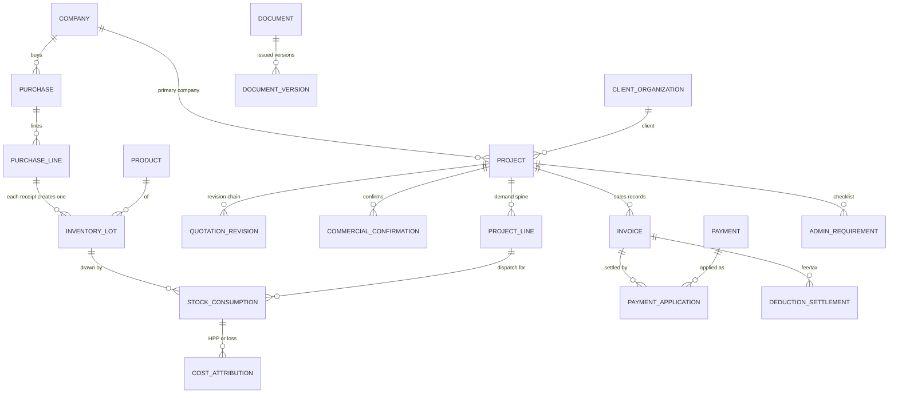

## 4. Module map and logical model

Tables group into thirteen modules owned by the application modules in [ARCHITECTURE](../ARCHITECTURE.md#3-modules). Counts are logical tables (framework infrastructure tables — sessions, password-reset tokens, queue and cache tables, migrations — are excluded and belong to P5/P9, and so is the authentication state SECURITY keeps outside the business tables: the credential-token store, pending login challenges, OAuth state and attempt markers, which live in the session, and limiter counters; `TECH-021`: so is the operational export-request record that [CONCURRENCY_IDEMPOTENCY H6-04](../../06-api-performance/CONCURRENCY_IDEMPOTENCY/s14-17-numbering-jobs-revocation.md#17-p5-obligations-h6-01h6-12) defines for the export context of PERMISSIONS_MATRIX DP-07).

| Module | Tables | Scope | Content |
| --- | --- | --- | --- |
| IAM — Identity & Access | 8 | GLOBAL | users, roles, capabilities, grants, external sign-in identities |
| ORG — Organization | 9 | COMPANY/GLOBAL | companies, bank accounts, numbering and retired-number tombstones, tax configuration |
| PTY — Parties | 5 | MASTER | client organization → unit → address/PIC, suppliers |
| CAT — Catalog | 6 | MASTER | products/services, units, conversions, barcodes, price defaults, images |
| PRJ — Projects & Commercial | 11 | PROJECT | projects, SIPLAH details, demand lines, quotations, confirmations, pins, cancellations, completion, guards |
| PUR — Procurement | 8 | COMPANY | purchases, lines, taxes, charges, shares, closures, adjustments, guard |
| INV — Inventory | 26 | POOL / POOL×COMPANY | locations, lots, serials, ledger, consumptions, restorations, balances, reservations, counts and their typed scopes, unattributed-loss cases with exposure guards |
| CST — Costing & Expenses | 6 | POOL×COMPANY / PROJECT / COMPANY | lot cost ledger and balance, cost attributions (HPP/loss), charge and charge-share guards, expenses |
| FUL — Fulfillment | 7 | PROJECT | drop-ship confirmations, deliveries, delivery closures, service handovers |
| DOC — Documents & Evidence | 10 | COMPANY | document types, documents, versions, renditions, files, evidence, bank statement lines, evidence guards and links |
| ADM — Administration | 3 | PROJECT | requirements, satisfaction links, waivers |
| FIN — Finance | 19 | COMPANY | invoices, versions, lines, tax components, billing, payments, applications, settlements, write-offs, disputes, opening credit, Kuitansi links, disbursements, other Cash-In, contras, guards |
| OPS — Operations | 7 | GLOBAL/COMPANY | audit, security events, command log, correction cases, imports, archive |
| **Total** | **125** | | |

The written tables below are authoritative; diagrams (this overview and the domain diagrams in §29) only orient.

