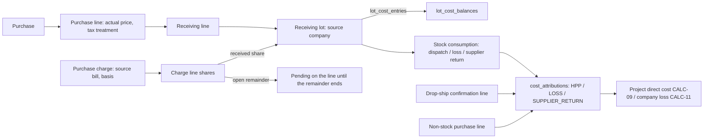

## 6. Lot, cost and HPP architecture

Managerial costing only — no general ledger, journal, valuation method or tax algorithm (FS-13; V1_SCOPE out-of-scope list). The model is two ledgers and one guard: **`lot_cost_entries`** (what each lot's cost basis is), **`cost_attributions`** (every draw of lot cost and every direct non-stock project cost, classed HPP, LOSS or SUPPLIER_RETURN) and **`lot_cost_balances`** (the remaining quantity and cost of each lot).

### 6.1 The chain

- **Purchase → purchase line:** actual unit price excluding creditable tax and the tax treatment recorded on the line (BR-PUR-01; D-1). Creating either changes no stock and no cash (BR-PUR-03; FS-04).
- **Receiving line → lot:** one lot per receiving event; `lot_cost_entries` GOODS and NONCREDITABLE_TAX are the line's value and non-creditable tax for the received quantity by **cumulative rounding**: with q = normal received net + drop-ship confirmed net after the event, the line's target is round(value × q ÷ ordered) (exactly the value when q = ordered), and the event posts target − `posted_goods_value` (and likewise for tax), then raises the posted value by what it posted. Because the posted values are **net of every receipt reversal, confirmation reversal and cost correction** and the value columns are the **current corrected** goods and tax values, partial receipts of a box-priced line sum exactly, the completing receipt takes the remainder, and a correction made between two receipts is never posted twice. CHARGE_SHARE entries follow the same cumulative rule per charge share against `purchase_charge_share_balances`, capped by the share still pending on the line (share − posted − re-spread out − expensed out), so a share already re-spread after a receipt reversal is never posted again when the units are re-received (SF-CHARGE). A drop-ship confirmation posts the same cumulative amounts as direct attributions. A replacement receipt (`receipt_kind` REPLACEMENT) carries REPLACEMENT_BASIS from its purchase-return case instead of GOODS and charge shares and counts only against the separate replacement cap, so replacement headroom can never admit a normal receipt beyond the ordered quantity (PX-03). The partial UNIQUE indexes of §4.8 give each lot exactly one basis entry.
- **Receipt reversal arithmetic:** a reversal of r unconsumed units draws r's share of the lot's remaining cost (the zeroing draw takes all of it, §6.2) and splits it over the lot's cost components in proportion to their net amounts in the lot, the last component in the fixed order GOODS, NONCREDITABLE_TAX, CHARGE (charge by charge id) absorbing the residual; the CHARGE component is written as one row per (charge, share) for the part the lot carries under the line's share schedule and one row per (charge, re-spread source line) for the part it received by re-spread, each in proportion to what the lot holds of it; each row lowers exactly the guard it came from (`posted_amount` of that share, or the source line's re-spread total), and the next receipt's cumulative target re-absorbs any rounding difference, so the line still totals its value exactly. The reversed share is re-spread in the same action over the charge's remaining received quantity as never received (AX-05; SF-CHARGE), moving the line's `respread_out_amount`; when no received quantity of the charge remains, it becomes a PURCHASE_CHARGE expense citing the line instead (DIR-024 D-2 items 5–6), which raises the share guard's `expensed_out_amount`, so the expensed share is no longer pending, a later re-receipt posts none of it, and allocated + pending + expensed = the charge at every step.
- **Charge allocation:** `purchase_charge_line_shares` splits an attributable charge over the purchase lines on its recorded basis with residual absorption (the last line in `line_no` order takes the remainder, BR-FIN-13). Each line's share is allocated over the **ordered** quantity by cumulative rounding against its `purchase_charge_share_balances` row, so the receipt that completes a line allocates exactly its remaining share and allocated + pending + expensed = charge at every step (L-47; AX-29). When a remainder ends (closure, cancellation, receipt reversal as never received) its pending share is re-spread over the received quantity of the charge in the same transaction (CHARGE_RESPREAD entries on lots; CHARGE_RESPREAD attributions for already-consumed units; AX-32). A charge recorded after goods were received and partly consumed (AX-29) posts, in the same transaction, each lot's whole share as a CHARGE_SHARE entry and draws the part belonging to units already dispatched, lost or returned as LATE_CHARGE attributions on those consumptions, so a fully consumed lot receives an entry and an equal draw and no later consumer inherits an earlier unit's charge. A charge with nothing received becomes an `expenses` row of kind PURCHASE_CHARGE (D-2 items 5–6). `purchase_charge_balances` enforces allocated + expensed ≤ amount; the source bill's `evidence_balances` row enforces Σ charges and expenses citing the bill ≤ its total (L-43).
- **Consumption → HPP:** a dispatch draws cost from the lot at its current net cost (§6.2) into a `cost_attributions` row (HPP, INITIAL) whose bearer is the consuming project (BR-FIN-12; L-18). Drop-ship confirmations and non-stock purchase lines attribute their actual cost directly (INITIAL rows with those sources).
- **Loss:** a LOSS consumption draws the lot's current net cost into a LOSS row whose bearer is the causal project or the owning company (BR-INV-13; L-38). A loss in transit, whose cost already sits in HPP, is a **reclassification pair** on the dispatch consumption — HPP −a and LOSS +a, cause RECLASSIFICATION — with no new stock-out and the dispatch's existing allocation kept (annex 15; L-44).
- **Supplier return:** the PURCHASE_RETURN consumption draws the returned units' cost into class SUPPLIER_RETURN (not profit and loss). The return case then records refunded value (`other_cash_receipts` SUPPLIER_REFUND, non-income, plus a RETURN_REFUNDED purchase adjustment), replaced value (the replacement receipt's lot carries REPLACEMENT_BASIS) and the unrecovered share (a SUPPLIER_RETURN −u / LOSS +u pair with cause RETURN_SETTLEMENT on the causal bearer). The case's returned, refunded, replaced and unrecovered figures are guard counters posted by those facts — returned cost counts the returned units' SUPPLIER_RETURN cost before any RETURN_SETTLEMENT pair, which moves only the unrecovered figure — and it cannot close unless returned cost = refunded + replaced + unrecovered, a CHECK on `correction_cases` (AX-11). A drop-ship supplier return (CM-15) enters the same equation through its SUPPLIER_RETURN reclassification (§5.7). RETURN_* adjustments never enter the cost-correction cascade, so no returned cost is removed twice.

### 6.2 Conservation identity and draw arithmetic

For every lot: **Σ `lot_cost_entries` = `lot_cost_balances.remaining_cost` + Σ net lot draws in `cost_attributions`** (draws net of restoration contras and corrections). The guard keeps `remaining_cost ≥ 0` and forces `remaining_cost = 0` when `remaining_qty_base = 0`.

A draw of q units from a lot with remaining quantity Q and remaining cost C takes **C exactly when q = Q** (the zeroing draw absorbs every rounding residual), otherwise **C × q ÷ Q rounded to the Rp1 increment** (half-up). A restoration, reclassification or substitution of part of a consumption takes the proportional share of the consumption's **net cost of the class it reverses** — net HPP for a dispatch consumption, net LOSS for a loss consumption — over the consumption's **open quantity** (quantity − restored − reclassified − substituted), the residual going to the event that zeroes that open quantity; restored units re-enter the lot at exactly that contra amount, automatically, because the contra reduces the net draw (SF-RESTORE; L-31). A total that already includes another class is never the base, so a return after a loss-in-transit reclassification cannot contra the reclassified loss again.

| Fixture | Rows | Result |
| --- | --- | --- |
| Annex 10 — box of 12 @100,000 | GOODS 100,000; draw 5 → 100,000 × 5 ÷ 12 = 41,666.67 → **41,667**; draw 7 zeroes the lot → **58,333** | Σ = 100,000 exactly |
| P3 scenario 18 — partial returns | X returns 2 of 5: contra 41,667 × 2 ÷ 5 = 16,666.8 → **16,667**; lot remaining 2 / 16,667; Z draws 2 (zeroing) → 16,667; X returns 3 (zeroing its consumption) → **25,000** | Y 58,333 + Z 16,667 + lot 25,000 = 100,000 |
| Annex 14 — freight 100,000 on line value | shares A 25,000, B 75,000; lots cost 102,500 per piece | allocated + pending = 100,000; the 20,000 fee is `expenses` only |
| Annex 15 — loss in transit | dispatch HPP 100,000; reclassification pair −50,000 HPP / +50,000 LOSS | project cost stays 100,000; nothing counted twice |
| Annex 15, then the delivered unit returns | open quantity 2 − 1 reclassified = 1; net HPP 50,000 → restoration contra 50,000; LOSS 50,000 stays | the 100,000 of cost is counted once |
| Annex 16 — client-damaged return | restoration contra −50,000 into UNUSABLE on the lot; later LOSS draw 50,000 on the causal project | loss once on the project |

### 6.3 Opening stock, drop-ship returns, surplus and corrections

- **Opening stock:** OPENING lots carry OPENING_COST from the signed opening data (BR-INV-12); archived history is never replayed (BR-XD-06).
- **Drop-ship return to the warehouse (CM-14):** a RESTORATION_CONTRA on the confirmation line's HPP and a new DROPSHIP_RETURN lot whose DROPSHIP_RETURN_BASIS equals that contra — cost neither created nor lost. Return straight to the supplier (CM-15): the returned units' HPP moves to SUPPLIER_RETURN under a PURCHASE_RETURN case and is settled by refund, replacement confirmation or an unrecovered RETURN_SETTLEMENT loss (§5.7).
- **Owner-attributed surplus:** a SURPLUS lot with a flagged cost basis (AX-07).
- **Cost corrections (CM-17/35, AX-34)** move every guard the corrected value feeds, in one transaction:
  1. **Price or tax correction of a line:** the `purchase_line_adjustments` row; `goods_value` (or `noncreditable_tax_value`) of the line guard moves by the delta; the line's cumulative target for its current q is recomputed and target − posted is spread over the line's lots and non-replacement drop-ship confirmation lines, in id order, by cumulative rounding of their **net** quantities (a lot's acquired quantity less its receipt reversals, a confirmation line's quantity less its confirmation reversals — a fully reversed lot takes nothing), and posted as COST_CORRECTION `lot_cost_entries` (component GOODS or NONCREDITABLE_TAX) on the lots and direct COST_CORRECTION attributions on the confirmation lines; the posted value moves by exactly what was posted. A later receipt then posts only the corrected remainder.
  2. **Charge correction (amount) or basis correction:** the adjustment row; `purchase_charge_balances.amount` and the source bill's `evidence_balances.cited_amount` move by the delta (the bill's cap still holds — a charge corrected above its bill needs the bill evidence corrected first); a new allocation version of the shares; every CHARGE posting of the old version is contra'd (COST_CORRECTION rows, component CHARGE) and the corrected charge is re-posted under the new version by exactly the AX-29 rules — received units in lots, consumed units as draws, ended remainders re-spread, open remainders pending, a charge with nothing received expensed — with `purchase_charge_share_balances` replaced by the new version's shares and posted amounts.
  3. **Dependents:** for each lot whose cost moved, COST_CORRECTION attributions re-attribute every dependent consumption, restoration, loss, allocation (same bearer, same overlay) and unrecovered share, each dependent's share being its net quantity over the lot's net quantity (§6.2), the lot keeping the rest; a purchase-return consumption's correction moves its case's `returned_cost`, and a replacement lot or replacement confirmation created for that case takes a COST_CORRECTION of its basis by the replaced units' share of that amount (moving `replaced_value`), so a replaced return stays balanced.
  4. **Case state:** if a CLOSED purchase-return case's equation no longer balances (a refunded or unrecovered share), the same transaction reopens it (§4.13); it closes again only after an explicit further outcome (additional refund evidence, a RETURN_SETTLEMENT unrecovered share) restores returned = refunded + replaced + unrecovered.
  5. **Revalidation:** one REVALIDATE transition per affected completed project where material (SF-REVAL), under the (`command_id`, `project_id`) key.

  **Result:** Σ attributed economic cost (lot remainders + HPP + LOSS + drop-ship and non-stock attributions, with SUPPLIER_RETURN draws balanced by their refund, replacement and unrecovered figures) = the corrected source cost exactly. Worked example (annex 10 corrected): a box of 12 for 100,000; receive 5 → GOODS 41,667 (posted 41,667); 2 of them dispatched → HPP 16,667. Price corrected to 120,000 → target(5) = 50,000 → COST_CORRECTION +8,333 on lot 1 (posted 50,000); the dispatch's share 8,333 × 2 ÷ 5 = 3,333 → HPP 20,000; lot 1 keeps 30,000 for 3 units. Receive 7 → GOODS 120,000 − 50,000 = 70,000. Total 20,000 + 30,000 + 70,000 = 120,000; without the posted-value move the second receipt would have posted 78,333 and the line 128,333. RETURN_* adjustments never enter this cascade.

### 6.4 Why a unit of cost is never counted twice

(1) One INITIAL attribution per consumption, drop-ship line and non-stock line (partial UNIQUE); (2) lot draws are bounded by `lot_cost_balances`; (3) HPP and LOSS are classes of the same row family, so moving cost between them is a pair of rows, never a second draw; (4) charges are allocated or expensed, never both (`purchase_charge_balances`; `expenses.purchase_charge_id`), and allocation uses cumulative rounding; (5) fee and configured tax expenses are capped by their evidence's `expensed_amount`, so a fee is expensed at most once across settlements, re-recordings and moves; (6) a source bill caps everything citing it, and a charge's expense never cites the bill again; (7) contras, reclassifications and substitutions use the class and open quantity being reversed; (8) CALC-09 sums `cost_attributions` and `expenses` rows once each. P8 proves the identities with the annex fixtures (GAP-025/027/028).

### 6.5 Inter-company allocation overlay

A consumption or cost row whose `source_company_id` (the lot's company, verified by composite foreign key to the lot) differs from `bearer_company_id` **is** the explicit inter-company allocation of BR-INV-05: product, base quantity, pinned lot cost (its attribution), source company, consuming company/project, `allocation_reason`, the authorizing actor and timestamp. It is written by the same statement as the consumption, reversed by the same restoration and re-attributed by the same correction, so **net allocation = net cross-company consumption per lot and project by construction** (AX-10; L-44). Both roots of the overlay are keyed to their causes: the lot's source company to the receiving line, import row, restoration or count finding that created the lot, and the consumption's bearer to the dispatch line or unattributed-loss resolution line that caused it (§4.7) — so no row can faithfully propagate a company that contradicts its cause. A cost-only allocation (the unrecovered share of a supplier return or a loss charged to another company's project) is a cost row with that overlay. The Owner's allocation report is a derived view over these rows. No inter-company invoice, journal or cash transfer exists (FS-07). Cost rows of a lot draw are keyed to their consumption (composite key on consumption, lot and source company) and carry its bearer (trigger), so a contra cannot silently drop or move an allocation; the one exception is the RETURN_SETTLEMENT loss of an unrecovered supplier-return share, charged to the causal project as a cost-only allocation. A row citing a correction case keys it with the company that owns the case — the bearer for sales-return and damaged-unit cases, the source for purchase-return cases (`case_company_id`).

