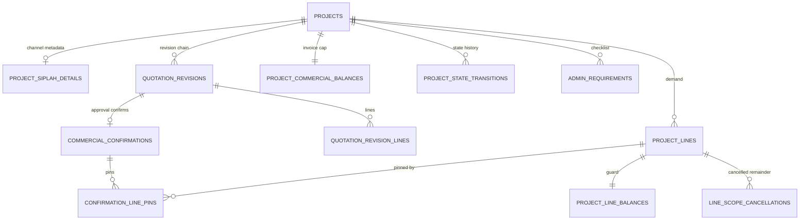
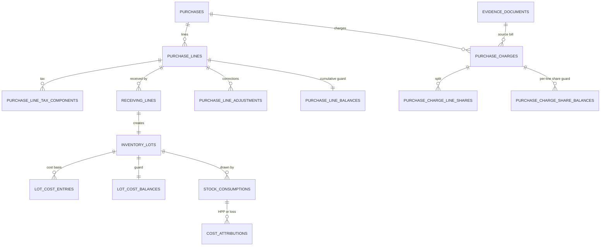
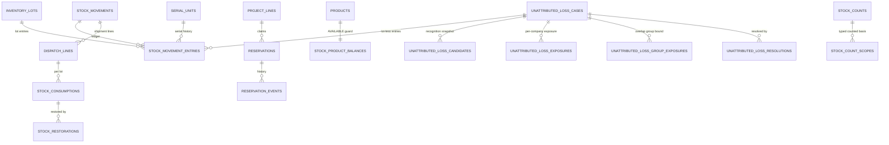
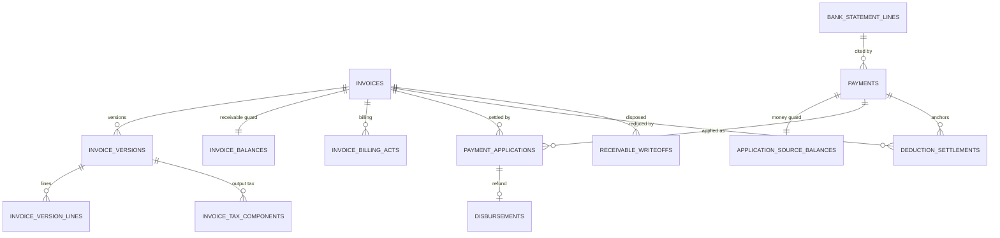
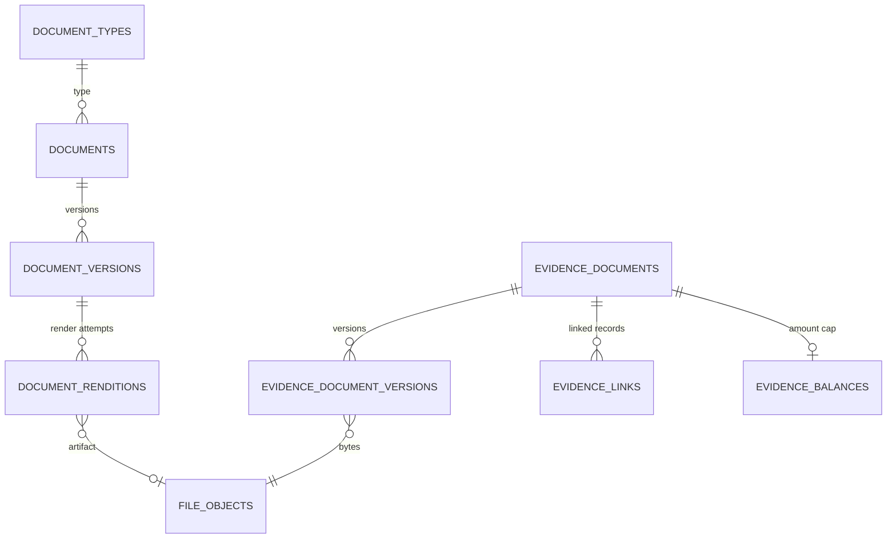

## 29. Domain diagrams

Orientation only; §4 is authoritative. Each diagram shows one domain's core relationships.

**Projects and commercial**

**Procurement and costing**

**Inventory core**

**Receivables and payments**

**Documents and evidence**

## 30. Traceability

P1 capability → P2 rules → P3 workflows and actions → P4 structures and constraints → later obligations. The aggregate verification (including AC, DOC, OWN and image identifiers and the orphan checks) is recorded in [P4_QUALITY_GATE](../evidence/P4_QUALITY_GATE.md#traceability-verification).

| CAP | P2 | P3 | P4 structures / constraints | Later |
| --- | --- | --- | --- | --- |
| CAP-01 | BR-XC-02, BR-ACC-01/03, BR-SN-01/02, BR-FIN-17 | WF-ACC-01/02, WF-MD-01 | §4.1–4.2; C-32, C-52 | P5 capabilities and grants; P9 database roles |
| CAP-02 | BR-ACC-02, BR-SN-02 | WF-MD-02/03 | §4.3; derived supplier history; §14 | P5 S3 history projection |
| CAP-03 | BR-INV-03/09, BR-SN-01/02 | WF-MD-04, SF-SCAN | §4.4, §7, §8; C-01, C-02, C-09 | P7 scanner flow; P8 |
| CAP-04 | SM:Project, SM:Quotation, BR-PRJ-05/06, BR-QUO-01–03 | WF-PRJ-01/02/04, WF-QUO-01; AX-13/14/27 | §4.5, §9; C-05, C-38 | P7 project hub |
| CAP-05 | BR-PUR-01–05 | WF-PUR-01/02/03, SF-CHARGE; AX-12/29/32/34 | §4.6, §6.1, §6.3; C-20, C-21, C-29, C-57 | P8 charge conservation and correction fixtures |
| CAP-06 | BR-INV-01–13, BR-RSV-01–04 | WF-INV-01–07, WF-FUL-01/03/05, SF-RESERVE, SF-RSV-CUT, SF-RESTORE, SF-LOSS, SF-UNATTRIBUTED; AX-01–11/30/35–37 | §4.7–4.8, §5, §6; C-02–09, C-24–28, C-33–37, C-57, C-59 | P6 AX mechanisms; P8 races and DQ |
| CAP-07 | BR-INV-02, BR-XD-01, CALC-04 | WF-FUL-02/03/04; AX-08/09 | §4.9; C-30 | P7 delivery evidence |
| CAP-08 | SM:Document, BR-DOC-01–04 | WF-DOC-01/02, WF-FIN-08; SF-ISSUE, SF-RENDER, SF-EVIDENCE; AX-15/31 | §4.10, §10; C-10–12, C-43, C-58 | P6 render durability and sequences; P8 numbering races |
| CAP-09 | BR-ADM-01–03, BR-PRJ-03 | WF-ADM-01 | §4.11 | P5 Owner-only relaxations |
| CAP-10 | BR-FIN-01–08/15/16, BR-CR-03 | WF-FIN-01–06/08; SF-APPLY, SF-SETTLE, SF-CONTRA; AX-16–24/31/33 | §4.12, §11; C-13–19, C-22, C-23, C-41–45, C-58, C-59, C-60 | P6 AX; P8 annex 1–6/13 and the refund-shortfall attack |
| CAP-11 | BR-FIN-09–14/17, BR-PUR-05, BR-INV-13, CALC-08–14 | WF-FIN-04/07; SF-CHARGE, SF-LOSS, SF-UNATTRIBUTED; AX-21/29/30/34/37 | §6, §11, §12; C-21, C-24–26, C-57 | P8 profitability reconciliation |
| CAP-12 | BR-PRJ-05, BR-FIN-09/10/16 | WF-PRJ-01, WF-FIN-04 | `project_siplah_details`; settlements; C-51 | P7 channel fields; SIPLAH adapter seam (ARCHITECTURE §13) |
| CAP-13 | BR-XC-01–03, BR-ACC-01–03, BR-CR-01–06 | SF-CMD; WORKFLOWS §4, §8 | §13, §15, §23, §26, §28; C-32, C-40, C-48, C-53, C-61; §4.1 TOTP fields and `user_external_identities`, C-62–C-65 | P5 matrix and SECURITY AU-16–AU-24; P8 denial and authentication tests; P9 roles and key management |
| CAP-14 | glossary | context tags | no schema content (public ids only) | P7 |
| CAP-15 | BR-INV-12, BR-FIN-05/14, BR-XD-06 | WF-MIG-01; AX-28; CM-33 | §24; C-47 | P10 rehearsal and cutover |
| CAP-16 | BR-DOC-01/03 | N/A — P9 | `file_objects` and rendition metadata for coherent backup | P9 backup and restore |
| CAP-17 | BR-XD-05, CALC-01–14 | WORKFLOWS §10 (QS-01–22) | §3 derived views, guard reads, §20 partial indexes | P6 targets; P7 dashboards |
| CAP-18 | BR-PRJ-02–04, BR-CR-05, BR-ADM-03 | WF-PRJ-03, SF-REVAL; AX-25/26 | `project_state_transitions`; C-38, C-39 | P5 Owner-only; P8 predicate tests |

**E-DB rules and their database guarantees:** BR-XC-01 → `audit_events` in the same transaction, C-53; BR-DT-01 → immutable `recorded_at` and `business_date` columns, C-50; BR-SN-01 → C-11 and §14; BR-CR-02 → C-45, C-53 and §13; BR-DOC-01 → C-11; BR-DOC-02 → C-10; BR-RSV-01 → C-04, C-05; BR-INV-01 → C-03, C-04; BR-INV-02 → C-07 (deliveries write no ledger rows); BR-INV-03 → C-09; BR-INV-04 → C-08, C-26; BR-INV-05 → C-28; BR-INV-08 → §3.1 guard registry and DQ checks, C-61; BR-FIN-03 → C-13, C-14; BR-FIN-04 → C-15, C-16.

**Owner decisions:** OWN-01 → §11.1; OWN-02 → §15, §5.1; OWN-03 → §9 completion; OWN-04 → §5.5; OWN-05 → §6.5; OWN-06 → P9. DIR-018 → §10 numbering, §17 dates; DIR-019/020 → §11.4; DIR-024 D-1 → §12, D-2 → §6.1, D-3 → §6.1, D-4 → §11.4, D-5 → C-40; DIR-026/027 → §5.8. DIR-037 D5 → the TOTP fields of §4.1, C-62, C-65; D6 and DIR-042 K2 → `user_external_identities`, C-63, C-64; K3 → its unlink contract (§4.1).

## 31. Downstream obligations and open technical items

- **P5:** capability catalogue in `capabilities`; the S1 physical projection versus S3/S4 fields per table class (field projection, including pool evidence and exposure rows); company scoping of every query, search, export and download; ADM+ and Owner-only enforcement including the DIR-027 evidence-resolution authority; upload validation; the evidence duplicate warnings — same checksum under two identities, same issuer, reference and date under two types; optional row-level security.
- **P6:** the statements, lock order (extended in §26) and retry policy for every guard and AX, including every action corrected by the targeted review; the completion anchor; zero-row guard updates treated as failure; race-safe creation of first-use guard and counter rows; `command_log` protocol and retention; SQLSTATE → outcome mapping including deferred-trigger failures; the render sweeper; count staleness; sequence allocation; the cross-row preconditions of §26 under their anchors; reconciliation (DQ) job cadence driven by the §3.1 registry.
- **P8:** every C-row, the ⚡ races with real concurrent PostgreSQL sessions, the DQ reconciliation suite driven by §3.1, the numeric annex 1–16 and P3 scenarios 1–18, DIR-027 fixtures — pending case with dispatch continuing, Owner resolution with and without substitution, evidence resolution, found before and after resolution, error reversal, condition-change conversion — and the targeted-review adversarial fixtures of P4_QUALITY_GATE: price and charge correction between partial receipts, the Rp1 refund-shortfall attack, the −5/+6 location move, replacement versus normal receipt caps, overlapping unattributed-loss cases, replacement invoices after partial payment, residual settlements, alternate-type evidence, corrective receipts, drop-ship reversals, cross-company bank accounts, multi-project revalidation, numbering with retired numbers, guard rebuild after corrections, and serial-state reconciliation including drop-shipped serials.
- **P9:** database roles and privileges of §28 — a separate migration connection and credential for Laravel, owner and TRUNCATE privileges kept out of the runtime, the administration role for audited maintenance; the `pg_trgm` and `btree_gist` extensions; private file storage layout; backup coherence of database and files; guard verification (§3.1) after every restore before reopening; audit and file retention.
- **P10:** opening import rehearsal, control totals and cutover freeze versus delta (GAP-010). **P11:** build units per module citing table groups, C-rows and AX-rows.
- **Authentication amendment (TECH-025):** P6 — the account-row sequences RV-11–RV-16 and the scenarios M-39–M-43 of CONCURRENCY_IDEMPOTENCY; P8 — C-62–C-65 with their ⚡ races and the unlink contract path by path (SECURITY H8-16–H8-22); P9 — the application key's storage, rotation and re-encryption (SECURITY AU-21, H9-14).
- **Open technical items (no Owner decision):** revision-number format (GAP-019); PostgreSQL and Laravel versions and extension availability, including deferred constraint triggers, generated columns in keys and the NULL-handling of partial UNIQUE indexes (DEP-07); partitioning thresholds (P6/P9); whether P5 adds row-level security. **OWNER_DECISION_REQUIRED = 0.**
